# The Forward Deployed Engineering (FDE) Field Guide

> **The definitive, empirical guide to turning ambiguous customer problems into production-grade, enterprise-scale software and AI systems.**

[](https://www.python.org/)
[](interviews/code/)
[](portfolio/reference-project/evals/)
[](interviews/dataset/)
[](job-market/dataset/)
[](LICENSE)
[](AWESOME.md)

> New here? Start with [AWESOME.md](AWESOME.md) — the curated, verified index of every learning resource in this repository, organized by what you need to close next.


---

## Executive Overview: The GenAI Divide & The Rise of the FDE

The technology landscape of 2026 has witnessed a historic bifurcation between model capability and enterprise reality. While foundational AI models are more capable than ever, the **MIT NANDA 2025 State of AI in Business report** (reported in *Fortune*) revealed that **95% of enterprise AI pilots fail to achieve measurable P&L impact or reach production**. Enterprise deployments stall not because models fail to generate plausible text, but because enterprise environments are hostile: legacy mainframe databases, strict zero-egress VPCs, complex RBAC permissions, non-deterministic latency, hallucinations, and stringent InfoSec compliance (HIPAA, SOC 2, FedRAMP).

The **Forward Deployed Engineer (FDE)** is the specialized engineering discipline created to cross this chasm. Pioneered by Palantir and now adopted as the primary enterprise deployment vehicle across frontier AI labs (OpenAI, Anthropic), cloud hyperscalers (AWS, GCP, Azure), and enterprise AI platforms (Scale AI, Databricks, Cohere), FDEs embed directly with customer technical and executive teams to scope, design, build, deploy, and productionize mission-critical systems.

According to empirical labor telemetry from Lightcast (*Fortune*, September 2026), **Forward Deployed Engineering job postings have expanded by >1,000% YoY**, carrying an advertised median salary of **$188,000** (with Tier-1 AI lab total compensation frequently exceeding **$350,000–$550,000+**). 

This repository is an **engineering field guide, production codebase, and empirical dataset suite**, not a superficial career brochure. Everything in this guide follows an uncompromising **evidence discipline**: zero synthetic placeholders, fully verified real-world practitioner rubrics, vetted architecture blueprints, runnable Python implementations, and empirical labor market datasets.

---

## Repository Architecture & Technical Lifecycle

The Forward Deployed Engineering operational arc encompasses discovery, systems architecture, secure deployment, automated evaluation, and stakeholder handover:

```mermaid
flowchart TD
    subgraph Discovery ["1. Problem Discovery & SOW"]
        D1["Vague Customer Ask"] --> D2["Executive & Technical Interviews"]
        D2 --> D3["Discovery Framework & Pain Matrix"]
        D3 --> D4["Tight SOW & Architecture Decision Record (ADR)"]
    end

    subgraph Architecture ["2. System Design & Security"]
        D4 --> A1["Determine Deployment Topology<br/>(In-VPC vs SaaS vs Air-Gapped)"]
        A1 --> A2["Network Boundary (AWS PrivateLink / PSC)"]
        A2 --> A3["Auth & Data Boundaries (RBAC, PII Sanitization)"]
    end

    subgraph Engineering ["3. Core & AI Engineering"]
        A3 --> E1["FastAPI Core Service & Resilient Clients"]
        E1 --> E2["Hybrid Retrieval Engine<br/>(pgvector Dense Cosine + BM25 Lexical)"]
        E2 --> E3["Deterministic Decision Gating & Tool Execution"]
    end

    subgraph Evaluation ["4. Quality Assurance & Auditing"]
        E3 --> Q1["Golden Evaluation Harness<br/>(Grounding, Classification, F1-Score)"]
        Q1 --> Q2{"Meets Enterprise SLAs?<br/>(Accuracy >= 90%, Latency p95 < 2s)"}
        Q2 -- "No (Regressions Detected)" --> E2
        Q2 -- "Yes (Passed Gating)" --> P1["Production Readiness Checklist"]
    end

    subgraph Production ["5. Production Operations & Handover"]
        P1 --> O1["Containerized Deployment (Docker / K8s)"]
        O1 --> O2["OpenTelemetry GenAI Observability (Traces & Costs)"]
        O2 --> O3["Customer SRE Runbook & Operational Handover"]
    end

    style Discovery fill:#f8fafc,stroke:#64748b,stroke-width:1px
    style Architecture fill:#eff6ff,stroke:#3b82f6,stroke-width:1px
    style Engineering fill:#f0fdf4,stroke:#22c55e,stroke-width:1px
    style Evaluation fill:#fefce8,stroke:#eab308,stroke-width:1px
    style Production fill:#faf5ff,stroke:#a855f7,stroke-width:1px
```



---

## Interactive Audience Navigation Matrix

Choose your entry point based on your background and immediate objectives:

```
+------------------------------------+---------------------------------------+-------------------------------------------------------+
| Your Background / Persona          | Primary Focus Areas                   | Recommended Starting Modules                          |
+------------------------------------+---------------------------------------+-------------------------------------------------------+
| Software Engineer (SWE)            | Transitioning from pure backend/infra | 1. [Learning Paths: From SWE](learning-paths/from-software-engineer.md)       |
|                                    | to customer-facing deployment systems | 2. [Customer: Working in Customer Envs](customer/03-working-in-customer-environments.md) |
|                                    | and ambiguous scope discovery.        | 3. [Skills: Discovery & Requirements](skills/02-discovery-and-requirements.md)        |
+------------------------------------+---------------------------------------+-------------------------------------------------------+
| AI / ML / Research Engineer        | Transitioning from offline models and | 1. [Learning Paths: From AI/ML](learning-paths/from-ai-ml-engineer.md)         |
|                                    | Jupyter notebooks to secure in-VPC    | 2. [Deployment: Prototype to Production](deployment/01-prototype-to-production.md)   |
|                                    | enterprise production infrastructure. | 3. [AI: Evaluation & Golden Evals](ai/03-evaluation-and-testing.md)          |
+------------------------------------+---------------------------------------+-------------------------------------------------------+
| Solutions Engineer / Tech Consult  | Moving from pre-sales demos / slides  | 1. [Learning Paths: From Solutions Eng](learning-paths/from-solutions-engineer.md)   |
|                                    | to deep production codebase ownership | 2. [Interviews: Systems Coding Solutions](interviews/08-coding-solutions.md)        |
|                                    | and architectural implementation.     | 3. [Engineering: APIs & Integrations](engineering/02-apis-and-integrations.md)       |
+------------------------------------+---------------------------------------+-------------------------------------------------------+
| Active Interview Candidate         | Preparing for top-tier FDE loops at   | 1. [Interviews: Process & Stages](interviews/01-interview-process.md)          |
|                                    | OpenAI, Anthropic, Palantir, Scale AI | 2. [Interviews: 17-Question Bank](interviews/07-question-bank.md)             |
|                                    | Databricks, or enterprise startups.   | 3. [Interviews: Verified Dataset](interviews/dataset/README.md)               |
+------------------------------------+---------------------------------------+-------------------------------------------------------+
| Engineering Leader / Recruiter     | Calibrating FDE job levels, bandings, | 1. [Job Market: Market Overview](job-market/01-market-overview.md)           |
|                                    | compensation, and interview rubrics.  | 2. [Job Market: Compensation Guide](job-market/02-compensation.md)             |
|                                    |                                       | 3. [Role: Responsibilities & Archetypes](role/02-responsibilities.md)         |
+------------------------------------+---------------------------------------+-------------------------------------------------------+
```

---

## The 14 Pillars of the FDE Field Guide

Explore the 14 comprehensive, rigorously verified knowledge pillars of Forward Deployed Engineering:

### 1. [Role & Competencies](role/README.md)
*The origins, definition, taxonomy, and operational lifecycle of Forward Deployed Engineering.*
- [01. What is an FDE?](role/01-what-is-an-fde.md) - Palantir origins, the 2026 AI deployment paradigm, and common industry misconceptions.
- [02. Responsibilities](role/02-responsibilities.md) - What FDEs actually do day-to-day, grounded in 146 verified job postings.
- [03. FDE vs Other Roles](role/03-fde-vs-other-roles.md) - Definitive taxonomy contrasting FDE with SWE, Solutions Engineer, AI Engineer, and Consultant.
- [04. Where FDEs Work](role/04-where-fdes-work.md) - The 4 operational archetypes: AI Frontier Labs, Enterprise Platforms, Early-Stage Startups, and Systems Integrators.
- [05. The FDE Loop](role/05-the-fde-loop.md) - The core 6-phase operational loop from ambiguous customer problem to measured business impact.

### 2. [Skills & Technical Execution](skills/README.md)
*The non-negotiable dual competency: elite systems execution combined with high-EQ customer leadership.*
- [01. Core Technical Skills](skills/01-core-technical-skills.md) - The baseline tech stack: Python 3.12+, Docker, Linux networking, SQL, and LLM APIs.
- [02. Discovery & Requirements](skills/02-discovery-and-requirements.md) - Conducting technical discovery, extracting pain points, and writing binding statements of work.
- [03. Communication & Storytelling](skills/03-communication-and-storytelling.md) - Translating deep technical latency metrics into executive C-suite ROI narratives.
- [04. Stakeholder Management](skills/04-stakeholder-management.md) - Navigating customer politics, aligning adversarial internal teams, and de-escalating conflicts.
- [05. Ambiguity & Prioritization](skills/05-ambiguity-and-prioritization.md) - Triaging competing customer requests under severe time, compute, and security constraints.

### 3. [Core Engineering](engineering/README.md)
*Production engineering patterns for systems deployed inside customer infrastructure.*
- [01. Prototyping & PoCs](engineering/01-prototyping-and-pocs.md) - Designing throwaway prototypes vs production-grade PoCs with hard kill-criteria.
- [02. APIs & Integrations](engineering/02-apis-and-integrations.md) - Building resilient webhook receivers, distributed rate limiters, and idempotency guarantees.
- [03. Data Pipelines](engineering/03-data-pipelines.md) - Ingesting messy customer exports, handling drift, schema reconciliation, and CDC pipelines.
- [04. Cloud & Infrastructure](engineering/04-cloud-and-infrastructure.md) - Deploying into customer AWS/GCP/Azure VPCs with zero-egress networking and Terraform.
- [05. Security & Compliance](engineering/05-security-and-compliance.md) - Navigating customer InfoSec reviews, SOC 2, HIPAA, FedRAMP, and secrets rotation.

### 4. [Customer Work & Delivery](customer/README.md)
*The operational discipline of managing live customer relationships without losing delivery velocity.*
- [01. The Engagement Lifecycle](customer/01-engagement-lifecycle.md) - The 5 phases of customer delivery from pre-kickoff to final SRE handover.
- [02. Requirements to Spec](customer/02-requirements-to-spec.md) - Converting vague customer requests into binding Technical Design Documents (TDDs).
- [03. Working in Customer Environments](customer/03-working-in-customer-environments.md) - Surviving locked-down corporate laptops, air-gapped VPCs, and slow ticketing systems.
- [04. Managing Expectations](customer/04-managing-expectations.md) - Managing scope creep, delivering technical bad news gracefully, and establishing boundary conditions.

### 5. [AI & LLM Engineering](ai/README.md)
*Grounded, empirical AI systems engineering for high-stakes enterprise applications.*
- [01. LLM Application Patterns](ai/01-llm-application-patterns.md) - RAG architectures, structured JSON output validation, context window caching, rerankers, and Strategic Automation Triage (AI reasoning vs deterministic code vs human-in-the-loop).
- [02. Agents & Tools](ai/02-agents-and-tools.md) - State machines, Model Context Protocol (MCP), tool-use loops, supervised multi-agent pipelines, persistent memory layers, and preventing runaway tool calls.
- [03. Evaluation & Testing](ai/03-evaluation-and-testing.md) - Automated golden evaluation harnesses, LLM-as-judge with Cohen's Kappa, and synthetic data auditing.
- [04. Monitoring & Reliability](ai/04-monitoring-and-reliability.md) - OpenTelemetry GenAI semantic conventions, token usage telemetry, and drift detection.

### 6. [Deployment & Productionization](deployment/README.md)
*Crossing the pilot-to-production cliff into enterprise runtime environments.*
- [01. Prototype to Production](deployment/01-prototype-to-production.md) - Overcoming the pilot cliff: security, multi-tenancy, deterministic latency, and SLAs.
- [02. Deployment Patterns](deployment/02-deployment-patterns.md) - In-VPC (Zero-Egress), SaaS-Adjacent (PrivateLink), Air-Gapped, and Hybrid architectures.
- [03. Production Readiness Checklist](deployment/03-production-readiness-checklist.md) - The 30-item non-negotiable go/no-go audit prior to production launch.

### 7. [System Design & Architecture](system-design/README.md)
*Designing reliable, scalable, and maintainable systems under strict customer constraints.*
- [01. Architecture for Customer Systems](system-design/01-architecture-for-customer-systems.md) - Designing systems when you do not own the network, storage, or compute.
- [02. Reference Architectures](system-design/02-reference-architectures.md) - 4 enterprise blueprints: RAG Knowledge Assistant, Real-Time Intake, Edge-to-Cloud, and Batch ETL.
- [03. Trade-offs & Decision Records](system-design/03-trade-offs-and-decision-records.md) - Authoring binding Architecture Decision Records (ADRs) that withstand customer audit.

### 8. [Troubleshooting & Field Operations](troubleshooting/README.md)
*Hypothesis-driven root cause analysis in opaque, distributed customer environments.*
- [01. Debugging Methodology](troubleshooting/01-debugging-methodology.md) - The 5-step structured diagnostic playbook for high-pressure production incidents.
- [02. Debugging Customer Systems](troubleshooting/02-debugging-customer-systems.md) - Diagnosing remote environments across locked-down bastions, proxy firewalls, and air-gapped clusters.
- [03. Common Failure Modes](troubleshooting/03-common-failure-modes.md) - The 7 recurring enterprise failure modes (token rate limits, silent context rot, network drops, etc.).

### 9. [Case Studies & Production Playbooks](case-studies/README.md)
*Real-world enterprise deployment post-mortems, architectures, and regulated playbooks.*
- [01. Deployment Patterns in the Wild](case-studies/01-deployment-patterns-in-the-wild.md) - 4 deep architectural analyses of production deployments across Fortune 500 enterprises.
- [02. LLM Deployment Cases](case-studies/02-llm-deployment-cases.md) - Large-scale production deployments across healthcare, finance, and legal operations.
- [03. Failure Stories](case-studies/03-failure-stories.md) - Frank post-mortems of real enterprise pilots that collapsed, with root-cause post-mortems.
- [04. Regulated Industries Playbook](case-studies/04-regulated-industries-playbook.md) - Comprehensive compliance playbooks for Healthcare (HIPAA/BAA), Financial Services (SOC 2/MRM), and Defense/Gov (FedRAMP/IL4).
- [05. Enterprise Manufacturing: Vaayu Pumps](case-studies/05-enterprise-manufacturing-vaayu-pumps.md) - Complete enterprise case study synthesized from 83 pages of BRD v1.1, TDD v1.0, and SDD v1.0 for Vaayu Pumps and Systems Ltd (INR 840 Cr manufacturing firm, 11,000 pumps, 42 field technicians). Covers 4-agent supervised pipeline, SAP S/4HANA integration, severity decision matrices, technician routing algorithm, and SLA impact metrics (source: Codebasics FDE Roadmap 2026, September 2026).

### 10. [Job Market & Career Telemetry](job-market/README.md)
*Empirical compensation benchmarks, role variants, and career positioning strategies.*
- [01. Market Overview](job-market/01-market-overview.md) - Analysis of 146 deduplicated 2026 enterprise postings; responsibilities, qualifications, and demand trends.
- [02. Compensation](job-market/02-compensation.md) - Sourced base, bonus, and equity bands across Early Startups, Growth Tech, and Tier-1 AI Labs.
- [03. Getting Hired](job-market/03-getting-hired.md) - Resume framing, positioning customer engineering impact, and beating the ATS filter.
- [Dataset: fde_market_data.json](job-market/dataset/README.md) - Curated, schema-validated JSON dataset of 146 live 2026 enterprise postings with automated validator.

### 11. [Learning Paths & Transition Curricula](learning-paths/README.md)
*Customized transition roadmaps and structured self-study curricula for every technical background.*
- [The 24-Week Enterprise FDE Roadmap](learning-paths/24-week-enterprise-fde-roadmap.md) - The complete week-by-week enterprise transition curriculum sourced directly from Codebasics FDE Roadmap 2026 (Dhaval Patel and Hemanand Vadivel, AtliQ Technologies). Phase 1: Python and FastAPI, RAG, Agentic AI and MCP, ERP Integration, DevOps, LLMOps, System Design. Phase 2: Problem Discovery, BRD, TDD, Stakeholder Management, UAT, Change Management.
- [The 90-Day FDE Transition Roadmap](learning-paths/90-day-fde-roadmap.md) - A week-by-week 12-week curriculum synthesizing FDE Academy masterclasses.
- [From Software Engineer](learning-paths/from-software-engineer.md) - Bridging the gap from internal microservices to customer-facing discovery and ambiguity.
- [From AI/ML Engineer](learning-paths/from-ai-ml-engineer.md) - Transitioning from offline evaluation and model weights to production infrastructure and VPC security.
- [From Data Engineer](learning-paths/from-data-engineer.md) - Leveraging pipeline, ETL, and warehouse strengths into customer application deployment.
- [From Solutions Engineer](learning-paths/from-solutions-engineer.md) - Upgrading from pre-sales architectural demos to full production code ownership and on-call.
- [From Consultant](learning-paths/from-consultant.md) - Transitioning from slide decks and strategy deliverables to building shipping software artifacts.
- [Beginner to FDE](learning-paths/beginner-to-fde.md) - Multi-stage foundational curriculum covering coding, networking, cloud, and customer delivery.

### 12. [Interviews & Technical Rubrics](interviews/README.md)
*The complete enterprise hiring pipeline, runnable coding solutions, customer scenarios, and question bank.*
- [01. The Interview Process](interviews/01-interview-process.md) - The standard 7-stage hiring pipeline across Palantir, OpenAI, Anthropic, and Scale AI.
- [02. Coding & Technical Rounds](interviews/02-coding-and-technical.md) - What enterprise FDE technical rounds test: practical systems, concurrency, and dirty data.
- [03. System Design Rounds](interviews/03-system-design.md) - Customer-flavored system design: capacity planning, network boundaries, and failover topologies.
- [04. Customer Scenario Rounds](interviews/04-customer-scenarios.md) - Verbatim customer role-play transcripts, adversarial pushback handling, and 3-tier rubrics.
- [05. Behavioral Rounds](interviews/05-behavioral.md) - Ownership stories, stakeholder negotiation, and navigating technical failure under pressure.
- [06. Take-Home Assignments](interviews/06-take-homes.md) - 72-hour enterprise take-home challenge, 100-point evaluation rubric, and ADR templates.
- [07. Question Bank](interviews/07-question-bank.md) - 17 verified real-world interview questions with senior practitioner response playbooks.
- [08. Systems Coding Solutions](interviews/08-coding-solutions.md) - Runnable Python implementations for all core challenges with verbal narration scripts.
- [Dataset: fde_interviews_data.json](interviews/dataset/README.md) - Audited JSON interview dataset with 10-pass verification test script.

### 13. [Production Portfolio & Reference Project](portfolio/README.md)
*Customer-grade portfolio projects and the complete Enterprise Ticket Intake & Scoping Engine (ETISE).*
- [01. What to Build](portfolio/01-what-to-build.md) - The 6 portfolio principles separating toy tutorials from enterprise deployment artifacts.
- [02. Project Ideas](portfolio/02-project-ideas.md) - 12 customer-grade project specifications spanning fintech, healthcare, and infrastructure.
- [03. Presenting Projects](portfolio/03-presenting-projects.md) - Crafting architectural READMEs, interactive Loom demos, and executive case studies.
- [04. Project Selection Masterclass](portfolio/04-project-selection-masterclass.md) - The 5 enterprise project archetypes, verified empirical datasets, and anti-patterns.
- [Reference Project: ETISE](portfolio/reference-project/README.md) - Full production FastAPI reference project with hybrid search, dense vector cosine similarity, RBAC ACLs, Docker, and golden evaluation suite.

### 14. [Resources & Ecosystem Directory](resources/README.md)
*The curated toolbox, primary literature, seminal research papers, and practitioner communities.*
- [01. Tools](resources/01-tools.md) - The enterprise FDE toolbox: development, deployment, evaluation, observability, and enterprise specification and diagramming tools (Eraser.io, LangSmith, LangFuse, SAP CPI).
- [02. Reading](resources/02-reading.md) - Foundational textbooks, seminal papers (vLLM, Lost in the Middle, ReAct), industry reports, 5 verified practitioner masterclasses (Kevin Bai, Aishwarya Srinivasan, Piyush Garg, AI LABS, Codebasics), and the Vaayu Pumps 83-page enterprise document pack.
- [03. Communities & People](resources/03-communities-and-people.md) - Where forward deployed engineers talk shop, including 10 verified FDE practitioners sourced from the Codebasics FDE Roadmap 2026.

---

## Embedded Runnable Codebases & Datasets

This repository contains fully runnable production implementations, automated evaluation harnesses, and verified empirical datasets:

```
FDE-Field-Guide/
├── interviews/
│   ├── code/                                # Runnable Systems Coding Solutions
│   │   ├── chunker.py                       # Overlapping context chunking
│   │   ├── parser.py                        # Resilient messy JSON export repair
│   │   ├── rate_limiter.py                  # Sliding-window log tenant limiter
│   │   ├── resilient_client.py              # Exponential backoff + jitter HTTP client
│   │   ├── structured_extractor.py          # Self-healing Pydantic schema extractor
│   │   ├── vibe_coding_runner.py            # Streaming pipeline with backpressure
│   │   ├── webhook_receiver.py              # Cryptographic HMAC idempotent receiver
│   │   └── test_*.py                        # 23 passing pytest unit tests
│   └── dataset/
│       ├── fde_interviews_data.json         # 17 audited real-world interview questions
│       ├── ten_pass_verification.py         # Automated 10-pass verification test script
│       └── README.md                        # Dataset documentation and schema
├── portfolio/
│   └── reference-project/                   # Complete Reference Application (ETISE)
│       ├── server.py                        # Production FastAPI service (hybrid search, RBAC)
│       ├── evals/
│       │   ├── golden_dataset.json          # 25 enterprise golden test cases
│       │   └── run_evals.py                 # Automated evaluation harness with SLA gating
│       ├── tests/
│       │   └── test_server.py               # 7 end-to-end integration tests
│       ├── Dockerfile                       # Hardened non-root production container
│       ├── docker-compose.yml               # Multi-service orchestrator
│       └── README.md                        # Production runbook & architectural spec
└── job-market/
    └── dataset/
        ├── fde_market_data.json             # 146 deduplicated live enterprise postings
        ├── validate_market_data.py          # Automated schema & statistics validator
        └── README.md                        # Telemetry methodology & verified metrics
```

---

## Quickstart & Verification Suite

You can clone this repository, install its lightweight dependencies, and execute the complete verification test suite in seconds:

### 1. Prerequisites & Installation

```bash
# Clone the repository
git clone https://github.com/AdilShamim8/FDE-Field-Guide.git
cd FDE-Field-Guide

# Create and activate a clean Python virtual environment
python -m venv .venv
source .venv/bin/activate       # On Windows: .venv\Scripts\activate

# Install required test dependencies
pip install fastapi uvicorn pydantic pytest
```

### 2. Execute the Full Unit Test Suite (30 Tests)

Runs all 23 systems coding unit tests and all 7 reference application integration tests:

```bash
python -m pytest interviews/code/ portfolio/reference-project/tests/ -v
```
*Expected Output: `30 passed in ~0.35s`*

### 3. Run the Automated Golden Evaluation Harness (25 Test Cases)

Evaluates the ETISE reference engine against the 25-case golden dataset, verifying category accuracy, severity classification, decision gating, and 100% citation grounding:

```bash
python portfolio/reference-project/evals/run_evals.py
```
*Expected Output: `RESULT: ALL ENTERPRISE SLA ACCEPTANCE CRITERIA PASSED.`*

### 4. Run the 10-Pass Interview Dataset Verification Audit

Executes a 10-pass cryptographic and structural integrity audit verifying JSON syntax, citation domains, 3-tier scoring rubrics, author credentials, and 2026 timestamps:

```bash
python interviews/dataset/ten_pass_verification.py
```
*Expected Output: `ALL 10/10 RIGOROUS VERIFICATION PASSES COMPLETED SUCCESSFULLY WITH ZERO ERRORS!`*

### 5. Validate the Empirical Labor Market Telemetry Dataset

Validates the schema, date ranges, and compensation metrics across the 146 deduplicated 2026 enterprise postings:

```bash
python job-market/dataset/validate_market_data.py
```
*Expected Output: `[+] Market dataset successfully validated: 146 deduplicated postings, 7 scrape dates.`*

---

## Evidence Discipline & Editorial Contract

To ensure this guide remains permanently authoritative and resistant to synthetic hallucination, all content adheres to the strict editorial contract codified in [STYLING.md](STYLING.md):

1. **Zero Synthetic Placeholders**: No fabricated datasets, simulated metrics, or placeholder URLs (`example.com`). Every citation links to verifiable practitioner literature, peer-reviewed research, or active enterprise repositories.
2. **Empirical Grounding**: Market claims, compensation bands, and technical adoption rates are directly tied to documented scrapes of live postings and reported industry studies.
3. **Reproducible Code**: Every code snippet in this repository is syntactically valid and part of an automated testing harness.
4. **Transparent Evolution**: Topics requiring ongoing empirical contribution are tracked openly in [_work-in-progress/README.md](_work-in-progress/README.md).

---

## License & Community Contributions

This project is open source and licensed under the [MIT License](LICENSE). 

Contributions of real-world deployment patterns, anonymized enterprise post-mortems, and empirical interview reports are warmly welcomed. Please read [STYLING.md](STYLING.md) to ensure your pull request adheres to our evidence contract and formatting standards.

<div align="center">

### ✦ Connect With Me

<p>
  <a href="https://www.adilshamim.me">
    
  </a>
  <a href="https://linkedin.com/in/adilshamim8">
    
  </a>
  <a href="https://adilshamim8.medium.com">
    
  </a>
  <a href="https://adilshamim.substack.com">
    
  </a>
</p>

<p>
  <a href="https://github.com/AdilShamim8">
    
  </a>
  <a href="https://www.kaggle.com/adilshamim8">
    
  </a>
  <a href="https://leetcode.com/u/AdilShamim8">
    
  </a>
  <a href="https://twitter.com/adil_shamim8">
    
  </a>
</p>

<sub>Building • Learning • Researching • Sharing</sub>

<br/>

⭐ <strong>If this repository helped you, consider giving it a star!</strong> ⭐

</div>
