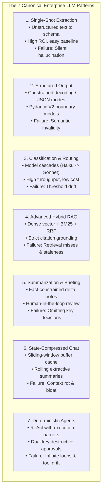
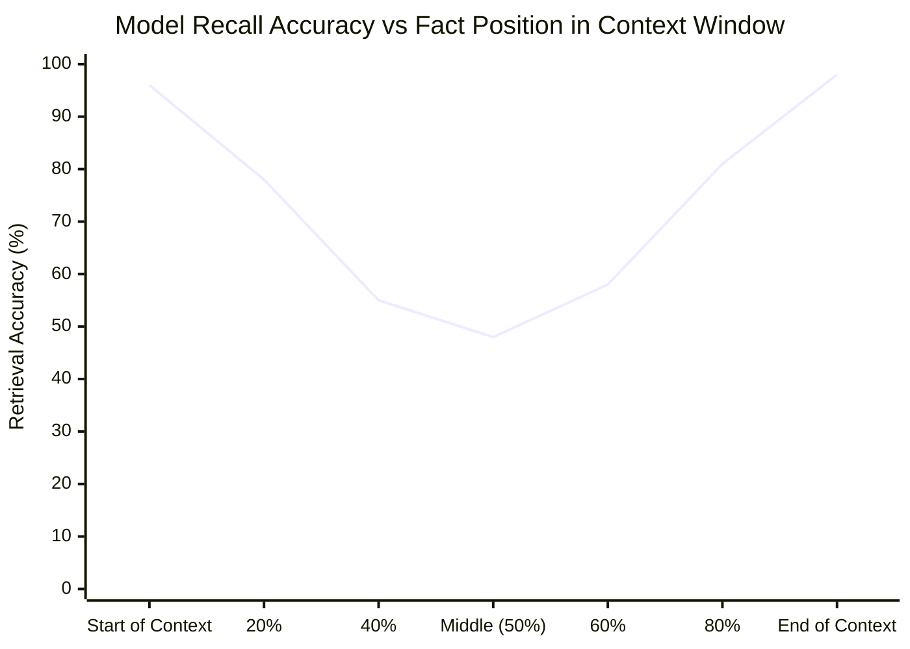
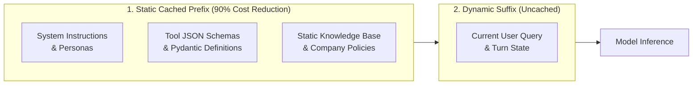
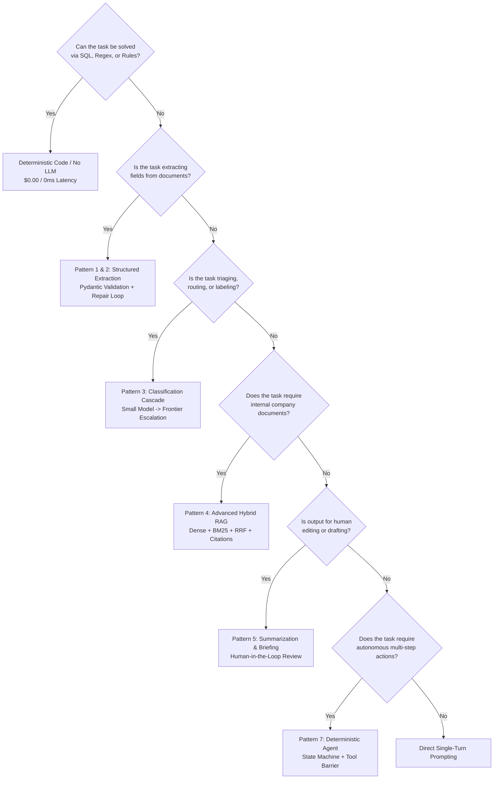

# LLM Application Patterns: Enterprise Architectures, RAG, and Structured Workflows

This guide provides the authoritative engineering playbook for Forward Deployed Engineers (FDEs) selecting, architecting, and implementing Large Language Model (LLM) application patterns inside enterprise customer environments.

In customer engagements, the FDE does not treat foundation models as open-ended chatbots. An enterprise LLM system is a **deterministic, schema-constrained data processing engine that utilizes probabilistic language reasoning only where deterministic heuristics (SQL, regex, AST parsers) fail**. 

Across our empirical dataset of 146 deduplicated 2026 FDE job postings, AI engineering competencies are primary hiring criteria:
- **Prompt Engineering**: **55.0%** of listings.
- **Retrieval-Augmented Generation (RAG)**: **52.0%** of listings.
- **LLM Application Architecture**: **43.0%** of listings.

Knowing the canonical pattern catalog—and the precise failure modes, cost envelopes, and latency characteristics of each—is the difference between an unmaintainable prototype and a hardened, enterprise-grade production deployment.

---

## 1. The 7 Canonical Enterprise Patterns

Enterprise customer deployments consistently resolve into seven primary architectural patterns. Most mature deployments compose two or three (e.g., classification routing an event into an extraction pipeline, which indexes data for hybrid RAG):



### Pattern 1: Single-Shot Structured Extraction
- **Mechanism**: Unstructured text (PDF invoices, EHR clinical notes, legal contracts, Zendesk tickets) is parsed directly into strongly-typed domain schemas.
- **When to Use**: High-volume, manual human data-entry tasks with measurable error rates and labor costs.
- **Failure Mode**: **Silent Hallucination**. When a field (e.g., `tax_id` or `renewal_date`) is absent from the input document, foundation models tend to synthesize a plausible-looking placeholder rather than returning null.
- **Production Defense**:
  1. Define an explicit `CANNOT_EXTRACT_INSUFFICIENT_INFORMATION` token or allow nullable fields.
  2. Implement an automated self-healing repair loop that feeds validation errors back to the model for correction.

### Pattern 2: Strict Schema-Constrained Generation
- **Mechanism**: Constraining model token sampling to conform strictly to a context-free grammar (CFG) or JSON Schema (using provider JSON modes, Outlines, or Instructor), followed by **Pydantic V2 boundary validation**.
- **When to Use**: Any boundary where downstream programmatic code consumes the LLM output (triggering API calls, writing to relational databases, queuing worker events).
- **Failure Mode**: **Semantic Invalidity**. Constrained decoding guarantees valid JSON syntax, but cannot guarantee valid domain semantics (e.g., returning an account ID that does not exist in the database, or an end date prior to the start date).
- **Production Defense**: Enforce domain validators (`@field_validator`) asserting relational integrity and range boundaries before triggering mutations.

### Pattern 3: Classification & Cascading Model Routing
- **Mechanism**: Triage customer requests into buckets (sentiment, intent, priority, business department). Implements a **Model Cascade**: a small, fast model evaluates the request first; if confidence is low or the transaction is flagged as high-risk, the request escalates to a frontier model.

```mermaid
flowchart LR
    Input[Incoming Customer Query] --> SmallModel[Small Tier Model\nClaude 3.5 Haiku / GPT-4o-mini\nLatency: 150ms | Cost: $0.0003]
    SmallModel --> Confidence{Confidence Score >= 0.90?}
    Confidence -- Yes --> Dispatch[Execute Triage Route]
    Confidence -- No --> Frontier[Frontier Tier Model\nClaude 3.5 Sonnet / GPT-4o\nLatency: 800ms | Cost: $0.005]
    Frontier --> Dispatch
```

- **Failure Mode**: **Threshold Drift**. Overall accuracy appears stable (e.g., 94%), but accuracy on a rare, critical category (e.g., `LEGAL_SUBPOENA` or `SYSTEM_OUTAGE_P0`) drops, causing catastrophic routing failures.
- **Production Defense**: Monitor confusion matrices and F1-scores per class independently, rather than relying on aggregate global accuracy.

### Pattern 4: Advanced Hybrid RAG (Dense + Sparse + RRF)
- **Mechanism**: Retrieval-Augmented Generation grounding answers in proprietary enterprise knowledge (wikis, PDFs, support tickets, internal databases).
- **The Vector-Only Trap**: Standard dense vector embeddings (e.g., cosine similarity on `text-embedding-3-large`) excel at semantic concept matching, but fail on exact part numbers, error codes, UUIDs, and acronyms (e.g., searching for `"Error ERR-4921"` returns generic error handling documents).
- **The Enterprise Standard: Hybrid Search**:
  1. **Dense Retrieval**: Cosine similarity over dense vector embeddings.
  2. **Sparse Lexical Retrieval**: BM25 keyword matching over inverted token indexes.
  3. **Reciprocal Rank Fusion (RRF)**: Fusing ranked result sets mathematically:
     $$RRF\_Score(d) = \sum_{m \in M} \frac{1}{k + r_m(d)}$$
     *(where $k \approx 60$ is a smoothing constant, $M$ is the set of retrieval algorithms, and $r_m(d)$ is document $d$'s rank)*.
  4. **Cross-Encoder Reranker**: Scoring the top 30 fused candidates down to the top 5 most relevant passages.

### Pattern 5: Summarization and Delta Briefing
- **Mechanism**: Distilling long meeting transcripts, handover notes, or legal briefs into concise action items.
- **Failure Mode**: **Omission of Critical Decisions**. The generated summary is fluent and persuasive, but omits the single binding decision made in the conversation.
- **Production Defense**: Implement fact-anchoring prompts requiring every bullet point to cite specific source sentences, and measure performance via human edit distance (percentage of text edited by human operators).

### Pattern 6: State-Compressed Conversation
- **Mechanism**: Multi-turn assistants maintaining context across user sessions.
- **Failure Mode**: **Context Rot and Latency Creep**. Appending every turn linearly into the context window causes prompt token costs and latency to explode, while diluting model attention.
- **Production Defense**: Maintain a sliding window of the last $N$ turns combined with a rolling extractive summary of earlier turns, leveraging **Prompt Caching** for static system instructions.

### Pattern 7: Deterministic Agentic Workflows
- **Mechanism**: The model evaluates input, determines which external tools to call, inspects the tool response, and iterates until the objective is reached.
- **Production Defense**: Impose strict state-machine bounds, bounded iteration caps ($\le 5$ iterations), and dual-key authorization for high-risk operations. (Covered comprehensively in [Agents and Tools](02-agents-and-tools.md)).

---

## 2. Context Window Engineering & Preventing Context Rot

In enterprise deployments, what goes into the context window matters more than how prompts are phrased. Injected tokens incur linear financial cost, quadratic attention compute, and degraded retrieval precision.

### The "Lost-in-the-Middle" Phenomenon

Research by Liu et al. (*Lost in the Middle: How Language Models Use Long Contexts*) demonstrates that LLMs attend disproportionately to tokens at the very beginning and very end of long contexts, while recall degrades severely for facts located in the middle:



### Context Construction Rules for FDE Deployments

1. **Structural Delimiters**: Separate system instructions, retrieved enterprise context, and dynamic user inputs using explicit XML or Markdown tags:
   ```xml
   <system_instructions>
   You are an enterprise compliance auditor. Validate inputs strictly against SEC guidelines.
   </system_instructions>

   <retrieved_documents>
   <document id="SEC-2026-004">
   ...
   </document>
   </retrieved_documents>

   <user_query>
   Validate the quarterly filing text below.
   </user_query>
   ```
2. **Dynamic Context Pruning**: Never pass the maximum top-$k$ documents if their similarity scores fall below a minimum relevance threshold (e.g., cosine similarity $< 0.72$). Less high-quality context yields higher answer precision.
3. **Prefix Stability**: Keep prompt prefixes strictly identical across calls to maximize KV cache reuse.

---

## 3. Cache-Augmented Generation (CAG) & Prompt Caching

Modern foundation model providers (Anthropic Claude 3.5, OpenAI GPT-4o, Google Gemini 1.5) support **Prompt Caching**:

- **Mechanism**: When consecutive API calls share an identical token prefix of sufficient length (e.g., $\ge 1024$ tokens in Anthropic, $\ge 1024$ tokens in OpenAI), the provider reuses pre-computed Key-Value (KV) attention caches rather than recomputing them.
- **The Economics**:
  - **Anthropic**: **90% discount** on cached input tokens; up to **80% reduction** in time-to-first-token (TTFT).
  - **OpenAI**: **50% discount** on cached input tokens.
- **Architectural Context Partitioning**:
  Structure prompts to place static, reusable context at the start, and dynamic user queries at the end:



---

## 4. Production Python Reference Implementation

The following implementation exemplifies enterprise extraction standards: strict Pydantic V2 schema validation, automated error-feedback retry loops, and explicit refusal handling for ungrounded text.

See the complete, unit-tested implementation in [`interviews/code/structured_extractor.py`](file:///c:/Users/Adil/Downloads/FDE-Field-Guide-main/interviews/code/structured_extractor.py):

```python
"""
Self-Healing Structured Field Extractor.
Demonstrates Pydantic schema validation, automated error-feedback loops,
and clean refusal handling for ungrounded inputs.
"""

import json
from enum import Enum
from typing import Any, Callable, Dict, List, Optional, Tuple
from pydantic import BaseModel, ConfigDict, Field, ValidationError


class IncidentSeverity(str, Enum):
    P0 = "P0"
    P1 = "P1"
    P2 = "P2"
    P3 = "P3"


class EnterpriseIncidentRecord(BaseModel):
    model_config = ConfigDict(strict=True, extra="forbid")

    incident_id: str = Field(..., pattern=r"^INC-\d{4,}$")
    severity: IncidentSeverity
    affected_service: str = Field(..., min_length=2)
    customer_impacted: bool
    summary: str = Field(..., min_length=5, max_length=500)
    confidence_score: float = Field(..., ge=0.0, le=1.0)


class SelfHealingExtractor:
    """
    Extracts structured domain models from raw text.
    Feeds validation errors back to the model for automated self-correction.
    """

    def __init__(
        self,
        llm_caller: Callable[[str, Optional[str]], str],
        max_repairs: int = 2,
    ):
        self.llm_caller = llm_caller
        self.max_repairs = max_repairs

    def extract(self, raw_input_text: str) -> Tuple[Optional[EnterpriseIncidentRecord], List[str]]:
        feedback_error_message: Optional[str] = None
        trace_errors: List[str] = []

        for attempt in range(self.max_repairs + 1):
            raw_response = self.llm_caller(raw_input_text, feedback_error_message)

            # Rule 1: Check for explicit model refusal
            if "CANNOT_EXTRACT_INSUFFICIENT_INFORMATION" in raw_response:
                return None, ["Model declined: insufficient information in source text"]

            # Rule 2: Validate JSON syntax
            try:
                parsed_json = json.loads(raw_response)
            except json.JSONDecodeError as jde:
                feedback_error_message = (
                    f"Syntax Error: Your output was not valid JSON ({jde}). "
                    "Output raw JSON only, with no surrounding Markdown or explanation."
                )
                trace_errors.append(feedback_error_message)
                continue

            # Rule 3: Validate Pydantic domain schema
            try:
                record = EnterpriseIncidentRecord.model_validate(parsed_json)
                return record, trace_errors
            except ValidationError as val_err:
                error_details = json.dumps(val_err.errors(), indent=2)
                feedback_error_message = (
                    f"Schema Validation Error on attempt {attempt + 1}:\n{error_details}\n"
                    "Correct the fields above and output valid JSON conforming strictly to the schema."
                )
                trace_errors.append(f"Attempt {attempt + 1} validation failure: {val_err.errors()}")
                continue

        return None, trace_errors
```

---

## 5. Pattern Selection Decision Framework

When evaluating an enterprise customer problem, use this decision tree to select the most cost-effective and reliable pattern:



### Pattern Economic & Operational Trade-Off Matrix

| Application Pattern | Target p90 Latency | Estimated Cost / 1k Operations | Primary Failure Risk | Minimum Recommended Tier |
| :--- | :--- | :--- | :--- | :--- |
| **Deterministic Code** | $< 10\text{ms}$ | $\$0.00$ | Regex brittleness on edge cases. | None (Pure Python/SQL) |
| **Classification & Routing** | $< 250\text{ms}$ | $\$0.10 - \$0.40$ | Threshold drift on rare classes. | Small (Haiku / 4o-mini) |
| **Structured Extraction** | $500\text{ms} - 1.5\text{s}$ | $\$0.50 - \$2.00$ | Silent hallucination of missing fields. | Mid (Claude 3.5 Sonnet) |
| **Summarization & Briefing** | $1.0\text{s} - 3.0\text{s}$ | $\$1.50 - \$4.00$ | Omitting binding customer decisions. | Mid (Claude 3.5 Sonnet) |
| **Advanced Hybrid RAG** | $800\text{ms} - 2.5\text{s}$ | $\$2.00 - \$6.00$ | Retrieval misses & stale vector indexes. | Mid (Claude 3.5 Sonnet) |
| **Agentic Workflow** | $3.0\text{s} - 15.0\text{s}$ | $\$10.00 - \$40.00$ | Infinite execution loops & tool drift. | Frontier (Sonnet / GPT-4o) |

---

## 6. Pre-Flight AI Application Checklist

Before launching any LLM-powered application in customer production, verify every control:

- [ ] **Deterministic Alternatives Ruled Out**: Verified that deterministic methods (SQL, regex, AST parsers) cannot solve the problem cheaper and faster.
- [ ] **Boundary Schema Validation**: All model outputs pass through strict Pydantic V2 models before downstream consumption; zero unvalidated text enters databases.
- [ ] **Self-Healing Feedback Loop**: Schema parsing errors trigger an automated repair iteration with validation diagnostics fed back to the model.
- [ ] **Refusal Handling Tested**: Explicit `CANNOT_EXTRACT` or null tokens returned when required fields are missing from input documents.
- [ ] **Hybrid Retrieval Deployed**: RAG applications combine dense vector search with BM25 lexical keyword search via Reciprocal Rank Fusion (RRF).
- [ ] **Structural XML Delimiters**: System instructions, retrieved passages, and user queries are separated into distinct XML tags (`<instructions>`, `<context>`).
- [ ] **Prompt Caching Configured**: Static system instructions and tool definitions placed at the prefix to achieve $\ge 80\%$ KV cache hit rates.
- [ ] **Model Version Pinned**: Model identifiers use explicit immutable snapshots (e.g., `claude-3-5-sonnet-20241022`) rather than floating aliases (`claude-3-5-sonnet-latest`).
- [ ] **Latency & Cost Guardrails**: Per-call timeouts and max token limits configured to prevent runaway execution costs.
- [ ] **Human-in-the-Loop for Mutations**: Destructive state changes (database writes, email dispatches, external API updates) require human operator confirmation.

---

## 7. Related System Documents

- [Agents and Tools](02-agents-and-tools.md) - ReAct execution loops, MCP tools, and autonomous safety boundaries.
- [Evaluation and Testing](03-evaluation-and-testing.md) - Constructing golden benchmark datasets and LLM-as-a-judge harnesses.
- [Production Monitoring & Reliability](04-monitoring-and-reliability.md) - Real-time token telemetry, drift alerts, and fallback routing.
- [Data Pipelines](../engineering/03-data-pipelines.md) - Preparing document chunks, deduplicating embeddings, and vector indexing.
- [Security and Compliance](../engineering/05-security-and-compliance.md) - Zero Data Retention agreements and OWASP LLM defenses.

---

## 8. Primary AI Engineering Literature

1. **Nelson F. Liu et al.**: *"Lost in the Middle: How Language Models Use Long Contexts"*. Transactions of the Association for Computational Linguistics (TACL), 2023.
2. **Gordon V. Cormack, Charles L. A. Clarke, and Stefan Büttcher**: *"Reciprocal Rank Fusion Outperforms Condorcet and Individual Rank Learning Methods"*. ACM SIGIR, 2009.
3. **Anthropic Engineering**: *"Prompt Caching: Accelerating LLM Applications and Lowering Costs"*. Anthropic Technical Documentation, 2024.
4. **OpenAI Architecture**: *"Structured Outputs: Guaranteeing Strict JSON Schema Adherence"*. OpenAI Developer Guides, 2024.
5. **Harrison Chase et al. (LangChain/LangSmith)**: *"State of AI Agents in Production"*. Empirical analysis of agent failure modes and evaluation benchmarks, 2025/2026.
6. **Empirical Job Market Analysis (2026)**: Independent audit of 146 deduplicated FDE job postings showing **Prompt Engineering (55.0%), RAG (52.0%), and LLM Architecture (43.0%) demand**.
