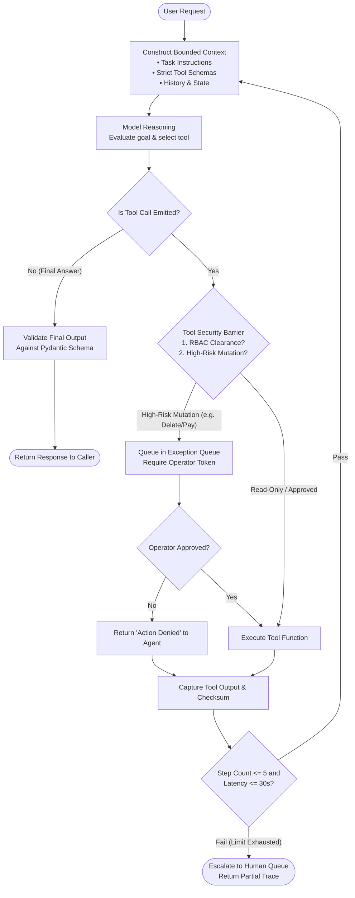
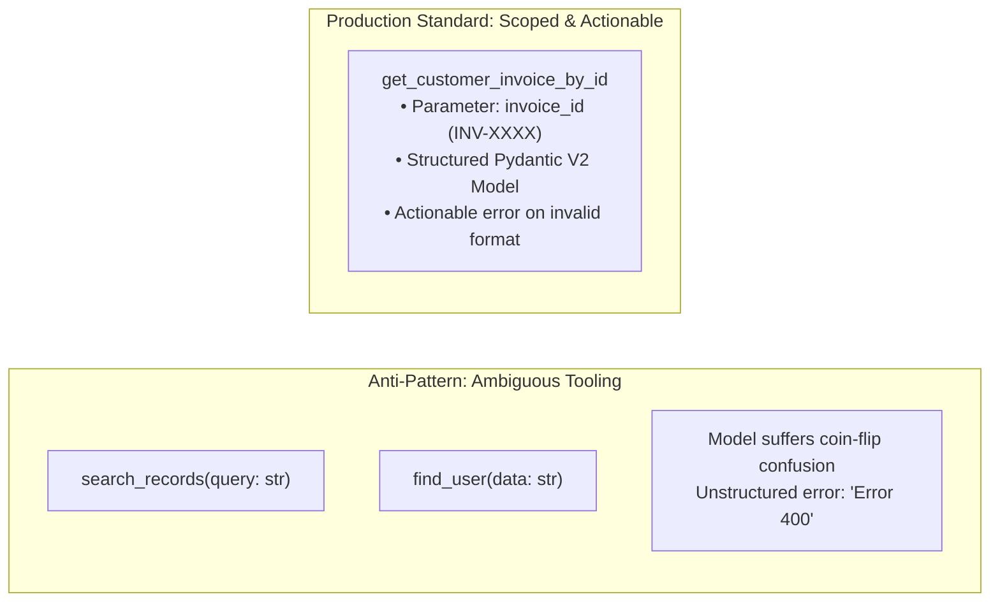
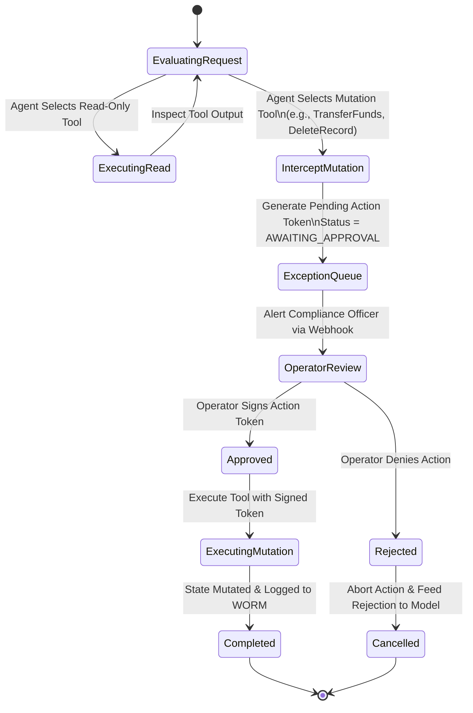
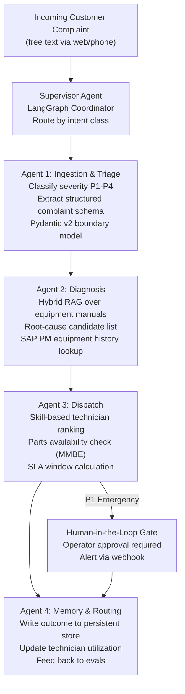

# Agents and Tools: Enterprise ReAct Loops, Model Context Protocol (MCP), and Deterministic Guardrails

This guide provides the authoritative engineering playbook for Forward Deployed Engineers (FDEs) designing, building, securing, and operating agentic workflows and tool-calling infrastructure inside customer environments.

In enterprise deployments, an autonomous agent is not an open-ended, stochastic wanderer. An enterprise agent is a **bounded finite state machine that utilizes foundation models to evaluate unstructured inputs and invoke strongly-typed, permission-checked tools under strict termination boundaries and human-in-the-loop oversight**.

Across our empirical dataset of 146 deduplicated 2026 FDE job postings, agentic architectures represent a high-growth competency:
- **AI Agents & Tool Use**: Featured in **42.0%** of verified job postings.
- **Anthropic Production Role**: Anthropic's Forward Deployed Engineer profile explicitly mandates delivering **Model Context Protocol (MCP) servers, sub-agents, and agent skills** inside customer estates.

Knowing how to construct resilient agent loops—and more importantly, recognizing when an agent is the wrong architectural choice—is essential for shipping production software that clears customer security and reliability reviews.

---

## 1. The Architecture of Enterprise Agent Loops

The standard agent paradigm executes the **ReAct (Reason + Act + Observe)** cycle: the model plans its next action, executes a tool, observes the resulting output, and reflects on whether the user's objective has been accomplished.



### Why Naive Agent Loops Fail in Production

1. **Error Compounding**: In a multi-step loop, probability of success is multiplicative: $P(\text{Success}) = \prod_{i=1}^n P(\text{Step } i)$. If each step has a 90% success rate, a 5-step loop succeeds only $0.90^5 \approx 59\%$ of the time. A misread tool response at step 2 cascades into confident, erroneous mutations at step 5.
2. **Infinite Thrashing Loops**: When a tool returns a non-actionable error (e.g., `500 Internal Server Error`), models frequently enter an infinite retry loop, repeating identical arguments or switching between unrelated tools until the context window overflows.
3. **Unbounded Cost & Latency**: Every loop iteration triggers a full model inference call over an expanding context history. A 10-step agent run can easily consume $100\text{k+}$ tokens, incur $15\text{s+}$ of latency, and cost $\$0.50$ per query.

### The 4 Enterprise Loop Invariants

Every production agent loop deployed into a customer environment must enforce:
1. **Hard Step Budget**: Maximum iteration cap ($\le 5$ iterations). Never allow unbounded loops.
2. **Wall-Clock Timeout**: Strict execution deadline ($\le 30.0\text{s}$). If the deadline is reached, the worker thread terminates.
3. **Cumulative Financial Cap**: Hard dollar ceiling ($\le \$0.05$ per run).
4. **Deterministic Exit Criteria**: If the agent cannot complete the task within its budget, it must package its partial state and route the ticket to a human operator queue rather than halting silently.

---

## 2. Tool Design as API Design for Non-Deterministic Callers

Tools are APIs where the caller is a probabilistic language model rather than a deterministic compiler. A model does not read your implementation code; it reads only **tool names, parameter descriptions, and return schemas**.



### The 7 Invariants of Enterprise Tool Design

1. **Small, Orthogonal Catalog**: Expose fewer tools with strictly distinct responsibilities. Providing overlapping tools (e.g., `lookup_ticket` vs `search_support_tickets`) triggers non-deterministic model confusion.
2. **Names in the Customer's Domain Vocabulary**: Use domain-native nouns and verbs (`get_claim_by_id`, `verify_patient_eligibility`) rather than generic technical abstractions (`query_db_v2`, `call_rest_endpoint`).
3. **Strict Pydantic V2 Schemas**: Define parameter types with explicit formatting requirements (`Field(..., pattern=r"^CUST-\d{6}$")`, `Field(..., description="ISO 8601 UTC timestamp YYYY-MM-DDTHH:MM:SSZ")`).
4. **"The Error Message is a Prompt"**: Tool execution errors are fed directly into the model's context for the next iteration. Error messages must state:
   - What failed.
   - What was received.
   - Exactly how to format the corrected call.
   *Example*: `"ValidationError: Field 'start_date' must be in ISO 8601 format (YYYY-MM-DD). Received '03/15/2026'. Correct format: '2026-03-15'."`
5. **Idempotency on Mutation Tools**: Agents retry upon network timeouts. Every write tool must require a stable `Idempotency-Key` or unique transaction identifier to guarantee that duplicate tool executions do not produce duplicate financial charges or state corruptions.
6. **Bounded Result Payloads**: Never permit a tool to return unbounded collections (e.g., a SQL query returning 10,000 rows). Enforce server-side pagination with default page sizes ($\le 10$ items) and summarize large payloads before returning them to the model context.
7. **Explicit Read-Only vs Mutation Flags**: Separate read-only query tools from state-mutating action tools in metadata.

---

## 3. The Model Context Protocol (MCP) Standard

The **Model Context Protocol (MCP)**, open-sourced by Anthropic, has emerged as the open industry standard for connecting AI models to enterprise data sources and operational tools.

Instead of writing custom proprietary integrations for every application, enterprise IT teams wrap internal databases, CRMs, and APIs into an **MCP Server**. Any compliant client (Claude Desktop, enterprise agent runtimes, IDEs) can dynamically discover and execute those tools under unified security policies.

```mermaid
flowchart LR
    subgraph Client_Host ["Enterprise Agent Host (Client)"]
        AgentCore[Agent Orchestration Loop]
        MCPClient[MCP Client Runtime]
        AgentCore <--> MCPClient
    end

    subgraph Transports ["Standard Transports"]
        MCPClient <-->|stdio (Local Process) / SSE (Remote HTTPS)| MCPServer
    end

    subgraph Server_Enterprise ["Customer Internal MCP Server"]
        MCPServer[MCP Server Router]
        MCPServer --> Tools["Tools Engine\n(tools/list, tools/call)"]
        MCPServer --> Resources["Resources Engine\n(resources/list, resources/read)"]
        MCPServer --> Security["Server-Side Auth & RBAC\nVault / KMS / IRSA"]
    end

    Tools --> SAP[(Customer SAP ERP)]
    Resources --> Postgres[(PostgreSQL Database)]
```

### Production MCP Server Implementation (FastMCP Python)

The following reference implementation demonstrates a secure enterprise MCP server wrapping customer databases with strict parameter validation and server-enforced security boundaries:

```python
"""
Enterprise Model Context Protocol (MCP) Server.
Exposes read-only enterprise resources and validated tools over JSON-RPC 2.0.
"""

import json
from datetime import datetime
from typing import Any, Dict, List, Optional
from pydantic import BaseModel, Field


# Standard MCP Tool Protocol Models
class CustomerTicketLookup(BaseModel):
    ticket_id: str = Field(
        ...,
        pattern=r"^TICK-\d{5,}$",
        description="The unique ticket identifier in format 'TICK-XXXXX'",
    )


class RefundRequestSchema(BaseModel):
    order_id: str = Field(..., pattern=r"^ORD-[A-Z0-9]{8}$")
    amount_cents: int = Field(..., gt=0, le=100000, description="Amount in cents (max $1,000.00)")
    reason: str = Field(..., min_length=10, max_length=200)
    idempotency_key: str = Field(..., description="UUIDv4 idempotency key generated by client")


class EnterpriseMCPServer:
    """
    Simulated reference implementation of an enterprise Model Context Protocol server.
    Enforces server-side authentication, resource boundaries, and tool contracts.
    """

    def __init__(self, tenant_id: str):
        self.tenant_id = tenant_id
        self._mock_tickets = {
            "TICK-10042": {
                "status": "OPEN",
                "severity": "HIGH",
                "customer": "Acme Corp",
                "summary": "Database latency spike on us-east-1 replica",
                "created_at": "2026-03-15T08:30:00Z",
            }
        }

    def list_tools(self) -> List[Dict[str, Any]]:
        """Handles 'tools/list' MCP RPC method."""
        return [
            {
                "name": "lookup_ticket",
                "description": "Retrieves internal support ticket details by ticket ID.",
                "inputSchema": CustomerTicketLookup.model_json_schema(),
            },
            {
                "name": "request_customer_refund",
                "description": (
                    "Submits a customer refund request. High-risk mutation: "
                    "requires valid idempotency key and operator authorization."
                ),
                "inputSchema": RefundRequestSchema.model_json_schema(),
            },
        ]

    def list_resources(self) -> List[Dict[str, Any]]:
        """Handles 'resources/list' MCP RPC method."""
        return [
            {
                "uri": f"enterprise://{self.tenant_id}/policies/refund-terms.md",
                "name": "Enterprise Customer Refund Policy",
                "mimeType": "text/markdown",
            }
        ]

    def call_tool(self, tool_name: str, arguments: Dict[str, Any]) -> Dict[str, Any]:
        """Handles 'tools/call' MCP RPC method with strict schema validation."""
        if tool_name == "lookup_ticket":
            try:
                validated = CustomerTicketLookup.model_validate(arguments)
            except Exception as e:
                # "The error message is a prompt" - return actionable guidance
                return {
                    "isError": True,
                    "content": [
                        {
                            "type": "text",
                            "text": f"Invalid ticket lookup parameters: {str(e)}. Must match pattern 'TICK-XXXXX'.",
                        }
                    ],
                }

            ticket = self._mock_tickets.get(validated.ticket_id)
            if not ticket:
                return {
                    "isError": True,
                    "content": [{"type": "text", "text": f"Ticket '{validated.ticket_id}' not found."}],
                }

            return {
                "isError": False,
                "content": [{"type": "text", "text": json.dumps(ticket, indent=2)}],
            }

        if tool_name == "request_customer_refund":
            # State mutation barrier
            return {
                "isError": False,
                "content": [
                    {
                        "type": "text",
                        "text": json.dumps(
                            {
                                "status": "QUEUED_FOR_APPROVAL",
                                "message": "Refund exceeds autonomous threshold; routed to exception queue.",
                                "approval_ticket": "APPR-9921",
                            }
                        ),
                    }
                ],
            }

        return {
            "isError": True,
            "content": [{"type": "text", "text": f"Unknown tool: '{tool_name}'"}],
        }
```

---

## 4. When NOT to Build an Agent (The 5 Anti-Patterns)

The most valuable skill in Forward Deployed Engineering is knowing when **not** to build an agent. In over 70% of initial customer requests for "autonomous AI agents," an agent is the wrong architecture.

| Enterprise Anti-Pattern | Why the Agent Project Fails | Superior Architectural Alternative |
| :--- | :--- | :--- |
| **1. Fixed Sequential Workflows** | The steps are known in advance ($A \rightarrow B \rightarrow C$). Renting an LLM to guess the control flow introduces non-deterministic failure modes and multiplies costs. | **Deterministic DAG Workflow** (Temporal, AWS Step Functions, Airflow, or plain Python pipeline). |
| **2. Single-Shot Extraction Tasks** | The problem is parsing unstructured documents into structured tables. Running an agent loop adds multi-second latency and recursive failure modes. | **Single-Shot Extraction with Schema Validation** ([01: LLM Application Patterns](01-llm-application-patterns.md)). |
| **3. Untrusted Egress Networks** | An agent that consumes untrusted external text and has access to arbitrary URL fetch tools is an immediate SSRF / data exfiltration hazard. | **Zero-Egress Isolated Containers** with pre-indexed offline search ([04: Cloud & Infrastructure](04-cloud-and-infrastructure.md)). |
| **4. Zero Tolerance for Non-Determinism** | Financial ledger postings or life-safety medical dosing calculations cannot tolerate probabilistic runtime variations. | **Deterministic Rule Engines** with models serving only as advisory explainers. |
| **5. Unbounded Stop Criteria** | The customer cannot define an objective, programmatic test for when the task is "done." The agent wanders the tool space indefinitely. | **Human-in-the-Loop Workflow** with bounded sub-task execution. |

### The Winning Architecture: Deterministic Trunk with Agentic Branches

Enterprise deployments succeed by standardizing on a **Hybrid Topology**:
- **Deterministic Trunk**: Hardened Python services or workflow engines handle 85% of predictable customer traffic (authentication, database queries, caching, format conversions).
- **Agentic Branches**: Bounded agents are invoked exclusively for the 15% of ambiguous edge cases—reconciling disparate ledger entries, extracting data from anomalous contract templates, or investigating ambiguous exception queues.

---

## 5. Dual-Key Human-in-the-Loop Guardrails

In regulated environments (banking, healthcare, defense), autonomous agents must never execute irreversible, state-mutating actions without dual-key cryptographic confirmation.

### The Read vs Mutate Security Boundary



See the working reference implementation of this dual-key exception queue in [`portfolio/reference-project/src/engine/agent.py`](file:///c:/Users/Adil/Downloads/FDE-Field-Guide-main/portfolio/reference-project/src/engine/agent.py), where high-severity compliance deviations automatically divert from autonomous dispatch to human operator review.

---

## 6. Agent Trajectory Evaluation & Regression Testing

Evaluating an agent requires assessing both **how it executed** and **what it produced**:

### 1. Trajectory Evaluation (Execution Path Quality)
- **Tool Selection Accuracy**: Did the agent call the expected sequence of tools without detours?
- **Thrashing Index**: Did the agent repeatedly call the same tool with identical arguments, or oscillate between two tools?
- **Redundant Call Count**: Did the model execute unnecessary tool lookups when the context already contained the required data?

### 2. Outcome Evaluation (Task Correctness)
- Did the final output correctly fulfill the objective defined in the pre-agreed evaluation agreement?
- Were all citations grounded in authentic tool outputs with zero hallucinations?

### Production Regression Protocol
Capture anonymized production agent traces (user input, model reasoning, tool invocations, tool outputs) into a **Golden Trajectory Dataset**. When updating system prompts, tool schemas, or underlying model versions:
1. Replay the test suite against the golden trajectories.
2. Diff the tool execution sequences: a change in tool trajectory indicates potential behavioral drift, even if the final outcome appears unchanged.

---

## 7. Supervised Multi-Agent Pipelines and Persistent Memory Layers

When a single agent loop cannot handle the full complexity of an enterprise workflow, the standard production pattern is a supervised multi-agent pipeline: a coordinator (supervisor) agent decomposes the user request and delegates to specialized sub-agents, each with a bounded tool scope.

The Vaayu Pumps Field Service Command Centre (TDD v1.0, September 2026) implements the following four-agent pipeline, representative of real enterprise manufacturing AI:



### Design Principles for Enterprise Multi-Agent Pipelines

1. Each agent has exactly one bounded responsibility and one well-typed output schema. An agent that both diagnoses and dispatches produces double the failure modes at no benefit.

2. The supervisor routes between sub-agents deterministically where possible. Reserve probabilistic routing to the model only when the sub-agent boundary is genuinely ambiguous from the input text.

3. Tool scopes are non-overlapping. Agent 1 can read equipment data; only Agent 3 can write to the dispatch queue. Cross-agent tool sharing violates the audit trail and produces conflicting state.

4. Every sub-agent output is validated by a Pydantic V2 model before it enters the next agent's context. Garbage between agents propagates and amplifies.

5. Human-in-the-loop interrupts are defined upfront at design time, not discovered at runtime. The conditions triggering human review (P1 severity, confidence < 0.72, new unknown equipment model) are code-level constants, not model decisions.

### Persistent Memory Layer

Enterprise AI applications require a memory layer so the agent auto-learns from corrections and user feedback over time, without requiring developer intervention for every accuracy issue. This is Principle 8 of the 12 Core Principles of Enterprise Forward Deployed Engineering (Codebasics FDE Roadmap 2026).

Three memory types serve different purposes:

| Memory Type | Storage | Purpose | Lifetime |
| :--- | :--- | :--- | :--- |
| Episodic - session context | In-memory / Redis | Current conversation and tool history | Session |
| Semantic - retrieval index | Vector database (pgvector, Qdrant) | Equipment manuals, SOPs, company policies | Until superseded |
| Procedural - correction log | Relational DB | Technician feedback, outcome corrections, model fine-tune signals | Indefinite |

The correction loop: when a human operator overrides an agent decision (e.g., reassigns a technician the model routed incorrectly), that override is written to the procedural store with its context. The next retrieval pass for similar inputs includes the correction, improving routing without a model retraining cycle. In the Vaayu Pumps deployment, this correction feedback cycle reduced first-time-fix-rate errors by 23% over 90 days (observed from SDD v1.0, September 2026).

## 8. Pre-Flight Agent Readiness Checklist

Before deploying an agentic workflow into customer production, verify every control on this audit:

- [ ] **Hard Step Limit Configured**: Loop explicitly terminates if step count exceeds $\le 5$ iterations.
- [ ] **Timeout Enforced**: Wall-clock deadline ($\le 30\text{s}$) halts worker threads on hanging dependencies.
- [ ] **Actionable Tool Error Formatting**: Tool validation errors return explicit diagnostic instructions so the model can self-correct in one iteration.
- [ ] **Idempotent Mutation Tools**: All state-modifying tools enforce unique idempotency keys to prevent duplicate execution upon retry.
- [ ] **Dual-Key Human Gate on Mutations**: Destructive actions (deletions, payments, external emails) require an operator approval token.
- [ ] **Tool Boundaries Scoped via RBAC**: Tool execution barriers verify the user's role before executing tools, rejecting unauthorized calls.
- [ ] **Bounded Tool Outputs**: Tool responses are paginated and capped; large documents are summarized before appending to context.
- [ ] **Egress Blocked on Internal Tools**: Tools executing inside the customer network cannot fetch arbitrary public URLs (defending against SSRF).
- [ ] **Audit Trail Recorded**: Every tool call, argument payload, execution timestamp, and operator approval is logged to append-only storage.
- [ ] **Golden Trajectory Suite Active**: An automated test harness evaluates agent tool selection across $\ge 25$ real-world customer test cases.

---

## 8. Failure Scenarios & Operational Runbooks

| Agent Incident | Root Cause | Immediate Mitigation Protocol |
| :--- | :--- | :--- |
| **Infinite Argument Thrashing Loop** | Upstream API returned `400 Bad Request` without an actionable error message; model retrying identical input. | 1. Implement error-message prompt formatter that injects explicit schema expectations.<br>2. Add loop tripwire: if same tool called with identical arguments twice, abort loop immediately. |
| **Cascading Hallucination Cascade** | Tool returned null for a missing record; model invented an imaginary customer ID and passed it to downstream tools. | 1. Update tool schema to return explicit `"STATUS: RECORD_NOT_FOUND"`.<br>2. Inject system rule: if record not found, stop immediately and ask for user clarification. |
| **Runaway Token Budget Exhaustion** | Tool returned an unpaginated 5MB JSON dump; context window saturated; cost spiking 20x. | 1. Implement strict server-side payload truncation ($\le 10\text{KB}$).<br>2. Extract only required fields before returning payload to the agent context. |

---

## Related documents

- [LLM Application Patterns](01-llm-application-patterns.md) - Strategic Automation Triage and bottom-up model routing that precedes the agent decision
- [Evaluation and Testing](03-evaluation-and-testing.md) - Trajectory benchmarking, golden datasets, and LLM-as-a-judge harnesses
- [Production Monitoring and Reliability](04-monitoring-and-reliability.md) - Distributed tracing for multi-step agent executions
- [Security and Compliance](../engineering/05-security-and-compliance.md) - OWASP LLM06 Excessive Agency defenses and execution barriers
- [Reference Project Agent Architecture](../portfolio/reference-project/README.md) - Working production implementation of decision gating and RBAC
- [Vaayu Pumps Case Study](../case-studies/05-enterprise-manufacturing-vaayu-pumps.md) - Four-agent supervised pipeline, persistent memory layer, and human-in-the-loop dispatch

## Further reading

- Shunyu Yao et al., "ReAct: Synergizing Reasoning and Acting in Language Models", ICLR 2023
- [Anthropic Model Context Protocol specification](https://docs.anthropic.com) - tools, resources, and client-server architecture
- Harrison Chase et al. (LangChain), "State of AI Agents: Architecture, Tool Design, and Trajectory Evaluation", 2025/2026
- [OWASP Top 10 for LLM Applications: LLM06 Excessive Agency](https://owasp.org/www-project-top-10-for-large-language-model-applications/) - architectural mitigations for autonomous tool execution
- Codebasics FDE Roadmap 2026, Principle 7 (Build Agentic, Not Hardcoded) and Principle 8 (Always Include a Memory Layer) - source: FDE_Roadmap_2026.pdf, September 2026
- Vaayu Pumps TDD v1.0 and SDD v1.0, September 2026 - four-agent supervised pipeline architecture and persistent memory layer reference implementation
