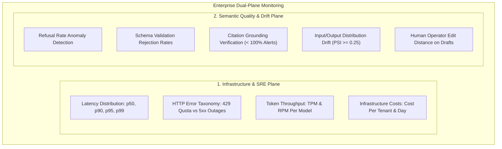
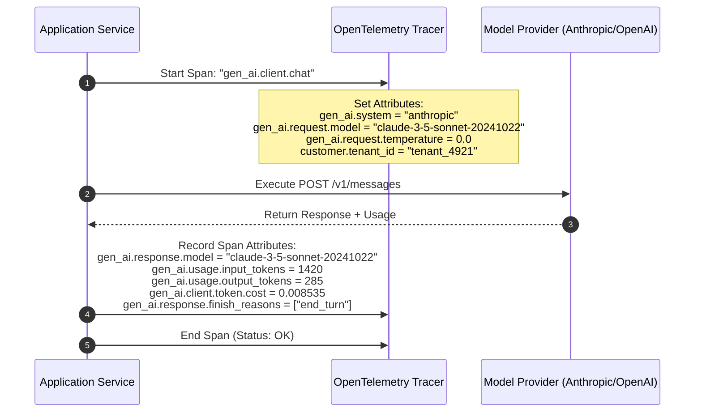
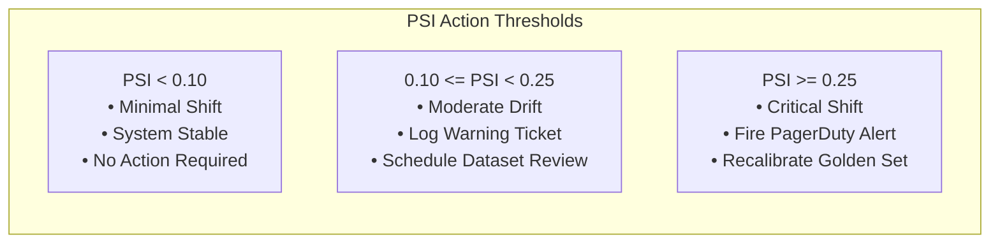
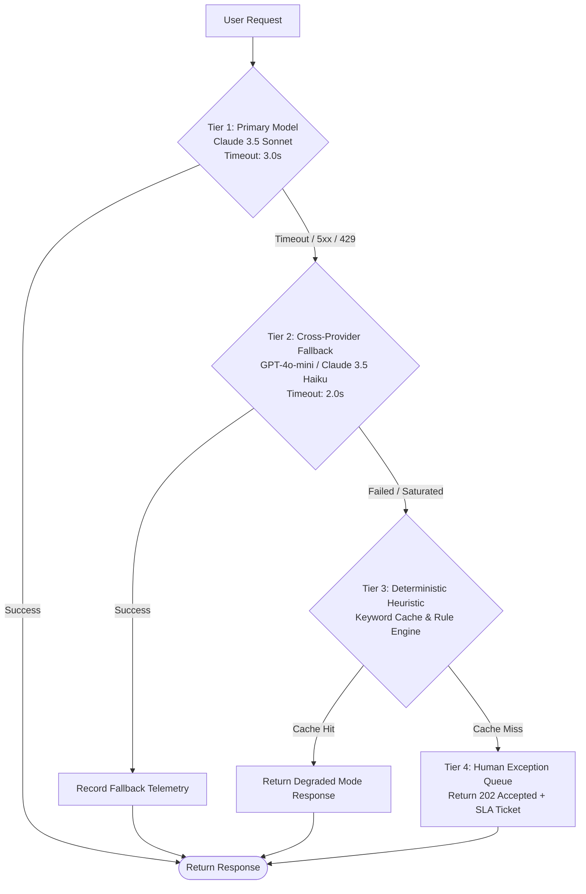

# Monitoring and Reliability for LLM Systems: Tracing, Quality Drift, and Fallback Cascades

This guide provides the authoritative engineering playbook for Forward Deployed Engineers (FDEs) operating, observing, and hardening Large Language Model (LLM) applications deployed within enterprise customer infrastructure.

In traditional software systems, an HTTP `200 OK` status code indicates healthy execution. LLM systems fail differently: **they fail probabilistically**. A model application can return `200 OK` in 300ms while generating a hallucinated factual claim, violating customer compliance policy, or producing unparseable output. Consequently, production observability must simultaneously monitor two distinct operational planes: **Infrastructure Health** and **Semantic Quality Drift**.

Across our empirical dataset of 146 deduplicated 2026 FDE job postings, **evaluation, testing, and monitoring appear in 49.0% of listings**. Operating an AI system post-launch requires capturing structured telemetry, calculating mathematical drift indices, and deploying automated fallback cascades before users encounter service degradation.

---

## 1. The Dual-Plane Monitoring Architecture

Enterprise AI observability requires decoupling infrastructure metrics from semantic quality proxies:



### Infrastructure vs Quality Metric Taxonomy

| Observability Plane | Production Metric | Alert Threshold (Page vs Ticket) | Diagnostic Significance |
| :--- | :--- | :--- | :--- |
| **Infrastructure** | **p95 Latency** | **PAGE**: $> 2,500\text{ms}$ sustained for 5 min. | Network egress congestion, provider queue backlog, or prompt bloat. |
| **Infrastructure** | **Upstream 429 Rate** | **PAGE**: $> 5\%$ of egress requests over 3 min. | Account token quota exhausted; workers retrying in lockstep. |
| **Infrastructure** | **Container OOM (137)** | **PAGE**: Any container exit code 137. | Batch ingestion or unpaginated tool output exceeded memory limits. |
| **Quality Plane** | **Schema Reject Rate** | **TICKET**: Rejections $> 2.0\%$ of requests. | Upstream provider silently modified JSON generation syntax. |
| **Quality Plane** | **Model Refusal Spike** | **PAGE**: Refusals triple hour-over-hour. | Safety filter false-positive triggering on valid customer vocabulary. |
| **Quality Plane** | **Citation Grounding** | **PAGE**: Grounding drops below $100.0\%$. | System hallucinating unverified claims; legal/compliance violation. |
| **Quality Plane** | **Human Edit Distance** | **TICKET**: Operator edits increase by $> 25\%$. | Output drafts drifting from corporate tone or domain guidelines. |

---

## 2. OpenTelemetry (OTel) GenAI Semantic Conventions

Standardize all application tracing on the **OpenTelemetry Generative AI Semantic Conventions**. This ensures compatibility with the customer's existing enterprise APM stack (Datadog, Dynatrace, New Relic, Honeycomb, or self-hosted Grafana Tempo).



### Zero-Leakage PII Tracing Rules

Customer InfoSec policies strictly forbid logging sensitive customer data into monitoring backends:
1. **Metadata Only by Default**: Log token counts, latencies, model snapshots, and cryptographic SHA-256 hashes of input/output payloads:
   $$\text{payload\_checksum} = \text{SHA-256}(\text{raw\_text})$$
2. **Encrypted Debug Dumps**: If full prompt and completion capture is required for legal compliance, route payloads to an isolated, encrypted S3 bucket with a 7-day TTL and role-based access restrictions. Never write raw prompt text to plaintext application logs.

---

## 3. Mathematical Drift Detection: Population Stability Index (PSI)

Drift is the natural state of an enterprise LLM system. Over weeks of deployment, customer query distributions shift (e.g., a new product launch, seasonal traffic spikes, or regional expansions), rendering original prompts and few-shot examples suboptimal.

### The Population Stability Index (PSI)

To mathematically quantify whether production inputs or embeddings have drifted away from the baseline golden dataset, calculate the **Population Stability Index (PSI)**:

$$PSI = \sum_{i=1}^B \left(P_i - Q_i\right) \times \ln\left(\frac{P_i}{Q_i}\right)$$

- $B$: Number of measurement bins (e.g., token length buckets, embedding cluster bins).
- $P_i$: Observed actual distribution of production requests in bin $i$.
- $Q_i$: Expected reference distribution from the baseline golden dataset in bin $i$.



*Example*: If a customer expands to German-language tickets, the input token length distribution shifts dramatically upward ($P_i \ne Q_i$). When $PSI \ge 0.25$, an alert notifies the FDE to incorporate bilingual examples into the golden benchmark.

---

## 4. Reliability Patterns & The 4-Tier Fallback Cascade

Enterprise customer architectures must maintain business continuity even when public foundation model endpoints experience regional outages or severe rate-limiting.



### The 4 Tiers of the Fallback Cascade

1. **Tier 1: Primary Frontier Model**: Full reasoning and context capabilities (e.g., Claude 3.5 Sonnet or GPT-4o).
2. **Tier 2: Cross-Provider Fallback**: A fast, secondary model deployed on a physically distinct cloud infrastructure (e.g., falling back from AWS Bedrock Claude to Azure OpenAI GPT-4o-mini). Prevents single-vendor cloud outages from halting customer operations.
3. **Tier 3: Deterministic Heuristic Cache**: Pre-computed exact-match responses, keyword-based routing, or cached summaries. Returns degraded but functional results with zero model dependency.
4. **Tier 4: Human Exception Queue**: When automated paths fail, acknowledge receipt (`202 Accepted`), generate an audit ticket, and route the customer payload to a human operator queue with an explicit SLA.

---

## 5. Production Python Reference Implementation: OpenTelemetry Instrumentation

The following production script implements zero-leakage OpenTelemetry tracing, calculates real-time token costs, records latency distributions, and logs cryptographic checksums.

```python
"""
Enterprise OpenTelemetry Instrumentation Wrapper for LLM Calls.
Enforces OTel GenAI Semantic Conventions, real-time cost calculation,
and zero-leakage payload hashing.
"""

import hashlib
import time
from typing import Any, Callable, Dict, Optional, Tuple


class OpenTelemetryLLMTracer:
    """
    Wraps LLM invocations with OpenTelemetry-compliant telemetry spans.
    """

    # 2026 Model Token Pricing (USD per 1M tokens)
    PRICING_CATALOG = {
        "claude-3-5-sonnet-20241022": {"input": 3.00, "output": 15.00},
        "claude-3-5-haiku-20241022": {"input": 0.80, "output": 4.00},
        "gpt-4o-2024-08-06": {"input": 2.50, "output": 10.00},
        "gpt-4o-mini-2024-07-18": {"input": 0.15, "output": 0.60},
    }

    def __init__(self, tracer_provider: Any = None):
        self.tracer = tracer_provider

    def _hash_payload(self, text: str) -> str:
        return hashlib.sha256(text.encode("utf-8")).hexdigest()

    def calculate_cost(self, model_id: str, input_tokens: int, output_tokens: int) -> float:
        pricing = self.PRICING_CATALOG.get(
            model_id, {"input": 3.00, "output": 15.00}
        )
        input_cost = (input_tokens / 1_000_000.0) * pricing["input"]
        output_cost = (output_tokens / 1_000_000.0) * pricing["output"]
        return round(input_cost + output_cost, 6)

    def execute_traced_call(
        self,
        model_id: str,
        system_instructions: str,
        user_prompt: str,
        tenant_id: str,
        call_fn: Callable[[], Tuple[str, int, int]],
    ) -> Dict[str, Any]:
        """
        Executes model call with OTel span recording and cost computation.
        call_fn returns: (generated_text, input_tokens, output_tokens)
        """
        start_time = time.perf_counter()
        prompt_hash = self._hash_payload(f"{system_instructions}:{user_prompt}")

        # In production: with self.tracer.start_as_current_span("gen_ai.client.chat") as span:
        try:
            generated_text, in_tokens, out_tokens = call_fn()
            duration_ms = (time.perf_counter() - start_time) * 1000.0
            total_cost = self.calculate_cost(model_id, in_tokens, out_tokens)
            response_hash = self._hash_payload(generated_text)

            telemetry_record = {
                "span_name": "gen_ai.client.chat",
                "status": "OK",
                "attributes": {
                    "gen_ai.system": "anthropic" if "claude" in model_id else "openai",
                    "gen_ai.request.model": model_id,
                    "gen_ai.response.model": model_id,
                    "gen_ai.usage.input_tokens": in_tokens,
                    "gen_ai.usage.output_tokens": out_tokens,
                    "gen_ai.client.token.cost": total_cost,
                    "customer.tenant_id": tenant_id,
                    "security.prompt_sha256": prompt_hash,
                    "security.response_sha256": response_hash,
                    "performance.duration_ms": round(duration_ms, 2),
                },
                "result": generated_text,
            }
            return telemetry_record

        except Exception as exc:
            duration_ms = (time.perf_counter() - start_time) * 1000.0
            return {
                "span_name": "gen_ai.client.chat",
                "status": "ERROR",
                "attributes": {
                    "gen_ai.request.model": model_id,
                    "customer.tenant_id": tenant_id,
                    "error.type": type(exc).__name__,
                    "error.message": str(exc),
                    "performance.duration_ms": round(duration_ms, 2),
                },
                "exception": exc,
            }
```

---

## 6. Pre-Flight Monitoring Readiness Checklist

Before signing off on production cutover, verify every item on this operational audit:

- [ ] **OpenTelemetry Spans Active**: Every model call, retrieval query, and tool execution emits a structured OTel span with latency and token usage.
- [ ] **Zero-Leakage Tracing Enforced**: Application logs capture token counts and SHA-256 payload checksums; raw customer prompts are never written to plaintext log streams.
- [ ] **Dual-Plane Dashboards Configured**: Grafana/Datadog dashboards display both infrastructure metrics (p95 latency, 429 rates) and quality proxies (refusal rates, schema rejections).
- [ ] **Symptom-Based Paging Rules**: PagerDuty/Opsgenie pages fire on user-impacting symptoms (p95 $> 2,500\text{ms}$, refusal rate tripling), not on transient single-request exceptions.
- [ ] **Automated Fallback Cascade Tested**: Primary model failure cleanly cascades to secondary provider, heuristic cache, and human exception queue in staging tests.
- [ ] **Circuit Breakers Active**: Outbound calls trip open upon sustained upstream 429 bursts, protecting internal worker thread pools from exhaustion.
- [ ] **Scheduled Golden Benchmark Runs**: Automated cron executes the golden evaluation set weekly against production configurations to catch silent provider drift.
- [ ] **Population Stability Index (PSI) Monitored**: Input length distributions and embedding clusters monitored for shifts ($PSI \ge 0.25$).
- [ ] **Kill Switches Operational**: Every model-backed feature can be disabled independently via feature flags without redeploying code.
- [ ] **Runbooks Linked to Every Alert**: Every monitoring alert links to an explicit step-by-step mitigation runbook in the customer's documentation repo.

---

## 7. Failure Scenarios & Operational Runbooks

| Production Incident | Root Cause | Immediate Mitigation Protocol |
| :--- | :--- | :--- |
| **Upstream 429 Quota Exhaustion Cascade** | Customer marketing campaign increased traffic 5x; vendor per-minute token quota exceeded. | 1. Trip circuit breaker to enable client-side rate shedding.<br>2. Route non-critical background summarization jobs to secondary provider.<br>3. Halve worker concurrency.<br>4. Open emergency quota expansion ticket with vendor account team. |
| **Silent Model Refusal Storm** | Vendor updated foundation model system guardrails; valid customer medical/financial queries falsely flagged as unsafe. | 1. Confirm refusal surge via `gen_ai.response.finish_reasons` telemetry.<br>2. Adjust prompt framing to emphasize authorized enterprise compliance role.<br>3. If unresolved, switch feature flag to pinned previous model version. |
| **Accidental PII Logging Emergency** | An engineer enabled debug logging in production; unredacted customer PII written to CloudWatch/Datadog. | 1. Immediately revoke debug feature flag.<br>2. Execute automated log deletion script targeting the affected time window.<br>3. Notify customer CISO/Privacy Officer with an audit ledger of affected records.<br>4. Rotate compromised secrets/tokens if present in logs. |

---

## 8. Related System Documents

- [Evaluation and Testing](03-evaluation-and-testing.md) - Golden benchmarks and metrics that power drift detection.
- [Agents and Tools](02-agents-and-tools.md) - Tracing multi-step agent trajectories and tool invocations.
- [APIs and Integrations](../engineering/02-apis-and-integrations.md) - Exponential backoff, jitter, and circuit breaker implementations.
- [Security and Compliance](../engineering/05-security-and-compliance.md) - Zero Data Retention agreements and audit trail governance.
- [Production Readiness Checklist](../deployment/03-production-readiness-checklist.md) - The final operational sign-off gate before go-live.

---

## 9. Primary Monitoring Literature

1. **OpenTelemetry Consortium**: *"Semantic Conventions for Generative AI Operations"*. CNCF OpenTelemetry Specification, 2024/2026.
2. **Betsy Beyer, Chris Jones, Jennifer Petoff, and Niall Richard Murphy**: *"Site Reliability Engineering: How Google Runs Production Systems"*. O'Reilly Media. (Foundational reference for symptom-based alerting and error budgets).
3. **Bilal Yurdakul**: *"Statistical Properties of the Population Stability Index"*. Journal of Risk Model Validation. (Mathematical derivation and thresholds for PSI).
4. **Prometheus Authors**: *"Alerting Rules and Metric Instrumentation Best Practices"*. Linux Foundation.
5. **Empirical Job Market Analysis (2026)**: Independent audit of 146 deduplicated FDE job postings showing **Evaluation, Testing, and Monitoring in 49.0% of listings**.
