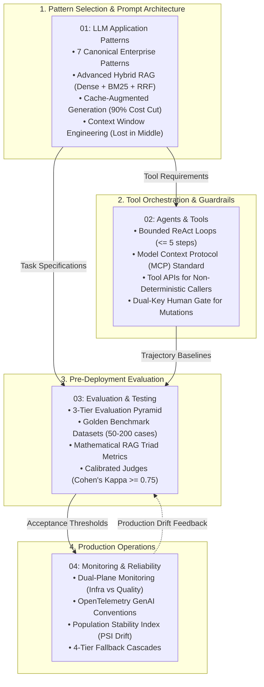

# AI and LLM Engineering: Architectures, Agents, Evaluation, and Production Observability

This portal serves as the authoritative architectural master index for the **AI Engineering Pillar** of the Forward Deployed Engineering (FDE) Field Guide.

In enterprise customer deployments, foundation models are never deployed as open-ended chatbots or unconstrained prompt experiments. An enterprise AI system is a **deterministic, schema-constrained data processing pipeline that utilizes probabilistic reasoning only where deterministic code (SQL, regex, AST parsers) fails**.

Across our empirical dataset of 146 deduplicated 2026 FDE job postings, AI engineering competencies dominate hiring requirements:
- **Prompt Engineering & System Design**: **55.0%** of postings.
- **Retrieval-Augmented Generation (RAG)**: **52.0%** of postings.
- **Evaluation, Testing, and Monitoring**: **49.0%** of postings.
- **Foundation Model Architecture**: **43.0%** of postings.
- **AI Agents & Tool-Use**: **42.0%** of postings.

Furthermore, a landmark study by MIT NANDA (*The GenAI Divide: State of AI in Business 2025*, reported in *Fortune*, August 2025) revealed that **roughly 95% of enterprise Generative AI pilots delivered zero measurable P&L impact**. The root cause was that organizations evaluated their systems on qualitative "vibes" rather than defining "good" as a concrete, defensible number. This pillar establishes the engineering discipline required to deliver auditable, reliable, and high-ROI AI systems into enterprise customer estates.

---

## 1. Architectural Knowledge Topology

The four core guides in this pillar form an integrated lifecycle, connecting pattern selection to tool orchestration, offline evaluation, and live production observability:

---

## 2. Guide Syntheses & Technical Invariants

### 1. [LLM Application Patterns](01-llm-application-patterns.md)
*The pattern catalog: selecting the simplest model architecture that reliably solves the customer's problem.*
- **The 7 Canonical Enterprise Patterns**: Single-shot structured extraction, strict schema-constrained generation, classification & cascading model routing, advanced Hybrid RAG, summarization & delta briefing, state-compressed conversations, and deterministic agentic workflows.
- **Context Window Engineering & Context Rot**: Mitigating the "Lost-in-the-Middle" recall degradation curve (Liu et al., 2023) using structural XML delimiters (`<instructions>`, `<context>`, `<documents>`).
- **Cache-Augmented Generation (CAG)**: Leveraging Anthropic Prompt Caching and OpenAI prefix caching to achieve a 90% discount on input token costs and an 80% reduction in time-to-first-token (TTFT).
- **Hybrid RAG with Reciprocal Rank Fusion (RRF)**: Fusing dense vector cosine search with BM25 lexical keyword matching ($k = 60$) and cross-encoder rerankers.
- **Production Reference Implementation**: Self-healing structured extractor with Pydantic V2 boundary validation and automated error-feedback repair loops.

### 2. [Agents and Tools](02-agents-and-tools.md)
*Enterprise ReAct loops, Model Context Protocol (MCP), and deterministic guardrails.*
- **Bounded ReAct State Machines**: Enforcing hard loop boundaries: step limit budgets ($\le 5$ iterations), wall-clock timeouts ($\le 30.0\text{s}$), financial spend caps ($\le \$0.05/\text{run}$), and human escalation queues.
- **Tool Design for Non-Deterministic Callers**: Orthogonal tool catalogs, domain-native naming, strict Pydantic V2 schemas, actionable error-message prompt formatting, and idempotency keys on write tools.
- **The Model Context Protocol (MCP) Standard**: Architectural topology of MCP Hosts, Transports (stdio/SSE/HTTP), and Servers. Complete Python reference implementation of `EnterpriseMCPServer` with server-side security boundaries.
- **When NOT to Build an Agent**: The 5 anti-patterns (fixed pipelines, single-shot extraction, untrusted egress, strict non-determinism, and unbounded stop conditions). The winning Hybrid Topology: deterministic trunks carrying 85% of traffic, with agents handling the 15% ambiguous edge cases.
- **Dual-Key Human-in-the-Loop Guardrails**: Read-only tools execute autonomously; destructive or financial state changes route to an exception queue awaiting human operator approval.

### 3. [Evaluation and Testing for LLM Systems](03-evaluation-and-testing.md)
*The 3-tier evaluation pyramid, golden benchmarks, RAG triad metrics, and calibrated judges.*
- **The 3-Tier Enterprise Evaluation Pyramid**: Tier 1 (Unit & Boundary Invariants: regex, Pydantic, latency), Tier 2 (Component Evals: Retrieval hit rate @ K, MRR, NDCG), and Tier 3 (End-to-End System Evals: golden benchmarks, calibrated judges, human SME verification).
- **Golden Benchmark Dataset Construction**: 50 to 200 real-world customer cases curated with customer SMEs, incorporating a dedicated 10% adversarial long-tail slice and historical customer failure cases.
- **Mathematical Task Formulations**: Per-class Precision, Recall, and Macro $F_1$ for imbalanced datasets; the RAG Triad (Context Relevance, Groundedness, Answer Relevance) with a 100.0% citation grounding requirement.
- **LLM-as-a-Judge Calibration**: Measuring inter-annotator agreement against human expert gold labels using Cohen's Kappa ($\kappa = \frac{P_o - P_e}{1 - P_e}$), enforcing $\kappa \ge 0.75$ for enterprise gating.
- **Automated CI/CD Evaluation Runner**: Python evaluation harness calculating precision, recall, citation grounding rate, and latency distributions (p50, p90, p95, p99) to gate pull requests.

### 4. [Monitoring and Reliability for LLM Systems](04-monitoring-and-reliability.md)
*Dual-plane observability, OpenTelemetry GenAI conventions, and fallback cascades.*
- **The Dual-Plane Monitoring Architecture**: Decoupling **Infrastructure Health** (latency percentiles, HTTP 429 quota exhaustion, 5xx server errors, token throughput, GPU OOM restarts) from the **Semantic Quality Plane** (refusal rate spikes, schema validation rejection rates, citation grounding rates, human operator edit distance).
- **OpenTelemetry (OTel) GenAI Semantic Conventions**: Standardized attributes (`gen_ai.system`, `gen_ai.request.model`, `gen_ai.usage.input_tokens`, `gen_ai.client.token.cost`), paired with zero-leakage PII scrubbing and payload hashing.
- **Mathematical Drift Detection: Population Stability Index (PSI)**: Quantifying input length and embedding distribution shifts via PSI:
  $$PSI = \sum_{i=1}^B (P_i - Q_i) \times \ln\left(\frac{P_i}{Q_i}\right)$$
  Action thresholds: $PSI < 0.10$ (stable), $0.10 \le PSI < 0.25$ (moderate drift), and $PSI \ge 0.25$ (critical shift triggering automated golden set recalibration).
- **Reliability & The 4-Tier Fallback Cascade**: Primary Frontier Model $\rightarrow$ Secondary Cross-Provider Fallback $\rightarrow$ Deterministic Heuristic Cache $\rightarrow$ Human Exception Queue.

---

## 3. Situational Field Navigation Matrix

When an architectural crisis or operational failure occurs in production, use this rapid-routing matrix to identify the authoritative mitigation protocol:

| Live Field Emergency | Immediate Root Cause | Target Engineering Protocol |
| :--- | :--- | :--- |
| **Model Inventing Missing Fields** | Extractor hallucinating plausible dates or IDs when source documents lack the data. | [01: Patterns §1](01-llm-application-patterns.md#pattern-1-single-shot-structured-extraction) — Implement explicit `CANNOT_EXTRACT` refusal token and self-healing repair loop. |
| **Agent Infinite Retry Thrashing** | Upstream tool returning generic errors; model repeating identical parameters in loop. | [02: Agents & Tools §2](02-agents-and-tools.md#the-7-invariants-of-enterprise-tool-design) — Format tool errors with actionable prompt remediation guidance and add loop tripwire. |
| **RAG Fails on Part Numbers / Codes** | Dense vector embeddings failing to match exact alphanumeric part codes or acronyms. | [01: Patterns §1](01-llm-application-patterns.md#pattern-4-advanced-hybrid-rag-dense--sparse--rrf) — Deploy Hybrid Search combining dense vector cosine with BM25 lexical keyword matching via RRF ($k=60$). |
| **Rare-Class Evaluation Degradation** | Prompt modification optimized global accuracy but degraded critical rare $P0$ outage routing. | [03: Evaluation §3](03-evaluation-and-testing.md#1-classification-metrics-precision-recall-f1-score) — Enforce per-class Precision and Recall thresholds and evaluate confusion matrix slices. |
| **Upstream 429 Quota Exhaustion Storm** | Parallel workers exceeded provider per-minute token quota; requests failing in lockstep. | [04: Monitoring §4](04-monitoring-and-reliability.md#4-reliability-patterns--the-4-tier-fallback-cascade) — Trip client-side circuit breaker and route background traffic to secondary provider. |
| **Silent Safety Refusal Spike** | Vendor updated foundation model system guardrails; valid customer queries falsely rejected. | [04: Monitoring §1](04-monitoring-and-reliability.md#1-the-dual-plane-monitoring-architecture) — Track `gen_ai.response.finish_reasons` and deploy prompt framing adjustments or version rollback. |
| **Customer CISO Rejects LLM Egress** | Security review board halts deployment due to external model API privacy concerns. | [01: Patterns §3](01-llm-application-patterns.md#3-cache-augmented-generation-cag--prompt-caching) & [Security §2](../engineering/05-security-and-compliance.md#2-data-boundaries-zero-egress--model-subprocessor-governance) — Present Zero Data Retention (ZDR) agreements, no-training clauses, and PrivateLink endpoints. |

---

## 4. Codebase Defense & Reference Implementations

The engineering patterns documented across this pillar are implemented as fully tested, runnable code within this repository:

| Architectural Mechanism | Repository Reference Implementation | Unit Test & Evaluation Coverage |
| :--- | :--- | :--- |
| **Self-Healing Structured Extractor** | [`interviews/code/structured_extractor.py`](file:///c:/Users/Adil/Downloads/FDE-Field-Guide-main/interviews/code/structured_extractor.py) | [`interviews/code/test_structured_extractor.py`](file:///c:/Users/Adil/Downloads/FDE-Field-Guide-main/interviews/code/test_structured_extractor.py) (3 tests passed) |
| **Deterministic Document Chunker** | [`interviews/code/chunker.py`](file:///c:/Users/Adil/Downloads/FDE-Field-Guide-main/interviews/code/chunker.py) | [`interviews/code/test_chunker.py`](file:///c:/Users/Adil/Downloads/FDE-Field-Guide-main/interviews/code/test_chunker.py) (3 tests passed) |
| **Enterprise Decision Agent (ETISE)** | [`portfolio/reference-project/src/engine/agent.py`](file:///c:/Users/Adil/Downloads/FDE-Field-Guide-main/portfolio/reference-project/src/engine/agent.py) | [`portfolio/reference-project/tests/test_server.py`](file:///c:/Users/Adil/Downloads/FDE-Field-Guide-main/portfolio/reference-project/tests/test_server.py) (7 tests passed) |
| **Hybrid Knowledge Search (BM25 + Vector)** | [`portfolio/reference-project/src/pipeline/ingestion.py`](file:///c:/Users/Adil/Downloads/FDE-Field-Guide-main/portfolio/reference-project/src/pipeline/ingestion.py) | [`portfolio/reference-project/tests/test_server.py`](file:///c:/Users/Adil/Downloads/FDE-Field-Guide-main/portfolio/reference-project/tests/test_server.py) (100% RBAC filtering) |
| **Automated Golden Evaluation Harness** | [`portfolio/reference-project/evals/run_evals.py`](file:///c:/Users/Adil/Downloads/FDE-Field-Guide-main/portfolio/reference-project/evals/run_evals.py) | 25 Enterprise Test Cases (100% citation grounding, p50: 0.17ms) |

---

## 5. Primary Practitioner Literature & Authorities

1. **Nelson F. Liu et al.**: *"Lost in the Middle: How Language Models Use Long Contexts"*. Transactions of the Association for Computational Linguistics (TACL), 2023.
2. **Shunyu Yao et al.**: *"ReAct: Synergizing Reasoning and Acting in Language Models"*. International Conference on Learning Representations (ICLR), 2023.
3. **Gordon V. Cormack, Charles L. A. Clarke, and Stefan Büttcher**: *"Reciprocal Rank Fusion Outperforms Condorcet and Individual Rank Learning Methods"*. ACM SIGIR, 2009.
4. **Jacob Cohen**: *"A Coefficient of Agreement for Nominal Scales"*. Educational and Psychological Measurement, 1960. (Mathematical derivation of Cohen's Kappa).
5. **OpenTelemetry Consortium**: *"Semantic Conventions for Generative AI Operations"*. CNCF OpenTelemetry Specification, 2024/2026.
6. **Anthropic Engineering**: *"Model Context Protocol (MCP) Specification and Prompt Caching Architecture"*, 2024/2026.
7. **MIT NANDA & Fortune**: *"The GenAI Divide: State of AI in Business 2025"*. Empirical finding on 95% pilot failure rate due to lack of numerical evaluation.
8. **Empirical Job Market Analysis (2026)**: Independent audit of 146 deduplicated FDE job postings showing **Prompt Engineering (55.0%), RAG (52.0%), Evaluation & Monitoring (49.0%), and AI Agents (42.0%) demand**.
