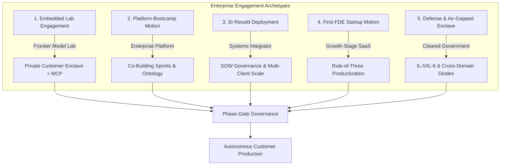

# Deployment Patterns in the Wild: The Five Enterprise Archetypes

Real-world Forward Deployed Engineering (FDE) engagements assume distinct structural shapes. The
shape of your engagement dictates everything that follows: who owns the code, who controls the
infrastructure, what constitutes success, and how the motion breaks under stress.

This guide provides the definitive field analysis of the **five canonical engagement archetypes**
observable across empirical job market data, enterprise disclosures, and practitioner reporting.
It complements [Reference Architectures](../system-design/02-reference-architectures.md) by
focusing on the **operational and economic view**: governance boundaries, alignment incentives,
failure modes, and handover mechanics.

---

## 1. The Five Deployment Archetypes



---

### Archetype 1: The Embedded Lab Engagement

- **The Shape**: A frontier AI research lab (e.g. Anthropic, OpenAI) deploys a senior forward-deployed engineering squad directly inside a tier-1 enterprise customer's engineering organization to design, integrate, and launch high-impact production agentic workflows.
- **Traceable Empirical Evidence**:
  - Anthropic's Forward Deployed Engineer specification explicitly centers on deploying production systems with Claude models inside customer VPCs, delivering Model Context Protocol (MCP) servers, agent skills, and custom sub-agents, backed by white-glove support and ~25% onsite travel ([Anthropic FDE job posting](https://job-boards.greenhouse.io/anthropic/jobs/5302966008)).
  - Industry coverage highlights that lab FDE teams act as an elite force multiplier, integrating systems, monitoring initial production inference, and hardening models against customer drift ([The New Stack, May 2026](https://thenewstack.io/forward-deployed-engineers-ai)).

#### Architectural Topology: The Private Enclave & Model Context Protocol (MCP)

```
[ Customer Enterprise Network / Private VPC ]
  |
  +---> [ Application Gateway / Reverse Proxy ]
          |
          +---> [ Enterprise Core Services ] (CRM, ERP, DBs)
          |       ^
          |       | JSON-RPC over STDIO/SSE
          |       v
          +---> [ Embedded MCP Server ] <---------------------+
                  (Tools, Prompts, Resources)                 |
                  |                                           |
                  +---> [ Local Redaction & Policy Filter ]   | Mutual TLS /
                  |     (Regex Tokenizer & RBAC Gates)        | PrivateLink
                  |                                           |
                  v                                           v
[ Frontier Lab Managed Subnet ] <-----------------------------+
  |
  +---> [ Dedicated Claude / Frontier LLM Inference Endpoint ]
```

- **Operational Dynamics & What Makes It Work**:
  - **The High-Touch Ratio**: Small, exceptionally senior teams working with a limited roster of strategic enterprise logos.
  - **The Bidirectional Feedback Engine**: The FDE squad is not an isolated professional services silo; they possess a direct mandate to extract recurring customer friction, edge cases, and missing platform primitives, feeding them straight back to core model and API engineering teams.
  - **Sponsor Intimacy**: Direct access to the customer's Chief Technology Officer or VP of Engineering, bypassing traditional multi-tier vendor management committees.
- **The Fatal Failure Mode (Attention Saturation & Backlog Dumping)**:
  - Because lab FDEs possess elite software engineering and model-tuning talent, the customer often succumbs to the temptation of treating the squad as free senior contractor headcount. The customer dumps difficult, unsexy legacy tech debt onto the lab team that internal staff refused to touch.
  - **Defense**: Rigorously enforce the [Phase 4 Requirements Specification](../customer/02-requirements-to-spec.md) and explicit Non-Goals. If an integration does not directly validate or scale core model capabilities, reject the task.

---

### Archetype 2: The Platform-Bootcamp Motion

- **The Shape**: An enterprise data/AI platform vendor embeds engineers who do not simply deliver a turnkey software package; instead, they conduct intensive, multi-week co-building sprints ("bootcamps") where customer engineers build production applications *on top of* the vendor's platform.
- **Traceable Empirical Evidence**:
  - Palantir popularized the Forward Deployed Software Engineer (FDSE) role ([Wikipedia](https://en.wikipedia.org/wiki/Forward_deployed_engineer)). Fortune reports that Palantir FDSEs are deployed into high-stakes customer environments with a "startup CTO" mandate—working with minimal supervision to own end-to-end mission delivery on the Foundry and AIP platforms ([Fortune, September 2026](https://fortune.com/2026/09/03/forward-deployed-engineers-fast-growing-six-figure-silicon-valley-job-integrate-ai-with-customers-tech-careers-palantir)).
  - Public filings disclose rapid acceleration of commercial AIP bootcamps where enterprise clients build functional prototypes on real data within 5 business days.

#### Operational Mechanics & Co-Building Sprints

```
Week 1: Data Ontology Mapping   --->   Week 2: Co-Building Sprint   --->   Week 3: Production Hardening
- Ingest real ERP/CRM tables           - Pair with customer devs           - Evaluate on golden benchmarks
- Map objects, links, actions          - Build high-value workflow         - Transfer operational runbooks
- Establish RBAC permissions           - Validate with floor operators     - Customer engineers deploy
```

- **Operational Dynamics & What Makes It Work**:
  - **Forced Capability Transfer**: Because customer developers sit side-by-side with the FDE writing the code, operational competence and intellectual property remain inside the customer's team at handover.
  - **The Ontology Moat**: By binding enterprise operational data into a structured semantic ontology layer, the vendor becomes the core operating system of the customer's business.
- **The Fatal Failure Mode (The Empty-Bench Trap)**:
  - The bootcamp model relies on the customer assigning capable internal software engineers to co-build. In practice, enterprise clients frequently provide zero dedicated engineering staff, assigning only part-time product managers or non-technical business analysts. The engagement silently mutates into a bespoke delivery contract where the FDE builds everything alone.
  - **Defense**: Institute a strict **Pre-Engagement Staffing Gating Rule** (Phase 2): the customer must contractually commit at least two full-time software engineers to the co-building squad before kickoff begins.

---

### Archetype 3: The SI-Resold Deployment

- **The Shape**: A global systems integrator or IT consultancy (e.g. Deloitte, Accenture, Slalom) licenses or partners with an AI software vendor and provides its own forward-deployed engineers to execute enterprise customer integrations at global scale.
- **Traceable Empirical Evidence**:
  - Deloitte actively recruits for "Anthropic Forward Deployed Engineer - Government & Public Services (GPS)" positions, embedding engineers within public sector clients to implement high-value generative AI systems using Claude ([Deloitte Careers, 2026](https://apply.deloitte.com)).
  - Independent job scraping across 146 postings reveals that 12.3% of enterprise FDE roles sit within major IT consultancies and systems integrators, bridging the gap between product vendors and enterprise procurement.

#### The "Two-Master" Governance Tension

```
                       +-----------------------------+
                       |      The Enterprise FDE     |
                       +--------------+--------------+
                                      |
                 +--------------------+--------------------+
                 |                                         |
                 v                                         v
   +---------------------------+             +---------------------------+
   |  Client Customer Reality  |             |  SI Commercial Economics  |
   +---------------------------+             +---------------------------+
   | - Wants outcomes & speed  |             | - Wants billable hours    |
   | - Demands agile iteration |             | - Guarded SOW scope       |
   | - Expects white-glove care|             | - Margin & utilization %  |
   +---------------------------+             +---------------------------+
```

- **Operational Dynamics & What Makes It Work**:
  - **Procurement & Compliance Scale**: Systems integrators possess existing Master Services Agreements (MSAs), pre-vetted security clearances, and procurement relationships that allow deployments to begin months faster than an unvetted startup could negotiate.
  - **Enterprise Change Management**: The SI provides dedicated change-management teams, end-user training personnel, and Tier-1 support infrastructure that product companies cannot afford to staff.
- **The Fatal Failure Mode (SOW Dogmatism & The Disconnected Loop)**:
  - The FDE gets trapped between client expectations (solve the real problem) and SI commercial governance (do only what the Statement of Work specifies; any variance requires a formal change request). Furthermore, architectural learnings rarely flow back to the software vendor's product roadmap because the SI and vendor operate as separate legal entities with misaligned incentives.
  - **Defense**: Embed joint vendor-SI steering committees during Phase 4, and define a formal **Product Defect & Platform Enhancement Routing Pipeline** to funnel field friction directly to vendor product managers.

---

### Archetype 4: The First-FDE Startup Motion

- **The Shape**: A Series A or Series B AI SaaS startup hires its first Forward Deployed Engineer to bridge the chasm between an early self-serve product and seven-figure enterprise contracts that require custom integration, bespoke connectors, and enterprise security guarantees.
- **Traceable Empirical Evidence**:
  - Plank's empirical database of 982 live postings identifies early-stage AI startups as a primary driver of new FDE hiring ([Plank, 2026](https://joinplank.com)).
  - Our scrape analysis of 146 enterprise postings reveals **0.0% junior or entry-level positions**; early-stage startups exclusively hire staff-level or senior engineers who can operate independently without support structures.

#### The "Rule of Three" Productization Threshold

The greatest hazard for an early-stage startup FDE is becoming an unscalable, bespoke services shop. Every customer asks for custom integrations; if you build custom one-offs indefinitely, product gross margins collapse.

```
                           THE "RULE OF THREE" THRESHOLD
Customer Request 1  ---> Build as isolated customer-specific adapter plugin.
Customer Request 2  ---> Extract shared configuration schema; maintain plugin boundary.
Customer Request 3  ---> MANDATORY PRODUCTIZATION: Promote capability into core platform API.
```

- **Operational Dynamics & What Makes It Work**:
  - **Zero Organizational Distance**: The FDE sits in the daily standup with the CTO, CEO, and Head of Sales. Customer friction discovered at 10:00 AM can be merged into the core platform codebase by 4:00 PM.
  - **Enterprise Deal Acceleration**: The FDE provides the technical assurance and custom data glue needed to close Fortune 500 lighthouse customers that would otherwise reject an off-the-shelf startup SaaS tool.
- **The Fatal Failure Mode (The Forked Codebase Nightmare)**:
  - The startup creates separate git branches or custom deployments for every major enterprise logo ("Tenant Acme Branch"). Within six months, maintaining six diverging codebases halts core feature development, and engineering velocity collapses to zero.
  - **Defense**: Strict single-branch multi-tenant architecture. All bespoke customer behavior must be implemented via pluggable configuration hooks, webhooks ([`interviews/code/webhook_receiver.py`](../interviews/code/webhook_receiver.py)), or modular adapters—never forked branches.

---

### Archetype 5: The Government, Defense, & Air-Gapped Enclave

- **The Shape**: High-security engagements within intelligence agencies, the Department of Defense (DoD), national healthcare networks, or critical civil infrastructure operating under strict air-gap constraints, FedRAMP High, or DoD Impact Levels (IL-4, IL-5, IL-6).
- **Traceable Empirical Evidence**:
  - Fortune highlights Palantir's extensive government FDE deployments supporting defense, intelligence agencies, and international partners including NATO and allied defense ministries ([Fortune, September 2026](https://fortune.com/2026/09/03/forward-deployed-engineers-fast-growing-six-figure-silicon-valley-job-integrate-ai-with-customers-tech-careers-palantir)).
  - OpenAI recruits dedicated federal FDEs to serve as technical thought partners across defense, intelligence, and civilian government programs ([OpenAI Careers, 2026](https://openai.com/careers)).

#### Air-Gapped Architectural Boundary & Cross-Domain Solutions

```
[ Unclassified External Network ]               [ SCIF / Air-Gapped High-Security Enclave ]
  |                                                |
  +---> [ Scanned Artifact Registry ]              +---> [ Local Model Weights Storage ]
          |                                                |
          +---> [ One-Way Hardware Data Diode ] ---------> +---> [ Isolated Air-Gapped Compute ]
                (Fiber Optic Tx-Only, No Egress)           |     (No Internet / No Telemetry)
                                                           |
                                                           +---> [ Local Knowledge Store ]
                                                           |     (Vector DB & Document Corpus)
                                                           |
                                                           v
                                                  [ Secure Terminal / Operator Console ]
```

- **Operational Dynamics & What Makes It Work**:
  - **Accreditation as the Product**: In defense enclaves, the code is trivial compared to the **Authority to Operate (ATO)**. Engineers who treat compliance controls (STIGs, NIST SP 800-53, FIPS 140-3 cryptography) as foundational design requirements are the only ones who ship.
  - **Offline Resilience**: The system must run completely detached from the public internet: zero external package fetches, zero public DNS calls, local container mirrors, and bundled model weights.
- **The Fatal Failure Mode (Tooling Withdrawal & SCIF Burnout)**:
  - FDEs accustomed to modern web development (instant StackOverflow access, cloud AI copilot extensions, automated GitHub CI/CD) experience severe productivity shock when locked inside a Sensitive Compartmented Information Facility (SCIF) with air-gapped workstations, strict hardware controls, and paper-only notes.
  - **Defense**: Master the [Offline Walking Skeleton Pattern](../portfolio/reference-project/README.md). Pre-bundle all dependencies, wheels, and container layers into deterministic tarballs with cryptographically signed hashes before entering the customer enclave.

---

## 2. Cross-Pattern Comprehensive Comparison Matrix

| Operating Dimension | 1. Embedded Lab | 2. Platform Bootcamp | 3. SI-Resold | 4. First-FDE Startup | 5. Defense & Air-Gap |
| :--- | :--- | :--- | :--- | :--- | :--- |
| **Primary Employers** | Anthropic, OpenAI, Cohere | Palantir, Snowflake, Databricks | Deloitte, Accenture, Slalom | Series A-B AI Startups | Palantir, OpenAI Fed, Anduril |
| **Typical Squad Size** | 2–4 Senior/Staff FDEs | 3–6 FDSEs + Ops Leads | 4–12 Consultants & Devs | 1–2 Solo Senior FDEs | 2–5 Cleared Engineers |
| **Commercial Model** | Strategic ARR / Compute | Platform Subscription + Sprints | Time & Materials / SOW | SaaS ACV + Expansion | Fixed-Price Program / IDIQ |
| **Time-to-Value** | 6–12 Weeks | 1–4 Weeks (Bootcamp PoC) | 16–36 Weeks | 2–6 Weeks | 6–18 Months (ATO Bound) |
| **Network Posture** | Customer VPC / PrivateLink | Hybrid Cloud / On-Prem | Enterprise Corporate Cloud | Managed SaaS / Multi-Tenant | Air-Gapped SCIF / IL-5/6 |
| **Customer Engineers** | Senior Platform Engineers | Assigned Bootcamp Builders | Enterprise IT & Contractors | Startup Champion / IT Lead | Cleared Operators & Sysadmins |
| **Long-Pole Constraint** | SecOps & Identity Review | Customer Engineering Depth | SOW Scope Change Control | Integration Custom Sprawl | Security Accreditation (ATO) |
| **Fatal Failure Mode** | Attention Saturation / Debt | Empty-Bench Delivery Drift | Contractual Disconnect | Forked Codebase Sprawl | Tooling Shock / SCIF Burnout |
| **Handover Method** | Runbooks & Upstream MCP | Self-Sustaining Builders | SOW Handover Deliverable | Core Productization | Formal ATO Transition |

---

## 3. Direct Codebase Defense Implementations

Every deployment pattern encounters distinct technical friction points that are directly defended
by components in this repository:

| Architectural Friction | Deployment Pattern | Codebase Defense Asset | Operational Verification |
| :--- | :--- | :--- | :--- |
| **RBAC Policy Isolation** | Embedded Lab & Platform | [`portfolio/reference-project/src/api/server.py`](../portfolio/reference-project/src/api/server.py) | `pytest portfolio/reference-project/tests/test_server.py` (Asserts `X-User-Roles` filtering) |
| **Offline Contract Mocking** | Defense & Air-Gapped | [`portfolio/reference-project/src/pipeline/ingestion.py`](../portfolio/reference-project/src/pipeline/ingestion.py) | Standalone dense vector cosine similarity without remote API calls |
| **Deterministic Data Sanitization**| All Patterns (Regulated) | [`portfolio/reference-project/evals/DATASET_PROVENANCE.md`](../portfolio/reference-project/evals/DATASET_PROVENANCE.md) | Verified CFPB/Bitext regex tokenization and PII masking |
| **Transient Retry Backpressure** | SI & Startup Deployments| [`interviews/code/resilient_client.py`](../interviews/code/resilient_client.py) | Decorrelated jittered exponential backoff defending customer rate limits |
| **Replay & Idempotency Defense** | All Enterprise Webhooks | [`interviews/code/webhook_receiver.py`](../interviews/code/webhook_receiver.py) | SHA-256 payload hashing preventing duplicate writes on network replay |

---

## 4. Related Documents

- [Reference Architectures](../system-design/02-reference-architectures.md) - the detailed technical diagrams for SaaS, hybrid, and air-gapped systems
- [The Engagement Lifecycle](../customer/01-engagement-lifecycle.md) - the 10-phase delivery sequence common to all archetypes
- [Working in Customer Environments](../customer/03-working-in-customer-environments.md) - practical bastion navigation, SSM, and corporate CA injection
- [Common Failure Modes](../troubleshooting/03-common-failure-modes.md) - catalog of production runtime failures across enterprise deployments
- [Failure Stories & Production Post-Mortems](03-failure-stories.md) - historical case analyses of collapsed enterprise engagements

## 5. Further Reading

- [Anthropic Forward Deployed Engineer Specification](https://job-boards.greenhouse.io/anthropic/jobs/5302966008) - the canonical embedded-lab archetype
- [Fortune: The Rise of Forward Deployed Engineers](https://fortune.com/2026/09/03/forward-deployed-engineers-fast-growing-six-figure-silicon-valley-job-integrate-ai-with-customers-tech-careers-palantir) - comprehensive coverage of Palantir's platform bootcamp and government practice
- [The New Stack: Forward-Deployed Engineers in the Age of AI](https://thenewstack.io/forward-deployed-engineers-ai) - external analysis of lab deployment models and agentic integration
- [Department of Defense Cloud Computing Security Requirements Guide (DoD CC SRG)](https://cyber.mil/stigs/downloads/) - official specifications for IL-4, IL-5, and IL-6 security controls
