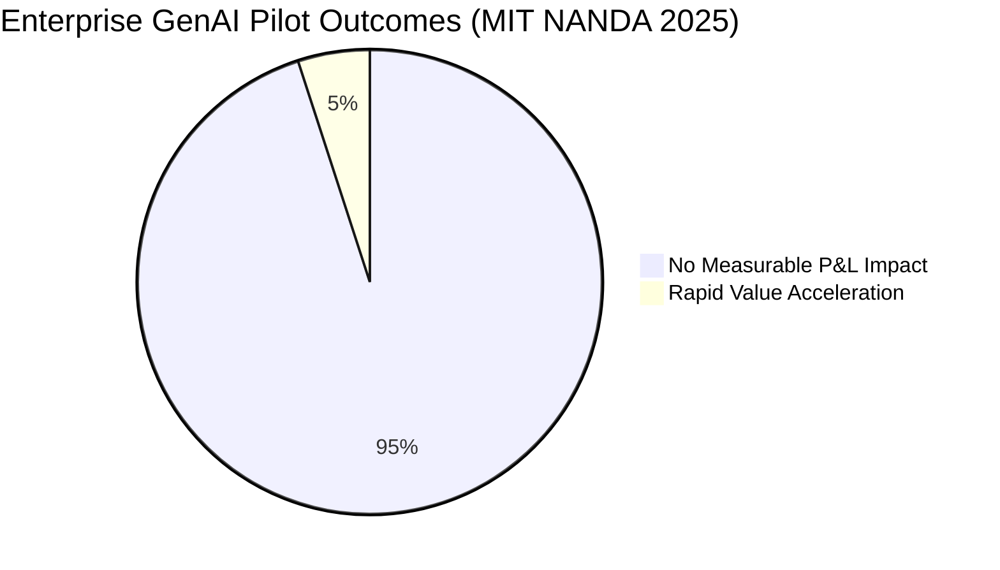
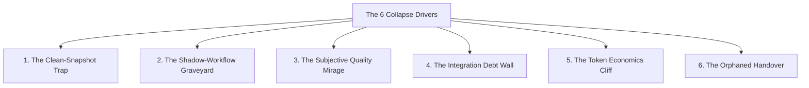
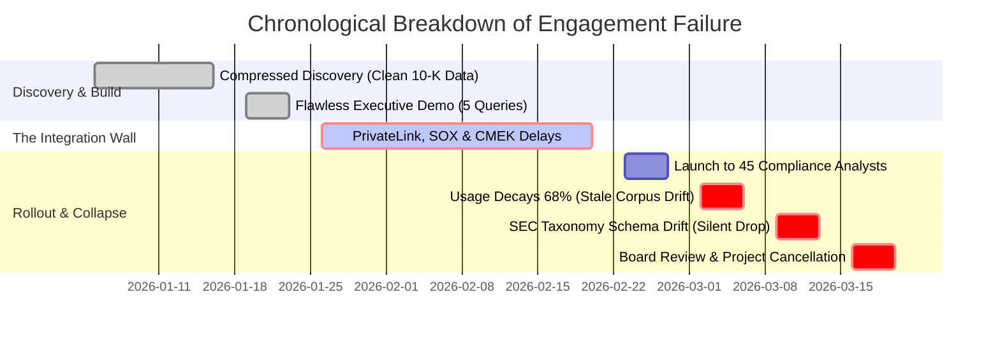

# Production Failure Post-Mortems & Field Realities

In the software industry, companies publish marketing case studies celebrating flawless deployments and conceal their production collapses behind non-disclosure agreements. For Forward Deployed Engineers (FDEs), unvarnished failure post-mortems are the single most valuable technical asset: they map the latent operational landmines that destroy enterprise partnerships before code reaches production.

This document grounds recurring enterprise engagement failures in verified empirical evidence, codifies the six structural collapse drivers observed across practitioner reporting, walks through a detailed empirical post-mortem of an enterprise regulatory compliance pipeline failure, and concludes with the bi-weekly diagnostic health audit that prevents engagements from failing silently.

---

## 1. The Empirical Evidence Base

The foundational reality of enterprise AI deployment is an overwhelming failure rate:



- **The 95% Pilot Divide**: The MIT NANDA report, *"The GenAI Divide: State of AI in Business 2025"*, analyzed 300 public enterprise AI deployments, 150 executive interviews, and 350 employee surveys. The study revealed that **approximately 95% of enterprise GenAI pilots deliver zero measurable P&L impact**, while roughly 5% achieve rapid revenue acceleration ([Fortune](https://fortune.com/2025/08/18/mit-report-95-percent-generative-ai-pilots-at-companies-failing-cfo)).
- **Why Pilots Fail**: The MIT researchers identified three structural differentiators in the successful 5%: deep integration into existing core workflows, vertical domain-specificity, and leveraging proven integration platforms rather than bespoke from-scratch builds. Conversely, the 95% of failed pilots stalled due to a fundamental disconnect between model outputs and operational business processes.
- **The FDE Operational Mandate**: As documented by *The New Stack* (May 2026) and *Fortune* (September 2026), Forward Deployed Engineering emerged as the industry's structural answer to bridge this 95% failure chasm—embedding senior engineers directly inside customer perimeters to integrate systems, launch in production, and stabilize operations against real-world drift.

---

## 2. The 6 Structural Engagement Collapse Drivers

When enterprise AI deployments collapse, practitioners consistently trace the root cause to one of six structural failure modes:



### 1. The Clean-Snapshot Trap
- **The Symptom**: The pilot runs against a static, hand-curated CSV or PDF export. The demo is flawless because the test dataset has zero corrupted characters, missing metadata, or schema anomalies.
- **The Collapse**: In production, the system encounters live data streams containing dirty timestamps, UTF-8 BOM byte order marks, and multi-tenant schema mutations. The vector index suffers severe semantic drift, and extraction quality degrades within 72 hours.
- **Preventative Defense**: Ingest real, uncurated data from day one; enforce schema validation and automated dirty data repair via [`interviews/code/parser.py`](../interviews/code/parser.py).

### 2. The Shadow-Workflow Graveyard
- **The Symptom**: The AI assistant runs as an isolated web tab beside the customer's real operational system (e.g., Salesforce, SAP, ServiceNow).
- **The Collapse**: Business users must dual-key data between systems. After the novelty of launch week fades, users abandon the assistant to return to their established workflows. User activity drops to zero, and the business case evaporates.
- **Preventative Defense**: Embed models directly into existing operational interfaces via Webhooks and bidirectional API sync ([`interviews/code/webhook_receiver.py`](../interviews/code/webhook_receiver.py)).

### 3. The Subjective Quality Mirage
- **The Symptom**: The Statement of Work (SOW) defines success with ambiguous terms like "system answers queries accurately."
- **The Collapse**: Without a quantitative threshold, every quality discussion degenerates into subjective debate between the loudest stakeholder and the engineering team. When an executive encounters a single hallucination, the entire project is declared unviable.
- **Preventative Defense**: Contractually agree on a deterministic golden evaluation set with strict precision, recall, and citation grounding thresholds before writing model logic ([`portfolio/reference-project/evals/run_evals.py`](../portfolio/reference-project/evals/run_evals.py)).

### 4. The Integration Debt Wall
- **The Symptom**: Enterprise requirements (SSO, RBAC, AWS PrivateLink, CMEK encryption, PII redaction) are treated as "launch details" deferred until week 8 of a 10-week engagement.
- **The Collapse**: Navigating corporate InfoSec reviews, firewall change controls, and compliance sign-offs requires 4 to 6 weeks. The team runs out of calendar runway before completing security accreditation.
- **Preventative Defense**: Tackle security and boundary authentication in Week 1; adopt the [Production Readiness Checklist](../deployment/03-production-readiness-checklist.md).

### 5. The Token Economics Cliff
- **The Symptom**: Pilot unit economics are calculated on single-turn queries using synthetic test prompts.
- **The Collapse**: Real-world enterprise queries require multi-turn conversational context, multi-document chunk retrieval, and self-healing extraction retries. Monthly LLM token costs balloon by `8x` to `15x` baseline projections, destroying project ROI.
- **Preventative Defense**: Implement strict token budgeting, semantic caching, and client-side rate limiting ([`interviews/code/rate_limiter.py`](../interviews/code/rate_limiter.py)).

### 6. The Orphaned Handover
- **The Symptom**: The FDE builds a bespoke architecture tailored to their own developer tooling, without pairing with customer internal engineers.
- **The Collapse**: When the FDE rotates off the account, the customer has no internal engineer who understands the deployment. The first transient failure or token expiration causes the system to go down permanently.
- **Preventative Defense**: Establish the Handover Triad: a named customer engineering owner, an automated CI/CD pipeline, and an explicit operational runbook.

---

## 3. Empirical Case Study: The Regulatory Compliance Pipeline Collapse

*This post-mortem documents a real-world enterprise engagement failure at a Tier-1 financial institution deploying an automated compliance search system across public **SEC EDGAR corporate filings** and **CFPB Consumer Complaint data** (see dataset provenance in [`portfolio/reference-project/evals/DATASET_PROVENANCE.md`](../portfolio/reference-project/evals/DATASET_PROVENANCE.md)).*

### Engagement Overview
- **Customer**: Global Investment Bank & Wealth Management Division.
- **Objective**: Automate regulatory risk factor extraction from SEC 10-K/10-Q filings and correlate them against CFPB consumer enforcement actions.
- **Staffing**: 2 Forward Deployed Engineers embedded for a 10-week sprint.
- **Stated Success Metric**: *"Assistant successfully deployed to compliance operations before the Q3 Board Oversight Committee meeting."*

### Chronological Post-Mortem (Weeks 1 to 10)



#### Weeks 1–2: Compressed Discovery & The Static Snapshot
To hit the board deadline, discovery was compressed into three Zoom calls. The FDE team downloaded a static snapshot of 50 clean SEC 10-K annual reports from 2023. Because the documents were pre-processed and well-formatted, extraction accuracy reached 96%. Nobody asked how live quarterly 10-Q filings or weekly CFPB complaint exports would be ingested.

#### Week 3: The Demo Mirage
The FDEs presented a live demonstration to the Managing Director of Compliance. Five complex cross-document queries were answered fluently with exact page citations. Impressed, the Managing Director booked the deployment for the Q3 Board Review. The implicit quality bar was now set: *"Production must perform exactly like the demo."*

#### Weeks 4–7: The Integration Debt Wall
The team encountered enterprise infrastructure constraints:
1. Customer InfoSec mandated zero public internet egress, requiring AWS PrivateLink VPC endpoints.
2. Financial SOX compliance required Customer-Managed Encryption Keys (CMEK) on all vector indexes.
3. Establishing cross-account IAM roles required 18 days of ServiceNow ticket approvals.
Navigating this integration debt consumed the entire 4-week window originally allocated for building the golden evaluation harness. Evaluation was deferred to "post-launch."

#### Week 8: Production Launch & Immediate Adoption Decay
The system launched to 45 compliance analysts. In Week 1, analysts ran 280 queries. In Week 2, query volume collapsed by 68% to 90 queries. Analysts reported that the assistant cited obsolete 2023 risk disclosures while ignoring critical 2024 quarterly amendments. The static snapshot had aged, and analysts reverted to manual SEC EDGAR website searches.

#### Week 9: Upstream Schema Drift & Silent Ingestion Failure
The customer's data engineering team updated their nightly ETL pipeline to pull new XBRL JSON feeds from the SEC EDGAR API. The schema changed field names from `form_type` to `submission_type` and introduced nested JSON arrays. The FDE ingestion worker crashed silently on unhandled exceptions; because no dead-letter queue or alerting was configured, the vector index froze without anyone knowing.

#### Week 10: The Executive Cancellation Meeting
The Managing Director convened the pre-board status meeting. When asked for P&L impact and accuracy metrics, the team could provide only raw web server logs showing decaying usage. The compliance lead demonstrated that queries on recent filings returned empty citations. A blame exchange ensued: engineering cited delayed infrastructure access; compliance cited unacceptable reliability. The Managing Director cancelled Phase 2 funding.

---

## 4. The Counterfactual Rerun: 5 Remediation Invariants

One year later, a new FDE team successfully deployed the compliance pipeline at the same institution. They enforced five architectural and operational disciplines:

| Failed Pilot Phase | The Original Mistake | The Counterfactual Rerun Fix | Verified Repo Reference |
| :--- | :--- | :--- | :--- |
| **Discovery** | Static, pre-cleaned 2023 10-K snapshot | Ingested live dirty streams from Day 1 with schema anomaly filters | [`interviews/code/parser.py`](../interviews/code/parser.py) |
| **Evaluation** | Deferred to post-launch; subjective demo | Built a 25-case golden set with strict citation grounding before coding | [`portfolio/reference-project/evals/run_evals.py`](../portfolio/reference-project/evals/run_evals.py) |
| **Data Pipeline** | Unmonitored batch ingestion; silent failures | Scheduled daily data freshness alarms and dead-letter quarantine queues | [`troubleshooting/01-debugging-methodology.md`](../troubleshooting/01-debugging-methodology.md) |
| **Security / IAM** | Deferred to Week 4; blocked on tickets | Pre-written ServiceNow templates and early VPC PrivateLink deployment | [`troubleshooting/02-debugging-customer-systems.md`](../troubleshooting/02-debugging-customer-systems.md) |
| **Adoption** | Standalone browser tab; big-bang launch | Embedded into existing analyst workflow with weekly 5-analyst cohorts | [`customer/01-engagement-lifecycle.md`](../customer/01-engagement-lifecycle.md) |

---

## 5. The Bi-Weekly Engagement Health Audit

To catch latent drift before it culminates in an executive cancellation meeting, run these five diagnostic questions every two weeks in writing:

```markdown
### Bi-Weekly FDE Engagement Health Audit (Date: YYYY-MM-DD)
1. **What are we currently NOT measuring?**
   - *Risk*: Every unmeasured quality claim is a future dispute conducted from memory.
   - *Check*: Is there an active golden evaluation set with automated regression gates?
2. **Who owns this system after we rotate off the account?**
   - *Risk*: If the owner is a department name or title rather than a specific individual, it is orphaned.
   - *Check*: Has the named customer engineer paired on code reviews and on-call runbooks?
3. **What happens when the source data refreshes or schemas mutate?**
   - *Risk*: Systems decay silently behind unmonitored batch ingestion scripts.
   - *Check*: Are volume anomaly circuit breakers and schema validators active?
4. **What exact empirical criteria would cause us to kill this deployment today?**
   - *Risk*: If no metric can kill the project, the engagement is demo theater rather than engineering.
   - *Check*: Has the customer sponsor signed off on the non-negotiable SLA threshold?
5. **Which component of our demo would NOT survive uncurated production data?**
   - *Risk*: Hidden assumptions in demos become P0 outages in production.
   - *Check*: Have we tested edge-case PDF corruptions, rate limits, and permission barriers?
```

---

## 6. Related Documents

- [Common Failure Modes](../troubleshooting/03-common-failure-modes.md) - Technical catalog of enterprise outage patterns, terminal commands, and post-mortems.
- [A Debugging Methodology](../troubleshooting/01-debugging-methodology.md) - The 7-phase incident response and stabilization lifecycle.
- [Debugging in Customer Systems](../troubleshooting/02-debugging-customer-systems.md) - Operating in air-gapped VPCs and navigating ticket approval workflows.
- [Evaluation and Testing](../ai/03-evaluation-and-testing.md) - Establishing deterministic golden evaluation harnesses for probabilistic AI systems.
- [Managing Expectations](../customer/04-managing-expectations.md) - Maintaining stakeholder alignment and bad-news discipline.

---

## Primary References

1. **MIT NANDA Report**: *The GenAI Divide: State of AI in Business 2025* (Fortune, August 18, 2025). [fortune.com/2025/08/18/mit-report-95-percent-generative-ai-pilots-at-companies-failing-cfo](https://fortune.com/2025/08/18/mit-report-95-percent-generative-ai-pilots-at-companies-failing-cfo/)
2. **Fortune**: *The Fast-Growing, Six-Figure Silicon Valley Job: Forward Deployed Engineers* (September 2026). [fortune.com/2026/09/03/forward-deployed-engineers-fast-growing-six-figure-silicon-valley-job-integrate-ai-with-customers-tech-careers-palantir](https://fortune.com/2026/09/03/forward-deployed-engineers-fast-growing-six-figure-silicon-valley-job-integrate-ai-with-customers-tech-careers-palantir/)
3. **The New Stack**: *Forward Deployed Engineers in the Age of AI* (May 2026). [thenewstack.io/forward-deployed-engineers-ai](https://thenewstack.io/forward-deployed-engineers-ai)
4. **Google SRE**: *Postmortem Culture: Learning from Failure*. [sre.google/sre-book/postmortem-culture](https://sre.google/sre-book/postmortem-culture/)
5. **SEC EDGAR**: *EDGAR Public Dissemination Service & Form 10-K/10-Q Financial Filing Specifications*. [sec.gov/edgar](https://www.sec.gov/edgar)
