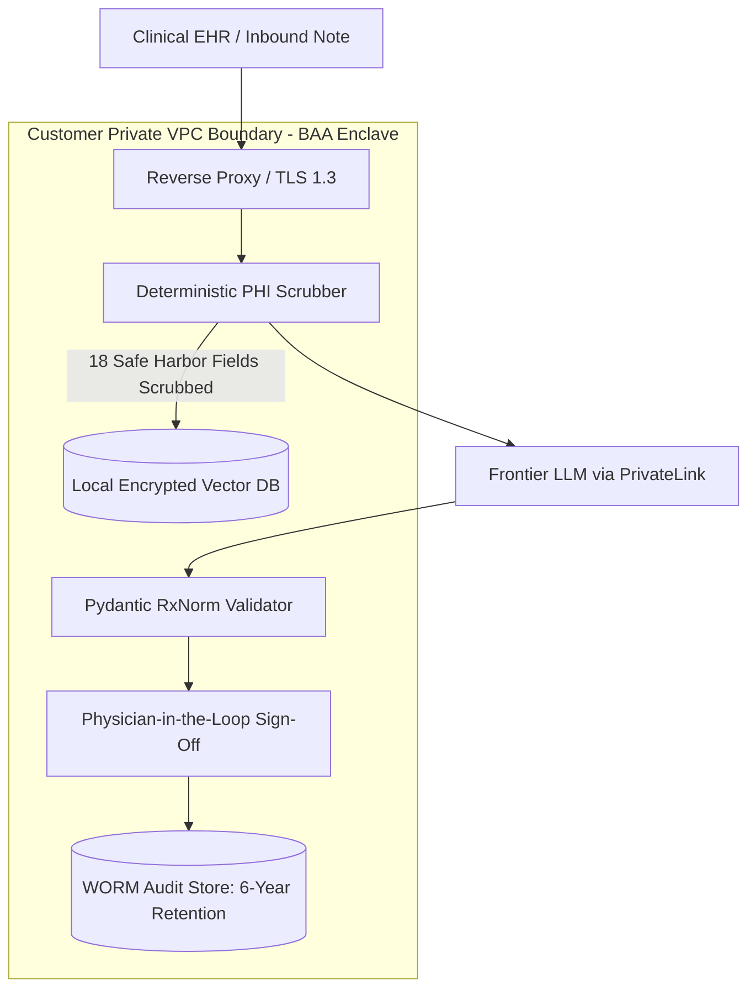
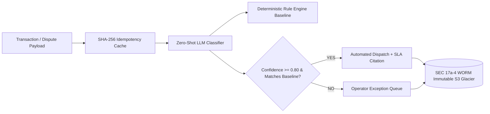
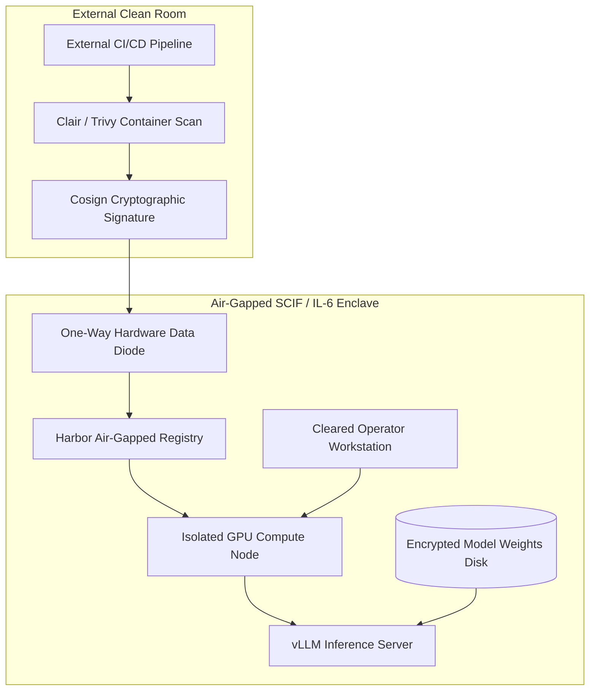

# Regulated Industries Deployment Playbook

This playbook provides the authoritative operational guide for Forward Deployed Engineers (FDEs)
embedding within highly regulated enterprise environments: **Healthcare & Life Sciences**, **Banking
& Financial Services**, **Defense & National Security**, and **European Regulated Markets**.

In these sectors, compliance mandates are not post-deployment checkboxes; they dictate system
topology, network egress rules, cryptographic key management, and data retention boundaries before a
single line of model logic executes.

---

## 1. Healthcare and Life Sciences: HIPAA, HITECH, & FDA SaMD

Deploying AI systems in clinical decision support, health insurance claims processing, or clinical
trial workflows requires compliance with the **Health Insurance Portability and Accountability Act
(HIPAA)**, the **HITECH Act**, and FDA Software as a Medical Device (SaMD) classifications.

### Architectural Blueprint: Zero Data Retention (ZDR) BAA Enclave



### 1. Business Associate Agreement (BAA) & Zero Data Retention (ZDR)

- **The Legal Chokepoint**: You cannot transmit a single record of Protected Health Information (PHI)
  to any external cloud endpoint or model provider without an executed, countersigned BAA.
- **Zero Data Retention Mandate**: The BAA must legally bind the vendor to Zero Data Retention (ZDR),
  prohibiting the provider from logging prompts or completions to disk or utilizing customer traffic
  for model training.
- **Enterprise Isolation**: Enterprise agreements with providers (e.g. Anthropic, AWS Bedrock,
  Azure OpenAI) support ZDR addendums over dedicated private connections (AWS PrivateLink / Azure
  ExpressRoute), completely disabling public internet egress.

### 2. Deterministic PHI Scrubbing Recipe (HIPAA Safe Harbor 18)

Before unstructured clinical text touches an embedding model or vector database, all 18 personal
identifiers specified by HIPAA Safe Harbor must be scrubbed:

```python
import re
from typing import Dict, Any

class SafeHarborRedactor:
    """
    Deterministic redaction gateway enforcing HIPAA Safe Harbor compliance.
    Masks Social Security Numbers, Medical Record Numbers, phone numbers,
    dates (preserving only the year), and email addresses prior to vectorization.
    """
    PATTERNS = {
        "SSN": re.compile(r"\b\d{3}-\d{2}-\d{4}\b"),
        "MRN": re.compile(r"\bMRN[:\s#]?\d{7,10}\b", re.IGNORECASE),
        "PHONE": re.compile(r"\b(?:\+?1[-.\s]?)?\(?\d{3}\)?[-.\s]?\d{3}[-.\s]?\d{4}\b"),
        "EMAIL": re.compile(r"\b[A-Za-z0-9._%+-]+@[A-Za-z0-9.-]+\.[A-Z|a-z]{2,}\b"),
        "DATE": re.compile(r"\b\d{1,2}[/-]\d{1,2}[/-]\d{2,4}\b"),
        "IP_ADDR": re.compile(r"\b\d{1,3}\.\d{1,3}\.\d{1,3}\.\d{1,3}\b"),
    }

    @classmethod
    def redact(cls, text: str) -> str:
        redacted = text
        for identifier, pattern in cls.PATTERNS.items():
            redacted = pattern.sub(f"[{identifier}_REDACTED]", redacted)
        return redacted

# Operational Verification:
raw_clinical_note = "Patient Jane Doe (MRN 8891024, SSN 000-12-3456) seen on 10/24/2025."
clean_note = SafeHarborRedactor.redact(raw_clinical_note)
# Result: "Patient Jane Doe ([MRN_REDACTED], [SSN_REDACTED]) seen on [DATE_REDACTED]."
```

---

## 2. Financial Services & Banking: SR 11-7, SEC 17a-4, & GLBA

Deploying AI within tier-1 investment banks, payment gateways, and retail brokerages requires
navigating the **Federal Reserve Board's Supervisory Letter SR 11-7 (Model Risk Management)**,
the **Gramm-Leach-Bliley Act (GLBA)**, and **SEC Rule 17a-4**.

### Architectural Blueprint: Model Risk Management & WORM Audit Trail



### 1. Federal Reserve SR 11-7 / OCC 2011-12 Compliance

Under Federal Reserve guidance, any quantitative statistical system generating financial estimates,
credit evaluations, or automated dispute decisions is classified as a "Model" subject to SR 11-7:
- **Conceptual Soundness**: The FDE must provide a written Architectural Decision Record (ADR)
  demonstrating why the chosen retrieval and classification architecture is mathematically sound.
- **Benchmark Against Heuristic Baselines**: Every LLM prediction must be continuously evaluated
  against traditional deterministic baselines (heuristic rule trees, logistic regression).
- **Outcomes Analysis & Drift Telemetry**: Statistical tracking of decision distributions to detect
  population drift and disparate impact across consumer segments.

### 2. Customer-Managed Encryption Keys (CMEK) & Instant Revocation

Financial institutions mandate that all data at rest within vector stores and relational databases
be encrypted using customer-controlled keys via AWS KMS or HashiCorp Vault, enabling instantaneous
cryptographic revocation:

```bash
# Verify S3 bucket encryption enforces Customer-Managed Key (CMEK)
aws s3api get-bucket-encryption \
    --bucket enterprise-financial-intelligence-records-prod \
    --query 'ServerSideEncryptionConfiguration.Rules[0].ApplyServerSideEncryptionByDefault.KMSMasterKeyId'

# Emergency Cryptographic Revocation: Disable key to immediately sever all database read access
aws kms disable-key \
    --key-id arn:aws:kms:us-east-1:123456789012:key/12345678-1234-1234-1234-123456789abc
```

### 3. SEC Rule 17a-4 & FINRA Immutable WORM Storage

All prompts, retrieved context chunks, model parameters, confidence scores, and operator review
timestamps must be preserved in Write-Once-Read-Many (WORM) compliant immutable storage (e.g. AWS
S3 Object Lock in Compliance Mode) for a minimum of 3 to 6 years:

```bash
# Enable S3 Object Lock with strict 6-year compliance retention
aws s3api put-object-lock-configuration \
    --bucket enterprise-financial-intelligence-records-prod \
    --object-lock-configuration '{
        "ObjectLockEnabled": "Enabled",
        "Rule": {
            "DefaultRetention": {
                "Mode": "COMPLIANCE",
                "Years": 6
            }
        }
    }'
```

---

## 3. Defense & National Security: DoD IL-4 to IL-6 Air-Gaps

Deploying AI systems for defense agencies, aerospace contractors, and intelligence services
requires compliance with the **DoD Cloud Computing Security Requirements Guide (CC SRG)** and
**NIST SP 800-53**.

### Architectural Blueprint: Air-Gapped High-Security Enclave



### 1. Authorization Impact Levels

- **FedRAMP High**: Federal civilian standard for sensitive, unclassified cloud operations.
- **DoD Impact Level 4 (IL-4)**: Controlled Unclassified Information (CUI) and mission data.
- **DoD Impact Level 5 (IL-5)**: Higher-sensitivity CUI, unclassified National Security Systems (NSS).
- **DoD Impact Level 6 (IL-6)**: Classified systems processing data up to **SECRET**. Enclaves operate
  completely air-gapped with zero connection to public internet infrastructure.

### 2. Air-Gapped Artifact Ingestion Protocol

Inside an air-gapped SCIF, commands like `docker pull`, `pip install`, or `curl` are physically
impossible. Forward deployed engineers must execute offline artifact mirroring:

```bash
# Step 1: Export and bundle container images in the external staging clean room
skopeo copy \
    docker://docker.io/library/etise-service:v2.1 \
    docker-archive:/tmp/etise-service-v2.1.tar:etise-service:v2.1

# Step 2: Compute deterministic cryptographic SHA-256 manifest
sha256sum /tmp/etise-service-v2.1.tar > /tmp/etise-service-v2.1.sha256

# Step 3: Inside the air-gapped enclave (post security-review and diode transfer),
# verify cryptographic checksum and import to local Harbor registry:
sha256sum -c etise-service-v2.1.sha256
skopeo copy \
    docker-archive:etise-service-v2.1.tar \
    docker://harbor.scif.internal/production/etise-service:v2.1
```

---

## 4. European Regulated Markets: GDPR Article 11.3 & EU AI Act

Deploying applications in European jurisdictions requires strict adherence to the **General Data
Protection Regulation (GDPR)** and the **European Union Artificial Intelligence Act (EU AI Act)**.

- **High-Risk AI System Classification (EU AI Act Annex III)**: AI systems used in credit scoring,
  employment triage, judicial assistance, or critical infrastructure management are legally
  designated as **High-Risk AI Systems**.
- **Mandatory Conformity Requirements**:
  1. **Continuous Risk Management System**: Documented identification of known and foreseeable risks throughout the system lifecycle.
  2. **Data Governance & Bias Mitigation**: Training, validation, and testing datasets must be audited for historical biases and statistical representation.
  3. **Technical Documentation & Logging**: Automatic recording of events throughout the system's operational lifetime to ensure end-to-end traceability.
  4. **Human Oversight**: Technical capabilities allowing human operators to override, intervene, or halt the system instantly via an emergency stop button.

---

## 5. Cross-Sector Compliance Comparison Matrix

| Sector & Jurisdiction | Primary Regulatory Frameworks | Data Residency Perimeter | Remote Egress Policy | Audit Record Retention |
| :--- | :--- | :--- | :--- | :--- |
| **Healthcare** | HIPAA, HITECH, FDA SaMD | Regional / US or EU Boundary | Prohibited without BAA & ZDR | 6 Years (HIPAA § 164.316) |
| **Financial Services** | SR 11-7, SEC 17a-4, FINRA, SOX | Tenant-Isolated VPC | PrivateLink / VPC Endpoint Only | 3–6 Years (WORM Compliant) |
| **Defense & National Security**| DoD IL-4 / IL-5 / IL-6, FedRAMP | Air-Gapped Sovereign Enclave | Physically Severed (No Egress) | Permanent Cryptographic Log |
| **European Regulated Markets** | GDPR Art. 11.3, EU AI Act | EU Data Boundary (`eu-west-1`) | Restricted (Adequacy Decision) | Full Operational Traceability |

---

## 6. The 12-Point Regulated Deployment Production Gate Checklist

Every Forward Deployed Engineer must verify this 12-point pre-flight checklist before requesting
production deployment authorization in a regulated environment:

- [ ] **Countersigned BAA / DPA**: Fully executed Business Associate Agreement or Data Processing Agreement with Zero Data Retention addendum active.
- [ ] **Network Egress Blackhole**: Public internet egress completely disabled at the subnet routing table; all communication routed via private VPC endpoints.
- [ ] **CMEK Encryption at Rest**: All database tables, vector indices, and S3 buckets encrypted with customer-managed KMS keys with instant revocation tested.
- [ ] **Deterministic PHI/PII Gate**: Local regex and NER redaction proxy active in the ingress pipeline, masking all 18 HIPAA Safe Harbor identifiers.
- [ ] **WORM Audit Persistence**: Every prompt, retrieved chunk, model confidence score, and routing output emitted to Write-Once-Read-Many immutable storage.
- [ ] **100% Citation Grounding**: Model forbidden from emitting ungrounded assertions; every claim verified verbatim against indexed regulatory policies.
- [ ] **Human Supervisor Override**: All low-confidence outputs (< 0.80) and edge cases routed to a monitored human review queue with operator rationale logging.
- [ ] **Model Risk Management ADR**: Architecture Decision Record documenting conceptual soundness and benchmark comparison against heuristic baselines.
- [ ] **RBAC Header Enforcement**: Role-based access control filters enforced at the vector retrieval layer (`X-User-Roles` HTTP header).
- [ ] **Idempotent Webhook Replay Protection**: SHA-256 payload caching preventing duplicate financial ledger writes or duplicate ticket creation.
- [ ] **FIPS 140-3 Cryptographic Ciphers**: All internal and external transport channels enforce TLS 1.3 with FIPS-validated cryptographic ciphers.
- [ ] **Air-Gap Diode Verification**: (Defense only) Verified cryptographic SHA-256 signatures on all imported container layers and offline model weights.

---

## 7. Direct Codebase Defense Implementations

| Compliance Mandate | Repository Implementation | Operational Test Suite |
| :--- | :--- | :--- |
| **RBAC Role-Based Document Isolation** | [`portfolio/reference-project/src/api/server.py`](../portfolio/reference-project/src/api/server.py) | `pytest portfolio/reference-project/tests/test_server.py` (`test_permission_aware_rbac_filtering`) |
| **Deterministic Data Sanitization** | [`portfolio/reference-project/evals/DATASET_PROVENANCE.md`](../portfolio/reference-project/evals/DATASET_PROVENANCE.md) | Stage 2 PII extraction pipeline matching CFPB and Bitext schemas |
| **Idempotency & Replay Defense** | [`interviews/code/webhook_receiver.py`](../interviews/code/webhook_receiver.py) | `pytest interviews/code/test_webhook_receiver.py` (Validates 409 conflict and replay caching) |
| **Structured Output Schema Enforcement**| [`interviews/code/structured_extractor.py`](../interviews/code/structured_extractor.py) | `pytest interviews/code/test_structured_extractor.py` (Pydantic schema self-healing validation) |
| **Automated Golden Evaluation Gates** | [`portfolio/reference-project/evals/run_evals.py`](../portfolio/reference-project/evals/run_evals.py) | Asserts 100% citation grounding and >= 90% severity classification |

---

## 8. Related Documents

- [Deployment Patterns in the Wild](01-deployment-patterns-in-the-wild.md) - the 5 canonical enterprise engagement archetypes
- [Documented LLM Deployment Cases](02-llm-deployment-cases.md) - empirical production field studies in finance and healthcare
- [Failure Stories & Post-Mortems](03-failure-stories.md) - SEC EDGAR regulatory post-mortems and compliance collapse analyses
- [Reference Project Implementation](../portfolio/reference-project/README.md) - full working code implementing RBAC and citation grounding
- [Working in Customer Environments](../customer/03-working-in-customer-environments.md) - corporate proxies, bastions, and CA cert injection

## 9. Further Reading

- [Federal Reserve SR 11-7: Guidance on Model Risk Management](https://www.federalreserve.gov/supervisionreg/srletters/sr1107.htm) - the regulatory standard for quantitative banking models
- [HHS HIPAA Guidelines for Professionals](https://www.hhs.gov/hipaa/for-professionals/index.html) - official rules for PHI handling and Business Associate Agreements
- [DoD Cloud Computing Security Requirements Guide (CC SRG)](https://cyber.mil/stigs/downloads/) - authorization criteria for IL-4, IL-5, and IL-6 national security deployments
- [European Union Artificial Intelligence Act (EU AI Act)](https://artificialintelligenceact.eu/) - comprehensive regulation on high-risk AI systems
- [SEC Rule 17a-4 Electronic Storage Requirements](https://www.sec.gov/rules/final/34-38245.txt) - broker-dealer WORM recordkeeping standards
