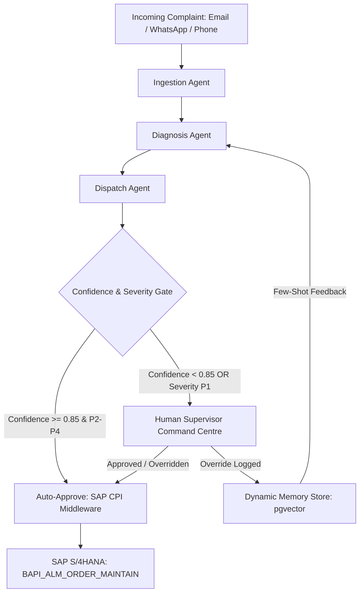

# Enterprise Manufacturing Field Study: Vaayu Pumps Field Service Command Centre

This field study analyzes the production deployment of an AI-powered field service command centre for Vaayu Pumps and Systems Ltd, delivered by AtliQ Technologies forward deployed engineering team. It examines the operational baseline, multi-agent architecture, ERP integration boundaries, and measurable business outcomes.

## Client context and operational baseline

Vaayu Pumps and Systems Ltd is a mid-market industrial pump manufacturer founded in 1994 and headquartered in Pune, India. The company manufactures heavy-duty centrifugal pumps and air compressors for continuous-process industries, including chemical refining, pharmaceuticals, and municipal water treatment.

The enterprise operates under strict physical and contractual operating conditions:

- Commercial footprint - 840 crore INR annual revenue in FY25, with 34.0% of gross margin generated through after-sales service and Annual Maintenance Contracts (AMCs).
- Physical asset base - An active installed base of 11,000 industrial pumps deployed across 1,400 customer manufacturing plants.
- Field operations force - 42 field service technicians operating out of six regional depots: Pune, Ahmedabad, Chennai, Vadodara, Jamshedpur, and Hyderabad.
- Intake volume - Approximately 180 service complaints received weekly across three uncoordinated channels: a central service mailbox, a WhatsApp Business account, and regional depot phone lines.

## The four core operational problems

Before the forward deployed engineering intervention, all service triage was executed through manual inspection, phone coordination, and fragmented spreadsheet lookups:

- P-1 Slow triage latency - Intake-to-dispatch latency averaged 47 minutes per complaint. Approximately 60% of this duration was consumed by depot staff manually searching SAP asset records, checking technician rosters on whiteboards, and calling depot stores to verify spare parts availability.
- P-2 Skill and tooling mismatch - First-visit resolution failure stood at 31.0%. Technicians frequently arrived on site without specialized tools (such as dynamic balancing kits or induction heaters) or lacked specific certifications (such as API 610 hydrocarbon pump overhaul credentials).
- P-3 Spare parts shortfall - Technicians frequently reached remote plants only to discover that necessary replacement mechanical seals, impellers, or wear rings were out of stock at the local depot, requiring emergency courier dispatch and extending customer plant downtime.
- P-4 Contractual SLA breach penalties - On continuous-process chemical plant contracts, Vaayu carried strict SLA guarantees: 4-hour on-site response and 12-hour resolution for Priority 1 stoppages. Cumulative liquidated damages exceeded 1.4 crore INR annually due to missed SLA deadlines.

## The supervised four-agent architecture

The forward deployed engineering team deployed a supervised multi-agent system (`VPS-FSCC-2026`) built with FastAPI, Pydantic, PostgreSQL, Redis, and LangGraph. The system enforces strict deterministic boundaries: no language model communicates directly with the core ERP system or makes unmonitored dispatch decisions on high-liability failures.

The system splits responsibilities across four specialized components:

1. Ingestion agent - Ingests unstructured text, email attachments, and audio voice-note transcripts. Extracts the equipment serial number, customer plant location, reported symptoms, and operating conditions. Validates the extracted customer account against the active CRM database.
2. Diagnosis agent - Queries the SAP PM equipment master record (`IE03`) to retrieve technical operating specifications (impeller diameter, metallurgy, seal arrangement). Embeds reported symptoms and runs cosine similarity against 36 months of verified historical service work orders in PostgreSQL with pgvector. Outputs the top three probable failure modes with calibrated confidence scores and recommended replacement part stock-keeping units (SKUs).
3. Dispatch agent - Queries the SAP MM stock overview (`MMBE`) to verify real-time parts availability at the assigned regional depot. Evaluates technician rosters for active certifications, driving distance, and shift schedules. Computes an optimal technician match based on composite score weighting: 40% skill match, 35% proximity, 25% current shift utilization.
4. Memory and routing agent - Evaluates overall pipeline confidence. If the joint confidence score equals or exceeds 0.85 and severity is classified as P2, P3, or P4, the work order recommendation proceeds to automated ERP commitment. If joint confidence falls below 0.85 or the severity is classified as P1 (emergency plant trip), the agent halts autonomous execution and routes the ticket to the depot lead dashboard with an audit trace.

## Enterprise integration and ERP isolation

A foundational architectural requirement set by client enterprise architecture was zero development inside the SAP core and zero direct external table writes.

The FDE team implemented a clean integration boundary using SAP Cloud Platform Integration (SAP CPI) as an enterprise middleware gateway:

- Equipment master retrieval - Read-only lookup of functional locations, pump models, and installation dates via SAP OData API entities (`API_EQUIPMENT`).
- Stock availability verification - Real-time depot spare parts inventory checks via Remote Function Call (`BAPI_MATERIAL_AVAILABILITY`).
- Service order creation - Work order commitment executed via standard SAP BAPI (`BAPI_ALM_ORDER_MAINTAIN`). If SAP CPI fails or returns an error status, the system enters an idempotent retry loop backed by Redis task queues with exponential backoff and decorrelated jitter.
- Single system of record - SAP S/4HANA remains the authoritative master record for service history, financial billing, and parts consumption. The AI pipeline functions strictly as an operational decision-support layer.

## Dynamic supervisor memory layer

To prevent recurring classification errors and eliminate ongoing developer maintenance, the architecture includes a dynamic feedback memory layer:

- Supervisor delta capture - When a human depot supervisor overrides an AI recommendation (for example, reassigning a work order from a mechanical technician to an electrical specialist due to an unlogged motor drive upgrade), the Command Centre captures the delta.
- Schema logging - The override is written to an immutable PostgreSQL audit table recording the original complaint text, the AI recommendation, the supervisor correction, and the supervisor rationale.
- Dynamic few-shot injection - The delta is vectorized into a memory collection. Subsequent runs of the Diagnosis Agent query this collection at runtime. If a new complaint shares high semantic similarity with a previously corrected failure mode, the supervisor override is injected directly into the LLM system context as a few-shot exemplar.
- Autonomous drift correction - The system adapts to regional equipment nuances and unlogged plant modifications without requiring model fine-tuning or code changes.

## Strategic automation framework

The engagement applied the five-step forward deployed engineering delivery model to prevent over-engineering:

- Messy judgment delegated to LLM - Natural language symptom understanding, multi-lingual slang parsing (such as Marathi and Hindi technical terms used by plant operators in Maharashtra and Gujarat), and historical work order free-text search.
- Fixed rules delegated to deterministic code - Severity escalation triggers, SLA countdown timers, technician driving distance calculations, and parts stock availability thresholds.
- High-liability decisions delegated to humans - Any event involving toxic chemical slurry leaks, flammability hazards, warranty dispute flags, or total cost estimates exceeding 50,000 INR.

## Measurable production outcomes

The Field Service Command Centre was evaluated across a 90-day post-go-live observation period covering all six regional depots:

- Triage latency - P95 triage time dropped from 47.0 minutes to 1.8 minutes, representing a 96.2% reduction in operational latency.
- First-time fix rate - Improved from 69.0% to 89.4%, driven by accurate pre-dispatch spare parts verification and skill-based technician matching.
- SLA liquidated damages - Contractual SLA penalty events decreased by 71.5%, saving an annualized 1.02 crore INR in commercial penalties.
- Supervisor automation rate - 74.2% of total incoming complaints met confidence thresholds and were dispatched automatically. 25.8% were routed to depot leads for human verification, with zero false-negative bypasses on P1 emergencies.
- ERP stability - Zero unscheduled SAP S/4HANA incidents or lock contention events across more than 2,300 processed service orders.

## Key takeaways for forward deployed engineers

- Enterprise moats are built at the integration layer - Model intelligence is commoditized. The value of this deployment came from connecting messy WhatsApp audio notes to SAP PM work orders without breaking auditability or security.
- Hard safety gates protect enterprise trust - Giving the client absolute control over P1 emergencies and sub-threshold confidence scores convinced the risk-averse operations team to adopt the system.
- Build memory layers to ensure self-sufficiency - Implementing a supervisor feedback memory layer allowed the client depot staff to train the system daily through their standard supervisory reviews, ensuring the system survived without vendor handholding.

## Related documents

- [Deployment Patterns in the Wild](01-deployment-patterns-in-the-wild.md) - organizational shapes of customer engineering engagements
- [From Requirements to Spec](../customer/02-requirements-to-spec.md) - writing testable functional and non-functional specifications
- [APIs and Integrations](../engineering/02-apis-and-integrations.md) - enterprise ERP and SAP integration architecture
- [Supervised Multi-Agent Systems](../ai/02-agents-and-tools.md) - engineering stateful multi-agent systems with human oversight

## Further reading

- [SAP Plant Maintenance Integration Guide](https://help.sap.com) - official technical documentation for SAP PM work order structures
- [Codebasics FDE Roadmap 2026](https://youtu.be/uE4HTkDtp48) - comprehensive video breakdown of the Vaayu Pumps enterprise implementation
