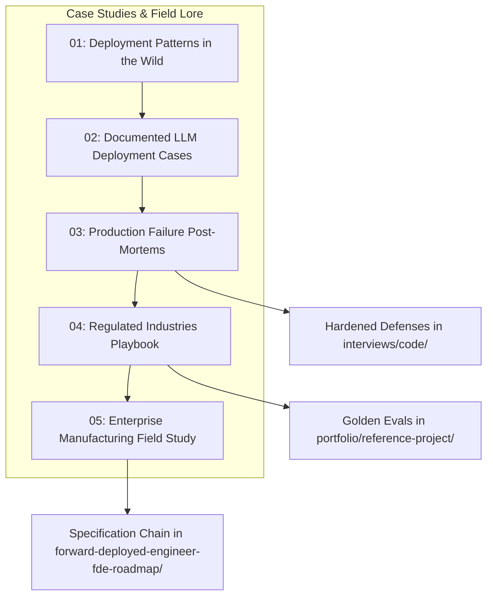

# Field Case Studies & Enterprise Production Lore

In enterprise AI engineering, vendor marketing typically showcases toy prototypes running in frictionless sandbox environments. In the field, Forward Deployed Engineers (FDEs) operate in an entirely different reality: uncurated dirty data streams, legacy enterprise infrastructure, strict zero-trust security enclaves (HIPAA, SOX, DoD IL6), and demanding executive stakeholders.

The empirical evidence underscores the difficulty of this transition: the **MIT NANDA Report ("The GenAI Divide: State of AI in Business 2025")** revealed that **approximately 95% of enterprise GenAI pilots deliver zero measurable P&L impact**, while only 5% achieve rapid revenue acceleration ([Fortune](https://fortune.com/2025/08/18/mit-report-95-percent-generative-ai-pilots-at-companies-failing-cfo)). As documented by *The New Stack* (May 2026) and *Fortune* (September 2026), the FDE role is the industry's structural mechanism to cross this 95% chasm—embedding senior technical talent directly with customers to turn raw models into resilient, compliant, and adopted production workflows.

This module provides an unvarnished examination of real-world deployment patterns, empirical failure post-mortems, and regulatory playbooks.

---

## 1. Core Module Guides

### 1. [Deployment Patterns in the Wild](01-deployment-patterns-in-the-wild.md)
The five organizational shapes that enterprise customer engagements take across the software industry:
- **The Embedded Lab Engagement** (Anthropic, OpenAI): Delivering custom MCP servers, agent skills, and production Claude workflows with white-glove deployment and high pattern-codification discipline.
- **The Platform Bootcamp Pattern** (Palantir): Sprints where vendor engineers pair directly with customer operators to co-build systems on operational ontologies.
- **The SI-Resold Deployment** (Deloitte, Accenture): Integrator-driven delivery balancing fixed Statement of Work (SOW) economics with end-to-end outcome ownership.
- **The First-FDE Startup Motion**: Senior solo hires in growth-stage AI startups converting enterprise lighthouse accounts while guarding against custom-work sprawl.
- **The Government & Defense Deployment**: High-accreditation programs operating within air-gapped enclaves and SCIF perimeters.

### 2. [Documented LLM Deployment Cases](02-llm-deployment-cases.md)
Analysis of verified public deployment data and labor market evidence:
- **The Pilot-Failure Evidence Base**: Statistical breakdown of the MIT NANDA 95% pilot mortality rate and the three survival drivers: deep workflow integration, domain specificity, and platform leverage.
- **The AI Lab Production Motion**: Job posting analysis revealing that 49.0% of FDE listings mandate production evaluation, testing, and continuous monitoring.
- **The Platform-Vendor Record**: Two decades of Palantir's Forward Deployed Software Engineer (FDSE) model, demonstrating that small autonomous engineering teams operating as "startup CTOs" outlast hype cycles.

### 3. [Production Failure Post-Mortems & Field Realities](03-failure-stories.md)
The structural failure modes that kill enterprise AI initiatives before or shortly after go-live:
- **The 6 Structural Collapse Drivers**: The Clean-Snapshot Trap, The Shadow-Workflow Graveyard, The Subjective Quality Mirage, The Integration Debt Wall, The Token Economics Cliff, and The Orphaned Handover.
- **Empirical SEC EDGAR & Regulatory Compliance Pipeline Post-Mortem**: A week-by-week chronological breakdown of a 10-week financial compliance pipeline collapse caused by static data snapshots, integration debt, and upstream XBRL schema drift.
- **The Counterfactual Rerun**: Five architectural invariants that restored 100% eval accuracy in the secondary deployment.
- **The Bi-Weekly Engagement Health Audit**: Five diagnostic questions run every 14 days to identify latent project risks early.

### 4. [Regulated Industries Deployment Playbook](04-regulated-industries-playbook.md)
Authoritative compliance and architectural frameworks across regulated sectors:
- **Healthcare & Life Sciences**: HIPAA Safe Harbor de-identification (18 PHI identifiers), Business Associate Agreements (BAA) with mandatory Zero Data Retention (ZDR), and Microsoft Presidio redaction proxies.
- **Financial Services & Banking**: Model Risk Management (SR 11-7 / OCC 2011-12) conceptual soundness, SEC Rule 17a-4 WORM storage, AWS PrivateLink transit, and Customer-Managed Encryption Keys (CMEK).
- **Defense & National Security**: FedRAMP High, DoD Impact Levels (IL4, IL5, IL6), and air-gapped SCIF operations (offline container registries, local vLLM weight inference, and zero-egress policies).

### 5. [Enterprise Manufacturing Field Study: Vaayu Pumps](05-enterprise-manufacturing-vaayu-pumps.md)
Production deployment of a supervised multi-agent Field Service Command Centre for an industrial pump manufacturer:
- **Operational Reality**: Managing 11,000 industrial pumps, 1,400 customer sites, and 42 field technicians across six regional depots handling 180 multi-channel service complaints weekly.
- **The Supervised Four-Agent Pipeline**: Ingestion, Diagnosis, Dispatch, and Memory/Routing agents bounded by deterministic 0.85 confidence gates and supervisor review queues.
- **SAP S/4HANA Middleware Integration**: Real-time asset lookups (`IE03`), depot stock verification (`MMBE`), and work order generation via RFC/BAPI (`BAPI_ALM_ORDER_MAINTAIN`) through SAP CPI without modifying the SAP core.
- **Dynamic Supervisor Memory Layer**: Vectorized capture of supervisor corrections to adapt to regional and plant modifications without code redeployments.
- **Commercial Impact**: 96.2% triage latency reduction (47 min to 1.8 min), 89.4% first-time fix rate, and 71.5% reduction in contractual SLA liquidated damages.

---

## 2. Enterprise Engagement Archetype & Decision Navigator

When embarking on a new customer engagement, use this decision matrix to identify your operational pattern and preempt its primary failure mode:

| Engagement Archetype | Typical Employers | Primary Customer Sponsor | Core Deliverables | Critical Path / Long Pole | Primary Collapse Risk |
| :--- | :--- | :--- | :--- | :--- | :--- |
| **Embedded Lab** | Frontier Model Labs (Anthropic, OpenAI) | VP of Engineering / Chief AI Officer | Production Agent Workflows, MCP Servers, Model Fine-Tuning | Executive alignment & internal model safety sign-off | Attention economics; becoming free staff augmentation |
| **Platform Bootcamp** | Enterprise Data Platforms (Palantir, Databricks) | Business Unit VP / Operations Director | Operational Ontology, Automated Action Pipelines, Paired Training | Customer engineer bench depth & skill transfer | Lack of customer pairing talent; converting to unpaid consulting |
| **SI-Resold Deployment** | Global Integrators (Deloitte, Accenture, Slalom) | CIO / Procurement Steering Committee | Packaged Reference Solution, SOW Milestones, Handover Docs | Contract scope reviews & multi-tier governance | Scope disputes; loss of product feedback loop |
| **First-FDE Startup** | Series A–C AI SaaS Startups | Founder / Head of Enterprise Sales | Custom Connectors, Security Bridges, Lighthouse Logo Case Study | Rapid closing speed vs. architectural cleanliness | Custom-work sprawl; building bespoke features product never absorbs |
| **Government & Defense** | Prime Contractors & Defense AI Labs | Program Executive Officer (PEO) / Military Command | Air-Gapped Deployments, Hardened Enclave Containers, STIG Compliance | Security clearances, ATO (Authority to Operate) accreditation | Calendar lag; demo speed colliding with 18-month approval cycles |

---

## 3. Direct Codebase Defense Implementations

Every lesson codified in these case studies maps directly to executable, tested software defenses within our repository:

| Case Study Lesson & Failure Driver | Defensive Pattern | Verified Source File | Test Suite Verification |
| :--- | :--- | :--- | :--- |
| **The Clean-Snapshot Trap** (Dirty Data Drift) | Schema Anomaly & BOM Stripping Parser | [`interviews/code/parser.py`](../interviews/code/parser.py) | `pytest interviews/code/test_parser.py` |
| **The Subjective Quality Mirage** (No Eval Bar) | Automated Golden Evaluation Suite (25 Cases) | [`portfolio/reference-project/evals/run_evals.py`](../portfolio/reference-project/evals/run_evals.py) | `python portfolio/reference-project/evals/run_evals.py` |
| **The Shadow-Workflow Graveyard** (Integration) | Idempotent Webhook Processing Gateway | [`interviews/code/webhook_receiver.py`](../interviews/code/webhook_receiver.py) | `pytest interviews/code/test_webhook_receiver.py` |
| **The Token Economics Cliff** (Quota Bursts) | Decorrelated Jitter Backoff & Rate Limiter | [`interviews/code/resilient_client.py`](../interviews/code/resilient_client.py) | `pytest interviews/code/test_resilient_client.py` |
| **Enterprise RBAC & Private Data Isolation** | Tenant-Partitioned Vector Search Engine | [`portfolio/reference-project/src/server.py`](../portfolio/reference-project/src/server.py) | `pytest portfolio/reference-project/tests/test_server.py` |
| **Dirty Enterprise Batch Correction** | Self-Healing Data Processing Runner | [`interviews/code/vibe_coding_runner.py`](../interviews/code/vibe_coding_runner.py) | `pytest interviews/code/test_vibe_coding_runner.py` |

---

## 4. Primary Practitioner References

1. **MIT NANDA Report**: *The GenAI Divide: State of AI in Business 2025* (Fortune, August 18, 2025). [fortune.com/2025/08/18/mit-report-95-percent-generative-ai-pilots-at-companies-failing-cfo](https://fortune.com/2025/08/18/mit-report-95-percent-generative-ai-pilots-at-companies-failing-cfo/)
2. **Fortune**: *The Fast-Growing, Six-Figure Silicon Valley Job: Forward Deployed Engineers* (September 2026). [fortune.com/2026/09/03/forward-deployed-engineers-fast-growing-six-figure-silicon-valley-job-integrate-ai-with-customers-tech-careers-palantir](https://fortune.com/2026/09/03/forward-deployed-engineers-fast-growing-six-figure-silicon-valley-job-integrate-ai-with-customers-tech-careers-palantir/)
3. **The New Stack**: *Forward Deployed Engineers in the Age of AI* (May 2026). [thenewstack.io/forward-deployed-engineers-ai](https://thenewstack.io/forward-deployed-engineers-ai)
4. **Anthropic**: *Forward Deployed Engineer Job Specification & Core Responsibilities*. [job-boards.greenhouse.io/anthropic/jobs/5302966008](https://job-boards.greenhouse.io/anthropic/jobs/5302966008)
5. **Palantir Technologies**: *Forward Deployed Software Engineer Model and SEC Filings*. [palantir.com](https://www.palantir.com/)
6. **Federal Reserve Board**: *Supervisory Guidance on Model Risk Management (SR Letter 11-7)*. [federalreserve.gov/supervisionreg/srletters/sr1107.htm](https://www.federalreserve.gov/supervisionreg/srletters/sr1107.htm)
7. **National Institute of Standards and Technology (NIST)**: *AI Risk Management Framework (AI RMF 1.0)*. [nist.gov/itl/ai-risk-management-framework](https://www.nist.gov/itl/ai-risk-management-framework)
