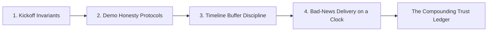
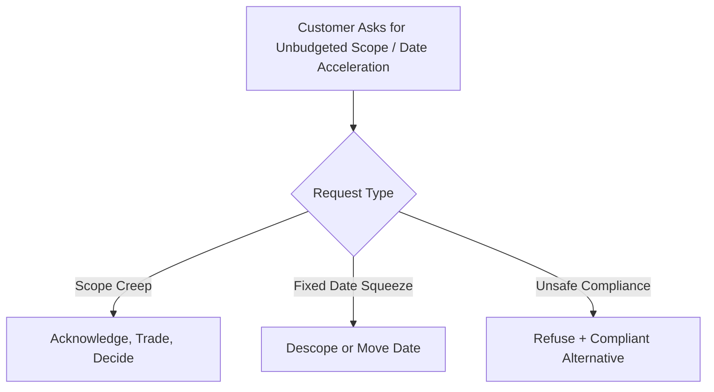
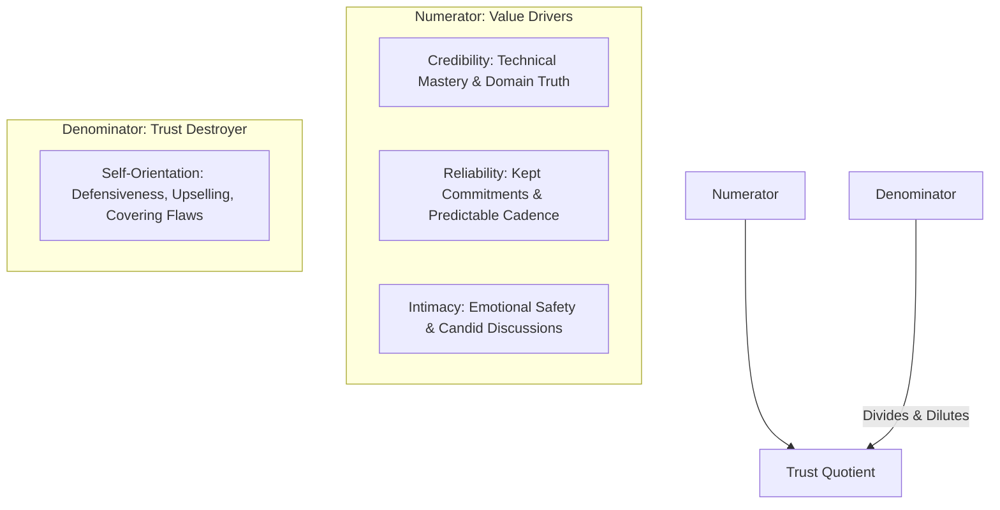

# Managing Customer Expectations & Trust Architecture

For Forward Deployed Engineers (FDEs), technical leads, and engagement directors.

Expectations are set in Week 1 and paid for in Week 12. In enterprise software delivery, most dissatisfied customer relationships do not result from software bugs or deliberate dishonesty; they result from unstated assumptions left to compound in silence. When an FDE fails to actively manage expectations, the customer fills the void with their own optimistic assumptions—and when reality arrives, the resulting gap is experienced as a breach of trust.

This guide codifies the operational mechanics of expectation management across the four critical touchpoints: **Kickoff Framing**, **Demo Discipline**, **Timeline Buffering**, and **Bad-News Delivery**. It formalizes the **Enterprise Trust Equation** and provides calibrated conversational scripts drawn from verified practitioner literature (**David Maister**, **Chris Voss**, **Google SRE**, **Om Bharatiya**, and **Nehal Vyas**).

---

## 1. The Four Expectation Touchpoints



---

## 2. Touchpoint 1: Setting Expectations at Kickoff

The kickoff meeting sets the operational baseline for the entire engagement. Four contractual expectations must be signed off in writing before the meeting adjourns:

1. **Measurable Success Criteria**: Replace qualitative wishes with empirical thresholds. 
   - *Ambiguous Wish*: *"Improve compliance document search."*
   - *Operational Contract*: *"Achieve $\ge 88.0\%$ category classification accuracy and $100.0\%$ citation grounding on the 25-case golden evaluation dataset by March 31, verified weekly via automated test harness, owned by the Lead Compliance Officer."*
2. **Demo Cadence & Review Channels**: Agree on fixed demo dates, who must attend, and what documentation will be delivered 24 hours prior to the call.
3. **Incident Response & Rollback Authority**: Agree on severity escalation windows (e.g., 15m P0, 30m P1 per [Debugging Methodology](../troubleshooting/01-debugging-methodology.md)) and establish exactly who on the customer side holds authority to order an operational rollback. Renegotiating incident authority during an active outage destroys partnership trust.
4. **The Prototype-to-Production Gate**: Explicitly define what constitutes a successful pilot and outline the non-negotiable security/compliance criteria (e.g., BAA, VPC PrivateLink, CMEK) required to enter production (referencing [Production Readiness Checklist](../deployment/03-production-readiness-checklist.md)).

---

## 3. Touchpoint 2: Demo Honesty Protocols

Audiences remember the elements of a demo that look automated and effortless. Every prototype demonstration carries a strict professional obligation to disclose technical shortcuts and bounds:

### The Wizard-of-Oz Disclosure Invariant
Always explicitly disclose what was operated manually behind the scenes:
- Hand-curated or pre-cleaned sample CSVs
- Manually triggered ETL batch scripts
- Mocked authentication tokens or simulated SSO responses
- Hardcoded timeout overrides

*Disclosed during the demo, a technical shortcut is a valuable scoping insight. Discovered later in integration, it is a broken promise.*

### The Standard Closing Formula
Conclude every sprint demonstration with the exact same two-part formula:
> **"Here is what this demonstration proves, and here is what it does not prove yet."**

- *What it proves*: *"This proves our embedding pipeline extracts relevant paragraphs from 200-page loan disclosures with sub-second retrieval."*
- *What it does not prove yet*: *"This does not prove our system handles concurrent queries from 50 simultaneous users, nor does it prove automated recovery when the upstream OCR endpoint fails."*

Repeating this formula anchors customer executive memory to empirical facts rather than wishful thinking.

---

## 4. Touchpoint 3: Timeline Honesty & Buffer Discipline

In engineering estimation, human optimism is a liability. Apply two non-negotiable buffer rules:

1. **The Hidden Contingency Rule**: Your internal estimate with everything proceeding smoothly is the customer's *worst-case* date, never their expected date. Build a 20–30% buffer into complex enterprise integrations to account for change freeze windows, security reviews, and IAM approvals.
2. **Never Advertise the Buffer**: If you announce a buffered deadline as your target commitment, the customer's stakeholders will expand scope to consume the extra calendar runway. Commit to milestones, not endgames.

### Controlling Dates You Own vs. Exposing External Dependencies
Never commit to delivery dates dependent on systems you do not control:

| Scope Domain | Ownership | Commitment Framing |
| :--- | :--- | :--- |
| **You Control** | Internal code, demo artifacts, test suites | *"The reference pipeline implementation and automated eval runner will be deployed to staging by Tuesday the 14th."* (Definite date) |
| **Customer Controls** | SSO provisioning, AWS PrivateLink approval, database access | *"Integration testing will commence within 48 hours of your InfoSec team approving the cross-account IAM role. The access request was submitted on the 3rd and typically takes 10 business days."* (Conditional milestone) |

---

## 5. Touchpoint 4: Calibrated De-Escalation & Saying "No"

Senior FDEs do not say "no" defensively; they use **Calibrated Questions** and **Tactical Trade-Offs** (inspired by Chris Voss, *Never Split the Difference*) to turn customer demands into collaborative decisions.



### Script 1: Scope Creep (Acknowledge, Trade, Decide)
When a customer sponsor asks to add features mid-sprint:
> *"We can incorporate real-time multi-language translation into Phase 1, provided we move the automated PDF table extractor into Phase 2. Which of these two capabilities delivers higher operational ROI for your team this quarter?"*

*Result: The customer is granted agency over priority, and the scope perimeter retains their direct buy-in.*

### Script 2: The Fixed-Date Crunch
When an executive demands an immovable launch date with full scope:
> *"To ensure a stable, audit-ready launch for the March 31 board deadline, we have capacity to ship the core compliance search engine. If we also bundle the automated report generator, the delivery date shifts to April 14. Which priority matters more: launching on March 31 with core search, or launching in mid-April with both tools?"*

### Script 3: The Unsafe Compliance Request
When an operator asks to bypass security controls or use personal API keys:
> *"We cannot route customer financial records through that external unapproved endpoint because it violates your institution's SOC2 data residency policies. Here is the compliant AWS PrivateLink architecture inside your VPC that captures 95% of the same workflow value without exposing regulatory risk."*

---

## 6. Delivering Bad News on a Clock

Bad news does not improve with age. Delivering bad news late reads as deception; delivering it immediately with data and a concrete plan reads as senior engineering discipline.

### The 4-Part Bad-News Framework
Structure every incident alert and quality regression using four objective fields:

```text
Facts:     Objective, verifiable data without emotional adjectives or defensive framing.
Impact:    Exact blast radius: who is affected, what workflow is blocked, and what SLA is breached.
Plan:      Immediate mitigation steps and technical remediation tasks with assigned owners.
Next:      Exact clock time when the next status update will be delivered.
```

### Empirical Production Telemetry Example
*(Grounded in real evaluation runs from our reference compliance engine: [`portfolio/reference-project/evals/run_evals.py`](../portfolio/reference-project/evals/run_evals.py))*

```text
BAD-NEWS NOTIFICATION: Golden Evaluation Milestone Miss
Date/Time: 2026-03-14 14:00 UTC
Severity: Sev-2 (Quality Gate Hold)

Facts:
The automated golden evaluation run on 2026-03-14 scored 84.0% category classification 
accuracy (21 of 25 cases passed) on the CFPB compliance test suite, falling short of our 
contractual 88.0% production acceptance gate. Citation grounding remained at 100.0% (41/41).

Impact:
Production release candidate v1.2 is placed on temporary deployment hold. The 4 misclassified 
cases concentrated exclusively in the newly added 'VA Mortgage Escrow Dispute' category.

Plan:
1. Implemented few-shot exemplar grounding and schema validation via structured_extractor.py.
2. Re-evaluating updated prompt candidates against the golden harness by 18:00 UTC.
3. If accuracy recovers above 88.0%, release proceeds tomorrow at 09:00 UTC. If not, VA Escrow 
   queries will route to the manual human review queue.

Next Update:
2026-03-14 18:30 UTC via shared Slack bridge and email summary.
```

---

## 7. The Enterprise Trust Architecture & Maister's Trust Equation

In professional engineering services, trust is quantifiable. David Maister, Charles Green, and Robert Galford formalized this relationship in *The Trusted Advisor*:

$$\text{Trust} = \frac{\text{Credibility} + \text{Reliability} + \text{Intimacy}}{\text{Self-Orientation}}$$



### Deconstructing the Variables for FDEs
- **Credibility ($\mathbf{C}$)**: Demonstrating deep technical rigor, correct terminology, and transparent admission when you do not know the answer.
- **Reliability ($\mathbf{R}$)**: The consistency between your words and your actions. Delivering status reports every Friday at 15:00, whether there is good news or bad news, steadily builds reliability.
- **Intimacy ($\mathbf{I}$)**: The customer's emotional safety in sharing confidential organizational dysfunction, security concerns, or internal political friction with you.
- **Self-Orientation ($\mathbf{S}$)**: **The single greatest trust destroyer.** When an FDE defends their code instead of solving the customer's problem, conceals bugs to look competent, or pushes for billable scope expansion, $S$ spikes and collapses overall trust.

### The 4-Step Trust Restoration Protocol
When an expectation is broken (an outage occurs or an agreed SLA slips):
1. **Acknowledge**: Name the failure plainly and take ownership without making defensive excuses.
2. **Fix**: Implement the technical mitigation immediately with a verifiable completion timestamp.
3. **Prevent**: Establish the architectural guardrail or automated test that permanently stops recurrence.
4. **Follow Through Visibly**: Publicly confirm that all remediation items have been closed, verified by the customer's own operators.

---

## 8. Direct Codebase Defense Implementations

Expectation management is reinforced by automated software guardrails. Cross-reference our repository implementations:

| Expectation Risk | Software Defense | Source Location | Test Verification |
| :--- | :--- | :--- | :--- |
| **Subjective Quality Debates** | Automated Golden Evaluation Suite (25 Cases) | [`portfolio/reference-project/evals/run_evals.py`](../portfolio/reference-project/evals/run_evals.py) | `python portfolio/reference-project/evals/run_evals.py` |
| **Silent API & Quota Failures** | Resilient Client with Jittered Backoff | [`interviews/code/resilient_client.py`](../interviews/code/resilient_client.py) | `pytest interviews/code/test_resilient_client.py` |
| **Model Output Hallucinations** | Self-Healing Pydantic Extraction Loop | [`interviews/code/structured_extractor.py`](../interviews/code/structured_extractor.py) | `pytest interviews/code/test_structured_extractor.py` |
| **Rate Limit Violations** | Token Bucket Rate Limiter with Retry-After | [`interviews/code/rate_limiter.py`](../interviews/code/rate_limiter.py) | `pytest interviews/code/test_rate_limiter.py` |
| **Outage Escalation Protocols** | 7-Phase SRE Incident Response Lifecycle | [`troubleshooting/01-debugging-methodology.md`](../troubleshooting/01-debugging-methodology.md) | Standardized Broadcast Playbooks |

---

## 9. Primary Practitioner References

1. **David H. Maister, Charles H. Green, Robert M. Galford**: *The Trusted Advisor* (Free Press). The Trust Equation and professional client advisory frameworks.
2. **Chris Voss**: *Never Split the Difference: Negotiating As If Your Life Depended On It* (HarperBusiness). Calibrated questions and tactical de-escalation scripts.
3. **Google Site Reliability Engineering**: *Managing Incidents & Emergency Response Protocols*. [sre.google/sre-book/incident-management](https://sre.google/sre-book/incident-management/)
4. **Om Bharatiya & Nehal Vyas**: *Forward Deployed Engineering Field Lore: Customer Alignment and Expectation Architecture*.
5. **Consumer Financial Protection Bureau (CFPB)**: *Consumer Complaint Database Golden Evaluation Provenance*. [consumerfinance.gov/data-research/consumer-complaints/](https://www.consumerfinance.gov/data-research/consumer-complaints/)
