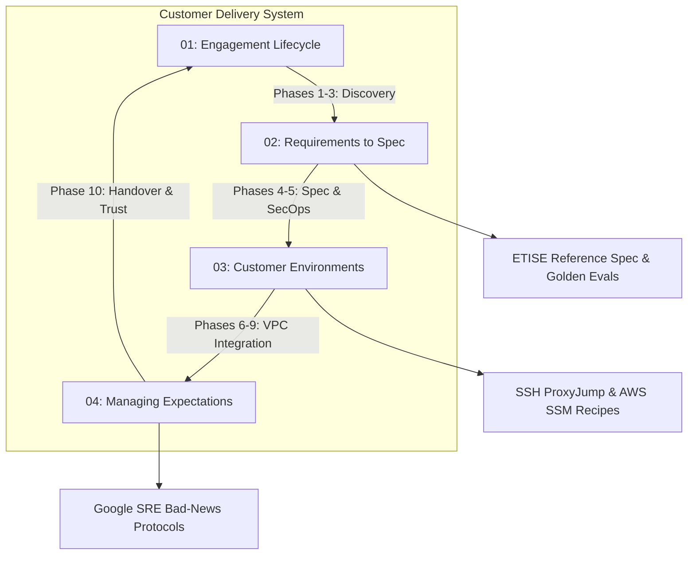

# Customer Engineering & Enterprise Delivery

In an enterprise Forward Deployed Engineering (FDE) engagement, technical capability is only half
the equation; the other half is organizational execution. You are deploying software inside another
company's infrastructure, working alongside engineers who did not build your system, under compliance
mandates you do not set, and answering to executive sponsors who judge your team by outcomes,
not code commits.

This module provides the operational field manual for the customer-facing half of the FDE discipline:
transforming ambiguous discovery conversations into executable specifications, navigating locked-down
customer networks, establishing stakeholder trust under crisis conditions, and executing disciplined
operational handovers.

---

## 1. Core Module Guides

### 1. [The Engagement Lifecycle](01-engagement-lifecycle.md)
The canonical 10-phase operational roadmap spanning technical pre-engagement to autonomous customer operation:
- **The 10 Structured Delivery Phases**: Inputs, activities, artifacts, measurable exit criteria, and classic failure modes for every phase from Kickoff to Handover.
- **Phase-Gate Governance Matrix**: Formal Go/No-Go decision gates between phases to eliminate project drift.
- **Empirical Pilot Failure Analysis**: Synthesis of the **MIT NANDA report** (Fortune, August 2025) explaining why ~95% of GenAI enterprise pilots stall without deep workflow integration.
- **The Operational Handover Triad**: The three non-negotiable requirements for sustainable customer autonomy: self-contained runbooks, automated regression test suites, and 30-day reverse shadowing.
- **Weekly 10-Point Health Audit**: Rapid self-diagnostic checklist for engagement leads to detect schedule drift before executive escalations.

### 2. [From Requirements to Spec](02-requirements-to-spec.md)
Turning loose discovery interviews and high-level aspirations into binding, testable engineering contracts:
- **The Anatomy of Spec Failure**: Eliminating ambiguity, unstated architectural assumptions, unassigned scope, and shifting stakeholders.
- **The One-Page Spec Skeleton**: Standardized structure covering problem quantification, measurable goals, explicit non-goals, and boundary scope.
- **Executable Given/When/Then Acceptance Criteria**: Formulating criteria that survive QA and map directly to automated tests.
- **Production Worked Example (ETISE-SPEC-2026-v2.1)**: Full real-world engineering specification for the Enterprise Ticket Intelligence & SLA Escalation Engine, backed by 26,872 Bitext customer interactions and CFPB dispute records.
- **The 24-Hour Review Ritual**: Silent reading protocols and closing open questions with named owners.

### 3. [Working in Customer Environments](03-working-in-customer-environments.md)
Operating effectively inside client VPCs, air-gapped enclaves, and regulated corporate bastions:
- **First-Week Onboarding Playbook**: Day 1 to Day 5 phased onboarding schedule to eliminate initial schedule friction.
- **The Access Dependency Log**: Operational tracking template preventing access approval delays from derailing sprint deliverables.
- **Tactical Bastion, VDI, & Network Navigation**: Concrete configuration recipes for OpenSSH `ProxyJump`, AWS Systems Manager (SSM) port forwarding, corporate TLS interception CA bundle injection (`corp-ca-bundle.crt`), and internal Artifactory/Nexus pip/npm mirrors.
- **Reverse-Engineering Unfamiliar Stacks**: Non-destructive database catalog queries (`information_schema.columns`), Redis cursor scanning (`SCAN`), and building against the **Walking Skeleton** pattern while security tickets queue.
- **Enterprise Politics & RACI Governance**: Codified RACI matrix across client engineering, InfoSec, and executive sponsors; overcoming the "Not-Invented-Here" (NIH) syndrome.

### 4. [Managing Customer Expectations & Trust Architecture](04-managing-expectations.md)
Maintaining technical alignment, handling scope pushback, and restoring credibility during production incidents:
- **The Four Expectation Touchpoints**: Kickoff invariants, demo honesty protocols ("Wizard-of-Oz" disclosures), the hidden 20–30% schedule contingency rule, and tactical de-escalation scripts.
- **Calibrated Scope De-Escalation**: Using Chris Voss's tactical trade-off frameworks (*Never Split the Difference*) to negotiate scope creep and fixed-date constraints without confrontation.
- **Delivering Bad News on a Clock**: Google SRE 4-part objective communication structure (Facts, Impact, Plan, Next Update) with strict notification timing invariants.
- **David Maister's Trust Equation**: $\text{Trust} = \frac{\text{Credibility} + \text{Reliability} + \text{Intimacy}}{\text{Self-Orientation}}$; identifying Self-Orientation as the fatal failure mode in client engineering.
- **The 4-Step Trust Restoration Protocol**: Acknowledge $\rightarrow$ Fix $\rightarrow$ Prevent $\rightarrow$ Follow Through Visibly following an operational breach.

---

## 2. Situational Field Navigation Matrix

When facing an active challenge on an enterprise engagement, use this rapid-routing matrix to jump
directly to the relevant operational protocol:

| On-the-Ground Field Scenario | Root Risk Domain | Immediate Stabilization Move | Reference Guide & Protocol |
| :--- | :--- | :--- | :--- |
| **Sponsor demands a fixed go-live date on Day 2** | Unbounded schedule expectation | Anchor on phase exits rather than end dates; apply the 20–30% buffer rule | [Expectation Touchpoint 3: Timeline Buffering](04-managing-expectations.md#3-timeline-buffers-the-hidden-20-30-contingency-rule) |
| **Blocked on corporate VPN, bastion, or IAM for 5+ days** | Idle project drift | Pivot to Walking Skeleton pattern; log blocker visibly in Access Dependency Log | [Access Friction & Dependency Log](03-working-in-customer-environments.md#the-access-dependency-log) |
| **Customer Tech Lead hostile to vendor solution ("NIH")** | Political misalignment | Co-author boundary interfaces; automate their operational toil; credit them in demos | [Overcoming NIH Syndrome](03-working-in-customer-environments.md#overcoming-the-not-invented-here-nih-syndrome) |
| **Customer asks to add "just one small feature" mid-sprint** | Scope creep | Deploy Chris Voss calibrated trade-off script: Acknowledge $\rightarrow$ Trade $\rightarrow$ Decide | [Calibrated De-Escalation: Scope Creep](04-managing-expectations.md#4-saying-no-and-calibrated-de-escalation) |
| **Corporate proxy breaking `pip install` with SSL errors** | TLS certificate re-signing | Export `REQUESTS_CA_BUNDLE` and configure corporate CA bundle permanently | [Corporate TLS & CA Bundle Injection](03-working-in-customer-environments.md#3-corporate-tls-interception--ca-certificate-bundles) |
| **Critical production bug causes customer data misrouting** | Credibility & trust collapse | Broadcast 4-part bad-news update within 60m; initiate 4-step trust restoration | [Delivering Bad News on a Clock](04-managing-expectations.md#delivering-bad-news-on-a-clock) |
| **Spec review meeting devolving into circular arguments** | Ambiguous written criteria | Institute 15-minute silent reading; convert verbal debates to tracked open questions | [The Review Ritual & Skeleton](02-requirements-to-spec.md#the-review-ritual) |
| **Canary pilot showing 20% operator override rate** | Quality gate failure | Halt Phase 9 transition; evaluate against Golden Dataset; execute Phase 8 loop | [Phase-Gate Governance Matrix](01-engagement-lifecycle.md#the-phase-gate-governance-matrix) |

---

## 3. Direct Codebase Defense Implementations

The protocols documented in this module are backed by executable code, test suites, and evaluation
frameworks within this repository:

| Operational Discipline | Codebase Implementation | Verification & Testing |
| :--- | :--- | :--- |
| **Executable Given/When/Then Acceptance Criteria** | [`portfolio/reference-project/tests/test_server.py`](../portfolio/reference-project/tests/test_server.py) | `pytest portfolio/reference-project/tests/` (Asserts automated dispatch, idempotency replays, RBAC) |
| **Empirical Golden Evaluation Harness** | [`portfolio/reference-project/evals/run_evals.py`](../portfolio/reference-project/evals/run_evals.py) | `python portfolio/reference-project/evals/run_evals.py` (25 enterprise cases, 100% citation grounding) |
| **Real-World Dispute Dataset Provenance** | [`portfolio/reference-project/evals/DATASET_PROVENANCE.md`](../portfolio/reference-project/evals/DATASET_PROVENANCE.md) | CFPB public complaint API & Hugging Face Bitext customer support dataset |
| **Walking Skeleton Architecture** | [`portfolio/reference-project/src/api/server.py`](../portfolio/reference-project/src/api/server.py) | Fast API server with mock fallbacks for rapid local integration |
| **Production Incident SRE Runbook** | [`troubleshooting/01-debugging-methodology.md`](../troubleshooting/01-debugging-methodology.md) | 7-phase incident lifecycle, Sev-0..Sev-3 SLA matrix, and blameless post-mortems |
| **Regulated Enclave & Bastion Runbook** | [`troubleshooting/02-debugging-customer-systems.md`](../troubleshooting/02-debugging-customer-systems.md) | 6-tier visibility ladder and multi-cloud IAM CLI diagnostic commands |

---

## 4. Primary Practitioner References

1. **Palantir Technologies**: *Forward Deployed Engineering Methodology and Field Architecture*. [palantir.com/careers/forward-deployed-software-engineer](https://www.palantir.com/careers/forward-deployed-software-engineer/)
2. **Anthropic**: *Forward Deployed Engineer Role Specification & Enterprise Claude Deployments*. [job-boards.greenhouse.io/anthropic/jobs/5302966008](https://job-boards.greenhouse.io/anthropic/jobs/5302966008)
3. **MIT NANDA Initiative / Fortune**: *The GenAI Divide: Why 95% of Enterprise AI Pilots Fail*. [fortune.com/2025/08/18/mit-report-95-percent-generative-ai-pilots-at-companies-failing-cfo](https://fortune.com/2025/08/18/mit-report-95-percent-generative-ai-pilots-at-companies-failing-cfo)
4. **David H. Maister, Charles H. Green, Robert M. Galford**: *The Trusted Advisor* (Free Press, 2000). The foundational formulation of the Trust Equation and advisory credibility.
5. **Chris Voss**: *Never Split the Difference: Negotiating As If Your Life Depended On It* (HarperBusiness, 2016). Tactical empathy, calibrated questions, and non-adversarial boundary setting.
6. **Google Site Reliability Engineering**: *Managing Incidents* & *Communication Protocols During Outages*. [sre.google/sre-book/managing-incidents](https://sre.google/sre-book/managing-incidents/)
7. **Consumer Financial Protection Bureau (CFPB)**: *Consumer Complaint Public Database & REST API*. [consumerfinance.gov/data-research/consumer-complaints](https://www.consumerfinance.gov/data-research/consumer-complaints/)
