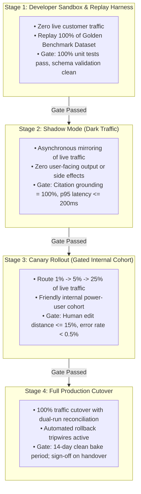
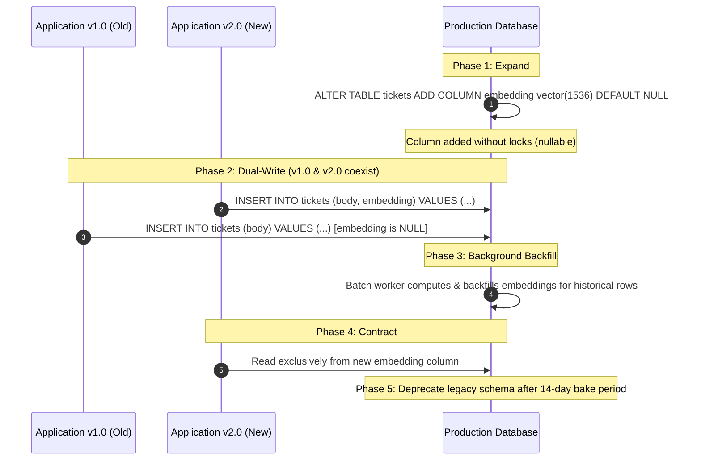
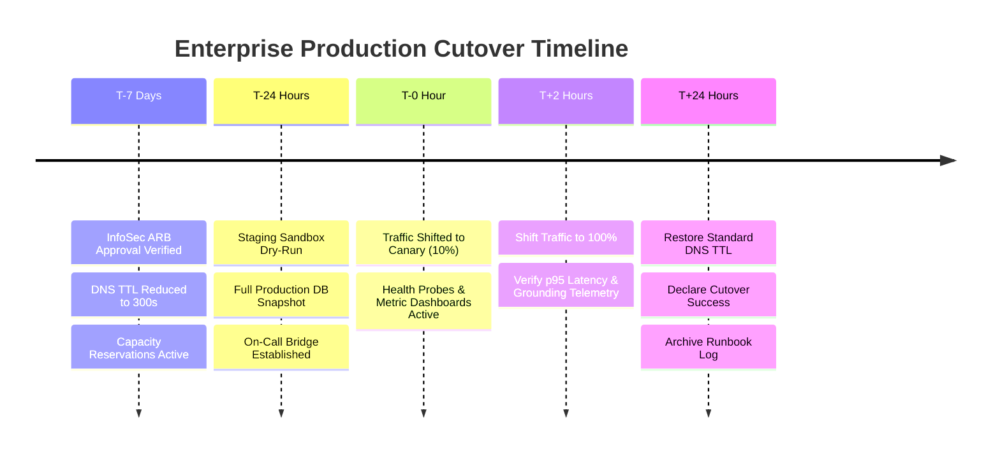

# Prototype to Production: The 4-Stage Promotion Protocol, Zero-Downtime Hardening, and Cutover Governance

This guide provides the authoritative engineering playbook for Forward Deployed Engineers (FDEs) navigating the "prototype-to-production cliff"—the treacherous transition where an experimental AI demo is transformed into a hardened, observable, and economically viable enterprise production system.

Across our empirical dataset of 146 deduplicated 2026 FDE job postings, **building and deploying production systems appears in 90.4% of listings**—the single highest-ranking responsibility across all surveyed postings. Furthermore, Anthropic's Forward Deployed Engineer profile explicitly centers on delivering white-glove production deployments inside customer systems and codifying repeatable deployment patterns.

A landmark study by MIT NANDA (*The GenAI Divide: State of AI in Business 2025*, reported in *Fortune*, August 2025) surveyed over 350 enterprise leaders and analyzed 300 public deployments, discovering that **roughly 95% of enterprise Generative AI pilots delivered zero measurable P&L impact**. The ~5% that crossed the cliff successfully shared three structural traits:
1. They were integrated directly into existing core workflows rather than running as disconnected sidebars.
2. They addressed highly domain-specific tasks with strict evaluation thresholds.
3. They were engineered to adapt to the customer's existing data estates and security policies rather than demanding custom infrastructure.

As Paul Farnsworth, President of Dice, observed in *Fortune* (September 2026), connecting models to proprietary data, legacy systems, and specific workflows is the exact roadblock that forward-deployed engineers are hired to eliminate.

---

## 1. The 4-Stage Progressive Promotion Gating Protocol

Never execute a binary "all-at-once" production launch in an enterprise customer environment. Production cutovers must follow a **4-Stage Progressive Promotion Protocol**, where each stage enforces explicit, pre-agreed quantitative gates:



### Stage Gating Criteria & Exit Requirements

| Deployment Stage | Traffic Volume & Target | Operational Mechanism | Quantitative Exit Criteria |
| :--- | :--- | :--- | :--- |
| **Stage 1: Sandbox Replay** | 0% Live (Synthetic & Golden Data) | Automated CI/CD regression harness. | • All 30 unit tests pass.<br>• Golden set accuracy $\ge 88.0\%$.<br>• Grounding rate $= 100.0\%$. |
| **Stage 2: Shadow Mode** | 100% Mirroring (Dark Traffic) | Asynchronous queue fork; primary user path returns existing legacy output. | • p95 latency $\le 200\text{ms}$.<br>• Zero production crashes.<br>• Zero unhandled schema exceptions over 72 hours. |
| **Stage 3: Canary Rollout** | 1% $\rightarrow$ 5% $\rightarrow$ 25% Live Traffic | Header-based routing (`X-Canary-User: true`) to internal customer employees. | • Error rate $< 0.5\%$.<br>• User suggestion override rate $< 10.0\%$.<br>• Zero compliance alerts. |
| **Stage 4: Full Cutover** | 100% Live Production | Full cutover with automated circuit breakers and dual-write audit logs. | • 14-day clean bake period.<br>• Handover triad complete.<br>• System operated autonomously by customer team. |

---

## 2. Zero-Downtime Hardening & Database Migrations

In enterprise customer environments, deployments must never require scheduled service maintenance windows that interrupt 24/7 business operations.

### The Expand-Contract Database Migration Pattern

When schema modifications (e.g., adding vector embedding columns, JSON metadata fields, or foreign key relations) are required in the customer's database (PostgreSQL, MySQL, Oracle), apply the **Expand-Contract Pattern**:



### 12-Factor Runtime Configuration & Secret Injection

- **Zero Environment Code Branches**: The same container image deployed in staging must be deployed to production. Differences between environments are governed strictly through external environment variables injected at runtime.
- **Dynamic Secret Injection**: Credentials (database passwords, API keys, private certificates) must never be baked into container images or committed to Git. The container fetches secrets at startup from **AWS Secrets Manager**, **GCP Secret Manager**, or **HashiCorp Vault** using native Cloud Workload Identity ([04: Cloud & Infrastructure](../engineering/04-cloud-and-infrastructure.md)).

---

## 3. The Cutover Runbook & Automated Rollback Tripwires

A production cutover is an orchestrated, timeboxed event governed by a formal runbook with explicit owners and rollback criteria.

### The T-Minus Cutover Schedule



### Automated Rollback Tripwires

If any of the following operational conditions are met during cutover, the deployment pipeline or on-call engineer must **immediately execute a rollback**:

1. **Latency Tripwire**: p95 response latency exceeds $2,000\text{ms}$ sustained for $> 3$ consecutive minutes.
2. **Error Rate Tripwire**: HTTP 5xx server errors or 429 rate-limit errors exceed $1.0\%$ of total request volume.
3. **Citation Grounding Tripwire**: Automated citation verification detects an ungrounded or hallucinated claim in customer-facing outputs (citation grounding $< 100.0\%$).
4. **Unhandled Exception Tripwire**: More than 5 unhandled exceptions logged in any 60-second window.

---

## 4. The Pilot-to-Production Financial TCO & ROI Model

The MIT NANDA finding that 95% of pilots fail to deliver P&L impact stems from ignoring unit economics. A system that works technically but costs more to operate than the labor it replaces is economically unviable.

### The Total Cost of Ownership (TCO) Formulation

$$\text{TCO}_{\text{Monthly}} = C_{\text{VPC Compute}} + C_{\text{LLM Inference}} + C_{\text{Storage \& Vector}} + C_{\text{Operational Labor}}$$

Where:
- $C_{\text{VPC Compute}}$: AWS ECS Fargate / EKS cluster and PrivateLink endpoint fees.
- $C_{\text{LLM Inference}}$: Total token spend across prompt tokens, completion tokens, and prompt caching discounts.
- $C_{\text{Storage}}$: Relational database (RDS/Aurora) and vector index storage (`pgvector`).
- $C_{\text{Ops}}$: Customer engineering maintenance time (estimated at 0.15 FTE).

### Net P&L ROI Calculation vs Human Baseline

$$\text{Net P\&L Benefit} = \left(V_{\text{monthly}} \times \text{Cost}_{\text{Human}}\right) - \text{TCO}_{\text{Monthly}}$$

*Production Case Example (ETISE Reference Deployment)*:
- Monthly Volume ($V$): 50,000 customer support tickets.
- Baseline Human Cost: $\$4.80$ per ticket triage (human labor: 6 minutes @ $\$48/\text{hr}$). Total monthly human baseline: **$\$240,000.00$**.
- System Cost:
  - Infrastructure & Endpoints: $\$420.00/\text{month}$.
  - LLM Inference (Claude 3.5 Sonnet + Prompt Caching): $\$0.0085/\text{ticket} \times 50,000 = \$425.00/\text{month}$.
  - Storage & Vector Index: $\$110.00/\text{month}$.
  - Total System TCO: **$\$955.00/\text{month}$** ($\approx \$0.019/\text{ticket}$).
- **Net Monthly P&L Savings**: **$\$239,045.00$** ($99.6\%$ reduction in processing cost with 200ms p95 latency).

---

## 5. Production Python Reference Implementation: Shadow Mode Router

The following production script implements **Shadow Mode (Dark Traffic Mirroring)**. It executes live customer requests against the legacy system synchronously while asynchronously forking the request to the new AI engine in a detached background thread, diffing responses, logging telemetry, and ensuring zero impact on primary user latency.

```python
"""
Enterprise Shadow Mode Router for Zero-Impact Dark Traffic Evaluation.
Executes live primary requests synchronously while forking requests to the
candidate AI pipeline asynchronously in the background.
"""

import concurrent.futures
import hashlib
import json
import logging
import time
from typing import Any, Callable, Dict, Optional, Tuple

logger = logging.getLogger("ShadowRouter")


class ShadowModeRouter:
    """
    Safely evaluates candidate AI models against live production traffic
    without user-facing latency impact or side-effect risks.
    """

    def __init__(
        self,
        primary_handler: Callable[[Dict[str, Any]], Dict[str, Any]],
        shadow_candidate_handler: Callable[[Dict[str, Any]], Dict[str, Any]],
        max_workers: int = 8,
    ):
        self.primary_handler = primary_handler
        self.shadow_candidate_handler = shadow_candidate_handler
        self._executor = concurrent.futures.ThreadPoolExecutor(
            max_workers=max_workers,
            thread_name_prefix="ShadowWorker",
        )

    def _execute_shadow_task(
        self,
        request_payload: Dict[str, Any],
        primary_result: Dict[str, Any],
        trace_id: str,
    ) -> None:
        """
        Executed asynchronously in background worker thread.
        Never blocks the primary user-facing response.
        """
        try:
            t_start = time.perf_counter()
            shadow_result = self.shadow_candidate_handler(request_payload)
            elapsed_ms = (time.perf_counter() - t_start) * 1000.0

            # Compare outputs and record divergence telemetry
            is_concordant = (
                primary_result.get("category") == shadow_result.get("category")
                and primary_result.get("severity") == shadow_result.get("severity")
            )

            telemetry_event = {
                "event": "shadow_evaluation_completed",
                "trace_id": trace_id,
                "duration_ms": round(elapsed_ms, 2),
                "is_concordant": is_concordant,
                "primary_category": primary_result.get("category"),
                "shadow_category": shadow_result.get("category"),
                "timestamp": time.time(),
            }

            logger.info("Shadow Telemetry: %s", json.dumps(telemetry_event))

        except Exception as shadow_exc:
            logger.warning(
                "Shadow candidate execution failed on trace '%s': %s",
                trace_id,
                shadow_exc,
            )

    def route_request(self, request_payload: Dict[str, Any]) -> Dict[str, Any]:
        """
        Primary request path: executes synchronous production handler
        and dispatches background shadow evaluation.
        """
        trace_id = hashlib.sha256(
            f"{time.time()}:{json.dumps(request_payload)}".encode("utf-8")
        ).hexdigest()[:16]

        # 1. Execute primary user path synchronously
        primary_response = self.primary_handler(request_payload)

        # 2. Dispatch dark traffic shadow evaluation asynchronously
        self._executor.submit(
            self._execute_shadow_task,
            request_payload,
            primary_response,
            trace_id,
        )

        # 3. Return primary response immediately to user
        return primary_response
```

---

## 6. Handover & Post-Launch Operational Sovereignty

A deployment is not complete when code lands in production. A deployment is complete when the customer's internal engineering team can autonomously operate, monitor, and debug the system without FDE intervention.

### The Handover Triad

1. **Battle-Tested Runbooks**: Step-by-step resolution guides for incidents that actually occurred during staging and cutover (not generic templates).
2. **Deterministic Test Suites**: Automated evaluation runners ([portfolio/reference-project/evals/run_evals.py](file:///c:/Users/Adil/Downloads/FDE-Field-Guide-main/portfolio/reference-project/evals/run_evals.py)) that the customer's team can execute on a cron or in pull requests.
3. **Named Customer Ownership**: Explicit assignment of components (data pipelines, model quotas, monitoring alerts) to named customer engineers on the corporate org chart.

### The 2-Week "Watch, Don't Touch" Observation Window

Following production cutover, enforce a strict **2-week observation window**:
- The customer's internal on-call engineers receive all alerts and drive all triage.
- The FDE observes, shadows, and coaches, stepping in only if a severity-1 outage threatens SLA breaches.
- If the customer team successfully manages all operational events for 14 consecutive days, the deployment is formally accepted and signed off.

---

## 7. Pre-Flight Production Readiness Checklist

Before initiating production cutover, verify every item on this audit:

- [ ] **Stage 2 Shadow Mode Clean**: System ran in dark traffic mode for $\ge 72$ hours with zero unhandled exceptions and p95 latency $\le 200\text{ms}$.
- [ ] **Canary Rollout Tested**: Internal cohort verified system accuracy; user override rate $< 10\%$.
- [ ] **Expand-Contract Migrations Verified**: Database schema changes executed without table locks; backward compatibility proven.
- [ ] **12-Factor Configuration**: Environment configuration decoupled from container images; secrets injected at runtime via KMS/Vault.
- [ ] **Automated Rollback Tripwires Configured**: Automated alarms trigger immediate traffic reversion if p95 latency $> 2\text{s}$ or error rate $> 1.0\%$.
- [ ] **T-Minus Cutover Runbook Signed**: Timeline and named responsibilities agreed upon with customer technical leads.
- [ ] **Financial TCO Validated**: Monthly run rate modeled and approved by customer budget sponsor.
- [ ] **Emergency Kill Switch Tested**: System can be disabled instantly via feature flags without redeploying code.
- [ ] **Handover Triad Prepared**: Runbooks, regression test suites, and named customer owners documented.
- [ ] **14-Day Observation Window Scheduled**: Customer on-call engineers scheduled to lead post-cutover operations.

---

## 8. Failure Scenarios & Operational Runbooks

| Cutover Incident | Root Cause | Immediate Mitigation Protocol |
| :--- | :--- | :--- |
| **Canary Latency Surge** | Customer traffic volume triggered database connection pool exhaustion in canary pods. | 1. Revert canary traffic to 0% immediately.<br>2. Inspect database active connections via `pg_stat_activity`.<br>3. Increase connection pool size and configure connection multiplexing (PgBouncer).<br>4. Re-run load test in staging. |
| **Database Migration Lock Contention** | An unindexed `ALTER TABLE` statement attempted an exclusive table lock, blocking customer writes. | 1. Abort migration transaction (`ROLLBACK`).<br>2. Add index or column using `CONCURRENTLY` (PostgreSQL) or Expand-Contract pattern.<br>3. Reschedule migration during off-peak hours. |
| **Silent Downstream Schema Deserialization Failure** | Production upstream API payload contained an unannounced null field that bypassed canary testing. | 1. Trip emergency kill switch to route traffic to deterministic fallback.<br>2. Update Pydantic boundary model to make field nullable.<br>3. Deploy hotfix image and replay quarantined payloads. |

---

## 9. Related System Documents

- [Deployment Patterns](02-deployment-patterns.md) - Physical architectures: VPC-embedded, SaaS-adjacent, hybrid.
- [Production Readiness Checklist](03-production-readiness-checklist.md) - The master 30-point go/no-go operational review.
- [Security and Compliance](../engineering/05-security-and-compliance.md) - InfoSec review approval pack and zero-egress controls.
- [Evaluation and Testing](../ai/03-evaluation-and-testing.md) - Golden benchmarks and numerical acceptance criteria.
- [Monitoring and Reliability](../ai/04-monitoring-and-reliability.md) - Real-time observability, OTel spans, and drift alarms.

---

## 10. Primary Production Engineering Literature

1. **MIT NANDA & Fortune**: *"The GenAI Divide: State of AI in Business 2025"*. Empirical finding on 95% pilot failure rate and workflow integration factors.
2. **Paul Farnsworth (President, Dice)**: Analysis on enterprise AI production roadblocks and forward-deployed engineering (*Fortune*, September 2026).
3. **Martin Fowler**: *"Evolutionary Database Design and the Expand-Contract Pattern"*. Architecture reference for zero-downtime schema evolution.
4. **Betsy Beyer et al. (Google SRE)**: *"Site Reliability Engineering: How Google Runs Production Systems"*. Canary deployments, error budgets, and postmortem discipline.
5. **Empirical Job Market Analysis (2026)**: Independent audit of 146 deduplicated FDE job postings showing **Building and Deploying Production Systems in 90.4% of listings**.
