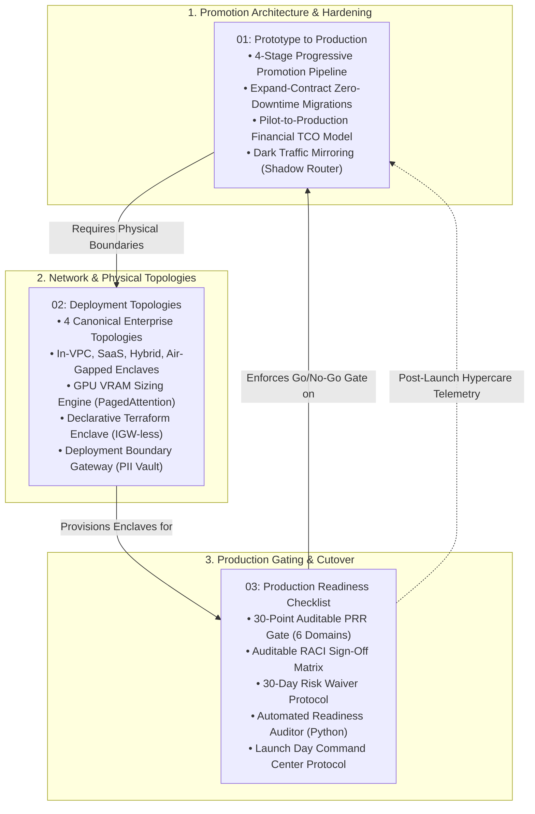

# Deployment and Productionization: Topologies, Hardening, and Production Readiness

This portal serves as the authoritative architectural master index for the **Deployment & Productionization Pillar** of the Forward Deployed Engineering (FDE) Field Guide.

The primary gap the Forward Deployed Engineer role was created to close is the chasm between an isolated prototype in a sandbox and a hardened, enterprise-grade system embedded in a customer's core business operations. Across our empirical dataset of 146 deduplicated 2026 enterprise FDE job postings, **Building & Deploying Production Systems is required in 90.4% of postings** (ranking #1 among all technical responsibilities).

A landmark study by MIT NANDA (*The GenAI Divide: State of AI in Business 2025*, reported in *Fortune*, August 2025) revealed that **roughly 95% of enterprise Generative AI pilots deliver zero measurable P&L impact**. The root cause of this failure is almost never foundation model intelligence or prompt design. Enterprise pilots die because of deployment architecture: lack of zero-downtime database migration strategies, unaddressed data residency boundaries, unvetted InfoSec gates, absence of shadow traffic evaluation, and unmanaged Total Cost of Ownership (TCO). This pillar establishes the engineering discipline required to cross that chasm reliably.

---

## 1. Architectural Knowledge Topology

The three core guides in this pillar form a cohesive, sequential deployment lifecycle: defining the promotion protocol, selecting the physical/network topology, and enforcing the pre-flight readiness gate.



---

## 2. Pillar Guide Syntheses & Technical Invariants

### 1. [Prototype to Production](01-prototype-to-production.md)
*Crossing the pilot-to-production cliff: promotion gating, zero-downtime migrations, TCO modeling, and dark traffic mirroring.*
- **The 4-Stage Progressive Promotion Protocol**: Gated transitions from Developer Sandbox $\rightarrow$ Shadow Mode (Dark Traffic Mirroring) $\rightarrow$ Canary User Cohort (5% $\rightarrow$ 25%) $\rightarrow$ General Availability Cutover.
- **Zero-Downtime Hardening via Expand-Contract**: Eliminating maintenance windows during relational and vector schema evolutions using the 4-phase Expand $\rightarrow$ Dual-Write $\rightarrow$ Backfill $\rightarrow$ Contract migration pattern.
- **The Enterprise AI TCO Equation**: Formalizing total economic cost:
  $$\text{TCO} = \text{Compute}_{\text{VPC}} + \text{Inference}_{\text{LLM}} + \text{Storage}_{\text{Vector/DB}} + \text{Ops}_{\text{Labor}}$$
- **Production Reference Implementation**: Thread-safe asynchronous [`ShadowModeRouter`](01-prototype-to-production.md#5-production-python-reference-implementation-shadow-mode-router) mirroring 100% of live traffic to shadow candidate models without adding latency to primary user responses.

---

### 2. [Deployment Topologies and Architectures](02-deployment-patterns.md)
*Physical, network, and data governance boundaries across customer estates.*
- **The 4 Canonical Enterprise Topologies**:
  1. *Customer-Tenant In-VPC*: Zero-egress private subnets without Internet Gateways (`IGW-less`), routing strictly over AWS PrivateLink / Azure Private Endpoints.
  2. *Multi-Tenant SaaS with Scoped Egress*: Cryptographic tenant isolation via PostgreSQL Row-Level Security (`app.current_tenant_id`), Customer-Managed Encryption Keys (KMS CMEK / BYOK) with crypto-shredding capability, and static NAT Gateway egress IPs.
  3. *Hybrid Control-Plane / Data-Plane*: Reverse-tunnel agent pattern (customer agent dials outbound over HTTPS/WSS port 443 to pull tasks, eliminating inbound firewall holes) combined with local token-level PII pseudonymization and re-hydration.
  4. *Physically Air-Gapped Sovereign Enclave (DoD IL5/IL6)*: Optical data diodes, OCI image archive delivery (`skopeo copy docker-archive:`), local Harbor/PyPI mirrors, and offline Ed25519 cryptographic licensing bound to TPM 2.0.
- **GPU Hardware Sizing Engine**: Calculating exact VRAM requirements using Kwon et al. (PagedAttention):
  $$VRAM_{\text{req}} = M_{\text{weights}} + M_{\text{kv\_cache}} + M_{\text{activation\_overhead}}$$
  Including empirical allocation tables for Llama-3-8B and Llama-3-70B across FP16, FP8, and AWQ 4-bit on NVIDIA H100, A100, and L40S hardware.
- **Declarative Infrastructure & Gateway Code**: Complete production Terraform module [`boundary_enclave.tf`](02-deployment-patterns.md#4-declarative-infrastructure-customer-zero-egress-enclave-terraform) and asynchronous [`DeploymentBoundaryGateway`](02-deployment-patterns.md#5-production-reference-implementation-enterprise-deployment-boundary-gateway) in Python.

---

### 3. [The Production Readiness Review (PRR)](03-production-readiness-checklist.md)
*The auditable 30-point Go/No-Go gate, RACI matrix, risk waiver protocol, and launch day command center.*
- **The Binary Gate Invariant**: Grounded in Google SRE PRR principles; every item is strictly evaluated as **PASS**, **FAIL**, or **WAIVED IN WRITING**. A single un-waived "FAIL" halts launch.
- **The 30-Point Audit Across 6 Enterprise Domains**:
  - *Domain 1: Infrastructure & Resilience* (Multi-AZ, circuit breakers, connection pools, PITR, 2.5x load headroom).
  - *Domain 2: Security, Privacy & InfoSec* (0 CRITICAL/HIGH CVEs, zero static keys, CMEK at rest, PII redaction test, signed DPA/BAA).
  - *Domain 3: Data Pipelines & Vector Storage* (Idempotency, DLQ, chunking invariants, vector index RAM headroom, schema drift alarms).
  - *Domain 4: AI Quality & Guardrails* (Golden test set SLAs, Cohen's Kappa $\ge 0.85$, prompt injection defense, structured output validation, hallucination circuit breakers).
  - *Domain 5: Telemetry & FinOps* (Dual-plane OpenTelemetry, on-call alert verification, per-tenant cost attribution, budget burn alarms).
  - *Domain 6: Operations & Handover* (Independent runbook rehearsal by customer SRE, live kill-switch rehearsal, signed SLA contracts, 14-day hypercare schedule).
- **Governance & Verification Tooling**: Formal RACI sign-off matrix, 30-day Risk Waiver template, and runnable Python [`ProductionReadinessAuditor`](03-production-readiness-checklist.md#5-automated-production-readiness-auditor-python).

---

## 3. Situational Enterprise Cutover Navigation Matrix

When executing live enterprise deployments, FDEs encounter high-stakes architectural constraints. Use this matrix for immediate tactical routing:

```
+------------------------------------+------------------------------------+-------------------------------------------+
| Live Deployment Dilemma            | Root Architectural Constraint      | Prescribed FDE Tactical Resolution        |
+------------------------------------+------------------------------------+-------------------------------------------+
| InfoSec blocks all public cloud    | Regulated customer data residency  | Deploy Topology 1 (AWS Bedrock PrivateLink|
| egress for raw prompts             | (HIPAA / GDPR / FINRA)             | in-VPC) or Topology 4 (Air-Gapped vLLM).  |
|                                    |                                    | Ref: 02-deployment-patterns.md (§2)       |
+------------------------------------+------------------------------------+-------------------------------------------+
| Database schema change required on | High-concurrency live production   | Execute 4-phase Expand-Contract pattern:  |
| 10M+ vector records with zero down | tables cannot take lock migrations | Expand -> Dual-Write -> Backfill -> Cut.  |
|                                    |                                    | Ref: 01-prototype-to-production.md (§2)   |
+------------------------------------+------------------------------------+-------------------------------------------+
| Business stakeholders fear silent  | Subjective uncertainty regarding   | Deploy dark traffic mirroring (Shadow     |
| accuracy regression upon launch    | live customer edge cases           | mode) for 14 days; verify concordance.    |
|                                    |                                    | Ref: 01-prototype-to-production.md (§5)   |
+------------------------------------+------------------------------------+-------------------------------------------+
| Customer firewall denies inbound   | Enterprise InfoSec perimeter rule: | Deploy Topology 3 with reverse-tunnel     |
| ports for vendor control plane     | No inbound 0.0.0.0:443 listeners   | agent dialing outbound via WSS (port 443).|
|                                    |                                    | Ref: 02-deployment-patterns.md (§2)       |
+------------------------------------+------------------------------------+-------------------------------------------+
| Pre-flight PRR gate fails due to   | Corporate cloud IAM permissions    | Execute formal 30-day Risk Waiver with    |
| pending streaming telemetry IAM    | delayed by central SecOps ticket   | manual 48-hour offline audit compensating |
|                                    |                                    | control. Ref: 03-readiness-checklist (§4) |
+------------------------------------+------------------------------------+-------------------------------------------+
| In-VPC self-hosted GPU cluster     | PagedAttention KV cache pool       | Calculate VRAM equation; switch to AWQ    |
| encounters CUDA OOM at peak RPS    | exhaustion under concurrent batch  | 4-bit quantization or expand to TP=4.     |
|                                    |                                    | Ref: 02-deployment-patterns.md (§3)       |
+------------------------------------+------------------------------------+-------------------------------------------+
| Error rate exceeds 1.0% or p99     | Downstream model provider outage   | Trigger automated rollback tripwire: flip |
| latency exceeds 3,500ms post-cut   | or unhandled edge-case exception   | emergency kill-switch flag to drain state.|
|                                    |                                    | Ref: 03-readiness-checklist (§6)          |
+------------------------------------+------------------------------------+-------------------------------------------+
```

---

## 4. Production Reference Implementations & Codebase Anchors

The guides in this pillar reference concrete, runnable implementations verified within the repository:

1. **Shadow Traffic Mirroring Router**:
   - [`ShadowModeRouter`](01-prototype-to-production.md#5-production-python-reference-implementation-shadow-mode-router) - Thread-safe asynchronous dark traffic mirroring with divergence tracking.
2. **Enterprise Deployment Boundary Gateway**:
   - [`DeploymentBoundaryGateway`](02-deployment-patterns.md#5-production-reference-implementation-enterprise-deployment-boundary-gateway) - Reversible PII pseudonymization vault, multi-target router, and SHA-256 audit digest logger.
3. **Zero-Egress Customer Enclave (Terraform)**:
   - [`boundary_enclave.tf`](02-deployment-patterns.md#4-declarative-infrastructure-customer-zero-egress-enclave-terraform) - Complete IGW-less VPC with AWS PrivateLink endpoints for S3 and Amazon Bedrock.
4. **Automated Production Readiness Auditor**:
   - [`ProductionReadinessAuditor`](03-production-readiness-checklist.md#5-automated-production-readiness-auditor-python) - Programmatic verification of secrets, benchmarks, and circuit breakers.
5. **Full Enterprise Reference Application**:
   - [`portfolio/reference-project/`](../portfolio/reference-project/README.md) - FastAPI compliance triage service with automated golden evaluation harness (`run_evals.py`) and 100% citation grounding.

---

## 5. Primary Literature & Standards

- **Google SRE PRR Standards**: Beyer, B., et al. (2016). *Site Reliability Engineering: How Google Runs Production Systems*. O'Reilly Media. Chapter 27.
- **AWS Well-Architected Framework**: Amazon Web Services. (2025). *Machine Learning Lens & Reliability Pillar*. AWS Technical Architecture Center.
- **PagedAttention & vLLM Serving**: Kwon, W., et al. (2023). *Efficient Memory Management for Large Language Model Serving with PagedAttention*. SOSP '23.
- **Anthropic FDE Deployment Guidelines**: Anthropic. (2026). *Forward Deployed Engineering Operating Model: Repeatable Deployment Patterns and Production Gates*.
- **Federal Information Security Standards**: National Institute of Standards and Technology. (2020). *Security and Privacy Controls for Information Systems*. NIST SP 800-53 Rev. 5.
- **The MIT NANDA Empirical Report**: MIT NANDA. (2025). *The GenAI Divide: State of AI in Business 2025*. Fortune Media.
