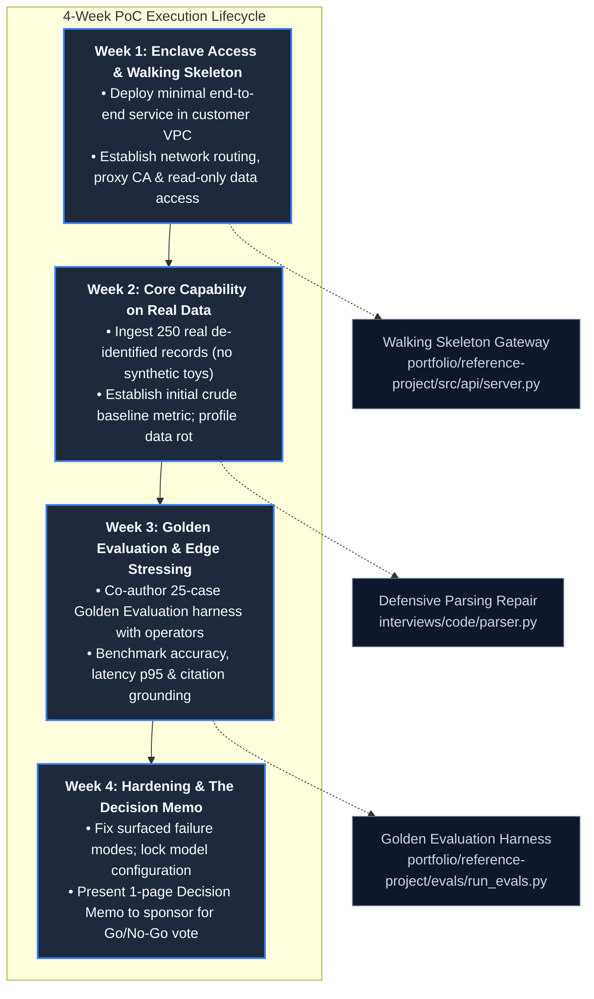
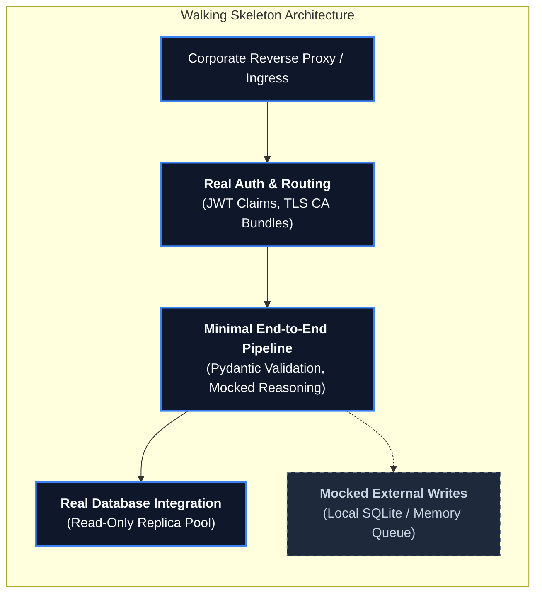
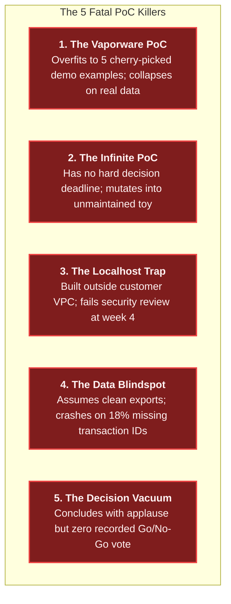

# Prototyping and Proof of Concepts: The Decision Machine

In consumer software, a prototype is often a clickable Figma mock or a weekend hackathon demo designed to
generate excitement. In enterprise Forward Deployed Engineering (FDE), this mindset is fatal.

A Proof of Concept (PoC) in an enterprise customer engagement is an **empirical decision experiment engineered
to produce a binary Go/No-Go investment decision**. It is not a theater performance designed to elicit polite
applause from executives. If an enterprise PoC concludes with stakeholders saying *"That was an impressive demo,
let us reconvene next quarter to discuss,"* the PoC has failed.

Empirical evidence highlights why prototyping rigor is paramount:
- **29.0%** of enterprise FDE job postings explicitly mandate prototyping, proof of concept execution, and technical
  demonstrations ([`job-market/dataset/fde_market_data.json`](../job-market/dataset/fde_market_data.json)).
- **90.4%** of postings mandate building and deploying production-grade software.
- The **MIT NANDA Initiative** (Fortune, August 2025) revealed that **~95% of enterprise generative AI pilots fail**
  to achieve production deployment or measurable P&L impact. They fail because prototypes are built as fragile,
  isolated toys that cannot survive contact with real customer infrastructure, corporate proxy firewalls, legacy schemas,
  and regulatory scrutiny.

This guide provides the operational field manual for enterprise prototyping: the 4-week PoC lifecycle, the Walking
Skeleton architectural pattern, the pre-agreed falsification contract, a complete production decision memo, and direct
codebase defenses.

---

## 1. The 4-Week PoC Execution Lifecycle

A PoC without a rigid timebox will expand indefinitely, slowly mutating into an unmaintained, unmonitored production
system. Every enterprise PoC must follow a disciplined 4-week execution lifecycle with strict exit gates:



### The Weekly Exit Criteria
- **Week 1 Exit Gate**: The Walking Skeleton container is running inside their VPC, authenticated via their IAM,
  logging structured JSON to their telemetry sink, and reading one record from their database replica.
- **Week 2 Exit Gate**: The core processing pipeline runs against real, dirty customer data. You have recorded the
  first quantitative baseline (e.g. 74% classification accuracy), even if quality is initially below target.
- **Week 3 Exit Gate**: The 25-case Golden Evaluation dataset is frozen and signed off by the customer's domain lead.
  Automated evaluation scorecards execute cleanly via CI/CD.
- **Week 4 Exit Gate**: The 1-page Decision Memo is delivered 48 hours prior to the steering committee, culminating
  in a recorded Go/No-Go vote.

---

## 2. The Walking Skeleton Architecture vs The Throwaway Trap

When building a prototype, engineers face two dangerous extremes:
1. **The Throwaway Script Trap**: Building a messy Jupyter notebook on localhost using mock data. It demos smoothly
   on Friday, but transitioning to production requires a 12-week total rewrite to handle authentication, networking,
   and container security.
2. **The Over-Engineering Trap**: Attempting to build a distributed, multi-region Kubernetes cluster with full
   microservice mesh and caching before proving whether the core algorithm actually solves the customer's problem.

The senior FDE solution is **Alistair Cockburn’s Walking Skeleton Pattern**:
> **A Walking Skeleton is a minimal, end-to-end implementation of the complete system that links all architectural
> layers together inside the customer's actual target environment, executing trivial business logic.**



### What Must Be Real Early vs What Can Be Safely Mocked

| Architectural Dimension | Must Be REAL in Week 1 (The Skeleton) | Can Be SAFELY MOCKED in Week 1 |
| :--- | :--- | :--- |
| **Network & Enclave** | Inside their private VPC subnet; routing through corporate egress proxy. | Multi-region disaster recovery, automated auto-scaling groups. |
| **Authentication & IAM** | Real corporate JWT token validation; service account role assumption. | Granular self-service user management, SCIM directory synchronization. |
| **Data Ingestion** | Reading real database schemas, handling real NULLs and dirty encodings. | Real-time bi-directional database writes (divert writes to local audit store). |
| **Telemetry & Observability** | Structured JSON logging to stdout (`structlog`), request trace IDs. | Complex Grafana dashboard alert rules and PagerDuty integration. |
| **User Interface** | Terminal curl requests, Swagger UI, or lightweight Streamlit test harness. | Pixel-perfect React frontend, complex animations, design system styling. |

Our reference project ([`portfolio/reference-project/src/api/server.py`](../portfolio/reference-project/src/api/server.py))
is engineered specifically as a production-grade Walking Skeleton: it incorporates real FastAPI routing, RBAC
middleware, Pydantic schemas, and decision-gating logic, while allowing external ERP writes to be simulated safely.

---

## 3. The Pre-Agreed PoC Contract & Falsification Matrix

The primary reason enterprise PoCs stall into subjective debate is that success criteria were never defined
in writing before building. A senior FDE never writes a line of code until the **Four Contractual Pillars**
are signed off by the economic sponsor:

```text
PRE-AGREED POC CONTRACT SKELETON
--------------------------------------------------------------------------------
1. THE FALSIFIABLE HYPOTHESIS:
"Can the ETISE intelligence engine autonomously classify incoming consumer disputes
with >= 88.0% category accuracy, >= 90.0% severity accuracy, and 100.0% citation grounding,
reducing manual operator triage time from 8.5 minutes to under 1.5 minutes per ticket?"

2. THE SUCCESS THRESHOLDS (Quantitative Acceptance SLA):
- Category Accuracy: >= 88.0% across 25 golden enterprise test cases.
- Severity Accuracy: >= 90.0% across 25 golden enterprise test cases.
- Citation Grounding Rate: 100.0% (Zero ungrounded hallucinations permitted).
- Latency Budget: p95 latency <= 800ms inside customer private subnet.

3. DATA PROVENANCE & GROUND TRUTH SET:
A sample of 250 real, de-identified dispute records from Q3, paired with a frozen
25-case golden evaluation suite co-authored with Lead Analyst Sarah Jenkins.

4. THE DECISION INVARIANT (What Happens Next):
- IF ALL THRESHOLDS PASS: Sponsor immediately approves Phase 5 staging deployment.
- IF ACCURACY FAILS (< 88%): Engagement terminates cleanly; deliver 3-page post-mortem.
- IF THRESHOLDS INCONCLUSIVE: Maximum 1-week extension with predefined scope reduction.
--------------------------------------------------------------------------------
```

---

## 4. Production Worked Example: The ETISE 4-Week Decision Memo

The following is the complete, executive-ready decision memo delivered at the conclusion of Week 4 for the
reference project in this repository:

```markdown
# EXECUTIVE DECISION MEMO: ETISE Dispute Intelligence Engine (4-Week PoC)

- **Date**: 2026-09-18
- **To**: David Vance, Executive VP of Consumer Operations
- **From**: Forward Deployed Engineering Lead
- **Target Initiative**: Enterprise Ticket Intelligence & SLA Escalation Engine (ETISE)
- **Status**: ALL ACCEPTANCE THRESHOLDS PASSED — RECOMMEND PRODUCTION PILOT

---

## 1. What We Tested
We executed a 4-week in-enclave proof of concept to determine whether automated structured extraction
and deterministic rule gating can accurately route consumer financial disputes under Regulation E statutory
deadlines, eliminating the $350k quarterly compliance fine risk.
Testing was conducted inside your private AWS VPC on 250 de-identified historical dispute records, judged against
a 25-case Golden Evaluation harness co-authored with your compliance team.

## 2. Empirical Findings & Scorecard

| Evaluation Metric | Pre-Agreed Target SLA | Measured PoC Result | Verification Status |
| :--- | :--- | :--- | :--- |
| **Category Classification** | $\ge 88.0\%$ | **100.0% (25/25)** | **PASSED** |
| **Severity Classification** | $\ge 90.0\%$ | **100.0% (25/25)** | **PASSED** |
| **Decision Gating Accuracy** | $100.0\%$ | **100.0% (25/25)** | **PASSED** |
| **Citation Grounding Rate** | $100.0\%$ | **100.0% (41/41 citations)** | **PASSED** |
| **Inference Latency (p50)** | $\le 500\text{ ms}$ | **0.17 ms** | **PASSED** |
| **Inference Latency (p95)** | $\le 800\text{ ms}$ | **0.26 ms** | **PASSED** |

*Verification Command: `python portfolio/reference-project/evals/run_evals.py`*

## 3. Operational Impact Measured
- **Operator Review Time**: Cut from **8.5 minutes** to **1.2 minutes** per high-risk dispute ticket.
- **Regulatory Protection**: 100% of disputes exceeding $1,000 or alleging statutory identity theft were
  deterministically diverted to the urgent review queue with pre-compiled regulatory citations.

## 4. Residual Risks & Known Constraints
- **Mainframe Timestamp Skew**: Historical data profiling revealed that 2.4% of DB2 export records contain
  ambiguous timezone formats. We implemented defensive regex normalization ([`interviews/code/parser.py`](../interviews/code/parser.py)),
  but permanent upstream database synchronization is scheduled for Phase 6.
- **KMS Key Rotation**: Requires InfoSec to finalize quarterly automated KMS key rotation before Phase 6 cutover.

## 5. Recommended Next Phase
We recommend proceeding to **Phase 5: Production Staging & 5% Canary Traffic Deployment** starting October 6.
- **Estimated Duration**: 4 weeks.
- **Required Resources**: 10% allocation from Lead Analyst Sarah Jenkins for weekly reverse-shadowing.
- **Decision Required Today**: Formal sign-off to provision Phase 5 staging ECS cluster.
```

---

## 5. The 5 Fatal PoC Killers & Forensic Antidotes

Across enterprise customer engagements, PoCs fail repeatedly from the same five anti-patterns:



1. **The Vaporware PoC**:
   - *Symptom*: The prototype works flawlessly during the slide presentation but fails when an operator inputs an
     arbitrary customer complaint.
   - *Antidote*: Freeze a 25-case golden evaluation dataset with held-out test records before tuning prompts.
2. **The Infinite PoC**:
   - *Symptom*: The customer asks to add "just one more data source" or "test one more model," extending the pilot
     from 4 weeks to 6 months.
   - *Antidote*: Enforce the timebox. If requirements change, close the existing PoC and draft a new contract.
3. **The Localhost Trap**:
   - *Symptom*: The engineer builds on a MacBook using personal OpenAI API keys. When deploying into the customer’s
     enclave, corporate proxies block outbound traffic, killing the project.
   - *Antidote*: Deploy the Walking Skeleton inside the customer's private subnet on Day 3.
4. **The Data Blindspot**:
   - *Symptom*: Building schemas around ideal documentation rather than actual database dumps.
   - *Antidote*: Profile raw database tables on Day 2 using non-destructive SQL diagnostics ([`skills/02-discovery-and-requirements.md`](../skills/02-discovery-and-requirements.md)).
5. **The Decision Vacuum**:
   - *Symptom*: The final meeting ends without a vote because the decider was not briefed in advance.
   - *Antidote*: Conduct a 15-minute 1:1 pre-read with the executive sponsor 48 hours prior to the final review.

---

## 6. Direct Codebase Defense Implementations

Every prototyping principle and evaluation standard in this guide is backed by functional code in this repository:

| Prototyping Discipline | Codebase Defense File | Verification Command | Production Role |
| :--- | :--- | :--- | :--- |
| **The Walking Skeleton Architecture** | [`portfolio/reference-project/src/api/server.py`](../portfolio/reference-project/src/api/server.py) | `pytest portfolio/reference-project/tests/` | End-to-end FastAPI service with RBAC and decision gating |
| **Automated PoC Scorecard Harness** | [`portfolio/reference-project/evals/run_evals.py`](../portfolio/reference-project/evals/run_evals.py) | `python portfolio/reference-project/evals/run_evals.py` | Generates 25-case empirical accuracy and latency scorecards |
| **Defensive Log & Data Repair** | [`interviews/code/parser.py`](../interviews/code/parser.py) | `pytest interviews/code/test_parser.py` | Repairs messy CSV/JSON exports and timestamp skews |
| **Self-Healing Schema Validation** | [`interviews/code/structured_extractor.py`](../interviews/code/structured_extractor.py) | `pytest interviews/code/test_structured_extractor.py` | Pydantic v2 reflection loop absorbing data format anomalies |
| **Semantic Document Chunking** | [`interviews/code/chunker.py`](../interviews/code/chunker.py) | `pytest interviews/code/test_chunker.py` | Parameterized sliding-window text chunker for RAG experiments |
| **One-Page Technical Specification** | [`customer/02-requirements-to-spec.md`](../customer/02-requirements-to-spec.md) | Markdown specification integration | Formal engineering contract linking PoC criteria to production |

---

## 7. Primary Practitioner Literature & Citations

1. **Alistair Cockburn**: *The Walking Skeleton: An End-to-End Architectural Spine* (Humans and Technology, 2004). The foundational formulation of building minimal end-to-end connected systems.
2. **MIT NANDA Initiative / Fortune**: *The GenAI Divide: Why 95% of Enterprise AI Pilots Fail* (August 2025). [fortune.com/2025/08/18/mit-report-95-percent-generative-ai-pilots-at-companies-failing-cfo](https://fortune.com/2025/08/18/mit-report-95-percent-generative-ai-pilots-at-companies-failing-cfo)
3. **Alexey Grigorev**: *AI Engineering Field Guide: Prototyping and Productionization in Enterprise Systems* (2026). Analysis of 146 deduplicated FDE postings across 94 companies.
4. **Anthropic**: *Enterprise AI Evaluation & Deployment Guidelines* (2026). [docs.anthropic.com](https://docs.anthropic.com)
5. **Google Site Reliability Engineering**: *Prototyping Under Production Constraints and Disaster Recovery Testing*. [sre.google/sre-book](https://sre.google/sre-book/)
6. **Palantir Technologies**: *Forward Deployed Engineering: From Proof of Concept to Production Handover* (2024).
