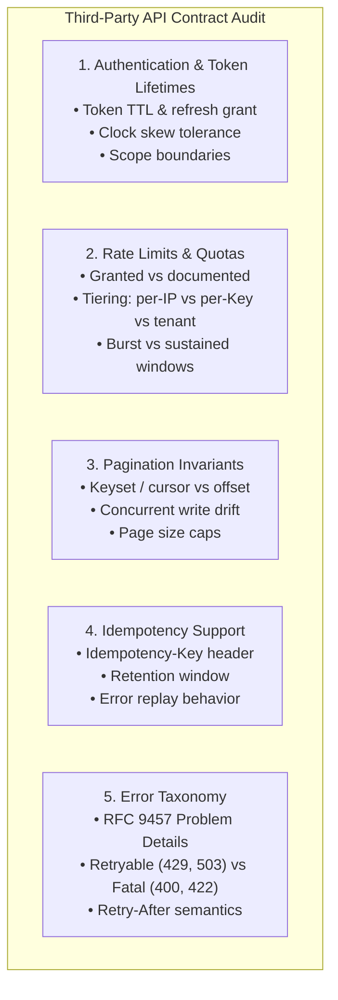
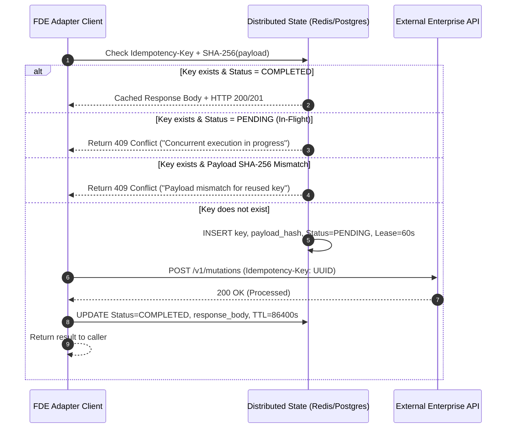
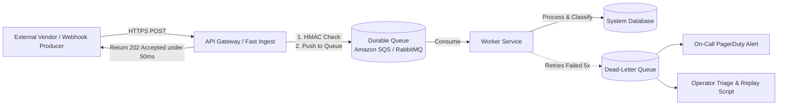

# APIs and Integrations: Enterprise Resilience, Auth, and Contract Safety

This guide provides the authoritative engineering playbook for Forward Deployed Engineers (FDEs) building the integration layer of customer deployments: the mission-critical boundary where your platform communicates with third-party, legacy, and vendor systems you do not own and cannot modify. 

Integration engineering appears in **64.0% of verified FDE job postings** across our empirical 146-posting dataset (scraped February–July 2026), ranking second only to building production systems. Customer systems are rigid, unyielding, and prone to unannounced changes; your integration layer must be fault-tolerant, self-healing, and contract-safe by design.

---

## 1. Auditing Third-Party API Contracts

Never write the happy path before auditing the failure modes. When interfacing with external enterprise APIs (e.g., Salesforce, SAP, Epic EHR, Core Banking APIs, or custom customer microservices), extract and document five non-negotiable contract dimensions during Week 1:



### Pre-Flight Contract Discovery Checklist

Before writing adapter code, obtain verified answers to these five architectural questions:
1. **Granted Quotas vs Documented Limits**: Does the customer's enterprise subscription have higher or lower rate limits than the vendor's public documentation? (In enterprise SaaS, enterprise tenants frequently have bespoke rate tiers or shared gateway pools).
2. **Idempotency Semantics**: Does the mutation endpoint (`POST`, `PATCH`) natively support deduplication headers (`Idempotency-Key`)? If not, what unique business key (e.g., `transaction_id`, `claim_number`) can be used for client-side locking?
3. **Cursor Invalidation on Mutation**: When paginating large collections, do records inserted during the scan shift offset pagination or invalidate cursor tokens?
4. **Error Payloads**: Does the API return standard RFC 9457 Problem Details, or does it return `200 OK` with `{"status": "error", "message": "..."}`?
5. **Sandbox Fidelity**: Does the staging/sandbox environment enforce the exact same rate limits, auth flows, and schema validation rules as production? (Assume it does not until verified).

---

## 2. Resilience Engineering & Mathematical Backoff

When an upstream dependency browns out, naive retry loops unleash a **retry storm** (thundering herd problem) that multiplies load, exhaust connection pools, and ensures the dependency cannot recover.

### The Mathematics of Jittered Backoff

In production distributed systems, standard exponential backoff without randomness synchronizes failed clients into periodic collision waves. Following research by Marc Brooker (AWS Architecture Blog), jitter breaks this synchronization:

1. **No Jitter (Dangerous)**:
   $$T_{\text{sleep}} = \min(T_{\text{max}}, T_{\text{base}} \times 2^{\text{attempt}})$$
   *Result*: All workers retry simultaneously in lockstep, repeatedly knocking down the recovering server.

2. **Full Jitter (Recommended for Enterprise Egress)**:
   $$T_{\text{sleep}} = \text{Uniform}\left(0, \min\left(T_{\text{max}}, T_{\text{base}} \times 2^{\text{attempt}}\right)\right)$$
   *Result*: Minimizes total client work and spreads retry attempts uniformly across the time horizon.

3. **Decorrelated Jitter (Alternative for Variable Latencies)**:
   $$T_{\text{sleep}} = \min\left(T_{\text{max}}, \text{Uniform}\left(T_{\text{base}}, T_{\text{prev}} \times 3\right)\right)$$
   *Result*: Reduces queueing latency variance when calls have short tail latencies.

### Production Resilient Client Pattern

The following implementation represents the enterprise standard for outbound HTTP calls, featuring **Full Jitter**, `Retry-After` header parsing (supporting both delta-seconds and RFC 1123 HTTP-dates), and deterministic error classification.

See the complete unit-tested reference implementation in [`interviews/code/resilient_client.py`](file:///c:/Users/Adil/Downloads/FDE-Field-Guide-main/interviews/code/resilient_client.py):

```python
"""
Resilient API Client with Exponential Backoff, Full Jitter, and Retry-After Handling.
Reference: Marc Brooker (AWS), RFC 9110 (HTTP Semantics), RFC 9457.
"""

import email.utils
import random
import time
from typing import Any, Callable, Dict, Optional, Tuple


class TransientIntegrationError(Exception):
    """Retryable: 429 Too Many Requests, 502/503/504 Gateways, timeouts."""
    pass


class FatalIntegrationError(Exception):
    """Unretryable: 400 Bad Request, 401 Unauthorized, 403 Forbidden, 422 Unprocessable."""
    pass


class ResilientHTTPClient:
    """
    Production-grade HTTP caller enforcing jittered backoff and quota safety.
    """

    def __init__(
        self,
        base_delay_sec: float = 0.5,
        max_delay_sec: float = 30.0,
        max_retries: int = 4,
        sleep_func: Optional[Callable[[float], None]] = None,
        random_func: Optional[Callable[[float, float], float]] = None,
    ):
        self.base_delay_sec = base_delay_sec
        self.max_delay_sec = max_delay_sec
        self.max_retries = max_retries
        self.sleep_func = sleep_func or time.sleep
        self.random_func = random_func or random.uniform

    def parse_retry_after(self, retry_after_header: Optional[str]) -> Optional[float]:
        """
        Parses standard RFC 9110 Retry-After header:
        - Delta-seconds: '120'
        - HTTP-date: 'Fri, 31 Dec 2026 23:59:59 GMT'
        """
        if not retry_after_header:
            return None
        retry_after_header = retry_after_header.strip()
        try:
            # Check for integer/float delta-seconds
            return max(0.0, float(retry_after_header))
        except ValueError:
            pass

        try:
            # Parse RFC 1123 HTTP-date
            parsed_date = email.utils.parsedate_to_datetime(retry_after_header)
            delay = parsed_date.timestamp() - time.time()
            return max(0.0, delay)
        except Exception:
            return None

    def calculate_backoff(self, attempt: int, retry_after: Optional[float] = None) -> float:
        """
        Calculates Full Jitter sleep duration or respects upstream Retry-After.
        """
        if retry_after is not None and retry_after > 0:
            # Cap upstream Retry-After to prevent malicious/accidental denial of service
            return min(self.max_delay_sec, retry_after)

        ceiling = min(self.max_delay_sec, self.base_delay_sec * (2 ** attempt))
        return self.random_func(0.0, ceiling)

    def execute_with_retry(
        self,
        request_fn: Callable[[], Tuple[int, Dict[str, str], Any]],
    ) -> Tuple[Any, int]:
        """
        Executes request_fn which returns (status_code, headers_dict, response_body).
        Retries transient failures with Full Jitter; halts on fatal errors.
        """
        attempt = 0
        while True:
            try:
                status_code, headers, body = request_fn()

                # Success
                if 200 <= status_code < 300:
                    return body, attempt + 1

                # Transient rate limit or server brownout
                if status_code in (408, 429, 500, 502, 503, 504):
                    if attempt >= self.max_retries:
                        raise TransientIntegrationError(
                            f"HTTP {status_code}: Retry budget exhausted ({self.max_retries} retries)"
                        )
                    retry_after = self.parse_retry_after(headers.get("Retry-After"))
                    delay = self.calculate_backoff(attempt, retry_after)
                    self.sleep_func(delay)
                    attempt += 1
                    continue

                # Unretryable client errors (Bad Request, Auth, Unprocessable)
                raise FatalIntegrationError(
                    f"HTTP {status_code}: Fatal client error. Response: {body}"
                )

            except (TimeoutError, ConnectionResetError) as net_err:
                if attempt >= self.max_retries:
                    raise TransientIntegrationError(f"Network failure exhausted retries: {net_err}")
                delay = self.calculate_backoff(attempt)
                self.sleep_func(delay)
                attempt += 1
```

---

## 3. Enterprise Idempotency Engine

In distributed systems, networks are unreliable: a request may successfully execute on the remote server, but the network connection drops before the client receives the acknowledgment. If the client retries naively, duplicate payments are charged, duplicate claims are generated, or records are duplicated.

### The Stripe-Standard Idempotency-Key Protocol

The industry standard for state-changing integration calls (`POST`, `PATCH`, `DELETE`) is the `Idempotency-Key` protocol:



### Idempotent Receiver Implementation

See the full verified implementation in [`interviews/code/webhook_receiver.py`](file:///c:/Users/Adil/Downloads/FDE-Field-Guide-main/interviews/code/webhook_receiver.py) and production usage in [`portfolio/reference-project/src/api/server.py`](file:///c:/Users/Adil/Downloads/FDE-Field-Guide-main/portfolio/reference-project/src/api/server.py):

```python
"""
Idempotency state machine tracking transitions: PENDING -> COMPLETED | FAILED.
Detects payload parameter drift and prevents concurrent execution stampedes.
"""

import hashlib
import json
import time
from dataclasses import dataclass
from enum import Enum
from typing import Any, Callable, Dict, Optional, Tuple


class ProcessingState(str, Enum):
    PENDING = "PENDING"
    COMPLETED = "COMPLETED"
    FAILED = "FAILED"


@dataclass
class ExecutionRecord:
    state: ProcessingState
    payload_hash: str
    response: Optional[Dict[str, Any]]
    created_at: float
    updated_at: float


class IdempotencyEngine:
    def __init__(self, ttl_seconds: int = 86400):
        self.ttl_seconds = ttl_seconds
        self._store: Dict[str, ExecutionRecord] = {}

    def _hash_payload(self, payload: Dict[str, Any]) -> str:
        # Canonical JSON serialization ensures key order does not alter the checksum
        serialized = json.dumps(payload, sort_keys=True)
        return hashlib.sha256(serialized.encode("utf-8")).hexdigest()

    def process(
        self,
        idempotency_key: str,
        payload: Dict[str, Any],
        handler: Callable[[Dict[str, Any]], Dict[str, Any]],
    ) -> Tuple[int, Dict[str, Any]]:
        if not idempotency_key:
            return 400, {"error": "Missing required Idempotency-Key"}

        now = time.time()
        payload_hash = self._hash_payload(payload)

        # Check existing execution state
        if idempotency_key in self._store:
            record = self._store[idempotency_key]

            # Rule 1: Parameter tampering / mismatch detection
            if record.payload_hash != payload_hash:
                return 409, {
                    "error": "Idempotency key reused with conflicting payload",
                    "idempotency_key": idempotency_key,
                }

            # Rule 2: In-flight concurrency lock
            if record.state == ProcessingState.PENDING:
                return 409, {
                    "error": "Concurrent request in progress for this idempotency key",
                    "status": "in_flight",
                }

            # Rule 3: Replay cached terminal response
            if record.state == ProcessingState.COMPLETED:
                return 200, {
                    "status": "cached_idempotent_replay",
                    "result": record.response,
                }

        # Acquire lock (Atomic SETNX with TTL in production Redis/Postgres)
        self._store[idempotency_key] = ExecutionRecord(
            state=ProcessingState.PENDING,
            payload_hash=payload_hash,
            response=None,
            created_at=now,
            updated_at=now,
        )

        try:
            result = handler(payload)
            self._store[idempotency_key].state = ProcessingState.COMPLETED
            self._store[idempotency_key].response = result
            self._store[idempotency_key].updated_at = time.time()
            return 200, {"status": "executed", "result": result}
        except Exception as exc:
            self._store[idempotency_key].state = ProcessingState.FAILED
            self._store[idempotency_key].updated_at = time.time()
            return 500, {"error": "Execution failed", "details": str(exc)}
```

---

## 4. Enterprise Auth Patterns & Credential Lifecycles

Enterprise machine-to-machine integrations must adhere to the principle of zero static credentials in source code or persistent configuration.

### 1. OAuth 2.0 Client Credentials Grant (RFC 6749 Section 4.4)

The gold standard for service-to-service communication.
- **Anti-Pattern**: Fetching a new bearer token on every outbound request. This wastes 100–300ms of latency per call and quickly exhausts the identity provider's token endpoint rate limits.
- **Production Standard**: Proactive in-memory/Redis token caching with an **85% TTL renewal safety threshold**:

```python
"""
Thread-safe OAuth2 Token Manager with proactive TTL renewal.
"""

import threading
import time
from typing import Dict, Optional


class OAuth2TokenManager:
    def __init__(self, client_id: str, client_secret: str, token_url: str):
        self.client_id = client_id
        self.client_secret = client_secret
        self.token_url = token_url
        self._access_token: Optional[str] = None
        self._expires_at: float = 0.0
        self._lock = threading.Lock()

    def _fetch_new_token(self) -> Dict[str, Any]:
        # Simulated POST to token_url with grant_type=client_credentials
        # In real systems, use requests.post or httpx.post
        return {
            "access_token": f"tok_{int(time.time())}",
            "expires_in": 3600,  # 1 hour
            "token_type": "Bearer",
        }

    def get_token(self) -> str:
        """
        Returns cached valid token. Proactively refreshes if remaining lifetime < 15%.
        """
        now = time.time()
        # Fast read without lock if token is safely valid
        if self._access_token and (self._expires_at - now) > 300:  # 5 min buffer
            return self._access_token

        with self._lock:
            # Double-checked locking
            if self._access_token and (self._expires_at - time.time()) > 300:
                return self._access_token

            data = self._fetch_new_token()
            self._access_token = data["access_token"]
            expires_in = float(data.get("expires_in", 3600))
            # Proactive renewal at 85% of TTL
            self._expires_at = time.time() + (expires_in * 0.85)
            return self._access_token
```

### 2. Mutual TLS (mTLS)

Common in tier-1 financial institutions (GLBA) and healthcare (HIPAA):
- Both client and server validate cryptographic X.509 certificates during the TLS handshake.
- Private keys must be stored in secure hardware (AWS CloudHSM, KMS, or HashiCorp Vault).
- **Operational Requirement**: Establish an automated certificate rotation alert at 60, 30, and 7 days prior to certificate expiry. An expired mTLS certificate causes a hard total outage.

### 3. Cloud Workload Identity Federation

Avoid long-lived API keys wherever possible by utilizing native cloud workload identities:
- **AWS**: IAM Roles for Service Accounts (IRSA) / ECS Task Roles.
- **GCP**: Workload Identity Federation via OIDC tokens.
- **Azure**: Managed Service Identity (MSI).

---

## 5. Webhook Ingestion & Durable Event Delivery

Customer integrations frequently rely on webhooks for near-real-time synchronization (e.g., Zendesk ticket creation, Stripe payment updates, Epic EHR event notifications).

### Webhooks vs Polling: Architectural Trade-Off Matrix

| Evaluation Dimension | Inbound Webhooks (Push) | Scheduled Polling (Pull) |
| :--- | :--- | :--- |
| **Data Freshness / Latency** | Near real-time (sub-second to few seconds). | High staleness (bounded by polling interval, e.g., 5–60 min). |
| **Network & Firewall Ingress** | Requires public HTTPS endpoint or reverse proxy (AWS API Gateway). | Zero inbound firewall openings; outbound HTTPS egress only. |
| **Load Distribution** | Burst-heavy; spikes during enterprise business peak hours. | Predictable, paced load governed by client token bucket. |
| **Reliability & Delivery** | At-least-once delivery; vendor drops events on target timeout. | Fully deterministic state reconciliation across watermarks. |
| **Recommended FDE Pattern** | **Hybrid**: Webhooks for real-time trigger + nightly reconciliation poll. |

### Webhook Security: HMAC-SHA256 Verification & Replay Defense

Inbound webhook endpoints are publicly addressable and must authenticate payloads before executing any business logic.

```python
"""
HMAC-SHA256 Webhook Verification with anti-replay timestamp window.
"""

import hmac
import hashlib
import time
from typing import Dict, Any


def verify_webhook_signature(
    raw_payload_bytes: bytes,
    signature_header: str,
    secret_key: str,
    tolerance_seconds: int = 300,
) -> bool:
    """
    Validates HMAC signature and timestamp header to defend against replay attacks.
    Example header format: t=1774182900,v1=9b7c84...
    """
    if not signature_header:
        return False

    elements = dict(item.split("=", 1) for item in signature_header.split(",") if "=" in item)
    timestamp_str = elements.get("t")
    received_signature = elements.get("v1")

    if not timestamp_str or not received_signature:
        return False

    # Anti-replay timestamp tolerance check (prevent replay of old captured requests)
    try:
        timestamp = float(timestamp_str)
        current_time = time.time()
        if abs(current_time - timestamp) > tolerance_seconds:
            return False  # Request is too old or from future
    except ValueError:
        return False

    # Compute expected HMAC on: timestamp + "." + raw_payload
    signed_payload = f"{timestamp_str}.".encode("utf-8") + raw_payload_bytes
    expected_signature = hmac.new(
        secret_key.encode("utf-8"),
        signed_payload,
        hashlib.sha256,
    ).hexdigest()

    # Timing-safe comparison prevents side-channel timing attacks
    return hmac.compare_digest(expected_signature, received_signature)
```

### Decoupled Ingestion & Dead-Letter Queue (DLQ) Architecture

Never execute heavy data processing, LLM calls, or third-party downstream writes inside the synchronous webhook handler:



---

## 6. Boundary Validation & Contract Safety

Third-party APIs evolve without notice: fields are renamed, nullability invariants are broken, and unexpected nested structures appear.

### Strict Pydantic V2 Boundary Parsing

Every incoming payload must be validated into an immutable domain schema at the system boundary.

```python
"""
Pydantic V2 Boundary Model with strict types and schema drift isolation.
"""

from typing import List, Optional
from pydantic import BaseModel, ConfigDict, Field, field_validator


class ExternalCustomerPayload(BaseModel):
    model_config = ConfigDict(
        strict=True,  # Prevent silent coercion of strings into ints
        extra="ignore",  # Absorb unmodeled upstream fields without crashing
        frozen=True,  # Immutable data record
    )

    ticket_id: str = Field(..., min_length=3, max_length=64)
    severity: str = Field(..., pattern=r"^(CRITICAL|HIGH|MEDIUM|LOW)$")
    customer_tier: str = Field(default="STANDARD")
    impact_amount_cents: int = Field(..., ge=0)
    raw_tags: List[str] = Field(default_factory=list)

    @field_validator("ticket_id")
    @classmethod
    def validate_ticket_format(cls, v: str) -> str:
        if not v.isalnum() and "-" not in v:
            raise ValueError("ticket_id must be alphanumeric with hyphens")
        return v
```

### Automated Contract Testing in CI/CD

Prevent upstream drift from causing production outages by running **Contract Tests** on a daily cron in GitHub Actions:
- Use **Schemathesis** or **Prism** to generate automated property-based test suites against the vendor's published OpenAPI 3.1 schema.
- Assert that all required vendor fields are present, response types have not changed, and status codes match the documented specification.
- If upstream releases an unannounced breaking change, the CI contract test fails and notifies the FDE before customer users encounter a production exception.

## 7. Enterprise ERP and SAP Integration Architecture

In enterprise deployments, forward deployed engineers rarely integrate with modern GraphQL or clean REST microservices. Over 70% of Fortune 500 manufacturing, logistics, and retail firms run their core business operations on enterprise resource planning (ERP) platforms, predominantly SAP S/4HANA, SAP ECC, Oracle NetSuite, and Microsoft Dynamics 365.

### The four SAP integration protocols

When connecting an AI application or agent pipeline to an enterprise SAP environment, choose the protocol matching the interaction pattern:

1. BAPI (Business Application Programming Interface) and RFC (Remote Function Call) - Synchronous, transactional function modules executed over SAP proprietary binary protocol or HTTPS via SAP NetWeaver RFC SDK. Essential for transactional mutations:
   - `BAPI_ALM_ORDER_MAINTAIN` - Creating and updating Plant Maintenance (PM) and Customer Service (CS) work orders.
   - `BAPI_MATERIAL_AVAILABILITY` - Real-time stock checks across plant storage locations.
   - `BAPI_EQUIPMENT_GETDETAIL` - Retrieving technical equipment specifications and functional locations.
2. OData (Open Data Protocol) - RESTful HTTP/JSON interfaces exposing SAP Core Data Services (CDS) views. Recommended for real-time reads, customer portal integrations, and lightweight writes:
   - `API_EQUIPMENT` - Standard entity set for equipment master data lookup.
   - `API_MAINTENANCENOTIFICATION` - Ingesting service complaints and customer notifications.
3. IDocs (Intermediate Documents) - Asynchronous message containers transmitted over RFC or HTTPS. Used for asynchronous event replication, high-latency batch integration, and EDI document exchange.
4. SAP CPI (Cloud Platform Integration / SAP Integration Suite) - Enterprise middleware proxy sitting between customer network perimeters and the SAP core. Handles message transformation, authentication token mediation, routing, and rate limiting.

### Core SAP modules for forward deployed engineers

FDEs do not need full SAP functional consultant certification, but must understand module data ownership:

- SAP PM (Plant Maintenance) - Manages physical asset maintenance. Master data includes Equipment (`IE01`/`IE03`) and Functional Locations (`IL01`). Operational transactions include Maintenance Notifications (`IW51`) and Maintenance Orders (`IW31`/`IW32`/`IW33`).
- SAP CS (Customer Service) - Manages after-sales service for external customer equipment, warranty contracts, service level agreements, and billing.
- SAP MM (Materials Management) - Manages spare parts inventory. Core transactions include Material Reservations (`MB21`), Goods Issue (`MB1A`), and Stock Overview (`MMBE`).

### Architectural invariants for ERP safety

To protect customer core financial and operational systems of record:

- Never execute direct SQL queries against underlying SAP database tables (`AFKO`, `EQUI`, `MARA`, `VBAK`). Direct writes corrupt transactional integrity and void vendor enterprise support contracts.
- Isolate ERP mutations behind a durable retry queue. If SAP CPI or RFC gateways experience lock contention, the integration layer must queue the work order in Redis with exponential backoff rather than failing the customer request.
- Enforce business validation before ERP submission. Verify customer credit status, spare parts reservation flags, and equipment functional location compatibility in the application layer before executing the BAPI call.

---

## 8. Pre-Launch Integration Checklist

Before declaring any customer integration production-ready, verify every item on this audit:

- [ ] **Explicit Outbound Timeouts**: Every outbound HTTP/gRPC call sets distinct `connect_timeout` (e.g., 3.0s) and `read_timeout` (e.g., 10.0s). Zero unbounded timeouts exist in code.
- [ ] **Jittered Backoff**: All transient retries implement Exponential Backoff with Full Jitter and a strict retry cap ($\le 4$ retries).
- [ ] **Unretryable Error Isolation**: Non-transient 4xx errors (400, 401, 403, 404, 422) fail fast immediately without retrying.
- [ ] **Deduplication & Idempotency**: All mutation calls generate stable idempotency keys; in-memory/Redis state deduplicates duplicate requests within an 86,400s (24h) window.
- [ ] **Client-Side Rate Pacing**: Egress traffic is rate-limited client-side (Token Bucket or Leaky Bucket) to stay safely beneath the customer's *granted* quota.
- [ ] **Proactive Token Renewal**: OAuth 2.0 access tokens are cached and proactively renewed at 85% of their lifetime, preventing token expiry mid-flight.
- [ ] **Timing-Safe Webhook Signatures**: All inbound webhooks verify HMAC-SHA256 signatures via `hmac.compare_digest` with an anti-replay timestamp tolerance window ($\le 300\text{s}$).
- [ ] **Asynchronous Ingestion**: Inbound webhook endpoints return `202 Accepted` within 50ms and delegate work to a durable queue.
- [ ] **Dead-Letter Queue Runbook**: A designated DLQ captures poison pills after max delivery attempts, paired with an active alert and a documented replay runbook.
- [ ] **Circuit Breakers on Degraded Upstreams**: Integration calls to volatile customer dependencies are protected by circuit breakers that fail fast during prolonged outages.

---

## 9. Failure Scenarios & Chaos Runbooks

| Incident Scenario | Root Cause | Immediate Mitigation Protocol |
| :--- | :--- | :--- |
| **Upstream 429 Cascade Storm** | Vendor reduced burst quota; multiple background workers retrying simultaneously. | 1. Enable client-side backpressure flag.<br>2. Halve max worker concurrency.<br>3. Inspect `Retry-After` response headers.<br>4. Open emergency quota expansion ticket with vendor account team. |
| **Payload Schema Drift Outage** | Vendor updated API schema without versioning; boundary validator rejecting payloads. | 1. Triage rejected payloads in Dead-Letter Queue.<br>2. Update Pydantic boundary model to accommodate new field structure.<br>3. Deploy adapter hotfix.<br>4. Replay quarantined payloads from DLQ. |
| **Expired mTLS / Auth Certificate** | Customer internal PKI certificate expired; all mutual TLS handshakes failing. | 1. Confirm handshake error via `openssl s_client -connect <host>:<port> -cert client.crt`.<br>2. Notify customer InfoSec/PKI on-call with certificate thumbprint.<br>3. Deploy updated certificate secret via Vault/Secrets Manager.<br>4. Re-enable traffic. |
| **Webhook Ingestion Backlog** | Downstream worker pool saturated; inbound webhook queue depth growing linearly. | 1. Scale consumer worker replicas.<br>2. Verify DB connection pool headroom.<br>3. Enable batch processing on queue consumer.<br>4. Verify message retention period on queue is $\ge 7$ days to prevent message loss. |

---

## 10. Related System Documents

- [Reference Architectures](../system-design/02-reference-architectures.md) - Architectural topologies for customer deployment boundaries.
- [Security and Compliance](05-security-and-compliance.md) - Enterprise secret storage, KMS policies, and InfoSec reviews.
- [Data Pipelines](03-data-pipelines.md) - Batch ETL and streaming synchronization patterns across legacy schemas.
- [Debugging Customer Systems](../troubleshooting/02-debugging-customer-systems.md) - Triaging failures when logs span external network boundaries.
- [Production Readiness Checklist](../deployment/03-production-readiness-checklist.md) - The final operational gate before customer sign-off.
- [Enterprise Manufacturing Field Study](../case-studies/05-enterprise-manufacturing-vaayu-pumps.md) - Real-world SAP S/4HANA PM/CS integration in production.

---

## 11. Primary Engineering Literature

1. **Marc Brooker (AWS Architecture)**: *"Exponential Backoff And Jitter"*. Empirical proof and analysis of Full Jitter vs Decorrelated Jitter algorithms in distributed systems.
2. **Stripe Engineering**: *"Designing Robust APIs with Idempotency"*. The reference standard for `Idempotency-Key` headers, distributed locking, and replay semantics.
3. **IETF RFC 9457**: *"Problem Details for HTTP APIs"*. Standardized format for machine-readable error reporting in RESTful integrations.
4. **IETF RFC 9110**: *"HTTP Semantics"*. Specification for HTTP status codes, headers, and `Retry-After` syntax.
5. **IETF RFC 6749**: *"The OAuth 2.0 Authorization Framework"*. Section 4.4: Client Credentials Grant specification.
6. **Dan McKinley**: *"Choose Boring Technology"*. Architectural conservatism in external integration layers.
7. **Empirical Job Market Analysis (2026)**: Independent audit of 146 deduplicated FDE job postings showing **64.0% demand for API and integration engineering**.
8. **SAP SE**: *SAP Plant Maintenance Function Modules and BAPI Reference* (help.sap.com). Transactional interfaces for maintenance notifications and work order execution.
