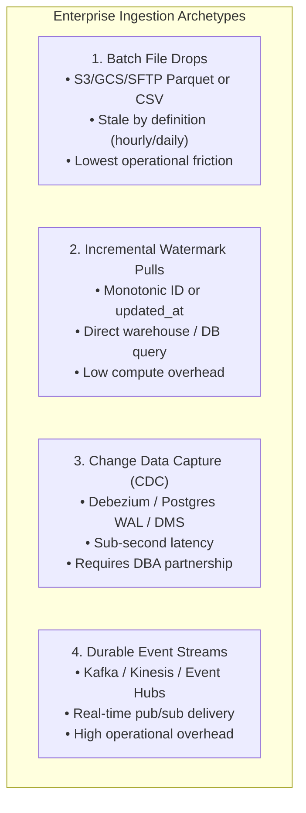
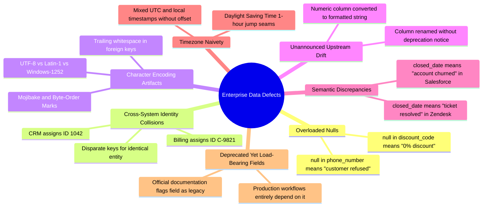
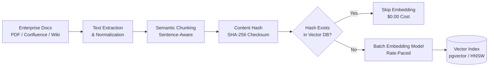

# Data Pipelines in Customer Environments: Ingestion, Profiling, and Vector ETL

This guide provides the authoritative engineering playbook for Forward Deployed Engineers (FDEs) architecting, building, and operating data pipelines across customer infrastructure.

In enterprise software and AI deployments, the overwhelming majority of engineering cycle time is absorbed not by model fine-tuning or prompt design, but by **data discovery, ingestion plumbing, schema normalization, and quality triage**. Paul Farnsworth, President of Dice, observed in *Fortune* (September 2026) that enterprises struggle to operationalize advanced systems because connecting them to *"proprietary data, existent systems and specific workflows"* remains the single greatest bottleneck, emphasizing that forward-deployed engineers *"can help fill that gap."*

---

## 1. The Enterprise Data Readiness Gap

When entering a customer estate, documentation is rarely current, data dictionaries are aspirational, and access is tightly restricted by Information Security policies. Customer data environments suffer from three structural realities:

1. **Fragmented Silos**: Operational data of record resides in legacy OLTP systems (Oracle, DB2, mainframe flat files), while analytics data sits in cloud data warehouses (Snowflake, BigQuery, Databricks), and unstructured documents are locked in SharePoint, Confluence, or S3 buckets.
2. **Zero Inherent Cleanliness**: Production enterprise data contains semantic nulls, character encoding collisions, duplicate entities minted across disparate business units, and undocumented schema migrations.
3. **Strict Egress Governance**: Under GDPR, HIPAA, and GLBA regulations, sensitive personal data (PII) and protected health information (PHI) cannot leave the customer's Virtual Private Cloud (VPC) without explicit compliance approval.

---

## 2. The 6-Dimension Data Discovery Inventory

The first non-negotiable data milestone in any FDE deployment is **read access to real, production-shaped sample data**. Synthetic mocks designed in isolation conceal the edge cases that crash production pipelines.

During Week 1 of discovery, construct and sign off on the formal **Enterprise Data Inventory**:

| Inventory Dimension | Production Assessment Criteria | Operational Impact |
| :--- | :--- | :--- |
| **1. Source System & Topology** | System of record (OLTP), read-replica, analytics warehouse, or export dump. | Determines read query performance impact and transaction locking risks. |
| **2. System Ownership & SLA** | Designated customer technical owner and database administrator (DBA). | Point of contact for connection credentials, firewall peering, and schema change notifications. |
| **3. Volume & Velocity** | Total historical volume (GB/TB), daily record delta, and peak write rates. | Dictates batch vs streaming architecture, network bandwidth, and memory sizing. |
| **4. PII/PHI Classification** | Explicit field-by-field audit (SSN, credit card, patient MRN, email, salary). | Dictates in-VPC masking, tokenization, or strict zero-egress architecture. |
| **5. Freshness & Ingestion Path** | Real-time CDC, hourly micro-batch, nightly batch, or weekly export. | Establishes end-to-end data latency SLAs for user-facing features. |
| **6. Egress & Access Protocol** | VPC Peering, AWS PrivateLink, SFTP drop, or authenticated REST/GraphQL API. | Sets network ingress topology and mutual TLS certificate requirements. |

---

## 3. The 4 Canonical Ingestion Patterns

Choose the ingestion pattern that matches the customer's operational maturity, latency tolerance, and security posture:



### Pattern 1: Batch File Drops (S3 / GCS / SFTP)
- **Mechanism**: Upstream scheduled jobs drop CSV, Parquet, or JSON Lines files into an object storage bucket or secure SFTP drop.
- **When to Use**: When source databases cannot accept direct queries, customer operations teams require a hard decouple, or near-real-time updates are unnecessary.
- **Engineering Invariants**:
  - Always validate file checksums (`MD5` or `SHA-256`) against a manifest file before initiating ingestion.
  - Stream large files in memory-bounded chunks (`pandas.read_csv(chunksize=10000)` or PySpark streaming) to prevent Out-Of-Memory (OOM) crashes on container workers.
  - Treat file names as immutable; write to unique date-partitioned prefixes (`s3://bucket/raw/year=2026/month=03/day=15/`).

### Pattern 2: Incremental High-Watermark Pulls
- **Mechanism**: The pipeline periodically queries the source database for records where `updated_at > :last_watermark` or `id > :last_seen_id`.
- **When to Use**: Direct read-replica access is granted, write volumes are moderate ($\le 500\text{k records/day}$), and the schema contains reliable audit timestamps.
- **Engineering Invariants**:
  - **Clock Skew Safety Window**: Always subtract an overlap safety margin (e.g., 5 minutes: `WHERE updated_at >= (:last_watermark - INTERVAL '5 minutes')`) to account for long-running uncommitted transactions that commit with an earlier timestamp.
  - **Transactional Checkpointing**: Commit the newly observed high-watermark in the same database transaction as the loaded target records. If the load fails, the watermark does not advance.

### Pattern 3: Change Data Capture (CDC)
- **Mechanism**: Ingestion engine (e.g., Debezium, AWS Database Migration Service) reads the database write-ahead log (Postgres WAL, MySQL binlog, Oracle GoldenGate) and streams row-level `INSERT`, `UPDATE`, and `DELETE` events.
- **When to Use**: Sub-minute freshness is mandatory and source DBAs approve replication slot configuration.
- **Engineering Invariants**:
  - Requires handling `DELETE` events (tombstones) explicitly downstream.
  - Must account for replication lag and WAL disk accumulation if the consumer stalls.

### Pattern 4: Durable Event Streams
- **Mechanism**: Consuming directly from customer message buses (Apache Kafka, AWS Kinesis, RabbitMQ).
- **When to Use**: Customer architecture already routes domain events across a mature event bus.
- **Engineering Invariants**:
  - Assign deterministic partition keys (e.g., `tenant_id` or `customer_id`) to preserve strict per-entity ordering.
  - Implement client-side backpressure: pause partition polling when downstream processing queues exceed high-watermark thresholds.

---

## 4. Data Quality Triage & Defect Classification

Profile representative data immediately upon access. Written quality thresholds convert subjective "bad data" complaints into concrete, automated integration gates.

### The 7 Classic Enterprise Data Defects



### Automated Validation & Dead-Letter Quarantine Engine

Never permit malformed records to crash an entire batch job. Implement strict boundary validation with a **Dead-Letter Quarantine**: valid records proceed to transformation, while invalid records are routed to an isolated quarantine table with error diagnostic metadata.

```python
"""
Enterprise Batch Validation and Quarantine Ingestion Engine.
Enforces Pydantic V2 schemas with row-level error isolation.
"""

import json
import logging
from datetime import datetime
from typing import Any, Dict, List, Optional, Tuple
from pydantic import BaseModel, ConfigDict, Field, ValidationError

logger = logging.getLogger("DataPipeline")


class CustomerAccountRecord(BaseModel):
    model_config = ConfigDict(strict=True, extra="forbid")

    account_id: str = Field(..., min_length=5, max_length=32)
    company_name: str = Field(..., min_length=1)
    annual_contract_value: float = Field(..., ge=0.0)
    created_at_utc: datetime
    is_active: bool = Field(default=True)
    contact_email: Optional[str] = Field(default=None)


class PipelineIngestionEngine:
    """
    Ingests batch records, validating schema conformity and routing
    corrupt records to quarantine storage without halting execution.
    """

    def __init__(self, failure_threshold_pct: float = 5.0):
        self.failure_threshold_pct = failure_threshold_pct

    def process_raw_batch(
        self,
        raw_rows: List[Dict[str, Any]],
        batch_id: str,
    ) -> Tuple[List[CustomerAccountRecord], List[Dict[str, Any]]]:
        valid_records: List[CustomerAccountRecord] = []
        quarantine_records: List[Dict[str, Any]] = []

        for idx, row in enumerate(raw_rows):
            try:
                # Validate against strict domain model
                record = CustomerAccountRecord.model_validate(row)
                valid_records.append(record)
            except ValidationError as val_err:
                # Capture quarantine record with detailed diagnostic context
                quarantined_item = {
                    "batch_id": batch_id,
                    "row_index": idx,
                    "raw_payload": row,
                    "validation_errors": val_err.errors(),
                    "quarantined_at": datetime.utcnow().isoformat(),
                }
                quarantine_records.append(quarantined_item)
                logger.warning("Row %d failed schema validation: %s", idx, val_err.errors())

        # Circuit breaker: abort batch if defect rate exceeds agreed SLA
        total_count = len(raw_rows)
        if total_count > 0:
            error_rate = (len(quarantine_records) / total_count) * 100.0
            if error_rate > self.failure_threshold_pct:
                raise ValueError(
                    f"Batch {batch_id} aborted: error rate {error_rate:.2f}% "
                    f"exceeds critical threshold {self.failure_threshold_pct}%"
                )

        return valid_records, quarantine_records
```

---

## 5. Data Minimization & In-VPC Privacy Hardening

Sensitive enterprise data must be minimized before reaching secondary storage or inference pipelines:

1. **Scoping at Ingestion**: PII/PHI not strictly required for the business feature must be dropped at the extraction boundary. Never load unneeded columns into staging tables with the plan to "filter them later."
2. **In-VPC Transformation (Zero-Egress)**:
   - When integrating with customer data warehouses (Snowflake, BigQuery, PostgreSQL), execute heavy transforms in-place using warehouse compute (ELT).
   - Sensitive raw data never leaves the customer's security boundary. Only synthesized outputs, aggregates, or anonymized embeddings cross network perimeters.
3. **Anonymization & Pseudonymization**:
   - Hash primary keys (`SHA-256(customer_ssn + enterprise_salt)`) to generate persistent join tokens while obscuring direct identifiers.
   - Strip unstructured PII (names, phone numbers, addresses) from free-form text using local in-VPC named-entity recognition (Microsoft Presidio or regex redaction engines).

---

## 6. Vector ETL Pipelines for Enterprise RAG

Retrieval-Augmented Generation (RAG) systems require a dedicated data pipeline to transform unstructured documents into queryable dense vector indexes.



### The Vector Ingestion Lifecycle

1. **Text Extraction & Normalization**:
   - Extract raw text from PDFs, Word documents, Markdown, and HTML.
   - Clean non-printing control characters, decode HTML entities, and normalize Unicode (`unicodedata.normalize('NFKC', text)`).
2. **Deterministic Semantic Chunking**:
   - Respect natural paragraph and sentence boundaries rather than cutting arbitrarily at character offsets.
   - Maintain sliding token overlap to preserve semantic context across chunk seams.
   - See the verified reference implementation in [`interviews/code/chunker.py`](file:///c:/Users/Adil/Downloads/FDE-Field-Guide-main/interviews/code/chunker.py).
3. **Content Hashing for Incremental Re-Indexing**:
   - Embedding API calls (OpenAI `text-embedding-3-large`, Cohere Embed) incur latency and direct dollar costs.
   - Compute `SHA-256(chunk_text + chunk_metadata)` for each chunk. If the checksum already exists in the vector database, skip re-embedding.
   - When a source document is updated, re-embed only the modified chunks; when a document is deleted, prune all associated vectors via metadata filtering (`doc_id = :deleted_id`).
4. **Vector Database Indexing**:
   - In enterprise estates, prefer native database vector extensions like **`pgvector`** over separate standalone vector databases whenever PostgreSQL is already operated by the customer team.
   - Use HNSW (Hierarchical Navigable Small World) indexes for low-latency similarity search with cosine distance (`vector_cosine_ops`).

---

## 7. Pipeline Failure Modes & Self-Healing Runbooks

| Pipeline Incident | Root Cause | Engineering Mitigation Protocol |
| :--- | :--- | :--- |
| **Silent Null Ingestion** | Upstream upstream renamed column `user_id` to `customer_uuid`; pipeline loaded nulls without failing. | 1. Implement strict schema validation (`extra='forbid'`, `allow_none=False`).<br>2. Add automated post-load assertion: fail job if null rate on primary keys $> 0\%$. |
| **Duplicate Batch Replay** | Scheduler retried interrupted job; total table row counts doubled. | 1. Enforce atomic upsert semantics (`INSERT INTO ... ON CONFLICT (id) DO UPDATE`).<br>2. Track batch execution IDs in a dedicated audit ledger table. |
| **Out-of-Memory (OOM) Crash** | Source extract dropped a 40GB uncompressed CSV; worker memory pool exhausted. | 1. Replace in-memory dataframe loading with disk-backed streaming generators.<br>2. Set container memory limits and alert on container restart exit code 137. |
| **Orphaned Vector Drift** | Documents deleted in upstream Confluence, but embeddings remain in vector store, generating hallucinated citations. | 1. Implement scheduled tombstone reconciliation sweeps.<br>2. Compare source document manifest with vector database document IDs; hard-delete orphans. |

---

## 8. Pre-Flight Data Pipeline Checklist

Before declaring any customer data pipeline production-ready, verify every item on this audit:

- [ ] **Data Discovery Inventory Signed Off**: System of record, volume, SLA, and PII classification documented with customer DBA.
- [ ] **Representative Sample Profiled**: Null distributions, cardinality, and character encodings validated against real production extracts.
- [ ] **Memory-Bounded Streaming**: Ingestion handles multi-gigabyte files in chunks without memory exhaustion or container termination.
- [ ] **Strict Schema Validation**: Ingestion models enforce strict types; malformed rows are quarantined into an inspectable dead-letter store.
- [ ] **Idempotent Job Execution**: Every pipeline job can be executed multiple times over the same input without creating duplicate rows or corrupted state.
- [ ] **Clock-Skew Protected Watermarks**: Incremental watermark queries include an overlap buffer to capture concurrent uncommitted transactions.
- [ ] **Zero Unnecessary PII Egress**: All non-essential sensitive attributes are redacted or dropped before storage or inference egress.
- [ ] **Deterministic Chunking & Checksumming**: Document chunking respects sentence boundaries; content hashes prevent redundant embedding API costs.
- [ ] **Orphan Vector Pruning**: Vector indexing includes automated deletion reconciliation when source documents are modified or removed.
- [ ] **Row-Count & Freshness Invariant Alerts**: Pipeline alerts on row-count drop-offs ($> 20\%$) and staleness thresholds, rather than relying solely on process exit codes.

---

## 9. Related System Documents

- [APIs and Integrations](02-apis-and-integrations.md) - Handling third-party API rate limits, pagination, and resilience.
- [Security and Compliance](05-security-and-compliance.md) - PII governance, SOC 2 / HIPAA boundaries, and InfoSec approval workflows.
- [LLM Application Patterns](../ai/01-llm-application-patterns.md) - Utilizing ingested and vectorized data in production RAG systems.
- [Evaluation and Testing](../ai/03-evaluation-and-testing.md) - Benchmarking grounding, retrieval precision, and data quality.
- [Architecture for Customer Systems](../system-design/01-architecture-for-customer-systems.md) - Zero-egress VPC deployment patterns.

---

## 10. Primary Engineering Literature

1. **Paul Farnsworth (President, Dice)**: Analysis on enterprise AI integration roadblocks and the Forward Deployed Engineering role (*Fortune*, September 2026).
2. **Martin Kleppmann**: *"Designing Data-Intensive Applications"*. Foundational reference for batch ETL, change data capture, and event-driven stream processing.
3. **Joe Reis & Matt Housley**: *"Fundamentals of Data Engineering"*. The data engineering lifecycle, storage abstractions, and security boundaries.
4. **Jonathan Ellis et al.**: *"pgvector: Open-source vector similarity search for PostgreSQL"*. Architecture and performance tuning of dense vector indexes.
5. **Empirical Job Market Analysis (2026)**: Independent audit of 146 deduplicated FDE job postings showing **64.0% demand for integration and data pipeline engineering**.
