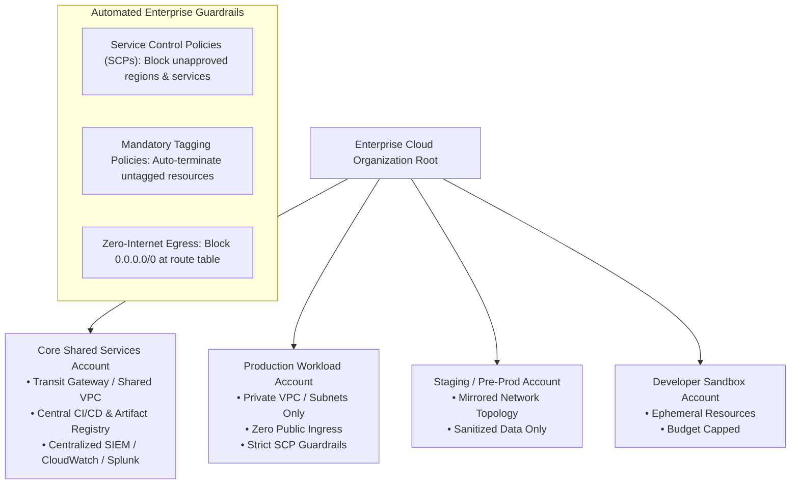
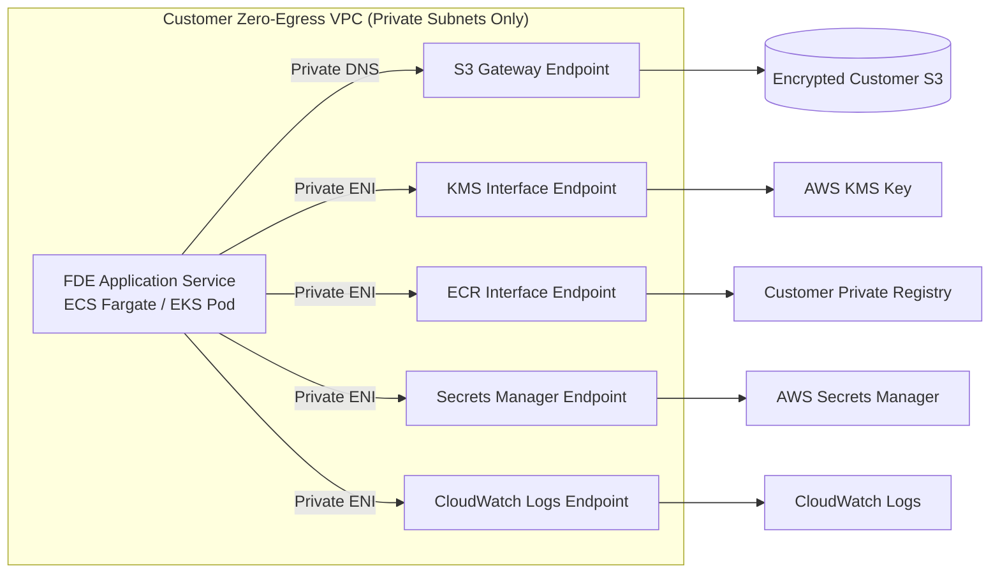
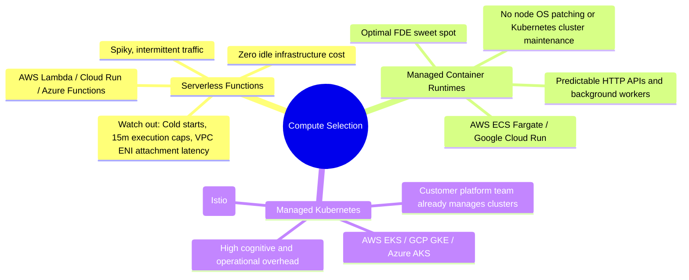

# Cloud and Infrastructure: Landing Zones, Zero-Egress VPCs, and Multi-Cloud Governance

This guide provides the authoritative engineering playbook for Forward Deployed Engineers (FDEs) deploying, configuring, and operating software inside customer cloud environments.

In customer engagements, the FDE never chooses the cloud provider or designs an unconstrained greenfield architecture. The customer already operates an established cloud estate, a rigid network layout, and firm Information Security (InfoSec) guardrails. Multi-cloud fluency is an absolute market prerequisite: across our empirical dataset of 146 deduplicated 2026 FDE job postings, **AWS appears in 47.0%**, **GCP in 38.0%**, and **Azure in 34.0%** of postings. Because an FDE meets all three across diverse client accounts, your deployment tooling and architectures must adapt seamlessly to the customer's landing zone.

---

## 1. Navigating the Customer Landing Zone

Enterprise cloud estates are organized into **Landing Zones**: standardized multi-account structures governed by automated guardrails (AWS Control Tower, GCP Organization Policies, Azure Management Groups).



### The Critical Path: "Show Me Where the Last Vendor Deployed"

Access requests are the primary friction point in enterprise engagements. Requesting cloud accounts, IAM roles, security group modifications, and cross-account peering requires navigating enterprise paperwork queues with multi-week lead times.

The single most effective discovery question in Week 1 is:
> *"Can you walk us through the architecture and permission model of the most recent vendor or internal service deployed to this environment?"*

Reusing an established deployment pattern grants:
1. An approved network path (pre-existing subnet, security group rules, and DNS resolution).
2. A vetted identity mechanism (IAM role structure or Workload Identity provider).
3. Pre-approved cost allocation tags.
4. Identification of the specific architecture review board approvers whose sign-off is required.

---

## 2. Enterprise Network Topologies & Zero-Egress VPCs

In regulated industries (banking, defense, healthcare), production compute subnets are isolated with **zero public internet ingress or egress**. Outbound routes to `0.0.0.0/0` via Internet Gateways or NAT Gateways are prohibited by corporate security policies.

### Network Ingress and Peering Architecture Comparison

| Connectivity Model | Architectural Mechanism | Security & Isolation Profile | FDE Operational Considerations |
| :--- | :--- | :--- | :--- |
| **AWS PrivateLink / Azure Private Endpoint** | Exposes service via dedicated Elastic Network Interfaces (ENI) using private IP space. | **Highest**. Unidirectional traffic; no IP route table peering; zero risk of CIDR address collisions. | **Recommended standard**. Enables vendor SaaS or separate accounts to connect without opening network-wide peering. |
| **VPC Peering** | Direct Layer-3 routing between two VPCs in the same or different accounts. | **Moderate**. Non-transitive; allows bidirectional packet flow between peered subnets. | Requires strictly non-overlapping IPv4 CIDR blocks (e.g., `10.100.0.0/16` vs `10.200.0.0/16`). |
| **Transit Gateway (TGW) / Azure vWAN** | Centralized hub-and-spoke router interconnecting hundreds of VPCs and on-premise links. | **Enterprise Standard**. Centralizes packet inspection through perimeter next-gen firewalls (Palo Alto/Fortinet). | Incurs per-GB transit processing fees; requires network platform team approval for route table propagation. |
| **AWS Direct Connect / GCP Interconnect** | Dedicated private physical fiber circuit between customer on-premise datacenter and cloud. | **High**. High-throughput, sub-millisecond latency dedicated connection. | Static configuration; FDE workloads access on-premise databases via corporate private DNS. |

### Designing Inside a Zero-Egress VPC

When outbound internet access is blocked, your containerized workloads cannot pull images from public Docker Hub, fetch packages from PyPI, or communicate with public cloud APIs. You must configure **VPC Endpoints (PrivateLink)**:



---

## 3. Workload Identity & Least-Privilege IAM (Zero Static Keys)

Under enterprise compliance frameworks (SOC 2 Type II, ISO 27001, FedRAMP), generating permanent IAM user access keys (`AKIA...`) for applications is an immediate audit failure. Workloads must authenticate via native **Cloud Workload Identity Federation**.

### Multi-Cloud Workload Identity Mapping

- **AWS EKS**: **IAM Roles for Service Accounts (IRSA)**. A Kubernetes ServiceAccount is associated with an IAM Role via an OpenID Connect (OIDC) identity provider. Pods receive short-lived AWS STS credentials via projected service account tokens (`AWS_WEB_IDENTITY_TOKEN_FILE`).
- **GCP GKE**: **Workload Identity**. Binds a Kubernetes ServiceAccount to a Google Service Account (GSA). The GKE metadata server intercepts credential requests and serves scoped Google OAuth2 access tokens.
- **Microsoft Azure AKS**: **Azure Workload Identity**. Pods project signed OIDC tokens verified by Microsoft Entra ID to assume managed identities without service principal secrets.

### Production Terraform: Scoped Least-Privilege IAM Policy

The following Terraform configuration exemplifies production FDE standards: scoped strictly to required resource ARNs, enforcing KMS encryption, and forbidding wildcard `*` permissions.

```hcl
# Production Scoped IAM Policy for FDE Ingestion Workload
# Zero wildcard permissions; strictly scoped resource ARNs and KMS keys.

data "aws_caller_identity" "current" {}
data "aws_region" "current" {}

locals {
  account_id   = data.aws_caller_identity.current.account_id
  region       = data.aws_region.current.name
  dataset_name = "customer-enterprise-sync"
}

# 1. IAM Role with OIDC Trust Relationship for Kubernetes Pod
resource "aws_iam_role" "fde_workload_role" {
  name        = "fde-${local.dataset_name}-workload-role"
  description = "Scoped execution role for FDE ingestion workload running on EKS"

  assume_role_policy = jsonencode({
    Version = "2012-10-17"
    Statement = [
      {
        Effect = "Allow"
        Principal = {
          Federated = "arn:aws:iam::${local.account_id}:oidc-provider/oidc.eks.${local.region}.amazonaws.com/id/EXAMPLE12345"
        }
        Action = "sts:AssumeRoleWithWebIdentity"
        Condition = {
          StringEquals = {
            "oidc.eks.${local.region}.amazonaws.com/id/EXAMPLE12345:sub" : "system:serviceaccount:fde-workload:ingestion-worker",
            "oidc.eks.${local.region}.amazonaws.com/id/EXAMPLE12345:aud" : "sts.amazonaws.com"
          }
        }
      }
    ]
  })

  tags = {
    Environment        = "production"
    CostCenter         = "CC-4921-INTEG"
    Owner              = "fde-core-team"
    DataClassification = "Restricted"
  }
}

# 2. Least-Privilege Scoped Policy
resource "aws_iam_policy" "fde_scoped_access" {
  name        = "fde-${local.dataset_name}-policy"
  description = "Grants restricted S3 read/write and KMS decrypt to FDE worker"

  policy = jsonencode({
    Version = "2012-10-17"
    Statement = [
      {
        Sid    = "AllowS3BucketListing"
        Effect = "Allow"
        Action = [
          "s3:ListBucket"
        ]
        Resource = [
          "arn:aws:s3:::customer-raw-data-bucket-${local.account_id}"
        ]
        Condition = {
          StringLike = {
            "s3:prefix" : ["landing-zone/*", "processed/*"]
          }
        }
      },
      {
        Sid    = "AllowS3ObjectReadWrite"
        Effect = "Allow"
        Action = [
          "s3:GetObject",
          "s3:PutObject",
          "s3:DeleteObject"
        ]
        Resource = [
          "arn:aws:s3:::customer-raw-data-bucket-${local.account_id}/landing-zone/*",
          "arn:aws:s3:::customer-raw-data-bucket-${local.account_id}/processed/*"
        ]
      },
      {
        Sid    = "AllowKMSKeyDecryption"
        Effect = "Allow"
        Action = [
          "kms:Decrypt",
          "kms:GenerateDataKey"
        ]
        Resource = [
          "arn:aws:kms:${local.region}:${local.account_id}:key/12345678-1234-1234-1234-123456789012"
        ]
      },
      {
        Sid    = "AllowSecretsManagerRead"
        Effect = "Allow"
        Action = [
          "secretsmanager:GetSecretValue"
        ]
        Resource = [
          "arn:aws:secretsmanager:${local.region}:${local.account_id}:secret:fde/customer-db-creds-*"
        ]
      }
    ]
  })
}

resource "aws_iam_role_policy_attachment" "attach_scoped" {
  role       = aws_iam_role.fde_workload_role.name
  policy_arn = aws_iam_policy.fde_scoped_access.arn
}
```

---

## 4. Infrastructure as Code (IaC) in Governed Estates

Enterprise customers operate **Terraform** or **OpenTofu** across structured CI/CD pipelines (e.g., Atlantis, Terraform Cloud, GitHub Actions, GitLab CI).

### Operational Rules for Customer IaC

1. **Consume Customer Internal Modules**: Always inspect the customer's internal private module registry before writing custom HCL. Enterprise modules already incorporate mandatory tagging, KMS customer-managed key (CMK) encryption, and security group invariants. Writing redundant modules creates friction with internal platform teams.
2. **State Backend Governance**: Terraform state contains decrypted resource attributes and connection strings. State must reside in an encrypted S3 bucket/GCS backend with DynamoDB/Cloud Spanner distributed state locking and object versioning enabled.
3. **The Plan & Apply Protocol**: In customer-hosted deployments, the FDE typically produces the pull request and validates the `terraform plan`. A designated customer platform administrator executes `terraform apply` using their elevated privileges during an approved change window.

---

## 5. Compute Selection & GPU Hardware Quota Procurement

Match the compute runtime to the customer's operational maturity:



### The GPU Hardware Procurement Reality

Deploying local inference workloads (e.g., vLLM, Ollama, TensorRT-LLM) inside a customer VPC requires **dedicated GPU instances** (e.g., AWS `g5.xlarge` with Nvidia A10G, `p4d.24xlarge` with A100s, or GCP `g2-standard` with L4 GPUs).

**The Enterprise Procurement Trap**:
In modern cloud landing zones, default quotas for accelerated compute (`Running On-Demand G and VT instances`) are set to **0 vCPUs**. Enterprise quota increases take **5 to 15 business days** and require financial approvals and cloud account manager intervention.

**Operational Rule**: Request GPU service quota increases and initiate Capacity Block reservations in **Week 1 discovery**, never the week of production launch.

---

## 6. Access in Air-Gapped & Restricted Environments

Direct SSH access over port 22 to production virtual machines is an audit violation in enterprise environments.

### Zero-Open-Port Bastions via AWS SSM Session Manager

Connect to private VPC instances without inbound firewall openings using **AWS Systems Manager (SSM) Session Manager**:
- The instance runs the SSM Agent, which initiates an outbound TLS connection to the AWS SSM endpoint.
- Engineers authenticate via AWS IAM / SSO credentials; no SSH keys or bastion public IPs are required.
- All session input and output is cryptographically logged to an encrypted S3 bucket and CloudWatch for compliance audits.

### Private Container Registry Hygiene

Deploying containers to restricted environments requires pushing images to the customer's internal registry (Amazon ECR, Google Artifact Registry, or Harbor):
1. **Container Scanning**: Images must pass automated vulnerability scans (Trivy, Amazon Inspector) with zero `CRITICAL` or `HIGH` CVEs.
2. **Base Image Provenance**: Standardize on minimal, hardened base images (e.g., `cgr.dev/chainguard/python` or `python:3.11-slim`).
3. **Air-Gapped Wheelhouses**: For environments with zero external egress, compile Python wheel packages into an internal artifact store or bundle them directly inside the container image during the build stage.

---

## 7. Cost Governance & FinOps in Customer Estates

Uncontrolled cloud spend during a proof-of-concept or initial rollout can terminate an enterprise engagement prematurely.

### Mandatory Tagging Taxonomy

Every provisioned cloud resource must include these five standard cost-allocation tags:

| Tag Key | Example Value | Purpose |
| :--- | :--- | :--- |
| `Environment` | `production`, `staging`, `poc` | Filters billing reports by deployment stage. |
| `CostCenter` | `CC-4921-INTEG` | Allocates cloud charges to the sponsoring business unit. |
| `Owner` | `fde-operations@vendor.com` | Identifies the engineer accountable for the resource. |
| `Project` | `customer-copilot-deployment` | Groups all compute, storage, and networking costs. |
| `DataClassification` | `Restricted`, `Confidential` | Dictates automated backup retention and encryption rules. |

### FinOps Budget Alerts & Anomaly Alarms

- Establish AWS Budgets or GCP Cloud Billing Alerts at **50%, 80%, and 100%** of the agreed monthly run rate.
- Configure AWS Cost Anomaly Detection to trigger Slack/PagerDuty alerts if daily spend exceeds the expected baseline by $> 20\%$.

---

## 8. Pre-Flight Cloud Readiness Checklist

Before initiating production infrastructure deployment, verify every requirement on this audit:

- [ ] **Landing Zone Account Provisioned**: Workload account established with designated cost center and billing hierarchy.
- [ ] **Network Egress Validated**: Subnet route tables and security groups audited; required VPC endpoints (S3, KMS, ECR, Secrets Manager) verified.
- [ ] **Zero Long-Lived Credentials**: Compute identities authenticate exclusively via Cloud Workload Identity (AWS IRSA, GCP Workload Identity, Azure Managed Identity).
- [ ] **Least-Privilege IAM Scoping**: All IAM policies restrict actions to explicit resource ARNs with zero wildcard `*` permissions.
- [ ] **Terraform State Secured**: Remote state stored in encrypted object storage with active distributed locking (DynamoDB / Spanner).
- [ ] **GPU Quotas Granted**: Accelerated compute quotas confirmed active in the target region prior to deployment.
- [ ] **Zero Public SSH Ports**: Remote administration configured via AWS SSM Session Manager or Azure Bastion; port 22 closed globally.
- [ ] **Container Image Compliance**: Container images scanned with zero critical CVEs and mirrored in the customer's private registry.
- [ ] **Mandatory Tagging Applied**: All resources tagged with `CostCenter`, `Environment`, `Owner`, and `Project`.
- [ ] **Billing Alarms Active**: Budget alerts configured with automated notifications to both FDE lead and customer sponsor.

---

## 9. Failure Scenarios & Operational Runbooks

| Infrastructure Incident | Root Cause | Immediate Mitigation Runbook |
| :--- | :--- | :--- |
| **VPC Endpoint DNS Resolution Timeout** | Workload attempting to resolve S3/KMS endpoint; private DNS resolution disabled on VPC. | 1. Enable `enableDnsSupport` and `enableDnsHostnames` on the customer VPC.<br>2. Confirm Route 53 Private Hosted Zone is associated with the target VPC.<br>3. Test resolution using `nslookup s3.<region>.amazonaws.com`. |
| **IAM Permission Denied Cascade** | CloudTrail logs show `AccessDenied` on `kms:Decrypt` when reading S3 objects. | 1. Inspect S3 bucket KMS Customer Managed Key (CMK) key policy.<br>2. Confirm the workload IAM role is explicitly listed in the KMS key policy `Statement[].Principal`.<br>3. Verify IAM policy includes `kms:Decrypt` on the key ARN. |
| **GPU Pod Pending Throttling** | Kubernetes pods remain in `Pending` state with `Insufficient nvidia.com/gpu`. | 1. Check EC2 service quota console for target instance family.<br>2. Inspect EKS node group auto-scaling group (ASG) events for `VcpuLimitExceeded`.<br>3. Request emergency spot/on-demand quota expansion via customer account executive. |

---

## 10. Related System Documents

- [Deployment Patterns](../deployment/02-deployment-patterns.md) - Architectural tradeoffs across VPC-embedded, hybrid, and SaaS deployments.
- [Security and Compliance](05-security-and-compliance.md) - SOC 2, HIPAA, and customer InfoSec review procedures.
- [APIs and Integrations](02-apis-and-integrations.md) - Networking, resilience, and rate-limiting patterns for external endpoints.
- [Architecture for Customer Systems](../system-design/01-architecture-for-customer-systems.md) - Designing fault-tolerant customer systems.
- [Production Readiness Checklist](../deployment/03-production-readiness-checklist.md) - Operational sign-off criteria before go-live.

---

## 11. Primary Engineering Literature

1. **AWS Well-Architected Framework**: Security, Reliability, and Operational Excellence Pillars. Amazon Web Services.
2. **Google Cloud Architecture Framework**: System Design, Security, and Landing Zone Governance. Google Cloud.
3. **Microsoft Azure Well-Architected Framework**: Architecture and Security Best Practices. Microsoft Azure.
4. **FinOps Foundation**: *"FinOps Framework: Real-Time Cloud Cost Governance and Optimization"*.
5. **HashiCorp**: *"Terraform Enterprise Best Practices: Module Design, State Management, and CI/CD Governance"*.
6. **Empirical Job Market Analysis (2026)**: Independent audit of 146 deduplicated FDE job postings showing **AWS (47.0%), GCP (38.0%), and Azure (34.0%) multi-cloud demand**.
