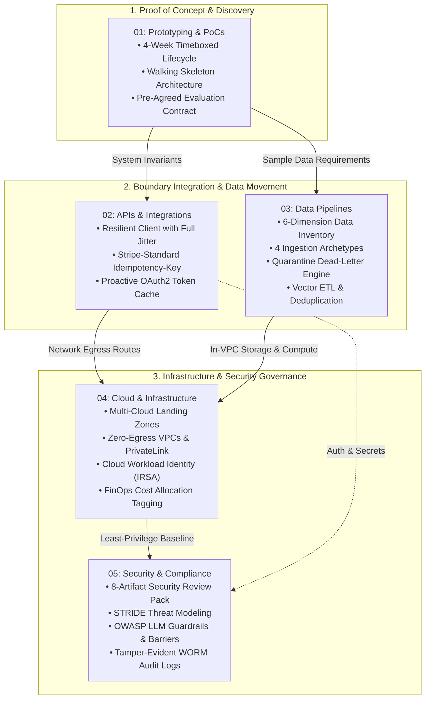

# Core Engineering: Building and Deploying Production Systems in Customer Environments

This portal serves as the authoritative architectural master index for the **Core Engineering Pillar** of the Forward Deployed Engineering (FDE) Field Guide.

Unlike conventional product software engineering—where engineers control the deployment runtime, the database schema, the network topology, and the release cadence—Forward Deployed Engineering is defined by **building inside someone else's infrastructure, against systems you do not own, under organizational and security policies you cannot alter**.

Across our empirical dataset of 146 deduplicated 2026 FDE job postings, technical execution across customer infrastructure dominates the role:
- **Building & Deploying Production Systems**: **90.4%** of listings (the #1 responsibility across all surveyed postings).
- **APIs and External Integrations**: **64.0%** of listings.
- **Proof-of-Concept & Prototyping**: **57.5%** of listings.
- **Multi-Cloud Fluency**: **AWS in 47.0%**, **GCP in 38.0%**, and **Azure in 34.0%** of listings.
- **Security & Compliance Clearance**: Required in **100%** of enterprise deployments.

---

## 1. Architectural Knowledge Topology

The five core guides in this pillar form an interdependent engineering execution lifecycle, guiding a customer deployment from initial prototype to hardened enterprise production:

---

## 2. Guide Syntheses & Technical Invariants

### 1. [Prototyping and PoCs](01-prototyping-and-pocs.md)
*Proofs of concept that force business decisions rather than becoming unmaintainable tech debt.*
- **The 4-Week Timeboxed Lifecycle**: Structured week-by-week progression with formal evaluation gates: Week 1 (Walking Skeleton & Data Access), Week 2 (Core Pipeline & Golden Benchmark), Week 3 (Integration, RBAC, & Exception Handling), and Week 4 (Evaluation, TCO Review, & Decision Memo).
- **The Walking Skeleton Invariant**: Shipping the minimal end-to-end trace with health probes, logging, and synthetic mock boundaries within the first 5 business days.
- **The Pre-Agreed Evaluation Contract**: Formal written agreement locking quantitative pass/fail metrics ($\ge 88\%$ classification accuracy, $\ge 90\%$ severity gating, $100\%$ citation grounding) and zero-day data destruction protocols.
- **Production Decision Memo**: Concrete decision artifact (ETISE-2026-004) evaluating SLA performance, unit economics, and operational handoff.

### 2. [APIs and Integrations](02-apis-and-integrations.md)
*The craft of gluing your platform to rigid third-party systems across network and organizational boundaries.*
- **Resilience Engineering & Jittered Backoff**: Mathematical models of Full Jitter vs Decorrelated Jitter (Marc Brooker, AWS Architecture) to eliminate retry amplification and thundering herd cascades.
- **The Stripe-Standard Idempotency Engine**: `Idempotency-Key` HTTP protocol featuring canonical JSON SHA-256 hashing to detect parameter conflicts (HTTP 409) and in-flight concurrency locks.
- **Enterprise Auth Lifecycles**: OAuth 2.0 Client Credentials Grant with thread-safe token caching and proactive renewal at 85% of TTL.
- **Durable Webhook Ingestion**: Timing-safe HMAC-SHA256 signature verification (`hmac.compare_digest`) with anti-replay timestamp windows ($\le 300\text{s}$) decoupled via queues and Dead-Letter Queues (DLQs).

### 3. [Data Pipelines in Customer Environments](03-data-pipelines.md)
*Overcoming the enterprise data readiness gap across legacy silos, dirty records, and vector ETL.*
- **The 6-Dimension Data Inventory**: System of record vs replica, daily delta volume, PII/PHI classification, refresh cadences, egress boundaries, and owner SLAs.
- **The 4 Canonical Ingestion Patterns**: Batch File Drops (chunked memory streaming), Incremental High-Watermark Pulls (with clock-skew buffer windows), Change Data Capture (CDC via database WAL), and Durable Event Streams (Kafka/Kinesis with client backpressure).
- **Data Quality Triage & Quarantine Engine**: Mitigating the 7 classic enterprise defects (overloaded nulls, cross-system identity collisions, encoding artifacts, upstream drift, semantic discrepancies, timezone naivety, and deprecated load-bearing fields) with Pydantic V2 row-level dead-letter routing.
- **Vector ETL for Enterprise RAG**: Semantic sentence-aware chunking, SHA-256 document content hashing for incremental re-indexing, and native `pgvector`/HNSW indexing.

### 4. [Cloud and Infrastructure](04-cloud-and-infrastructure.md)
*Deploying inside customer cloud landing zones across AWS, GCP, and Microsoft Azure.*
- **Enterprise Landing Zones**: Deploying inside governed multi-account structures (AWS Control Tower, GCP Organization Policies, Azure Management Groups) using the golden rule: *"Show me where the last vendor deployed."*
- **Zero-Egress VPC Network Architecture**: Operating in private subnets with `0.0.0.0/0` outbound routes blocked, routing traffic exclusively through AWS PrivateLink / Azure Private Endpoints for S3, KMS, ECR, and Secrets Manager.
- **Workload Identity Federation (Zero Static Keys)**: Replacing permanent IAM access keys with cloud-native workload identities (AWS IRSA, GCP Workload Identity, Azure Managed Identity) and scoped least-privilege Terraform policies.
- **Compute Selection & GPU Quotas**: Triaging Serverless vs ECS Fargate vs Managed Kubernetes, navigating multi-week enterprise GPU quota procurement (Nvidia A10G/L4/H100), and air-gapped access via AWS SSM Session Manager.

### 5. [Security and Compliance](05-security-and-compliance.md)
*Clearing customer Information Security reviews, OWASP LLM defenses, and regulatory regimes.*
- **The 8-Artifact Security Review Pack**: DFDs with trust boundaries, PII inventory, STRIDE threat models, authentication designs, KMS CMK key governance, WORM audit logging, SOC 2 Type II reports, and penetration test remediation ledgers.
- **Subprocessor Data Governance**: Enforcing Zero Data Retention (ZDR), zero training on customer data (Anthropic Commercial Terms, OpenAI Enterprise Terms), and treating vector embeddings as derived personal data subject to GDPR Article 17 deletion.
- **OWASP Top 10 for LLMs Defenses**: Mitigating prompt injection (LLM01) and excessive agency (LLM06) via schema-validated execution barriers and dual-key operator confirmation for destructive actions.
- **Sector Compliance & WORM Audit Trails**: Regulatory controls for HIPAA/HITECH, GLBA/PCI-DSS, FedRAMP, and tamper-evident audit logging to S3 Object Lock.

---

## 3. Situational Field Navigation Matrix

When an architectural crisis or operational blocker strikes in the field, use this rapid-routing matrix to identify the authoritative mitigation protocol:

| Live Field Emergency | Immediate Root Cause | Target Engineering Protocol |
| :--- | :--- | :--- |
| **Upstream 429 Cascade Storm** | Third-party vendor API rate limit exceeded; parallel workers retrying simultaneously. | [02: APIs & Integrations §2](02-apis-and-integrations.md#2-resilience-engineering--mathematical-backoff) — Deploy `ResilientHTTPClient` with Full Jitter backoff and `Retry-After` parsing. |
| **Silent Schema Drift Outage** | Upstream customer database renamed a column; pipeline loading nulls or crashing workers. | [03: Data Pipelines §4](03-data-pipelines.md#4-data-quality-triage--defect-classification) — Deploy `PipelineIngestionEngine` with Pydantic V2 validation and row-level quarantine. |
| **Container Egress Network Failure** | Customer private VPC blocks internet; container cannot pull packages or connect to S3/KMS. | [04: Cloud & Infrastructure §2](04-cloud-and-infrastructure.md#2-enterprise-network-topologies--zero-egress-vpcs) — Provision AWS PrivateLink / Interface VPC Endpoints and enable private DNS. |
| **CISO Halts Deployment on AI Egress** | Customer security team refuses to allow customer data to leave VPC to external LLM APIs. | [05: Security & Compliance §2](05-security-and-compliance.md#2-data-boundaries-zero-egress--model-subprocessor-governance) — Present ZDR agreements, no-training clauses, and PrivateLink endpoints. |
| **PoC Scope Creep & Launch Paralysis** | Customer stakeholders continually add requirements without agreeing to production sign-off. | [01: Prototyping & PoCs §3](01-prototyping-and-pocs.md#3-the-pre-agreed-evaluation-contract) — Enforce Pre-Agreed Evaluation Contract and execute Decision Memo gating. |
| **Duplicate Payments / Mutated State** | Network drop caused client to retry write request; upstream processed mutation twice. | [02: APIs & Integrations §3](02-apis-and-integrations.md#3-enterprise-idempotency-engine) — Implement `IdempotencyEngine` with distributed lock and SHA-256 conflict detection. |
| **GPU Node Deployment Blocked** | EKS node group fails to launch GPU instances due to account quota limits. | [04: Cloud & Infrastructure §5](04-cloud-and-infrastructure.md#5-compute-selection--gpu-hardware-quota-procurement) — File emergency GPU vCPU quota increase and procure EC2 Capacity Blocks. |

---

## 4. Codebase Defense & Reference Implementations

The engineering patterns documented across this pillar are implemented as fully tested, runnable code within this repository:

| Architectural Mechanism | Repository Reference Implementation | Unit Test & Evaluation Coverage |
| :--- | :--- | :--- |
| **Full Jitter Exponential Backoff** | [`interviews/code/resilient_client.py`](file:///c:/Users/Adil/Downloads/FDE-Field-Guide-main/interviews/code/resilient_client.py) | [`interviews/code/test_resilient_client.py`](file:///c:/Users/Adil/Downloads/FDE-Field-Guide-main/interviews/code/test_resilient_client.py) (4 tests passed) |
| **Idempotent Webhook Receiver** | [`interviews/code/webhook_receiver.py`](file:///c:/Users/Adil/Downloads/FDE-Field-Guide-main/interviews/code/webhook_receiver.py) | [`interviews/code/test_webhook_receiver.py`](file:///c:/Users/Adil/Downloads/FDE-Field-Guide-main/interviews/code/test_webhook_receiver.py) (3 tests passed) |
| **Token Bucket Rate Limiter** | [`interviews/code/rate_limiter.py`](file:///c:/Users/Adil/Downloads/FDE-Field-Guide-main/interviews/code/rate_limiter.py) | [`interviews/code/test_rate_limiter.py`](file:///c:/Users/Adil/Downloads/FDE-Field-Guide-main/interviews/code/test_rate_limiter.py) (4 tests passed) |
| **Deterministic Semantic Chunker** | [`interviews/code/chunker.py`](file:///c:/Users/Adil/Downloads/FDE-Field-Guide-main/interviews/code/chunker.py) | [`interviews/code/test_chunker.py`](file:///c:/Users/Adil/Downloads/FDE-Field-Guide-main/interviews/code/test_chunker.py) (3 tests passed) |
| **Enterprise Server (ETISE)** | [`portfolio/reference-project/src/api/server.py`](file:///c:/Users/Adil/Downloads/FDE-Field-Guide-main/portfolio/reference-project/src/api/server.py) | [`portfolio/reference-project/tests/test_server.py`](file:///c:/Users/Adil/Downloads/FDE-Field-Guide-main/portfolio/reference-project/tests/test_server.py) (7 tests passed) |
| **Golden Evaluation Harness** | [`portfolio/reference-project/evals/run_evals.py`](file:///c:/Users/Adil/Downloads/FDE-Field-Guide-main/portfolio/reference-project/evals/run_evals.py) | 25 Enterprise Golden Test Cases (100% citation grounding) |

---

## 5. Primary Practitioner Literature & Authorities

1. **Marc Brooker (AWS Architecture)**: *"Exponential Backoff And Jitter"*. Empirical proof and analysis of Full Jitter vs Decorrelated Jitter algorithms in distributed systems.
2. **Martin Kleppmann**: *"Designing Data-Intensive Applications"*. Foundations of batch ETL, change data capture, distributed locking, and event processing.
3. **Joe Reis & Matt Housley**: *"Fundamentals of Data Engineering"*. The data engineering lifecycle, storage abstractions, and security boundaries.
4. **Paul Farnsworth (President, Dice)**: Analysis on enterprise AI integration roadblocks and the Forward Deployed Engineering role (*Fortune*, September 2026).
5. **Dan McKinley**: *"Choose Boring Technology"*. Architectural conservatism in customer integration layers.
6. **NIST AI Risk Management Framework (AI RMF 1.0)**: National Institute of Standards and Technology framework for trustworthy and responsible AI deployment.
7. **OWASP Foundation**: *"Top 10 for Large Language Model Applications (2025/2026)"*. Threat vectors, prompt injection defenses, and architectural guardrails.
8. **Stripe Engineering**: *"Designing Robust APIs with Idempotency"*. The reference standard for `Idempotency-Key` headers, distributed locking, and replay semantics.
9. **Empirical Job Market Analysis (2026)**: Independent audit of 146 deduplicated FDE job postings showing **90.4% demand for building production systems and 64.0% demand for API integrations**.
