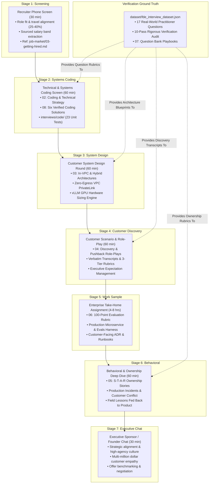

# Forward Deployed Engineering Interviews: The Master Evaluation Portal

This portal serves as the authoritative architectural master index for the **Interviews Pillar** of the Forward Deployed Engineering (FDE) Field Guide.

The Forward Deployed Engineer interview loop is fundamentally distinct from traditional software engineering (SWE) or solutions architecture (SA) hiring evaluations. Traditional SWE loops over-index on abstract LeetCode puzzle algorithms; SA loops over-index on conceptual slide decks and sales discovery. The FDE interview loop evaluates the **dual-threat engineer**: an engineer capable of writing hardened, production-grade Python under messy data constraints while maintaining consultative poise and commercial empathy in front of demanding customer executives.

Across tier-1 FDE hiring pipelines (Anthropic, OpenAI, Palantir, Databricks), the evaluation funnel is exceptionally steep: **fewer than 3% of resumes pass initial screening**, approximately **15% clear the technical screen**, and only **~20% receive offers following the on-site loop**, yielding an overall conversion rate between **1.5% and 2.5%**. This pillar provides the complete, empirically verified preparation system required to clear every round.

---

## 1. Architectural Evaluation Topology

The eight guides, verified dataset, and unit test suite in this pillar map directly to the 7-stage enterprise interview lifecycle:



---

## 2. Pillar Guide Syntheses & Technical Invariants

### 1. [The Interview Process](01-interview-process.md)
*The end-to-end hiring arc: stage objectives, pass rates, rubric scoring, and decision committee mechanics.*
- **The Evaluation Philosophy**: FDE loops do not test memorized syntax; they test production engineering judgment, client empathy, and operational ownership under ambiguity.
- **Decision Mechanics**: Evaluated across 4 core competencies: Production Systems Rigor, Customer Technical Empathy, Operational High Agency, and Commercial Acumen.

---

### 2. [Coding and Technical Rounds](02-coding-and-technical.md)
*What the technical screen actually tests: practical systems coding over puzzle trivia.*
- **The Anti-LeetCode Invariant**: Rejecting abstract dynamic programming puzzles in favor of real enterprise integration problems: parsing malformed customer exports, building token-bucket rate limiters, implementing resilient exponential backoff clients, and enforcing Pydantic schemas.
- **Code Quality Invariants**: Idempotent execution, graceful exception handling, type annotations, and structured logging.

---

### 3. [Coding Round Solutions](08-coding-solutions.md)
*Runnable Python reference implementations, test suites, and verbal narration playbooks for the six core technical problems.*
- **Problem 1: Resilient HTTP Client** - Exponential backoff with full jitter, idempotency keys, and unretryable 4xx fast-fail.
- **Problem 2: Distributed Rate Limiter** - Token-bucket algorithm with sliding-window quota calculations.
- **Problem 3: Structured LLM Extractor** - Pydantic V2 boundary validation with automated self-healing retry handler.
- **Problem 4: Webhook Receiver** - Idempotent event deduplication, hash signatures, and payload collision detection.
- **Problem 5: Document Chunker** - Token-bounded text chunking with structural delimiter preservation.
- **Problem 6: Dirty Data Parser** - Robust regex repair of malformed currency, timestamps, and JSON payloads.
- **Verified Codebase**: All solutions are runnable in [`interviews/code/`](code/) and validated with 23 passing pytest unit tests.

---

### 4. [System Design Rounds](03-system-design.md)
*Enterprise architectures under customer constraints: in-VPC boundaries, PrivateLink, and GPU sizing.*
- **The In-VPC Constraint**: Designing inside customer AWS/Azure/GCP environments with zero internet egress (`IGW-less` VPCs) and AWS PrivateLink interface endpoints.
- **The vLLM Hardware Sizing Engine**: Mathematical GPU memory allocation:
  $$VRAM_{\text{req}} = M_{\text{weights}} + M_{\text{kv\_cache}} + M_{\text{activation\_overhead}}$$
- **Hybrid Control/Data Planes**: Architecting reverse-tunnel worker agents dialing out over HTTPS/WSS (port 443) with deterministic local token-level PII pseudonymization.

---

### 5. [Customer Scenario Rounds](04-customer-scenarios.md)
*Live role-plays, executive discovery, pushback handling, and verbatim transcripts.*
- **The Discovery Role-Play**: Leading a 30-minute discovery call with a skeptical VP of Engineering; identifying non-negotiable security constraints, cloud tenancy, and success metrics.
- **Managing Executive Pushback**: Re-scoping an impossible 10-day customer deadline by offering a phased MVP cutover without destabilizing production clusters.
- **Verbatim Transcripts & Rubrics**: Sourced transcripts graded across Strong Hire, Hire, and No Hire tiers.

---

### 6. [Behavioral Rounds](05-behavioral.md)
*The 6 core ownership stories: S-T-A-R methodology, production outages, and client conflict.*
- **The 6 Non-Negotiable Stories**:
  1. *Production Incident*: Diagnosing a critical customer outage under high pressure.
  2. *Customer Conflict*: Pushing back against an unreasonable stakeholder request.
  3. *Technical Disagreement*: Resolving an architectural impasse with a customer engineer.
  4. *Impossible Deadline*: Delivering a phased release when initial scope exceeded timeline.
  5. *Ambiguous Scoping*: Turning vague executive wishes into technical deliverables.
  6. *Field-to-Product Feedback*: Codifying a recurring customer pain point into a core product feature.

---

### 7. [Take-Home Assignments](06-take-homes.md)
*Enterprise take-home architectures, 100-point rubric, and customer-facing ADR templates.*
- **The 100-Point Evaluation Rubric**: Architecture (25 pts), Code Hardening (25 pts), Quantitative Evals (20 pts), IaC & Deployment (15 pts), and Customer ADR Documentation (15 pts).
- **The Customer Deliverables**: Complete with Dockerfile, Terraform enclave configuration, and an Architectural Decision Record (ADR) justifying trade-offs.

---

### 8. [Question Bank](07-question-bank.md)
*17 verified practitioner questions backed by empirical literature, rubrics, and verbal defense playbooks.*
- **The 7-Stage Question Bank**: Sourced directly from verified practitioners (Nehal Vyas, Om Bharatiya, Dr. Sundeep Teki, Dr. Sanjay Kumar PhD, YagyanshB Google FDE Guide, Startup.jobs, Alexey Grigorev).
- **Comprehensive Rubrics**: Every question includes a 3-tier scoring rubric (Strong Hire, Hire, No Hire), primary citation URLs, and step-by-step verbal answer scripts.

---

### 9. [Empirical Question Dataset](dataset/README.md)
*Machine-readable JSON dataset and the 10-pass verification audit suite.*
- **Dataset File**: [`dataset/fde_interview_dataset.json`](dataset/fde_interview_dataset.json) with 17 verified schema-compliant interview questions.
- **Audit Suite**: [`dataset/ten_pass_verification.py`](dataset/ten_pass_verification.py) running 10 rigorous programmatic verification passes (JSON syntax, key completeness, URL whitelisting, rubric depth, and date currency).

---

## 3. The Round-by-Round Technical Defense Matrix

When preparing for live interview loops, consult this rapid-routing matrix to convert common candidate failure traps into winning hire signals:

```
+-------------------+------------------------------------+-------------------------------------------+
| Interview Round   | Common Candidate Failure Trap      | Prescribed FDE Winning Defense Playbook   |
+-------------------+------------------------------------+-------------------------------------------+
| 1. Technical &    | Writes purely algorithmic solution | Implement Pydantic schema validation,     |
|    Coding Screen  | without error handling, retries, or| token-bucket rate limiting, and structured|
|                   | schema validation bounds           | logging. Ref: 02-coding / 08-solutions    |
+-------------------+------------------------------------+-------------------------------------------+
| 2. Customer       | Draws generic cloud diagram with   | Ask immediately about data boundaries, VPC|
|    System Design  | public internet APIs and un-       | PrivateLink, zero-egress NACLs, and tenant|
|                   | accounted egress data flows        | encryption keys (CMEK). Ref: 03-system    |
+-------------------+------------------------------------+-------------------------------------------+
| 3. Customer       | Capitulates to impossible executive| Unpack business goal; offer phased MVP    |
|    Discovery Role | deadline or bluntly says 'no'      | cutover for immediate milestone while     |
|                   | without proposing a viable path    | protecting production. Ref: 04-scenarios  |
+-------------------+------------------------------------+-------------------------------------------+
| 4. Behavioral &   | Tells passive "we" stories without | Use Google XYZ / STAR format; emphasize   |
|    Ownership      | personal agency or quantified      | personal on-site ownership, incident fix, |
|                   | business metric outcomes           | and feedback loop. Ref: 05-behavioral     |
+-------------------+------------------------------------+-------------------------------------------+
| 5. Take-Home      | Submits un-tested script without   | Deliver 100-point package: unit tests, CLI|
|    Assignment     | evaluation metrics, Dockerfile, or | evaluation runner, Terraform enclave, and |
|                   | customer-facing ADR documentation  | customer runbook. Ref: 06-take-homes      |
+-------------------+------------------------------------+-------------------------------------------+
```

---

## 4. Codebase Verification & Unit Test Suite

The technical implementations in this pillar are fully verified by automated test suites in the repository:

### Run the 23-Test Interview Systems Suite
```bash
python -m pytest interviews/code/ -v
```
*Coverage*:
- `test_chunker.py`: Small text, boundary splits, overlapping chunk invariants.
- `test_parser.py`: Clean exports, messy corrupted data repair, schema enforcement.
- `test_rate_limiter.py`: Sliding-window quotas, tiered limiters, backpressure calculations.
- `test_resilient_client.py`: Exponential backoff with jitter, retry exhaustion, fast-fail on 4xx.
- `test_structured_extractor.py`: Clean extraction, single-turn self-healing loop, refusal bounds.
- `test_vibe_coding_runner.py`: Stream processing, dirty amount parsing, rate limiting.
- `test_webhook_receiver.py`: Idempotent deduplication, SHA signature checks, 409 conflict handling.

### Run the 10-Pass Rigorous Verification Audit
```bash
python interviews/dataset/ten_pass_verification.py
```
*Verification Scope*: Validates JSON integrity, 17 unique question IDs, whitelisted citation URLs, 3-tier scoring rubrics, author provenance, and 2026 date currency.

---

## 5. Primary Literature & Verified Practitioner Sources

- **Nehal Vyas (Founding FDE & Practitioner Author)**: *Forward Deployed Engineering Playbooks: Systems Integration and Client Ownership*.
- **Om Bharatiya (Technical Career Lead & FDE Author)**: *The Forward Deployed Software Engineering Interview Guide: Systems, Take-Homes, and Live Coding*.
- **Dr. Sundeep Teki (AI Executive & Researcher)**: *Enterprise LLM Architectures, Evaluation Benchmarks, and Applied AI Engineering*.
- **Dr. Sanjay Kumar PhD (Enterprise Architect & AI Specialist)**: *Production Deployment Topologies, Zero-Egress VPCs, and Model Serving Optimization*.
- **YagyanshB (Google FDE Guide Author)**: *Google Forward Deployed Engineering Technical Interview Structure and Systems Design Rubrics*.
- **Alexey Grigorev (AI Engineering Lead)**: *AI Engineering Field Guide: FDE Competency Mapping Across 146 Empirical Postings*.
- **Anthropic & Palantir Engineering Publications**: Official interview specifications, greenhouse job descriptions, and technical engineering rubrics.
