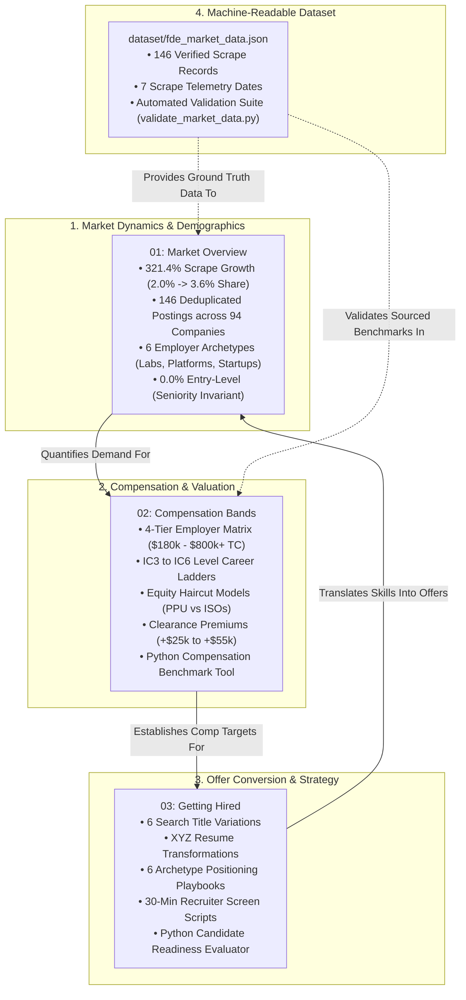

# Forward Deployed Engineering Job Market: Macro Economics, Compensation, and Offer Conversion

This portal serves as the authoritative architectural master index for the **Job Market & Career Pillar** of the Forward Deployed Engineering (FDE) Field Guide.

Forward Deployed Engineering has transitioned from a specialized title at Palantir into one of the fastest-growing and highest-paying career trajectories in enterprise technology. Independent labor analytics from Lightcast (*Fortune*, September 2026) reveals that FDE job postings grew **more than 1,000% year-over-year**, with an advertised median salary exceeding **$188,000**—commanding a **~30% cash premium** over traditional software engineers ($145,000).

The macroeconomic driver behind this surge is the enterprise deployment reality documented by MIT NANDA (*Fortune*, August 2025): **roughly 95% of enterprise Generative AI pilots fail to deliver measurable P&L impact**. Enterprise buyers have stopped purchasing abstract software licenses and API keys; they demand engineers who embed on-site, navigate restricted VPC boundaries, harden data pipelines, and take operational accountability for business outcomes. This pillar provides the empirical data, compensation frameworks, and hiring conversion strategies required to navigate this market.

---

## 1. Architectural Knowledge Topology

The guides in this pillar form a structured career lifecycle: tracking macro hiring demand, benchmarking compensation bands across employer tiers, and executing an unassailable job search strategy.



---

## 2. Pillar Guide Syntheses & Empirical Invariants

### 1. [Market Overview](01-market-overview.md)
*Macroeconomic hiring trajectories, employer archetypes, and empirical market share.*
- **The Empirical Scrape Trajectory**: Across 7 monthly scrapes of the AI engineering ecosystem between February and July 2026, live FDE listings grew **321.4%** (from 28 to 118 postings), expanding FDE market share from **2.0% to 3.6%** of all AI engineering openings (growing 1.8x faster than the broader AI market).
- **The 146-Posting Dataset**: Deduplication across job IDs yielded 146 verified positions across 94 companies, preserved in [`dataset/fde_market_data.json`](dataset/fde_market_data.json).
- **The Seniority Invariant**: Across all 146 empirical postings, exactly **0.0% are entry-level or junior positions**, proving that FDE is fundamentally a mid-to-principal-level deployment discipline.
- **Top Hiring Employers**: Databricks (5 postings), Mistral AI (4), Stord (4), Thomson Reuters (4), Truelogic Software (4), Anthropic (3), and Invisible Technologies (3).

---

### 2. [Compensation](02-compensation.md)
*Base salary bands, equity structures, level ladders, and negotiation playbooks.*
- **The 4-Tier Employer Compensation Matrix**:
  - *Tier 1: Frontier AI Labs* (Anthropic, OpenAI, Mistral AI): Base $240k–$320k, Equity $150k–$450k+ (PPUs/RSUs), Total Comp **$400k–$800k+**.
  - *Tier 2: Enterprise AI & Data Platforms* (Palantir, Databricks, Scale AI, Snowflake): Base $170k–$235k, Equity $80k–$250k (liquid public RSUs), Total Comp **$260k–$520k**.
  - *Tier 3: Hyperscalers & Big Tech* (AWS, Google Cloud, Microsoft Azure): Base $165k–$225k, Equity $90k–$220k, Total Comp **$270k–$480k**.
  - *Tier 4: Growth-Stage Startups & Vertical AI* (Series A–C, "First-FDE"): Base $150k–$200k, Equity 0.25%–1.00%, Total Cash **$160k–$220k** plus equity upside.
- **Level-by-Level Career Ladder**: Detailed compensation progression from IC3 (Mid-Level, $180k–$265k TC) to IC4 (Senior FDE, $300k–$460k TC), IC5 (Staff / Lead FDE, $450k–$720k TC), and IC6 (Principal FDE, $720k–$1.05M+ TC).
- **Security Clearance Premiums**: Sourced cash premiums for defense/national security FDE roles: Active Secret (+$10k–$15k), TS/SCI (+$25k–$40k), and TS/SCI with Full-Scope Polygraph (**+$40k–$55k+** annual cash differential).
- **Equity Risk Haircuts & Travel Multipliers**: Mathematical valuation models discounting startup options by 75% and private lab PPUs by 25%; pricing the operational friction of 25%–50% on-site customer embedding.
- **Production Reference Tool**: [`FDECompensationBenchmark`](02-compensation.md#8-production-python-reference-implementation-fde-compensation-benchmark-tool) calculating realized cash and risk-adjusted total compensation.

---

### 3. [Getting Hired](03-getting-hired.md)
*Title variations, XYZ resume transformations, recruiter screen playbooks, and candidate readiness scoring.*
- **The Steep Conversion Funnel**: Fewer than 3% of resumes pass screening, ~1% reach final rounds, and ~0.2% receive offers. Traditional software engineering resumes fail because they lack customer boundary evidence and quantifiable business metrics.
- **The 5-Pillar Competency Weights**: Building & Deploying Production Systems (90.4%), Complex System & API Integration (64.0%), Prompt Engineering & Context Management (55.0%), Evaluation & Telemetry (49.0%), and Cross-Functional Customer Discovery (Anthropic 4+ YOE mandate).
- **The FDE Resume Architecture (Google XYZ Formula)**: Concrete Before/After bullet transformations demonstrating how to frame AI pipelines, enterprise integrations, customer go-live gates, and production incident recovery into high-impact accomplishments.
- **Recruiter Screen Playbook**: Word-for-word model responses for the 4 universal screening questions: restricted customer environments, pushing back on unreasonable client deadlines, foundation models beyond toy demos, and travel/on-call commitments.
- **Portfolio Defense Standards**: Four non-negotiable enterprise artifacts: hardened microservice, automated golden evaluation harness, declarative Terraform enclave, and customer-facing architectural decision records.
- **Production Reference Tool**: [`FDECandidateReadinessEvaluator`](03-getting-hired.md#8-production-python-reference-implementation-candidate-readiness-evaluator) evaluating candidate profiles against 146-posting benchmarks.

---

### 4. [Empirical Market Dataset](dataset/README.md)
*Machine-readable dataset, telemetry schema, and automated validation suite.*
- **Dataset File**: [`dataset/fde_market_data.json`](dataset/fde_market_data.json) containing 146 deduplicated FDE postings, categorized by employer, sector, responsibilities, technical requirements, and scrape timestamps.
- **Automated Validation Script**: [`dataset/validate_market_data.py`](dataset/validate_market_data.py) enforcing JSON schema compliance, key integrity, date formatting, and statistical distributions.

---

## 3. The Candidate Situational Career Navigation Matrix

When evaluating opportunities, negotiating offers, or positioning your background, use this matrix for immediate tactical routing:

```
+------------------------------------+------------------------------------+-------------------------------------------+
| Candidate Career Dilemma           | Root Market Constraint             | Prescribed FDE Tactical Action            |
+------------------------------------+------------------------------------+-------------------------------------------+
| Backend SWE with 5 YOE but zero    | Recruiters screen heavily for      | Reframe cross-functional PR reviews and   |
| external customer-facing title     | customer empathy & discovery       | internal API consumers as customer proxies|
|                                    | (Anthropic 4+ YOE mandate)         | Ref: 03-getting-hired.md (§4)             |
+------------------------------------+------------------------------------+-------------------------------------------+
| Recruiter offers "Solutions        | Enterprise employers attempt to cap| Rebut using 90.4% production systems      |
| Engineer" title with lower base    | base salaries by classifying FDEs  | requirement; insist on FDSE title band.   |
| ($130k vs $210k senior market)     | as pre-sales support               | Ref: 02-compensation.md (§1)              |
+------------------------------------+------------------------------------+-------------------------------------------+
| Evaluating Series B startup offer  | Illiquid startup stock options have| Apply venture haircut formula (75% hair-  |
| with $160k base + 0.5% options vs  | an 85%+ probability of zero value; | cut); negotiate cash base to household    |
| $280k base at Anthropic / Palantir | cash base must meet living standard| minimum floor. Ref: 02-compensation.md (§5|
+------------------------------------+------------------------------------+-------------------------------------------+
| Recruiter screen asks for hands-on | Generic LangChain/Streamlit toy    | Walk through the 4 portfolio artifacts:   |
| GenAI production experience        | projects trigger immediate reject  | Pydantic validation, golden eval harness, |
|                                    | from senior hiring managers        | and IaC enclaves. Ref: 03-getting-hired(§6|
+------------------------------------+------------------------------------+-------------------------------------------+
| Role requires 35% on-site travel to| On-site client embedding imposes   | Price the burden: negotiate $30k–$50k sign|
| customer SCIF / defense enclaves   | substantial operational friction   | on cash bonus or higher base salary band. |
|                                    | and personal fatigue               | Ref: 02-compensation.md (§6)              |
+------------------------------------+------------------------------------+-------------------------------------------+
| Candidate has <3 YOE and faces     | 0.0% of empirical postings accept  | Pursue adjacent bridge role (Solutions Eng|
| rejection across senior postings   | junior or entry-level applicants   | or Support Eng) while building portfolio. |
|                                    | across 146 surveyed positions      | Ref: 03-getting-hired.md (§4)             |
+------------------------------------+------------------------------------+-------------------------------------------+
```

---

## 4. Primary Literature & Sourced Standards

- **Lightcast US Labor Market Analytics**: Lightcast. (2026). *Emerging Technology Roles and Labor Market Velocity: The Rise of the Forward Deployed Engineer*. Reported by *Fortune Media* (September 3, 2026).
- **Anthropic Public Greenhouse Filings**: Anthropic PBC. (2026). *Forward Deployed Engineer, Applied AI Job Specifications and Salary Transparency Disclosures*. San Francisco, New York, Seattle.
- **Levels.fyi Enterprise Compensation Data**: Levels.fyi. (2026). *Forward Deployed Software Engineer Total Compensation and Equity Realization Aggregation*.
- **Perspective AI Longitudinal Report**: Perspective AI. (May 2026). *State of Forward Deployed Engineering 2026: Compensation, Tooling, and Career Trajectories*. Survey of ~1,500 enterprise FDEs.
- **The MIT NANDA Empirical Report**: MIT NANDA. (2025). *The GenAI Divide: State of AI in Business 2025*. Fortune Media.
- **Alexey Grigorev & AI Engineering Field Guide**: Grigorev, A., et al. (2026). *The Role of the Forward Deployed Engineer and Market Analysis Across 146 Postings*. AI Engineering Publications.
