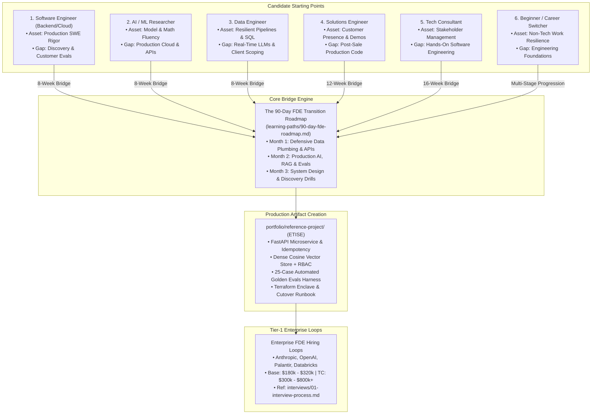

# Forward Deployed Engineering Learning Paths: The Master Transition Portal

This portal serves as the authoritative architectural master index for the **Learning Paths & Career Transitions Pillar** of the Forward Deployed Engineering (FDE) Field Guide.

Transitioning into Forward Deployed Engineering represents one of the highest-leverage career pivots in technology. Independent labor analytics from Lightcast (*Fortune*, September 2026) reveals that advertised FDE median salaries exceed **$188,000**, commanding a **~30% cash salary premium** over traditional software engineers ($145,000). At frontier AI labs and enterprise platforms (Anthropic, Palantir, OpenAI), senior FDE total compensation packages reach **$400,000 to $800,000+**.

The market pays this premium because the **dual-threat engineer**—combining hardened production cloud engineering with executive client presence and quantitative AI evaluation discipline—is exceptionally rare. In our empirical dataset of 146 deduplicated 2026 enterprise FDE postings, **0.0% of roles are entry-level or junior**. You cannot "game" an FDE transition with superficial prompt tweaks or toy demos; you must methodically close your specific technical and customer-facing gaps through verifiable proof-of-work.

This portal synthesizes six distinct background routes and the intensive 90-day transition curriculum into a unified, actionable execution framework.

---

## 1. Architectural Learning Paths Topology

The transition paths in this pillar converge into a common curriculum engine, leading to the creation of hardened portfolio artifacts and successful conversion in tier-1 hiring loops:



---

## 2. Pillar Guide Syntheses & Transition Blueprints

### 1. [The 90-Day FDE Transition Roadmap](90-day-fde-roadmap.md)
*An intensive, week-by-week curriculum synthesizing FDE Academy masterclasses and enterprise hiring rubrics.*
- **Month 1: Enterprise Engineering & Data Plumbing (Weeks 1 to 4)**:
  - Week 1: Production Python, Pydantic V2 schema validation, and defect-accounting CSV/JSON parsers ([interviews/code/parser.py](../interviews/code/parser.py)).
  - Week 2: Resilient API integrations, HTTP idempotency keys, exponential backoff with full jitter, and sliding-window rate limiters ([interviews/code/resilient_client.py](../interviews/code/resilient_client.py)).
  - Week 3: Relational schemas, schema drift alarms, and zero-downtime expand-contract database migrations.
  - Week 4: Containerization, Docker multi-stage builds, and AWS/Azure zero-egress VPC networking.
- **Month 2: Production AI Systems & Deterministic Evaluation (Weeks 5 to 8)**:
  - Week 5: Advanced Hybrid RAG fusing dense embeddings with BM25 lexical search via Reciprocal Rank Fusion ($k = 60$).
  - Week 6: Quantitative offline evaluation harnesses, RAG triad metrics, and Cohen's Kappa agreement ($\kappa \ge 0.85$).
  - Week 7: Bounded ReAct state machines, Model Context Protocol (MCP), and PII de-identification vaults.
  - Week 8: OpenTelemetry GenAI dual-plane telemetry, token cost attribution, and drift monitoring (PSI $< 0.10$).
- **Month 3: System Design, Discovery & Interview Execution (Weeks 9 to 12)**:
  - Week 9: In-VPC customer system design, AWS PrivateLink interface endpoints, and vLLM GPU memory sizing equations.
  - Week 10: Live customer discovery role-plays, executive pushback defense, and 30-point PRR readiness gates.
  - Week 11: 4-hour take-home assignment drill and production code hardening.
  - Week 12: Behavioral ownership stories (STAR format) and offer negotiation benchmarking.

---

### 2. [From Software Engineer](from-software-engineer.md)
*The most direct transition: adding customer discovery, expectation management, and AI evaluations to production coding.*
- **Inherent Asset**: Production software engineering rigor (the 90.4% requirement in job postings). You write review-ready, unit-tested, concurrent code that survives real deployments.
- **Primary Gaps**: Requirements extraction from messy business stakeholders (52.0% requirement), quantitative AI evaluation discipline (49.0%), and customer-facing incident communication.
- **Execution Blueprint**: Reframe internal cross-functional technical leadership as customer proxies; build an In-VPC Hybrid RAG pipeline with a golden evaluation harness to prove AI fluency.

---

### 3. [From AI / ML Engineer](from-ai-ml-engineer.md)
*Bridging from offline models to client-constrained production delivery.*
- **Inherent Asset**: Foundation model mechanics, loss functions, embedding vector spaces, and evaluation metrics.
- **Primary Gaps**: Enterprise integration plumbing (64.0% requirement), Docker containerization, REST/gRPC API design, and deploying software inside customer cloud accounts (AWS PrivateLink).
- **Execution Blueprint**: Move out of Jupyter notebooks; package an extraction or classification model into a hardened FastAPI microservice with Pydantic validation, Redis rate-limiting, and an automated Docker test suite.

---

### 4. [From Data Engineer](from-data-engineer.md)
*Leveraging pipeline resilience and schema mastery to own the hardest 80% of customer deployments.*
- **Inherent Asset**: Complex data transformations, SQL, schema drift handling, Kafka streams, and distributed backfills—the exact unglamorous data plumbing that breaks 95% of enterprise AI pilots.
- **Primary Gaps**: The LLM application layer (prompt engineering, context window management, caching) and executive-facing consultative discovery.
- **Execution Blueprint**: Bridge batch ETL into real-time context retrieval; build a high-throughput webhook ingestion engine with dead-letter queue replay and structured LLM extraction.

---

### 5. [From Solutions Engineer](from-solutions-engineer.md)
*Upgrading pre-sales demo craft to post-sales production engineering ownership.*
- **Inherent Asset**: High customer empathy, exceptional discovery instincts, demo presentation craft, and commercial awareness.
- **Primary Gaps**: Writing production-grade software that survives code review and on-call rotations; deep systems debugging under production constraints.
- **Execution Blueprint**: Transition from pre-sales POCs to hardened code; master asynchronous Python, write rigorous unit and integration tests with `pytest`, and build an end-to-end production microservice.

---

### 6. [From Consultant](from-consultant.md)
*Transitioning from PowerPoint decks and advisory scoping to hands-on software engineering.*
- **Inherent Asset**: Executive presence, stakeholder management, scoping ambiguous business requests, and structured problem decomposition.
- **Primary Gaps**: Direct hands-on keyboard ownership: writing code, managing Git branches, handling CI/CD failures, and debugging production network partitions.
- **Execution Blueprint**: Build a verifiable software track record; master Git workflows, build production APIs, and pair your consultative communication with direct engineering execution.

---

### 7. [Beginner to FDE](beginner-to-fde.md)
*The realistic multi-stage progression for aspiring engineers without professional software experience.*
- **The Honest Market Reality**: With 0.0% of empirical postings targeting junior candidates, attempting to jump directly into a senior FDE role at Anthropic or Palantir is unrealistic.
- **The 4-Stage Bridge Progression**:
  1. *Stage 1 (Months 1–3)*: Master Python fundamentals, data structures, and FastAPI with `pytest`.
  2. *Stage 2 (Months 4–6)*: Build an enterprise-grade portfolio project with automated golden evaluations.
  3. *Stage 3 (Months 7–18)*: Land an adjacent technical first role (Technical Support Engineer, Implementation Consultant, or Solutions Engineer).
  4. *Stage 4 (Month 18+)*: Leverage real-world customer production deployment experience to transition into a full Forward Deployed Engineer role.

---

## 3. The Comparative Transition Archetype Matrix

```
+-------------------+-----------------------+-------------------------+-------------+-------------------------+---------------------------------+
| Starting Archetype| Existing Superpower   | Primary Skill Deficit   | Est. Window | 1st Portfolio Archetype | Key Milestone Deliverable       |
+-------------------+-----------------------+-------------------------+-------------+-------------------------+---------------------------------+
| Software Engineer | Production SWE Rigor, | Discovery, Client Comm, | 8 Weeks     | In-VPC Hybrid RAG with  | Golden evaluation harness with  |
| (Backend / Cloud) | CI/CD, Concurrency    | AI Evaluation Frameworks|             | Citation Grounding      | 100% citation grounding metrics |
+-------------------+-----------------------+-------------------------+-------------+-------------------------+---------------------------------+
| AI / ML Engineer  | Model Architectures,  | Enterprise Integration, | 8 Weeks     | Unstructured Intake &   | Hardened FastAPI microservice   |
| (Research / DS)   | Evals, Math Fluency   | Docker, PrivateLink VPC |             | Structured Extraction   | with Docker & Pydantic schemas  |
+-------------------+-----------------------+-------------------------+-------------+-------------------------+---------------------------------+
| Data Engineer     | Resilient Pipelines,  | Real-Time LLM Layer,    | 8 Weeks     | High-Throughput Event   | Bidirectional webhook pipeline  |
| (ETL / Big Data)  | SQL, Schema Drift     | Executive Presence      |             | Ingestion & DLQ Replay  | with Redis sliding rate limiter |
+-------------------+-----------------------+-------------------------+-------------+-------------------------+---------------------------------+
| Solutions Engineer| Customer Empathy,     | Post-Sale Production    | 12 Weeks    | Bounded ReAct Agent with| Complete microservice passing 30|
| (Pre-Sales Tech)  | Discovery, Demos      | Code, On-Call Survival  |             | State Machine Invariants| unit/integration pytest cases   |
+-------------------+-----------------------+-------------------------+-------------+-------------------------+---------------------------------+
| Tech Consultant   | Stakeholder Alignment,| Hands-On Keyboard Dev,  | 16 Weeks    | ETISE Compliance Triage | Public GitHub repo with passing |
| (Big 4 / MBB)     | Scoping, Deck Craft   | Git PRs, Systems Debug  |             | Reference Architecture  | tests, Docker, and customer ADR |
+-------------------+-----------------------+-------------------------+-------------+-------------------------+---------------------------------+
| Beginner / Career | High Agency, Domain   | Production Engineering, | 12 - 18     | Command-Line Data Parser| Land an adjacent technical role |
| Changer           | Experience, Hunger    | CS Fundamentals, Cloud  | Months      | & Defect Report Tool    | (Support / Implementation Eng)  |
+-------------------+-----------------------+-------------------------+-------------+-------------------------+---------------------------------+
```

---

## 4. The Readiness Self-Audit Protocol: 5 Proof-of-Work Invariants

Before submitting applications to tier-1 enterprise FDE postings, rigorously evaluate your readiness against the **5 Proof-of-Work Invariants**:

```
+----+----------------------------------+-------------------------------------------------------------------------------+
| #  | Proof-of-Work Invariant          | Audit Verification Criteria                                                   |
+----+----------------------------------+-------------------------------------------------------------------------------+
| 1  | Production Microservice Rigor    | You have built and deployed an asynchronous FastAPI service enforcing strict  |
|    |                                  | Pydantic schemas, distributed rate limiting, and idempotent request handling.  |
+----+----------------------------------+-------------------------------------------------------------------------------+
| 2  | Quantitative Evaluation Harness  | You have built a standalone CLI evaluation runner executing >=25 enterprise   |
|    |                                  | golden test cases, reporting precision/recall, latency, and citation grounding|
+----+----------------------------------+-------------------------------------------------------------------------------+
| 3  | Customer Architectural Governance| You have authored a complete Architectural Decision Record (ADR) justifying   |
|    |                                  | trade-offs (e.g., in-VPC Bedrock vs local vLLM) and a cutover rollback runbook|
+----+----------------------------------+-------------------------------------------------------------------------------+
| 4  | Messy Real-World Data Parsing    | You have written defensive Python parsers that process corrupted real-world   |
|    |                                  | enterprise exports (CFPB / SEC EDGAR) without unhandled exceptions or data loss|
+----+----------------------------------+-------------------------------------------------------------------------------+
| 5  | Rehearsed Ownership Stories      | You have drafted and verbally rehearsed 6 core ownership stories (outages,    |
|    |                                  | stakeholder conflict, impossible deadlines) using the Google XYZ / STAR format|
+----+----------------------------------+-------------------------------------------------------------------------------+
```

---

## 5. Direct Codebase & Repository Integrations

Accelerate your transition by engaging directly with the runnable code and reference templates in this repository:

1. **Systems Coding Drills**:
   - Master the 6 core coding interview patterns in [`interviews/code/`](../interviews/code/) (all 23 unit tests passing).
2. **The Production Reference Template**:
   - Clone and examine the Enterprise Ticket Intake & Scoping Engine in [`portfolio/reference-project/`](../portfolio/reference-project/README.md).
3. **Compensation Benchmarking**:
   - Benchmark your target compensation against 146 empirical postings in [`job-market/02-compensation.md`](../job-market/02-compensation.md).
4. **Interview Question Preparation**:
   - Drill the 17 verified practitioner questions in [`interviews/07-question-bank.md`](../interviews/07-question-bank.md).

---

## 6. Primary Literature & Sourced Standards

- **FDE Academy**: (2026). *The Forward Deployed Engineering Master Curriculum: Enterprise Deployment and Field Execution*.
- **Alexey Grigorev**: (2026). *AI Engineering Field Guide: Role Taxonomy and Transition Roadmaps*.
- **Anthropic PBC**: (2026). *Applied AI Forward Deployed Engineering Job Specifications and Competency Models*.
- **Lightcast Labor Market Analytics**: (September 2026). *Emerging Tech Talent Velocity and Compensation Premiums*.
- **Google Site Reliability Engineering**: Beyer, B., et al. (2016). *Site Reliability Engineering: How Google Runs Production Systems*.
