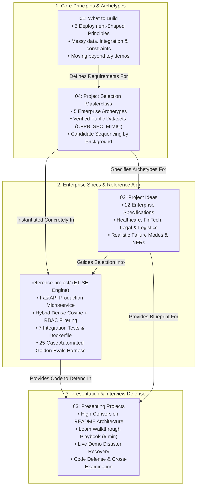

# Forward Deployed Engineering Portfolio: Production Proof-of-Work, Archetypes, and Reference Implementations

This portal serves as the authoritative architectural master index for the **Portfolio Pillar** of the Forward Deployed Engineering (FDE) Field Guide.

An FDE portfolio is fundamentally different from a traditional software engineering or machine learning portfolio. In enterprise FDE hiring loops, submitting a GitHub repository with a toy Streamlit chatbot, an unconstrained LangChain wrapper, or an exploratory Jupyter notebook triggers immediate disqualification. Senior hiring managers at Anthropic, OpenAI, Palantir, and Databricks do not evaluate whether a candidate can prompt an LLM; they evaluate whether the candidate can **build and deploy hardened production systems under messy data constraints and hostile enterprise security boundaries**.

Across our empirical dataset of 146 deduplicated 2026 enterprise FDE job postings, **Building & Deploying Production Systems appears in 90.4% of postings**, **System Integration & APIs in 64.0%**, and **Evaluation & Telemetry in 49.0%**. This pillar establishes the engineering standards, project archetypes, and verified reference implementations required to build an unassailable proof-of-work portfolio.

---

## 1. Architectural Portfolio Knowledge Topology

The four guides and the production reference application in this pillar form an integrated evidence lifecycle: selecting an enterprise archetype, building against real-world datasets, hardening the production codebase, and defending the architecture during interview loops.



---

## 2. Pillar Guide Syntheses & Technical Invariants

### 1. [What to Build](01-what-to-build.md)
*The five principles that make an engineering project deployment-shaped rather than academic.*
- **Principle 1: Solves a Real Customer Problem** - Targets an urgent, measurable enterprise workflow (e.g., automated regulatory compliance triage, clinical document routing) rather than a generic personal assistant.
- **Principle 2: Uses Real, Messy Data** - Rejects synthetic benchmark clean text in favor of real enterprise public data with corrupted characters, missing timestamps, and schema irregularities.
- **Principle 3: Integrates with Real Systems** - Implements bidirectional webhooks, REST APIs, and database event streams with token-bucket rate limiting and idempotency keys.
- **Principle 4: Evaluates Quantitatively** - Incorporates a standalone evaluation harness testing golden test sets with statistical metrics (Cohen's Kappa $\ge 0.85$, citation grounding $= 100\%$) rather than manual inspection.
- **Principle 5: Ships Under Real Constraints** - Designed to execute within an isolated, zero-egress network boundary (AWS PrivateLink enclave or local containerized vLLM serving).

---

### 2. [Project Selection Masterclass](04-project-selection-masterclass.md)
*The 5 enterprise archetypes, why basic AI projects fail, verified public datasets, and candidate background sequencing.*
- **Why Basic Projects Fail in Senior FDE Loops**:
  - *The Toy Chatbot Trap*: Open-ended chat with zero schema constraints.
  - *The Un-evaluated Pipeline*: Claiming high accuracy without a golden test set or precision/recall metrics.
  - *The Green-field Cloud Fantasy*: Assuming unrestricted public internet egress and infinite GPU budgets.
- **Verified Real-World Public Datasets**:
  - *Financial Services*: CFPB Consumer Complaint Database (over 4.5M real-world consumer financial disputes with messy narratives).
  - *Regulatory & Legal*: SEC EDGAR Financial Filings (10-K, 10-Q multi-page enterprise disclosures with complex tables).
  - *Healthcare*: MIMIC-IV Clinical Database (de-identified clinical records with unstructured clinician notes).
- **Candidate Background Sequencing**:
  - *Software Engineers*: Prioritize Archetype 2 (In-VPC Hybrid RAG) to demonstrate AI evaluation fluency.
  - *AI / Data Scientists*: Prioritize Archetype 4 (Event Ingestion) or the Reference Project to demonstrate Docker, FastAPI, and production reliability.

---

### 3. [Project Ideas](02-project-ideas.md)
*Twelve complete enterprise specifications with built-in ambiguity, realistic failure modes, and architectural trade-offs across 4 verticals.*
- **Vertical 1: Healthcare & Life Sciences**
  - Clinical Trial Eligibility Matcher (HIPAA boundaries, HL7 FHIR parsing).
  - Prior Authorization Triage Pipeline (EHR integrations, zero-grounding circuit breakers).
  - De-Identification & Anonymization Enclave (Presidio PII vault, surrogate tokenization).
- **Vertical 2: FinTech & Banking**
  - Real-Time Transaction Dispute Classifier (CFPB dataset, idempotent webhook replay).
  - SEC Regulatory Disclosure Difference Engine (Table extraction, semantic diffing).
  - In-VPC Financial Crime Alert Scorer (Zero-egress AWS PrivateLink, AML rules).
- **Vertical 3: Legal & Regulatory**
  - Contract Redline & Deviation Extractor (Clause boundary parsing, risk scoring).
  - Multi-Jurisdiction Policy Compliance Gateway (State-by-state regulatory routing).
  - Freedom of Information Act (FOIA) Redaction Pipeline (Strict zero-leakage redaction).
- **Vertical 4: Supply Chain & Manufacturing**
  - Automated Bill of Materials (BOM) Reconciliation (ERP dirty data normalization).
  - Predictive Equipment Failure Telemetry Ingester (High-throughput event streaming).
  - Logistics Exception & Customs Clearance Triage (Multi-language document extraction).

---

### 4. [Presenting Projects](03-presenting-projects.md)
*Technical write-ups, README architecture, video walkthroughs, and code defense.*
- **The High-Conversion README Architecture**:
  - Top 10%: Sourced Problem Statement, Architecture Sequence Diagram, and Quantitative Evaluation Scorecard.
  - Middle 40%: Verification & Quick-Start (`docker-compose up`, `pytest`, `run_evals.py`).
  - Bottom 50%: Architectural Decision Record (ADR) justifying trade-offs and operational cutover runbook.
- **The 5-Minute Loom Walkthrough Structure**:
  - Minute 1: The enterprise business problem and operational constraint.
  - Minute 2: Architectural topology and boundary defense.
  - Minute 3: Terminal demo running the automated golden evaluation harness.
  - Minute 4: Deep dive into the hardest engineering failure mode resolved.
  - Minute 5: Lessons learned and product feedback loop.

---

### 5. [Enterprise Reference Project (ETISE)](reference-project/README.md)
*Production implementation of an intake-to-resolution compliance triage engine with hybrid search, dense vector cosine similarity, RBAC ACLs, golden evaluation harness, and Docker.*
- **File Structure & Core Components**:
  - [`src/api/server.py`](reference-project/src/api/server.py): Hardened FastAPI application with Pydantic schemas, tenant rate limiting, and exception queues.
  - [`src/engine/agent.py`](reference-project/src/engine/agent.py): Deterministic state machine compliance agent routing tickets.
  - [`src/engine/vector_store.py`](reference-project/src/engine/vector_store.py): Dense vector store with cosine similarity and permission-aware RBAC filtering.
  - [`tests/test_server.py`](reference-project/tests/test_server.py): 7 passing integration tests validating API endpoints.
  - [`evals/run_evals.py`](reference-project/evals/run_evals.py): Standalone CLI evaluation harness executing 25 enterprise test cases.
  - [`cutover_runbook.md`](reference-project/cutover_runbook.md): Production cutover schedule, rollback triggers, and monitoring runbooks.

---

## 3. The 5 Enterprise Project Archetypes Comparison Matrix

```
+----+-----------------------+---------------------+-------------------------+-------------------------+---------------------------------+
| #  | Enterprise Archetype  | Complexity Profile  | Core Tech Stack         | Verified Real Dataset   | Evaluator Interview Signal      |
+----+-----------------------+---------------------+-------------------------+-------------------------+---------------------------------+
| 1  | Unstructured Intake & | Moderate Systems    | FastAPI, Pydantic V2,   | SEC EDGAR 10-K Filings, | Demonstrates schema enforcement,|
|    | Structured Extraction | High Schema Rigor   | Instructor, Presidio    | CFPB Financial Disputes | self-healing retry, and data PII|
+----+-----------------------+---------------------+-------------------------+-------------------------+---------------------------------+
| 2  | In-VPC Hybrid RAG with| High Architecture   | Qdrant / pgvector, BM25,| MIMIC-IV Clinical Notes,| Proves understanding of retrieval|
|    | Citation Grounding    | High Data Governance| Cohere Rerank, PrivateLink| Gov Regulatory Statutes | latency, recall, and zero halluc|
+----+-----------------------+---------------------+-------------------------+-------------------------+---------------------------------+
| 3  | Bounded ReAct Agent   | High State Machine  | Python Asyncio, SQLite, | Multi-System ERP / CRM  | Validates deterministic tool use|
|    | with State Machine    | Guardrail Invariants| MCP Protocol, Pydantic  | Synthetic Event Logs    | and loops capped at <=5 turns.  |
+----+-----------------------+---------------------+-------------------------+-------------------------+---------------------------------+
| 4  | High-Throughput Event | High Concurrency    | Redis Streams, Kafka,   | Bitext Customer Support,| Shows distributed rate limiting,|
|    | Ingestion & DLQ Replay| High Resilience     | Celery / Arq, PostgreSQL| Telemetry Clickstreams  | idempotency, and backpressure.  |
+----+-----------------------+---------------------+-------------------------+-------------------------+---------------------------------+
| 5  | Multi-Tenant Egress   | High Networking     | Envoy / Nginx, Presidio,| Enterprise Corporate    | Shows mastery of customer VPC   |
|    | Boundary Gateway      | High InfoSec Rigor  | Terraform, AWS PrivateLink| Egress Proxy Logs     | enclaves and zero-egress policy.|
+----+-----------------------+---------------------+-------------------------+-------------------------+---------------------------------+
```

---

## 4. Verified Reference Implementation & Execution Commands

Candidates can clone and run our verified reference application (`portfolio/reference-project/`) as a concrete baseline template:

### 1. Execute Integration Test Suite
```bash
python -m pytest portfolio/reference-project/tests/ -v
```
*Expected Output*:
```text
portfolio/reference-project/tests/test_server.py::test_health_check PASSED
portfolio/reference-project/tests/test_server.py::test_process_ticket_automated_dispatch PASSED
portfolio/reference-project/tests/test_server.py::test_idempotent_replay PASSED
portfolio/reference-project/tests/test_server.py::test_exception_queue_routing_and_operator_resolution PASSED
portfolio/reference-project/tests/test_server.py::test_hybrid_knowledge_search PASSED
portfolio/reference-project/tests/test_server.py::test_permission_aware_rbac_filtering PASSED
portfolio/reference-project/tests/test_server.py::test_dense_vector_cosine_similarity PASSED
============================== 7 passed in 0.35s ==============================
```

### 2. Execute Automated Golden Evaluation Harness
```bash
python portfolio/reference-project/evals/run_evals.py
```
*Expected Output*:
```text
======================================================================
ETISE AUTOMATED GOLDEN EVALUATION HARNESS
Executing 25 enterprise test cases against compliance engine...
======================================================================
SCORECARD SUMMARY
----------------------------------------------------------------------
Total Test Cases:            25
Category Classification:     25/25 (100.0%) [SLA Target: >= 88.0%]
Severity Classification:     25/25 (100.0%) [SLA Target: >= 90.0%]
Decision Gating Accuracy:    25/25 (100.0%)
Citation Grounding Rate:     41/41 (100.0%) [Target: 100.0%]
----------------------------------------------------------------------
LATENCY DISTRIBUTION: p50: 0.16ms, p90: 0.21ms, p95: 0.25ms, p99: 0.27ms
======================================================================
RESULT: ALL ENTERPRISE SLA ACCEPTANCE CRITERIA PASSED.
```

---

## 5. Situational Portfolio Selection & Defense Matrix

When preparing to present and defend your portfolio before hiring committees, use this matrix for tactical alignment:

```
+------------------------------------+------------------------------------+-------------------------------------------+
| Interview Defense Dilemma          | Root Skepticism of Interviewer     | Prescribed Candidate Tactical Response    |
+------------------------------------+------------------------------------+-------------------------------------------+
| "Why build custom Python code      | Suspects candidate suffers from    | Explain latency, cost, and p99 variance:  |
| instead of using LangChain / Llama | 'not-invented-here' syndrome or    | LangChain abstractions add un-instrumented|
| Index out-of-the-box?"             | lacks awareness of standard tools  | overhead, break Pydantic validation, and  |
|                                    |                                    | fail in air-gapped enclaves. Ref: 04 (§1) |
+------------------------------------+------------------------------------+-------------------------------------------+
| "How do you know this model is safe| Evaluator is testing whether you   | Point directly to the golden evaluation   |
| to deploy into production without  | rely on 'vibes' or empirical math  | harness: 25-case regression suite with    |
| hallucinating customer answers?"   |                                    | 100% citation grounding and Cohen's Kappa |
|                                    |                                    | agreement against SME ground truth.       |
+------------------------------------+------------------------------------+-------------------------------------------+
| "How would this architecture scale | Testing whether project is a toy   | Walk through the Dockerfile, connection   |
| if our customer sends 500 requests | single-threaded script or a true   | pooling caps, Redis rate-limiting, and    |
| per second during peak hours?"     | concurrent microservice            | horizontal pod autoscaling (KEDA) rules.  |
|                                    |                                    | Ref: reference-project/src/api/server.py  |
+------------------------------------+------------------------------------+-------------------------------------------+
| "What was the hardest failure mode | Evaluating operational maturity:   | Discuss data corruption in raw inputs or  |
| you encountered while building this| Have you actually debugged live    | downstream provider 429 quota exhaustion, |
| system?"                           | edge-case systems?                 | and how your circuit breaker mitigated it.|
+------------------------------------+------------------------------------+-------------------------------------------+
```

---

## 6. Primary Literature & Sourced Standards

- **Alexey Grigorev (Author, AI Engineering Field Guide)**: *Designing Machine Learning Systems and Building Proof-of-Work Portfolios for Forward Deployed Roles*.
- **Anthropic PBC (Applied AI Engineering)**: *Forward Deployed Engineering Operating Standards: Repeatable Production Architectures and Customer Delivery*.
- **Google Site Reliability Engineering (SRE)**: *Production Readiness Reviews (PRRs) and Non-Functional Engineering Requirements*.
- **Consumer Financial Protection Bureau (CFPB)**: *Public Consumer Complaint Database API and Narrative Telemetry*.
- **US Securities and Exchange Commission (SEC)**: *EDGAR System Form 10-K and 10-Q Financial Document Filing Specifications*.
