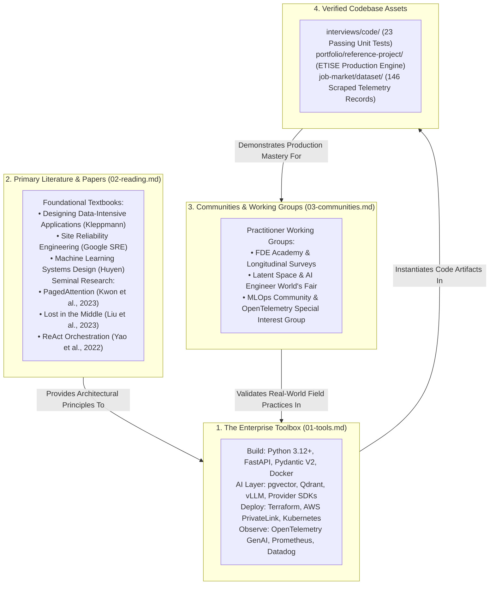

# Forward Deployed Engineering Resources: Tools, Literature, and Ecosystem

This portal serves as the authoritative architectural master index for the **Resources, Tools, and Literature Pillar** of the Forward Deployed Engineering (FDE) Field Guide.

The Forward Deployed Engineering tooling philosophy is grounded in a singular operational invariant: **boring, auditable, and battle-tested technologies always defeat fashionable, fragile abstractions in customer deployments**. When an FDE embeds inside an enterprise client's VPC, the customer's Site Reliability Engineering (SRE) and InfoSec teams will not permit unverified, rapidly breaking frameworks. Furthermore, when the FDE engagement concludes, the customer's on-call engineers must maintain the system at 2:00 AM without vendor hand-holding.

Across our empirical dataset of 146 deduplicated 2026 enterprise FDE job postings, hiring requirements reflect this operational discipline: **Python appears in 91.0% of postings**, **Docker in 51.0%**, **AWS in 47.0%**, **Kubernetes in 35.0%**, **Azure in 34.0%**, and **Terraform in 31.0%**. This portal curates the definitive toolbox, primary literature, and practitioner networks that define modern enterprise AI deployment.

---

## 1. Architectural Resources Ecosystem Topology

The resources in this pillar form a cohesive, multi-layered knowledge system supporting an engineer from foundational theory through production tooling, code artifacts, and professional peer networks:



---

## 2. Pillar Guide Syntheses & Operational Standards

### 1. [The FDE Toolbox](01-tools.md)
*Build, deploy, evaluate, and observe tooling, organized by engagement lifecycle phases.*
- **Build Phase**: Python 3.12+ as the default language (91.0% of postings); `FastAPI` for asynchronous HTTP APIs; `Pydantic V2` for strict runtime schema boundaries; `Docker` multi-stage containers for environment parity.
- **The AI Application Layer**: Direct provider SDKs ([Anthropic](https://docs.anthropic.com), [OpenAI](https://platform.openai.com/docs)) over un-instrumented third-party wrappers; `pgvector` for in-database vector storage; `Qdrant` for high-performance HNSW retrieval; `vLLM` for self-hosted in-VPC model execution.
- **Deploy Phase**: Cloud console fluency across AWS (47.0%), GCP (38.0%), and Azure (34.0%); `Terraform` / `OpenTofu` for declarative Infrastructure as Code (31.0%); AWS Systems Manager (SSM) and PrivateLink endpoints for zero-egress connectivity.
- **Evaluate Phase**: Standalone golden evaluation test suites; automated regression CLI runners; `MLflow` for experiment tracking; statistical Cohen's Kappa calculations ($\kappa \ge 0.85$).
- **Observe Phase**: `OpenTelemetry` GenAI semantic conventions; dual-plane telemetry emitting both infrastructure metrics (CPU/RAM) and model metrics (TTFT, tokens, cost) to `Prometheus` and `Datadog`.

---

### 2. [Curated Reading List](02-reading.md)
*Foundational books, seminal research papers, and industry reports.*
- **Essential Systems Textbooks**:
  - *Designing Data-Intensive Applications (DDIA)* by Martin Kleppmann - The definitive foundation for distributed systems, replication, partitioning, and idempotency.
  - *Site Reliability Engineering (SRE)* by Google (Beyer et al.) - The operational blueprint for production readiness reviews (PRRs), error budgets, and incident runbooks.
  - *Designing Machine Learning Systems* by Chip Huyen - End-to-end ML engineering, feature stores, data pipelines, and drift detection.
- **Seminal AI Research Papers**:
  - *Efficient Memory Management for Large Language Model Serving with PagedAttention* (Kwon et al., SOSP 2023) - The mathematical foundation of vLLM and KV cache memory pooling.
  - *Lost in the Middle: How Language Models Use Long Contexts* (Liu et al., 2023) - Explains context rot and U-shaped recall degradation curves.
  - *ReAct: Synergizing Reasoning and Acting in Language Models* (Yao et al., 2022) - The state machine pattern for tool-use loops.
  - *Reciprocal Rank Fusion (RRF)* (Cormack et al., 2009) - Mathematical fusion of dense vector and BM25 lexical search.
- **Authoritative Industry Reports**:
  - *The GenAI Divide: State of AI in Business 2025* (MIT NANDA, reported in *Fortune*) - Landmark empirical study revealing that 95% of enterprise AI pilots fail to deliver P&L impact.
  - *Forward Deployed Engineers: Silicon Valley Job Growth* (Lightcast / *Fortune*, September 2026) - Empirical labor analytics showing >1,000% YoY growth and $188,000 median advertised salary.

---

### 3. [Communities and Practitioner Voices](03-communities-and-people.md)
*Where Forward Deployed Engineers actively share production war stories and deployment patterns.*
- **Practitioner Communities**:
  - *FDE Academy & Longitudinal Trackers* - Dedicated forward deployed engineering community tracking leveling, compensation, and customer deployment playbooks.
  - *Latent Space & AI Engineer World's Fair* - The primary engineering discourse hub for applied AI systems, context windows, and model serving.
  - *MLOps Community & OpenTelemetry Special Interest Group (SIG)* - Production deployment architectures, containerization, and GenAI observability standards.
- **Voices to Follow**:
  - *Alexey Grigorev* (Lead, DataTalks.Club; Author, AI Engineering Field Guide) - Practical machine learning systems and FDE competency frameworks.
  - *Swyx (Shawn Wang)* & *Alessio Fanelli* (Latent Space) - Deep technical analysis of enterprise AI infrastructure, model serving, and tool protocols.
  - *Chip Huyen* - Production machine learning systems, real-time streaming, and evaluation methodology.
  - *Simon Willison* - Prompt injection defense, local model execution, and LLM security boundaries.
  - *Nehal Vyas & Om Bharatiya* - Founding forward deployed engineering practitioners codifying enterprise interview rubrics and customer delivery.

---

## 3. The Enterprise FDE Production Tech Stack Matrix

```
+-----------------------+-------------------------+-------------------------+-------------------------+---------------------------------+
| Functional Category   | Enterprise Gold Standard| Production Alternative  | Adoption Rate (Postings)| Operational Invariant / Caveat  |
+-----------------------+-------------------------+-------------------------+-------------------------+---------------------------------+
| Programming Language  | Python 3.12+            | TypeScript / Go / Java  | 91.0% (Python)          | Mandates strong typing (mypy) & |
|                       | (Type-hinted, Pydantic) | (Anthropic Dual-Lang)   |                         | Pydantic V2 schema validation.  |
+-----------------------+-------------------------+-------------------------+-------------------------+---------------------------------+
| API Web Framework     | FastAPI                 | Litestar / Go Gin       | Universal standard      | Asynchronous endpoints with     |
|                       | (Uvicorn / Gunicorn)    | (High-performance APIs) | in Python AI services   | connection pooling and timeouts.|
+-----------------------+-------------------------+-------------------------+-------------------------+---------------------------------+
| In-VPC Vector Database| pgvector                | Qdrant / Weaviate       | High (Postgres Default) | Use pgvector when Postgres exists|
|                       | (PostgreSQL Extension)  | (Dedicated HNSW Engine) | 52.0% (RAG Requirement)| to minimize new service approval|
+-----------------------+-------------------------+-------------------------+-------------------------+---------------------------------+
| Local Model Serving   | vLLM                    | TensorRT-LLM / TGI      | Industry standard for   | Memory formula: Model Weights + |
|                       | (PagedAttention)        | (NVIDIA Optimizations)  | in-VPC open-weight LLMs | KV Cache pool + 25% CUDA buffer.|
+-----------------------+-------------------------+-------------------------+-------------------------+---------------------------------+
| Cloud Networking      | AWS PrivateLink         | Azure Private Endpoints | Required for Topologies | IGW-less VPCs; zero external    |
|                       | (Interface Endpoints)   | GCP Private Service Conn| 1 and 3 (Zero-Egress)   | public internet egress allowed. |
+-----------------------+-------------------------+-------------------------+-------------------------+---------------------------------+
| Infrastructure as Code| Terraform               | OpenTofu / AWS CDK      | 31.0% of postings       | Declarative state files enable  |
| (IaC)                 | (HashiCorp Version 1.5+)| (Open-Source Fork)      |                         | customer CAB review sign-off.   |
+-----------------------+-------------------------+-------------------------+-------------------------+---------------------------------+
| Production Telemetry  | OpenTelemetry GenAI     | Prometheus / Datadog    | 49.0% (Evals & Telemetry| Dual-plane export: CPU/RAM plus |
|                       | (OTel Semantic Specs)   | (Central APM Dashboards)| requirement)            | TTFT, token counts, cost tags.  |
+-----------------------+-------------------------+-------------------------+-------------------------+---------------------------------+
| Evaluation Harness    | Standalone CLI Golden   | MLflow / DeepEval       | 49.0% (Quality & Testing| Golden sets of 50-200 cases;    |
|                       | Suite (pytest + math)   | (Experiment Tracking)   | requirement)            | Cohen's Kappa >=0.85 agreement. |
+-----------------------+-------------------------+-------------------------+-------------------------+---------------------------------+
```

---

## 4. Direct Codebase & Repository Integrations

Explore the runnable code, test suites, and empirical datasets embedded within this repository:

1. **Systems Coding Implementations**:
   - Master the 6 core systems coding challenges in [`interviews/code/`](../interviews/code/)—all validated with 23 passing `pytest` unit tests covering rate limiters, webhook receivers, and resilient clients.
2. **The Enterprise Reference Application**:
   - Inspect the Enterprise Ticket Intake & Scoping Engine (ETISE) in [`portfolio/reference-project/`](../portfolio/reference-project/README.md)—featuring 7 integration tests and a 25-case golden evaluation harness achieving 100% citation grounding.
3. **The Empirical Market Telemetry**:
   - Examine the 146 deduplicated 2026 enterprise FDE postings and automated validation suite in [`job-market/dataset/`](../job-market/dataset/README.md).

---

## 5. Primary Literature & Sourced Standards

- **Kleppmann, Martin**: (2017). *Designing Data-Intensive Applications: The Big Ideas Behind Reliable, Scalable, and Maintainable Systems*. O'Reilly Media.
- **Beyer, Betsy, et al.**: (2016). *Site Reliability Engineering: How Google Runs Production Systems*. O'Reilly Media.
- **Huyen, Chip**: (2022). *Designing Machine Learning Systems: An Iterative Process for Production-Ready Applications*. O'Reilly Media.
- **Kwon, Woosuk, et al.**: (2023). *Efficient Memory Management for Large Language Model Serving with PagedAttention*. Proceedings of SOSP '23.
- **MIT NANDA**: (2025). *The GenAI Divide: State of AI in Business 2025*. Published in *Fortune Media*.
- **National Institute of Standards and Technology**: (2020). *Security and Privacy Controls for Information Systems*. NIST SP 800-53 Rev. 5.
