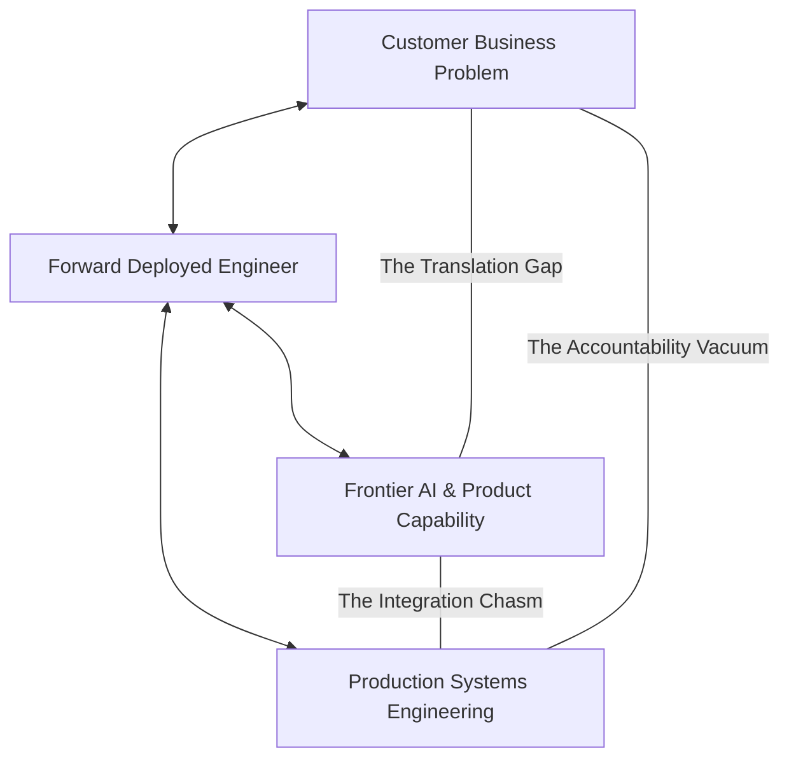

# What Is a Forward Deployed Engineer?

If you have encountered the title "Forward Deployed Engineer" (FDE) or "Forward Deployed Software
Engineer" (FDSE) in a job listing, enterprise contract, or tech discussion and want an authoritative,
evidence-based breakdown, start here.

This guide provides the sourced definition, the Palantir origin story, the generative AI boom that
turned the title into a mainstream engineering category, the operational "Startup CTO" mandate,
and the empirical job market reality backed by real-world data.

---

## 1. The Definitive Industry Definition

[Wikipedia defines the role](https://en.wikipedia.org/wiki/Forward_deployed_engineer) as follows
(verified 2026):

> *"A forward-deployed engineer (FDE), also called a forward-deployed software engineer (FDSE),
> is a customer-facing software engineer who develops and deploys software within a client company,
> often working alongside the client's employees for a defined period of time."*

Three distinct components of this definition define the operational reality of the job:

1. **Customer-Facing**: The engineer interacts directly with the end users, operators, and executive
   sponsors whose pain is being solved—regularly, in real time, without intermediary account managers.
2. **Develops and Deploys Software**: This is deeply technical software engineering, not high-level
   advisory consulting or slide-deck architecture. The primary deliverable is working code running
   in production.
3. **Within a Client Company**: The engineering takes place inside the customer's enterprise infrastructure,
   behind their firewalls, subject to their security reviews, legacy database constraints, and organizational
   politics.

---

## 2. The Triangular Bridge Mental Model

The Forward Deployed Engineer is the structural bridge connecting three previously disconnected
domains:



```
                     THE TRIANGULAR BRIDGE MENTAL MODEL
                     
                       [ Customer Business Reality ]
                       (Legacy Schemas, Politics, SLAs)
                                    / \
                                   /   \
                                  /     \
                                 /  FDE  \
                                /         \
    [ Frontier Product Capability ] ------- [ Production Engineering Rigor ]
    (LLMs, Vector DBs, MCP Servers)         (Latency, CI/CD, Idempotency, SRE)
```

Remove any one vertex of this triangle, and the role collapses into a traditional title:
- **Remove Customer Business Reality**: You have a **Product Engineer** building features in an isolated vendor sandbox without customer visibility.
- **Remove Production Engineering Rigor**: You have a **Management Consultant** delivering strategy decks and workflow diagrams that never compile.
- **Remove Frontier Product Capability**: You have a **Sales Engineer** or Solutions Architect delivering pre-sales slides and canned throwaway demos.

The Forward Deployed Engineer is the rare practitioner who operates across all three vertices
simultaneously, owning the trajectory from ambiguous operational pain to live production software.

---

## 3. Origins & The Generative AI Explosion

### Palantir Pioneered the Blueprint (2004–2020)

Palantir Technologies invented and popularized the FDSE title ([Wikipedia](https://en.wikipedia.org/wiki/Forward_deployed_engineer)).
The philosophy behind the role was captured directly by Palantir leadership in Fortune's analysis
of the FDE market ([Fortune, September 2026](https://fortune.com/2026/09/03/forward-deployed-engineers-fast-growing-six-figure-silicon-valley-job-integrate-ai-with-customers-tech-careers-palantir)):

> *"We hired the best software engineers in the world, ejected them from the comfort of a Palo Alto
> office, and dropped them in remote locations to spend their days in the service of incredibly
> skilled but non-technical [customers]."*

Palantir's FDSE job description codified the role's autonomous, cross-functional nature:

> *"As an FDSE, your responsibilities look similar to those of a startup CTO: you'll work in small
> teams with minimal supervision and own end-to-end execution of high stakes projects. Your day might
> span discussing architecture with fellow engineers, wrangling massive-scale data, coding a custom
> web app, speaking with customer executives, or establishing strategy for your team."*

### The Generative AI Boom Made It Infrastructure (2024–2026)

While Palantir invented the title for big-data intelligence, the Generative AI revolution turned
it into a mandatory hiring category across the entire software industry. Frontier AI labs (Anthropic,
OpenAI, Cohere), hyperscalers (AWS, Microsoft Azure, Google Cloud), and growth-stage AI startups
faced an identical commercial roadblock: **enterprises could not turn raw foundation models into
working business systems on their own**.

- **Anthropic** established dedicated FDE teams to build production Claude applications inside customer
  VPCs, authoring Model Context Protocol (MCP) servers and agent skills with white-glove support
  ([Anthropic FDE job posting](https://job-boards.greenhouse.io/anthropic/jobs/5302966008)).
- **The New Stack (May 2026)** noted that FDEs have become the critical operational link for integrating
  agentic workflows, monitoring production inference, and hardening systems against prompt drift
  ([The New Stack](https://thenewstack.io/forward-deployed-engineers-ai)).
- **Deloitte & Global SIs** began reselling the title, recruiting "Anthropic Forward Deployed Engineers"
  to embed within government and enterprise clients ([Deloitte Careers, 2026](https://apply.deloitte.com)).

---

## 4. Deconstructing the "Startup CTO" Mandate

The startup-CTO comparison is the most accurate industry shorthand for the FDE role. In an enterprise
client deployment, the Lead FDE must execute across five distinct disciplines:

```
+-----------------------------------------------------------------------------------+
|                        THE 5 DISCIPLINES OF THE FDE STARTUP CTO                   |
+-----------------------------------------------------------------------------------+
| 1. Boundary Architecture & Security Clearance                                     |
|    Design VPC topologies, threat models, RBAC filters, and CMEK encryption keys.  |
+-----------------------------------------------------------------------------------+
| 2. Data Pipeline & Schema Forensic Archaeology                                    |
|    Uncover corrupted UTF-8 BOMs, parse messy legacy tables, trace missing keys.   |
+-----------------------------------------------------------------------------------+
| 3. Production Full-Stack & Integration Coding                                     |
|    Build resilient REST/gRPC gateways, handle rate limits, enforce idempotency.   |
+-----------------------------------------------------------------------------------+
| 4. Executive C-Suite & Sponsor Translation                                        |
|    Translate latency budgets into P&L savings; deliver bad news on a clock.       |
+-----------------------------------------------------------------------------------+
| 5. Upstream Product Feedback & Pattern Codification                              |
|    Extract reusable customer friction and turn it into core platform primitives.   |
+-----------------------------------------------------------------------------------+
```

---

## 5. Empirical Job Market Reality

Our forensic analysis of **146 deduplicated enterprise FDE postings across 94 companies**
(scraped February to July 2026; full dataset in [`job-market/dataset/`](../job-market/dataset/fde_market_data.json))
reveals the exact ground truth of the profession:

| Empirical Market Metric | Measured Value | Market Implication |
| :--- | :--- | :--- |
| **Building Production Systems** | **90.4%** of postings | FDE is an engineering role; toy prototypes and slide decks are rejected. |
| **Direct Customer Interaction** | **88.0%** of postings | Senior technical communication is an absolute requirement, not a soft skill. |
| **Discovery & Scoping** | **52.0%** of postings | Scoping is an engineering discipline; FDEs define technical acceptance criteria. |
| **Evaluation, Testing, & Monitoring**| **49.0%** of postings | Quality assurance via golden datasets is mandatory in applied AI deployments. |
| **Entry-Level / Junior Postings** | **0.0%** (0 / 146) | Zero entry-level roles exist; the role carries a mandatory senior/staff barrier. |
| **Lightcast Advertised Median Base** | **$188,000** | Total compensation ranges from $260,000 to $380,000+ with equity and bonuses. |
| **Travel Expectations** | **9.0%** general market (~25% AI labs) | Travel is highly concentrated around integration crunches, go-lives, and war rooms. |

---

## 6. The Six Misconceptions vs Ground Truth

| Common Misconception | What People Assume | The Ground Truth Reality |
| :--- | :--- | :--- |
| **"It's just a Sales Engineer"** | Pre-sales demos, answering RFPs, carrying sales quotas. | FDEs deploy *after* the contract is signed, write production code, and carry SLA uptime accountability. |
| **"It's consulting with a laptop"** | Delivering slide decks and strategy roadmaps, then rolling off. | FDEs own the live system in production, write integration tests, and conduct operational handovers. |
| **"It's a glorified support role"** | Answering Zendesk/Jira tickets on existing software. | FDEs architect and build the system from scratch, living with the consequences of their own design. |
| **"It's a junior road-warrior job"** | Fresh college graduates traveling 80% of the year. | Zero junior postings exist (0.0%); postings require 4–8+ years of distributed systems or AI experience. |
| **"It's throwaway demo work"** | Building quick weekend hacks that get discarded. | 90.4% of postings require production-grade software that survives security, compliance, and scale. |
| **"It's an unscalable services trap"** | Building bespoke one-offs that dilute company gross margins. | Elite FDEs enforce the Rule-of-Three productization threshold, feeding patterns back to core product. |

---

## 7. The Honest Structural Trade-Offs & Downsides

The Forward Deployed Engineering discipline is exceptionally rewarding, but it presents real
structural challenges that make it unsuitable for certain engineering temperaments:

- **Urgency is Structural**: Enterprise clients buy FDE engagements because they face high-stakes,
  urgent deadlines (e.g. regulatory fines, competitive threats, legacy contract expirations). The
  pressure does not pause for personal convenience.
- **Context-Switching Cognitive Load**: You might debug a raw PostgreSQL deadlock via SSH jump host at
  9:00 AM, review an executive status dashboard with the client VP at 11:00 AM, and write Pydantic
  data-cleaning extractors at 2:00 PM.
- **Absorbing Enterprise Friction**: You will navigate corporate change-control boards (ITSM), wait
  days for firewall approvals, and operate inside locked-down Virtual Desktop Infrastructures (VDIs).
- **If You Need Long Refactoring Horizons**: If your ideal engineering experience involves spending
  six months writing a compiler in total isolation with zero meetings, you will hate this job. If you
  thrive on seeing your code impact high-stakes operations in days, it is the most exhilarating role in tech.

---

## 8. Direct Codebase Defense Implementations

The capabilities required of a Forward Deployed Engineer are embodied in executable software
throughout this repository:

| FDE Technical Discipline | Codebase Implementation Asset | Verification Suite |
| :--- | :--- | :--- |
| **Production Server & RBAC Filtering** | [`portfolio/reference-project/src/api/server.py`](../portfolio/reference-project/src/api/server.py) | `pytest portfolio/reference-project/tests/test_server.py` |
| **Empirical Golden Evaluation Harness**| [`portfolio/reference-project/evals/run_evals.py`](../portfolio/reference-project/evals/run_evals.py) | 25 real-world cases (100% citation grounding) |
| **Resilient API Client with Backoff** | [`interviews/code/resilient_client.py`](../interviews/code/resilient_client.py) | `pytest interviews/code/test_resilient_client.py` |
| **Idempotent Webhook Replay Defense** | [`interviews/code/webhook_receiver.py`](../interviews/code/webhook_receiver.py) | `pytest interviews/code/test_webhook_receiver.py` |
| **Self-Healing Structured Extractor** | [`interviews/code/structured_extractor.py`](../interviews/code/structured_extractor.py) | `pytest interviews/code/test_structured_extractor.py` |
| **Dirty Export Parser & Sanitizer** | [`interviews/code/parser.py`](../interviews/code/parser.py) | `pytest interviews/code/test_parser.py` |

---

## 9. Related Documents

- [Responsibilities](02-responsibilities.md) - the core technical work, weighted across 146 empirical postings
- [FDE vs Other Roles](03-fde-vs-other-roles.md) - sharp, unambiguous boundaries against SWE, SRE, SA, and Consultants
- [Where FDEs Work](04-where-fdes-work.md) - how the role operates across AI labs, platforms, startups, and defense
- [The FDE Loop](05-the-fde-loop.md) - the 8-stage operational mental model governing field engagements
- [Market Overview](../job-market/01-market-overview.md) - the hiring statistics, salaries, and employer concentration

## 10. Further Reading

- [Wikipedia: Forward Deployed Engineer](https://en.wikipedia.org/wiki/Forward_deployed_engineer) - formal definition and origins
- [Fortune: The Rise of Forward Deployed Engineers](https://fortune.com/2026/09/03/forward-deployed-engineers-fast-growing-six-figure-silicon-valley-job-integrate-ai-with-customers-tech-careers-palantir) - comprehensive coverage of the FDE hiring surge and Palantir's model
- [The New Stack: Forward-Deployed Engineers in the Age of AI](https://thenewstack.io/forward-deployed-engineers-ai) - why applied AI labs require forward deployed teams
- [Anthropic Forward Deployed Engineer Guide](https://job-boards.greenhouse.io/anthropic/jobs/5302966008) - the canonical employer specification
