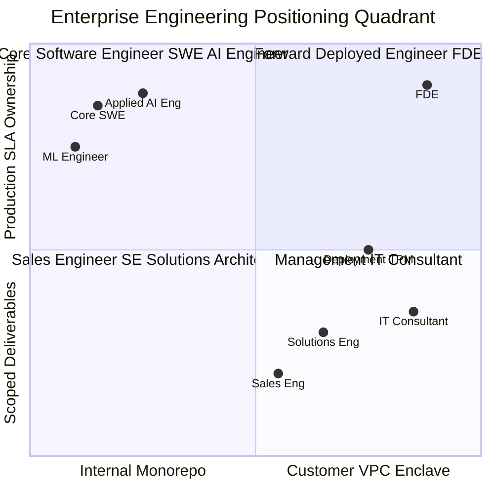

# FDE vs Other Roles: The Definitive Engineering Taxonomy

For software engineers evaluating career paths, candidates comparing competing job offers, and
hiring managers calibrating organizational titles: this guide provides the authoritative,
multi-dimensional taxonomy separating the Forward Deployed Engineer (FDE) from adjacent technical
disciplines.

---

## 1. Why Job Titles Obscure Reality

In enterprise tech, job titles are frequently driven by recruiting marketing rather than operational
reality. As documented in [Wikipedia](https://en.wikipedia.org/wiki/Forward_deployed_engineer),
responsibilities attributed to Forward Deployed Engineers overlap with Solutions Architects,
Sales Engineers, Customer Engineers, Professional Services Consultants, and Applied AI Engineers.

Our empirical analysis of 146 enterprise postings revealed that identical customer-embedded
production work is frequently advertised under titles like *Applied AI Engineer*, *Forward Deployed
Software Engineer (FDSE)*, *Deployment Engineer*, or *Partner Engineer*. Conversely, some early-stage
startups advertise "Forward Deployed Engineer" roles that are in reality 100% pre-sales demo hacking
with zero production deployment responsibility.

To cut through title inflation, evaluate roles across **operational responsibilities and governance
boundaries**, rather than recruitment labels.

---

## 2. The 2D Engineering Positioning Quadrant

Every technical role can be mapped along two fundamental operational axes:
1. **Customer Proximity & Environment**: Does your code run in an internal company monorepo, or
   does it execute inside a client's private VPC, subject to their security boundaries and politics?
2. **Ownership Horizon & Artifact**: Do you ship slide decks, proof-of-concept demos, and billable
   hours, or do you own production systems, SLA uptime, and long-term business metrics?



```
+-----------------------------------------------------------------------------------+
|               THE ENTERPRISE TECHNICAL ROLES TAXONOMY (2D MAP)                    |
+-----------------------------------------------------------------------------------+
|  HIGH PRODUCTION OWNERSHIP                                                        |
|                                                                                   |
|  [Core SWE / AI Engineer]                    [FORWARD DEPLOYED ENGINEER (FDE)]    |
|  - Internal monorepo & tooling               - Embedded in customer VPC           |
|  - Stable internal CI/CD                     - Navigates customer bastions & IAM  |
|  - Controlled on-call rotation               - Owns production deployment & SLA   |
|                                                                                   |
|  -------------------------------------------------------------------------------  |
|                                                                                   |
|  [Machine Learning Engineer]                 [Management / IT Consultant]         |
|  - Model weights & training pipelines        - SOW deliverables & billable hours  |
|  - Pre-sales demos / slide decks             - Hands off at contract completion   |
|  [Sales Engineer / Solutions Architect]                                           |
|                                                                                   |
|  LOW PRODUCTION OWNERSHIP (PRE-SALE / ADVISORY)                                    |
+-----------------------------------------------------------------------------------+
   INTERNAL PRODUCT INFRASTRUCTURE             CUSTOMER ENTERPRISE ENCLAVE
```

---

## 3. The 6-Dimensional Role Comparison Matrix

| Technical Title | Engagement Timing | Primary Deliverable | Core KPI & Comp Model | Codebase Control | On-Call / Pager Duty | Upstream Feedback Vector |
| :--- | :--- | :--- | :--- | :--- | :--- | :--- |
| **Forward Deployed Engineer (FDE)** | Embedded across full lifecycle (Discovery $\rightarrow$ Handover) | Live production system inside customer VPC | Customer SLA uptime & business impact (Base + Equity) | Customer VPC, bastions, legacy databases | Yes (Reverse-shadows on customer incidents) | Direct feedback to core product (Rule of Three) |
| **Core Software Engineer (SWE)** | Continuous internal product development | Core product features & microservices | Sprint velocity, code quality, uptime (Base + Equity) | 100% internal monorepo & internal cloud | Internal team on-call rotation | Internal product management roadmap |
| **Applied AI Engineer** | Internal product with customer-specific fine-tuning | LLM features, RAG pipelines, agent tools | Feature adoption & latency/cost budgets (Base + Equity) | Internal cloud infrastructure & APIs | Internal service rotation | Model evaluation benchmarks |
| **Machine Learning Engineer (MLE)**| Model R&D and training lifecycle | Trained model weights & inference endpoints | Model loss, perplexity, inference latency (Base + Equity) | Dedicated GPU training clusters | Low / serving pipeline only | Research papers & model registry |
| **Solutions Engineer (SE)** | Primarily Pre-Sale (Kickoff to signature) | Tailored demos, PoCs, reference architectures | Technical win rate & sales velocity (Base + Bonus) | Temporary sandbox demo environments | None (Hands off at signature) | Sales objection feedback |
| **Sales Engineer (Pre-Sales)** | 100% Pre-Sale | Product demos, RFP answers, technical validation | Quota attainment (Base + Commission OTE: 70/30 split) | Pre-configured demo instances | None | Feature request tickets to product |
| **IT / Management Consultant** | Contract-scoped engagement | Deliverables specified in Statement of Work (SOW) | Billable utilization & SOW milestone sign-off | Client network (temporary access) | None (Rolls off at project conclusion) | None (SOW change requests) |
| **Deployment Strategist / TPM**| Across engagement lifecycle | Charters, project plans, training, enablement | On-time milestone completion (Base + Bonus) | Non-coding (Runs governance & meetings) | None (Coordinates escalations) | Operational process improvements |

---

## 4. Deep-Dive on the Seven Close Pairs

---

### Pair 1: FDE vs Applied AI Engineer

Both roles write Python, build RAG pipelines, craft prompts, and integrate embeddings. The fundamental
difference is **where the system runs and who you sit with**:
- The **Applied AI Engineer** builds generative AI features inside the vendor's own product monorepo
  for thousands of multi-tenant users. Their primary enemy is roadmap fragmentation and inference
  cost per user.
- The **Forward Deployed Engineer** takes those AI primitives and forces them to work inside *one
  demanding enterprise customer's private enclave*, navigating their custom database schemas, corporate
  proxies, and compliance fences (HIPAA, SEC 17a-4).
- **The Tell in the Interview**: *"When the model hallucinates or an ingestion pipeline drops rows at
  2:00 AM, whose pager goes off—your internal team's, or the customer's on-call rotation?"*

---

### Pair 2: FDE vs Core Software Engineer (SWE)

The technical skill set is identical—data structures, systems design, concurrency, API development—but
the operating environment is fundamentally opposed:
- The **Core Software Engineer** operates within a codebase their team controls, using familiar CI/CD
  pipelines, standard modern tooling (GitHub, Docker, Datadog), and established testing harnesses.
- The **Forward Deployed Engineer** operates within an alien technical environment nobody on their
  team controls: a 12-year-old monolithic database, a homegrown batch scheduler, an audited bastion
  jump host with disabled public internet, and corporate change-control boards.
- **The Tell in the Interview**: *"Do you spend your day optimizing internal microservice latency in
  your company's cloud, or reverse-engineering an enterprise customer's legacy database schemas across
  an SSH jump host?"*

---

### Pair 3: FDE vs Solutions Engineer (SE)

The Solutions Engineer proves the software *can* work; the Forward Deployed Engineer *makes it work
in production*:
- The **Solutions Engineer** builds pre-sales prototypes, tailors demo instances, and validates
  technical feasibility to get the deal closed. Once the contract is signed, they celebrate and hand
  off the account.
- The **Forward Deployed Engineer** treats the signed contract as Day 1. They inherit the architectural
  commitments, integrate with live enterprise backends, run golden evaluation benchmarks, and live
  with the system until production handover.
- **The Tell in the Interview**: *"Does your engagement end when the sales contract is signed, or does
  your primary engineering delivery work begin after signature?"*

---

### Pair 4: FDE vs Sales Engineer

The Sales Engineer carries a quota; the Forward Deployed Engineer does not:
- The **Sales Engineer** is compensated on an On-Target Earnings (OTE) commission structure (commonly
  70% base, 30% sales commission). Their optimization function is the commercial close: whatever
  script or demo convinces the client to sign is the right output.
- The **Forward Deployed Engineer** is compensated on standard engineering bands (Base + Equity).
  Their optimization function is long-term production resilience: they will explicitly reject unsafe
  customer requests or unrealistic timelines because they are accountable for post-launch uptime.
- **The Tell in the Interview**: *"Is any portion of your compensation tied to a sales quota or quarterly
  booking target?"*

---

### Pair 5: FDE vs Machine Learning Engineer (MLE)

The division of labor between model training and model deployment:
- The **Machine Learning Engineer** focuses on model weights: pre-training, fine-tuning, loss curves,
  quantization, and GPU cluster throughput (PyTorch, vLLM, TensorRT).
- The **Forward Deployed Engineer** treats the model weights as an engine component. Their focus is
  the surrounding enterprise harness: ingestion pipelines, deterministic PII redaction, hybrid vector
  retrieval, RBAC permissions, and API gateways.
- In our scrape of 146 enterprise postings, **91.0% demanded Python**, **52.0% demanded RAG**, and
  **0% listed training models from scratch** as a core duty. FDE is applied systems engineering.
- **The Tell in the Interview**: *"Do you spend your sprints optimizing gradient descent hyperparameters,
  or building deterministic schema extractors and exception queues around model outputs?"*

---

### Pair 6: FDE vs Management / IT Consultant

The difference between delivering advice and delivering running software:
- The **Consultant** (e.g. McKinsey, Accenture, Big 4) delivers against a Statement of Work (SOW)
  governed by billable hours. The deliverable is an architectural roadmap, a slide deck, or a scoped
  proof of concept. When the SOW completes, the consultant rolls off.
- The **Forward Deployed Engineer** delivers running code in production. They do not get evaluated on
  how elegant their PowerPoint looks; they get evaluated on whether the customer's production tickets
  route accurately with sub-500ms latency.
- **The Tell in the Interview**: *"What is the final acceptance artifact of your engagement: an executive
  strategy presentation, or an automated test suite passing against live production APIs?"*

---

### Pair 7: FDE vs Deployment Strategist / Technical Program Manager (TPM)

Palantir established the pairing between Forward Deployed Software Engineers (FDSE) and Deployment
Strategists:
- The **Deployment Strategist / TPM** owns the human, organizational, and operational process:
  stakeholder alignment, training sessions, executive steering committees, and change management.
- The **Forward Deployed Engineer** owns the code that makes that process possible: writing the
  connectors, hardening the API, configuring bastions, and debugging network drops.
- **The Tell in the Interview**: *"In an executive project review, are you presenting the project
  milestone roadmap, or are you defending the system's p95 latency budget and RBAC security model?"*

---

## 5. The Job Description Diagnostic Litmus Test

When evaluating an ambiguous job posting titled "Forward Deployed Engineer", "Applied AI Engineer",
or "Solutions Architect", score the posting against this 5-question forensic rubric:

```
+-----------------------------------------------------------------------------------+
|                     THE 60-SECOND JOB POSTING DIAGNOSTIC RUBRIC                   |
+-----------------------------------------------------------------------------------+
| 1. Does the posting mention sales quotas, commission, or OTE?                     |
|    [YES: Disguised Sales Engineering]   [NO: Proceed to Q2]                       |
+-----------------------------------------------------------------------------------+
| 2. Does the posting mandate writing production code inside customer systems?      |
|    [NO: Advisory Consulting / TPM]      [YES: Proceed to Q3]                      |
+-----------------------------------------------------------------------------------+
| 3. Does the engagement continue past go-live through evaluation and handover?     |
|    [NO: Pre-Sales Solutions Engineer]   [YES: Proceed to Q4]                      |
+-----------------------------------------------------------------------------------+
| 4. Are you accountable for on-call incidents and customer operational SLAs?       |
|    [NO: Temporary Demo Hacker]          [YES: Proceed to Q5]                      |
+-----------------------------------------------------------------------------------+
| 5. Does the role mandate codifying field patterns back to core product?           |
|    [NO: Unscalable Services Shop]       [YES: GENUINE FORWARD DEPLOYED ENGINEER]  |
+-----------------------------------------------------------------------------------+
```

---

## 6. Direct Codebase Defense Implementations

Every role boundary described in this taxonomy is directly reflected in the technical defenses
implemented in this repository:

| Role Boundary Assertion | Repository Defense Implementation | Operational Verification |
| :--- | :--- | :--- |
| **FDE vs SE (Production Code vs Toy Demo)** | [`portfolio/reference-project/src/api/server.py`](../portfolio/reference-project/src/api/server.py) | Full FastAPI service with exception queues, metrics, and health checks |
| **FDE vs Consultant (Tested Code vs Deck)** | [`portfolio/reference-project/tests/test_server.py`](../portfolio/reference-project/tests/test_server.py) | 7 integration tests asserting idempotency, RBAC, and dispatch |
| **FDE vs MLE (Systems Harness vs Weights)** | [`portfolio/reference-project/evals/run_evals.py`](../portfolio/reference-project/evals/run_evals.py) | 25-case golden evaluation harness asserting 100% citation grounding |
| **FDE vs Core SWE (Customer Enclave Defense)**| [`troubleshooting/02-debugging-customer-systems.md`](../troubleshooting/02-debugging-customer-systems.md) | 6-tier visibility ladder and multi-cloud IAM CLI diagnostic runbooks |
| **Deterministic Data Defense** | [`interviews/code/structured_extractor.py`](../interviews/code/structured_extractor.py) | Self-healing Pydantic schema extractor recovering from bad outputs |

---

## 7. Related Documents

- [What Is an FDE](01-what-is-an-fde.md) - foundational definition, origins, and the startup CTO mandate
- [Responsibilities](02-responsibilities.md) - the 146-posting empirical breakdown of daily duties
- [Where FDEs Work](04-where-fdes-work.md) - how the role adapts across AI labs, platforms, and startups
- [From Software Engineer](../learning-paths/from-software-engineer.md) - the transition path from core engineering
- [From Solutions Engineer](../learning-paths/from-solutions-engineer.md) - the transition path from pre-sales
- [From Consultant](../learning-paths/from-consultant.md) - the transition path from advisory services

## 8. Further Reading

- [Wikipedia: Forward Deployed Engineer](https://en.wikipedia.org/wiki/Forward_deployed_engineer) - formal industry taxonomy and role overlaps
- [Fortune: The Rise of Forward Deployed Engineers](https://fortune.com/2026/09/03/forward-deployed-engineers-fast-growing-six-figure-silicon-valley-job-integrate-ai-with-customers-tech-careers-palantir) - comparative analysis of Palantir's model vs enterprise tech roles
- [Anthropic Forward Deployed Engineer Job Specification](https://job-boards.greenhouse.io/anthropic/jobs/5302966008) - canonical modern role benchmark
