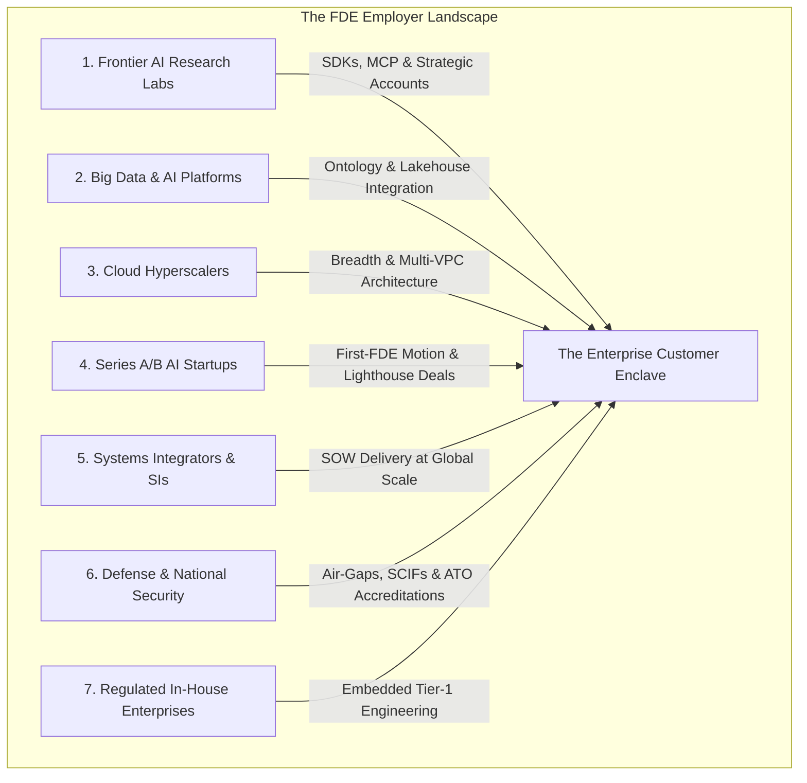

# Where FDEs Work: The Seven Employer Archetypes

For engineers evaluating career options, candidates targeting specific sectors, and engineering
leaders benchmarking team structures: this guide provides the definitive breakdown of the **seven
distinct employer archetypes** hiring Forward Deployed Engineers in the modern AI ecosystem.

While the foundational engineering skeleton—[the FDE loop](05-the-fde-loop.md)—remains constant
across the industry, the specific employer archetype dramatically alters your travel expectations,
compensation structure, stack autonomy, customer seniority, and daily operational stress.

---

## 1. The Employer Ecosystem & Macro Market Concentration

Our empirical analysis of **146 deduplicated enterprise FDE postings across 94 companies**
(scraped February to July 2026; see [`job-market/dataset/`](../job-market/dataset/fde_market_data.json)),
corroborated by Plank's market census of **982 live FDE postings across 462 companies**
([Plank, 2026](https://joinplank.com)), reveals that Forward Deployed Engineering hiring is
concentrated within seven primary sectors:



---

## 2. The Employer Operating Dial Matrix

Before evaluating any job offer, evaluate how the employer sets these six structural operating dials:

| Operating Dimension | 1. Frontier Labs | 2. Data/AI Platforms | 3. Hyperscalers | 4. Series A-B Startups | 5. Systems Integrators | 6. Defense & Intel | 7. In-House Enterprise |
| :--- | :--- | :--- | :--- | :--- | :--- | :--- | :--- |
| **Representative Employers** | Anthropic, OpenAI, Cohere | Palantir, Databricks, Snowflake | AWS, Microsoft, GCP | Scale-stage AI Startups | Deloitte GPS, Accenture | Anduril, Palantir Gov | JPMorgan, Mayo Clinic |
| **Travel Intensity** | ~25% Onsite (High-touch) | 30–50% (Bootcamp sprints) | 10–20% (Briefings) | 10–20% (Deal closing) | 40–70% (Client site) | 50–80% (SCIF/Base) | 0–10% (Internal office) |
| **Comp Model** | $190k–$260k + High-Valuation Equity | $170k–$240k + Liquid RSUs | $180k–$230k + Liquid RSUs | $160k–$220k + Early Options | $140k–$190k + Annual Bonus | $170k–$230k + Cleared Bonus | $180k–$250k + Cash Bonus |
| **Custom vs Product Code** | 40% Custom / 60% Core SDK | 20% Custom / 80% Platform | 15% Custom / 85% Cloud | 80% Custom / 20% Product | 90% Custom SOW Code | 50% Custom / 50% Platform | 100% In-House Code |
| **Feedback Velocity** | Immediate (Direct to lab PMs) | Moderate (Platform sprints) | Slow (Multi-quarter roadmaps)| Daily (Direct to founders) | Very Slow / None | Low (Air-gap isolated) | Internal Product Only |
| **Support Infrastructure** | Senior lab escalations | Mature support & devrel | Massive global support | None (You are tiers 1–3) | Client IT / SI helpdesk | Strict military sysadmins | Enterprise SRE on-call |
| **Primary Burnout Vector** | High executive visibility | Endless bootcamp travel | Bureaucratic inertia | Unscalable custom sprawl | Utilization & SOW friction | SCIF tooling isolation | Enterprise corporate silos |

---

## 3. Deep-Dive on the Seven Employer Archetypes

---

### Archetype 1: Frontier AI Research Labs (Anthropic, OpenAI, Cohere)

- **The Operational Reality**: The lab FDE squad acts as the tip of the spear for foundation model
  adoption. You are deploying Claude or GPT models into Fortune 500 banks, healthcare systems, and
  logistics giants. You author custom **Model Context Protocol (MCP) servers**, build deterministic
  PII scrubbers, and evaluate structured reasoning pipelines.
- **The Travel & Cadence**: Anthropic explicitly benchmarks travel at approximately **25%**
  ([Anthropic FDE Posting](https://job-boards.greenhouse.io/anthropic/jobs/5302966008)). Travel is
  concentrated around initial architectural whiteboarding, integration crunches, and Sev-0 post-mortems.
- **The Career Ceiling**: High organizational influence. The FDE team acts as the primary sensory
  organ for the research lab, directly steering which model capabilities, token limits, and API primitives
  get prioritized in the next training run.

---

### Archetype 2: Enterprise Big Data & AI Platforms (Palantir, Databricks, Snowflake)

- **The Operational Reality**: Palantir pioneered the Forward Deployed Software Engineer (FDSE) role
  and still runs the largest global deployment organization, with dozens of active postings across
  commercial and government programs ([Fortune, September 2026](https://fortune.com/2026/09/03/forward-deployed-engineers-fast-growing-six-figure-silicon-valley-job-integrate-ai-with-customers-tech-careers-palantir)).
  Databricks accounted for the single highest listing count in our 146-posting scrape sample.
- **The Technical Focus**: Binding fragmented customer data estates (lakehouses, relational stores,
  ERP endpoints) into an operational semantic ontology. You write heavy PySpark pipelines, SQL
  aggregations, and custom full-stack web applications on top of the vendor's platform.
- **The Operational Cadence**: Intensive 1- to 4-week co-building bootcamps where you pair directly
  with customer engineers, forcing them to become self-sufficient before you roll off.

---

### Archetype 3: Cloud Hyperscalers (AWS, Microsoft Azure, Google Cloud)

- **The Operational Reality**: Amazon hires Principal and Senior Forward Deployed Engineers who embed
  across strategic multi-million-dollar enterprise accounts (observed on `amazon.jobs`).
- **The Technical Focus**: Breadth over depth. Rather than optimizing one model prompt, you architect
  resilient multi-VPC cloud topologies, configure AWS PrivateLinks, optimize KMS key rotations, and
  integrate serverless event buses (EventBridge, SQS) across the customer's enterprise cloud landscape.
- **The Career Ceiling**: Massive architectural scale, but slower feedback loops into core cloud
  service teams due to the organizational size of hyperscalers.

---

### Archetype 4: Series A & B Growth-Stage AI Startups (The "First-FDE" Motion)

- **The Operational Reality**: The company has built a promising AI product, but closing seven-figure
  enterprise deals requires custom integration work that the core product cannot yet do out of the box
  ([Plank, 2026](https://joinplank.com)). You are hired as the **First FDE**.
- **The Operating Conditions**: No playbook exists. There is no training manual, no dedicated Tier-1
  support rota, and no pre-built sandbox. You attend sales calls with the CEO, write customer connectors
  during the afternoon, and resolve customer webhook failures at midnight.
- **The Critical Success Factor**: Enforcing the [Rule-of-Three Productization Threshold](../case-studies/01-deployment-patterns-in-the-wild.md#the-rule-of-three-productization-threshold).
  If you build bespoke code for every customer without generalizing it into the core product, the
  startup collapses into an unscalable professional services agency.

---

### Archetype 5: Systems Integrators & Consultancies (Deloitte, Accenture, Slalom)

- **The Operational Reality**: Major consultancies now recruit dedicated forward deployed engineers
  (such as Deloitte's "Anthropic Forward Deployed Engineer - GPS" practice; [Deloitte Careers, 2026](https://apply.deloitte.com))
  to deliver vendor platforms into public sector and Fortune 500 accounts.
- **The Operating Conditions**: You serve two masters: the client day to day, and the consultancy's
  utilization metrics, billable hours, and Statement of Work (SOW) change-control boards.
- **The Strategic Trade-Off**: You gain immense enterprise navigation experience across massive,
  multi-year transformation contracts, but you have zero ability to modify the vendor's underlying model
  or platform codebase.

---

### Archetype 6: Defense, Aerospace, & National Security (Palantir Defense, Anduril, OpenAI Federal)

- **The Operational Reality**: Mission-critical AI deployments within the Department of Defense (DoD),
  allied defense ministries (NATO, Five Eyes), and intelligence agencies.
- **The Technical Focus**: Air-gapped enclaves, hardware cross-domain data diodes, offline container
  registries (Harbor), and zero-internet compute nodes ([Regulated Industries Playbook](../case-studies/04-regulated-industries-playbook.md)).
- **The Hiring Barrier**: Strict personnel security clearances (Secret, Top Secret, or TS/SCI with
  polygraph) gate the entire hiring funnel. Clearance-eligible engineers command substantial compensation
  premiums.

---

### Archetype 7: Regulated In-House Enterprise Teams (JPMorgan Chase, Mayo Clinic)

- **The Operational Reality**: Large financial institutions and healthcare networks are establishing
  internal "Forward Deployed" teams that operate as internal consultancy squads, embedding with
  underwriting, wealth management, or clinical divisions to productionize applied AI systems.
- **The Technical Focus**: High data gravity. You sit directly behind the corporate firewall with
  unlimited access to internal data lakes, solving deep domain problems without external vendor friction.
- **The Career Trade-Off**: Stable working hours and minimal travel, balanced against slower corporate
  procurement timelines and internal bureaucratic approval gates.

---

## 4. The 8-Question Candidate Due Diligence Interview Protocol

When interviewing for an FDE role, use these eight diagnostic questions during your reverse-interview
slot to uncover the true operating environment before signing an offer:

```
+-----------------------------------------------------------------------------------+
|                    CANDIDATE DUE DILIGENCE INTERVIEW PROTOCOL                     |
+-----------------------------------------------------------------------------------+
| 1. "What percentage of the team's engineering roadmap was driven by customer      |
|     field feedback in the last two quarters?"                                     |
|    - Green Flag: Can name 2+ specific platform features born from field pain.     |
|    - Red Flag: "Product manages the roadmap; field engineering just implements."  |
+-----------------------------------------------------------------------------------+
| 2. "Who owns on-call alerts for customer deployments after launch?"               |
|    - Green Flag: Explicit 30-day reverse-shadowing handover to customer ops.     |
|    - Red Flag: "The FDE who deployed it stays on-call indefinitely."              |
+-----------------------------------------------------------------------------------+
| 3. "What was the actual travel load (in days per month) over the last 90 days?"   |
|    - Green Flag: Specific numbers grounded in project milestones (e.g. 4 days/mo).|
|    - Red Flag: "It varies, but we expect people to be flexible." (Code for 50%+). |
+-----------------------------------------------------------------------------------+
| 4. "How do you prevent custom enterprise work from fragmenting the codebase?"     |
|    - Green Flag: Pluggable adapter architecture, webhooks, or Rule-of-Three gates.|
|    - Red Flag: "We maintain separate customer branches for enterprise logos."     |
+-----------------------------------------------------------------------------------+
| 5. "What proportion of my time will be spent pre-sale vs post-sale?"              |
|    - Green Flag: >= 80% post-sale production integration and evaluation.         |
|    - Red Flag: "You'll help sales close deals and build custom demo proofs."      |
+-----------------------------------------------------------------------------------+
| 6. "What happens when an enterprise customer requests an unsafe compliance bypass?"|
|    - Green Flag: Executive leadership backs engineering refusal with written ADRs.|
|    - Red Flag: "Sales usually finds a compromise to keep the customer happy."     |
+-----------------------------------------------------------------------------------+
| 7. "How many customer engagements has this specific squad completed end-to-end?"  |
|    - Green Flag: Concrete case histories with clear handover dates and runbooks.  |
|    - Red Flag: Every engagement is still "ongoing" after 12 months with no exit.  |
+-----------------------------------------------------------------------------------+
| 8. "Is any portion of my compensation tied to sales quotas, renewals, or OTE?"    |
|    - Green Flag: 100% standard engineering compensation band (Base + Equity).     |
|    - Red Flag: Any quota, commission, or revenue target (This is a sales role).   |
+-----------------------------------------------------------------------------------+
```

---

## 5. Direct Codebase Defense Implementations

| Employer Technical Discipline | Repository Defense Asset | Verification Suite |
| :--- | :--- | :--- |
| **Frontier Lab MCP & RBAC Integration** | [`portfolio/reference-project/src/api/server.py`](../portfolio/reference-project/src/api/server.py) | `pytest portfolio/reference-project/tests/test_server.py` (`test_permission_aware_rbac_filtering`) |
| **Defense & Air-Gapped Offline Math** | [`portfolio/reference-project/src/pipeline/ingestion.py`](../portfolio/reference-project/src/pipeline/ingestion.py) | Standalone vector math without remote network dependencies |
| **Startup Idempotency & Replay Defense**| [`interviews/code/webhook_receiver.py`](../interviews/code/webhook_receiver.py) | SHA-256 payload caching preventing duplicate writes |
| **Hyperscaler Rate Limiting Backpressure**| [`interviews/code/rate_limiter.py`](../interviews/code/rate_limiter.py) | Token bucket rate limiting with sliding windows |
| **Enterprise Data Redaction Gate** | [`portfolio/reference-project/evals/DATASET_PROVENANCE.md`](../portfolio/reference-project/evals/DATASET_PROVENANCE.md) | Verified CFPB & Bitext regex tokenization |

---

## 6. Related Documents

- [What Is an FDE](01-what-is-an-fde.md) - foundational definition, origins, and the startup CTO mandate
- [Responsibilities](02-responsibilities.md) - core technical responsibilities weighted across 146 postings
- [FDE vs Other Roles](03-fde-vs-other-roles.md) - sharp 2D positioning quadrant against adjacent titles
- [The FDE Loop](05-the-fde-loop.md) - the 8-stage operational delivery framework
- [Market Overview](../job-market/01-market-overview.md) - compensation benchmarks and employer concentration data

## 7. Further Reading

- [Fortune: The Rise of Forward Deployed Engineers](https://fortune.com/2026/09/03/forward-deployed-engineers-fast-growing-six-figure-silicon-valley-job-integrate-ai-with-customers-tech-careers-palantir) - comprehensive reporting on Palantir and the enterprise hiring surge
- [Plank FDE Market Census](https://joinplank.com) - empirical database of 982 live postings across 462 companies
- [The New Stack: Forward-Deployed Engineers in AI](https://thenewstack.io/forward-deployed-engineers-ai) - why AI labs require embedded field teams
- [Anthropic Forward Deployed Engineer Specification](https://job-boards.greenhouse.io/anthropic/jobs/5302966008) - canonical role posting from a frontier AI lab
