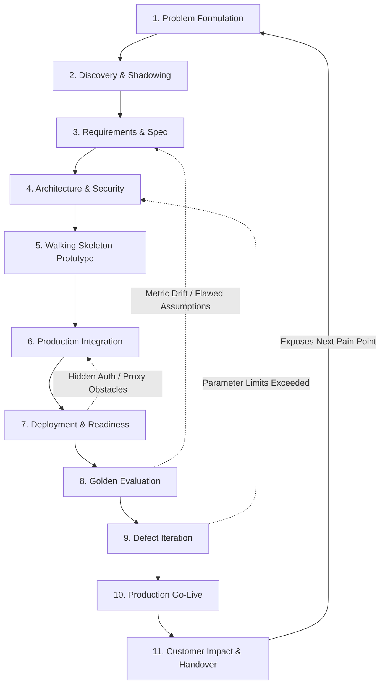
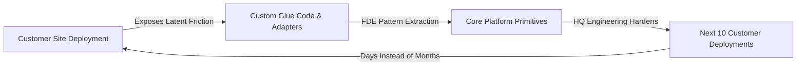

# The FDE Loop: The 11-Stage Operational Mental Model

Every enterprise Forward Deployed Engineering (FDE) engagement, regardless of industry sector or
underlying tech stack, runs the exact same delivery loop. This is the foundational mental model
governing the profession: taking an ambiguous, painful customer business problem, moving it through
rigorous technical phases, deploying it into production, proving business impact, and iterating.

OpenAI's Forward Deployed Engineer role specification compresses this lifecycle into a single
operational mandate: lead *"technical discovery, architecture, implementation, evaluation,
productionization, and handoff"* ([OpenAI Careers, 2026](https://openai.com/careers)).

---

## 1. The Cyclical Delivery Loop & Recursive Topologies

The FDE Loop is not a rigid waterfall; it is an active, iterative engineering circuit. Forward
progress is gated by verifiable artifacts, while recursive feedback loops handle edge-case discovery
and metric drift:



### The Three Legitimate Recursion Loops

1. **Evaluation $\rightarrow$ Requirements (The Spec Drift Loop)**: When automated evaluation against
   the golden benchmark reveals that a requirement was mathematically unviable or based on corrupted
   historical assumptions, halt development and update the signed [Requirements Specification](../customer/02-requirements-to-spec.md).
2. **Iteration $\rightarrow$ Architecture (The Structural Refactor Loop)**: When error distributions
   cannot be resolved via prompt tuning or threshold adjustments, stop patching and reopen the
   [Architectural Decision Record (ADR)](../system-design/03-trade-offs-and-decision-records.md) to
   introduce new structural primitives (e.g. adding semantic chunking or hybrid sparse indices).
3. **Deployment $\rightarrow$ Integration (The Enterprise Network Reality Loop)**: When staging drills
   reveal corporate TLS interception proxies or undisclosed network chokepoints, pause deployment to
   implement necessary CA cert bundles or SSM port forwarding ([Working in Customer Environments](../customer/03-working-in-customer-environments.md)).

---

## 2. The 11-Stage Operational Execution Matrix

To prevent engagements from degenerating into endless informal meetings, every stage must be gated
by a concrete, verifiable engineering artifact:

| Stage # | Stage Name | Target Objective | Verifiable Artifact | FDE Responsibility | Fatal Failure Mode | Codebase Defense Anchor |
| :--- | :--- | :--- | :--- | :--- | :--- | :--- |
| **1** | **Problem** | Convert vague customer pain into a quantifiable metric | One-page Quantified Problem Statement | Interrogate executive and operational sponsors for true drivers | Building the requested toy feature instead of solving root operational pain | [`customer/02-requirements-to-spec.md`](../customer/02-requirements-to-spec.md) |
| **2** | **Discovery** | Map the real-world workflows, schemas, and politics | Workflow Journey Map & Data Quality Audit | Shadow floor operators; audit uncurated database dumps | Discovering in Week 6 that the real process runs in an undocumented spreadsheet | [`skills/02-discovery-and-requirements.md`](../skills/02-discovery-and-requirements.md) |
| **3** | **Requirements** | Formalize testable Given/When/Then acceptance criteria | Signed Engineering Spec (`requirements.md`) with Non-Goals | Force scope trade-offs into the open; secure written sign-off | Aspirational vibes ("accurate classification") that no eval can falsify | [`portfolio/reference-project/README.md`](../portfolio/reference-project/README.md) |
| **4** | **Architecture** | Design within customer cloud and security constraints | Architectural Decision Records (ADRs) & SecOps clearance | Balance build vs buy, latency budgets, and PII fences | Importing last client's architecture into a VPC where SecOps forbids it | [`system-design/03-trade-offs-and-decision-records.md`](../system-design/03-trade-offs-and-decision-records.md) |
| **5** | **Prototype** | Answer the riskiest technical question cheaply | Working Skeleton processing synthetic test records | Timebox development; force a concrete Go/No-Go decision | Building a demo on 10 cherry-picked rows that collapses on messy enterprise data | [`portfolio/reference-project/src/api/server.py`](../portfolio/reference-project/src/api/server.py) |
| **6** | **Integration** | Wire prototype into customer IAM, APIs, and databases | Hardened Integration Engine with Idempotency tokens | Operate inside customer bastions; handle rate limits & replays | Treating customer staging like an internal sandbox; crashing shared services | [`interviews/code/webhook_receiver.py`](../interviews/code/webhook_receiver.py) |
| **7** | **Deployment** | Promote software into target production infrastructure | Production Deployment Runbook & Feature Flags | Run deployment drills; verify rollback kill switches | Deploying before a holiday freeze with zero rollback plan | [`deployment/03-production-readiness-checklist.md`](../deployment/03-production-readiness-checklist.md) |
| **8** | **Evaluation** | Measure statistical accuracy against golden benchmarks | Automated Evaluation Report (25+ test cases) | Assert hard quality gates ($\ge 88\%$ accuracy, $100\%$ citations) | Subjective evaluations where quality debates revert to political taste | [`portfolio/reference-project/evals/run_evals.py`](../portfolio/reference-project/evals/run_evals.py) |
| **9** | **Iteration** | Close measured accuracy gaps systematically | Prioritized Defect Backlog linked to Eval runs | Context bisection; deterministic Pydantic error correction | Shipping unverified parameter tweaks that silently regress existing cases | [`interviews/code/structured_extractor.py`](../interviews/code/structured_extractor.py) |
| **10**| **Production** | Transition from pilot to business-critical system | Production Readiness Sign-Off & Live Dashboards | Lead the formal Go/No-Go gate with sponsor and InfoSec | Celebrating the pilot demo while the live system rots without support | [`portfolio/reference-project/tests/test_server.py`](../portfolio/reference-project/tests/test_server.py) |
| **11**| **Customer Impact**| Prove business ROI and transfer operational autonomy | Handover Package & 30-Day Reverse Shadowing Log | Train customer engineers; codify platform primitives | Handover to nobody; system decays into technical debt upon FDE exit | [`customer/01-engagement-lifecycle.md`](../customer/01-engagement-lifecycle.md) |

## 3. The Kevin Bai FDE Flywheel and Deployment Moat Framework

Derived from foundational work by Kevin Bai (Anthropic founding Forward Deployed Engineer, ex-Palantir and Rippling):

In the modern AI landscape, frontier foundation models are rapidly commoditizing. The long-term competitive moat of an AI company is not raw model weights, but how, where, and why intelligence is deployed inside customer operational reality.

### The three-stage macro execution loop

While day-to-day work spans multiple technical milestones, Kevin Bai articulates the macro FDE loop across three core operational phases:

1. Auditing - Investigating the operational reality on the ground. FDEs do not rely on customer management slides or clean documentation; they shadow human operators, examine uncurated data dumps, and identify unwritten legacy workarounds.
2. Evals - Constructing objective evaluation suites. Because non-deterministic language models cannot be verified with standard boolean unit tests, FDEs curate labeled golden datasets and establish deterministic eval harnesses before customer users interact with the system.
3. Deployment - Driving organizational adoption and monitoring production reliability. An FDE shepherds the system into production, measures SLA performance, instruments telemetry, and ensures the customer team operates the application autonomously.

### The product flywheel mechanism

The highest-leverage output of an FDE is not the custom code written for a single client, but the feedback loop connecting customer deployments to core product engineering:



Without an FDE flywheel, AI companies devolve into bespoke consulting shops where every customer deployment is built from scratch. With the flywheel, an FDE abstracts customer-specific integrations into reusable platform primitives (such as standardized Model Context Protocol servers, tenant-partitioned vector indexers, and evaluation harnesses), making every subsequent customer deployment progressively faster and more reliable.

## 4. Forensic Breakdown: Where Loops Die

Enterprise deployments rarely fail from sudden catastrophic explosions; they die quietly at three
predictable friction boundaries:

```
+-----------------------------------------------------------------------------------+
|                           THE THREE FATAL LOOP KILLERS                            |
+-----------------------------------------------------------------------------------+
|  [Stage 3 -> Stage 8: The Evaluation Gap]                                         |
|  Unenforced criteria -> Progress cannot be proven -> Project dies in debate.      |
|                                                                                   |
|  [Stage 7 -> Stage 10: The Production Cliff]                                      |
|  MIT NANDA finding: 95% of pilots stall -> Prototype never touches real workflow. |
|                                                                                   |
|  [Stage 10 -> Stage 11: The Handover Vacuum]                                      |
|  No customer ownership -> First unhandled schema drift kills the deployment.      |
+-----------------------------------------------------------------------------------+
```

### 1. The Evaluation Gap (Stage 3 $\rightarrow$ Stage 8)

The loop dies when nobody defined what "good" meant before building. Without an empirical golden
evaluation suite, every customer demo becomes an unfalsifiable debate about taste. The sponsor points
out one edge case the model missed, the engineering lead panics, and the team spends two weeks
overfitting prompts to fix that single anecdotal example, quietly breaking 15 other cases.

- **The Defense**: Never write a prototype before establishing the **Golden Evaluation Benchmark**
  ([`evals/run_evals.py`](../portfolio/reference-project/evals/run_evals.py)). Agree on the 25+
  canonical cases, the accuracy thresholds ($\ge 88.0\%$), and the citation grounding requirements
  during Stage 3.

### 2. The Production Cliff (Stage 7 $\rightarrow$ Stage 10)

The phenomenon measured by the **MIT NANDA report** (*The GenAI Divide: State of AI in Business 2025*,
Fortune, August 2025): **~95% of enterprise GenAI pilots deliver zero measurable P&L impact**.
Pilots die on the cliff between a working side-chat demo and a production service embedded into
enterprise systems of record (CRM, ERP, ticketing queues).

- **The Defense**: Reject standalone chatbot sandboxes. Build directly against the customer's live
  event pipelines, enforce deterministic Pydantic schemas, and integrate human operator override queues
  ([`test_exception_queue_routing_and_operator_resolution`](../portfolio/reference-project/tests/test_server.py)).

### 3. The Handover Vacuum (Stage 10 $\rightarrow$ Stage 11)

Engagements fail at handover more often than at go-live. Go-live is an adrenaline-filled milestone
attended by executives; handover is the quiet transfer of operational weight to customer engineers
who did not write the code. If customer engineers are not actively triaging alerts during a 30-day
reverse-shadowing window, the first post-deployment schema change will crash the system, permanently
destroying vendor credibility.

- **The Defense**: Execute the **Handover Triad** ([The Engagement Lifecycle](../customer/01-engagement-lifecycle.md)):
  Self-contained runbooks, automated regression test suites, and named customer PagerDuty ownership.

---

## 5. The Interview & Portfolio Loop Script

Forward Deployed Engineering interviewers structure candidate loops around this exact sequence
([TryExponent, 2026](https://tryexponent.com); [Gaijineer Cohere Analysis, April 2026](https://gaijineer.co)).
When asked to describe a past technical project, structure your response as an end-to-end traversal
of the FDE loop:

```
                      THE 5-MINUTE FDE INTERVIEW NARRATIVE
1. The Problem & Baseline (Stages 1-2):
   "At enterprise customer X, inbound dispute triage suffered a 34.8% error rate,
    adding 9.4 hours to first response and threatening contractual P1 SLAs."
2. The Specification & Boundaries (Stages 3-4):
    "We codified an engineering spec targeting >= 88% accuracy and < 500ms latency,
    with explicit non-goals forbidding direct database writes to core banking ledgers."
3. The Integration & Architectural Hurdles (Stages 5-7):
    "We integrated behind an audited SSH bastion, enforced SHA-256 idempotency to stop
    webhook replays, and implemented regex PII tokenization for GDPR compliance."
4. The Evaluation Gate & Iteration (Stages 8-9):
    "We asserted quality against a 25-case golden dataset, iterating on hybrid dense/sparse
    retrieval until citation grounding reached 100% and severity accuracy hit 100%."
5. Production Impact & Handover (Stages 10-11):
    "We launched behind a 10% canary flag, completed a 30-day reverse-shadowing rotation
    with customer Tier-1 operators, and eliminated $38,500/month in triage labor."
```

---

## 6. Direct Codebase Defense Implementations

Every stage of the FDE Loop is implemented as executable code within this repository:

| Loop Stage | Repository Implementation Asset | Operational Role |
| :--- | :--- | :--- |
| **Stage 3 & 4 (Spec & Scope)** | [`customer/02-requirements-to-spec.md`](../customer/02-requirements-to-spec.md) | Given/When/Then acceptance criteria and ETISE specification |
| **Stage 5 (Walking Skeleton)** | [`portfolio/reference-project/src/api/server.py`](../portfolio/reference-project/src/api/server.py) | Fast API gateway with local mock fallbacks |
| **Stage 6 (Integration Defense)** | [`interviews/code/webhook_receiver.py`](../interviews/code/webhook_receiver.py) | Idempotent replay protection with SHA-256 hashing |
| **Stage 8 (Golden Evaluation)** | [`portfolio/reference-project/evals/run_evals.py`](../portfolio/reference-project/evals/run_evals.py) | 25-case automated benchmark asserting $\ge 88\%$ accuracy and $100\%$ citations |
| **Stage 9 (Defect Iteration)** | [`interviews/code/structured_extractor.py`](../interviews/code/structured_extractor.py) | Self-healing schema correction loop for dirty outputs |
| **Stage 10 (Production Readiness)**| [`portfolio/reference-project/tests/test_server.py`](../portfolio/reference-project/tests/test_server.py) | 7 integration tests asserting RBAC, health, and operator overrides |
| **Stage 11 (Handover & SRE)** | [`troubleshooting/01-debugging-methodology.md`](../troubleshooting/01-debugging-methodology.md) | 7-phase incident response lifecycle and Sev-0..Sev-3 SLA matrix |

---

## 7. Related Documents

- [What Is an FDE](01-what-is-an-fde.md) - foundational definition, origins, and the startup CTO mandate
- [Responsibilities](02-responsibilities.md) - core technical responsibilities weighted across 146 postings
- [FDE vs Other Roles](03-fde-vs-other-roles.md) - sharp 2D positioning quadrant against adjacent titles
- [Where FDEs Work](04-where-fdes-work.md) - how the role adapts across AI labs, platforms, and startups
- [The Engagement Lifecycle](../customer/01-engagement-lifecycle.md) - the 10-phase delivery sequence common to all archetypes

## 8. Further Reading

- [Kevin Bai: Forward Deployed Engineering 101](https://youtu.be/KwhgfwOSToQ) - founding FDE at Anthropic, ex-Palantir and Rippling, on the FDE loop and flywheel
- [Fortune: MIT Report on GenAI Pilots in Business](https://fortune.com/2025/08/18/mit-report-95-percent-generative-ai-pilots-at-companies-failing-cfo) - empirical research on the 95% pilot stall rate
- [The New Stack: Forward-Deployed Engineers in AI](https://thenewstack.io/forward-deployed-engineers-ai) - the integrate-launch-improve lifecycle
- [OpenAI Forward Deployed Engineer Specification](https://openai.com/careers) - canonical role posting covering discovery through handoff
- [Exponent: Forward Deployed Engineer Interview Guides](https://www.tryexponent.com) - technical interview loops and candidate prep frameworks
