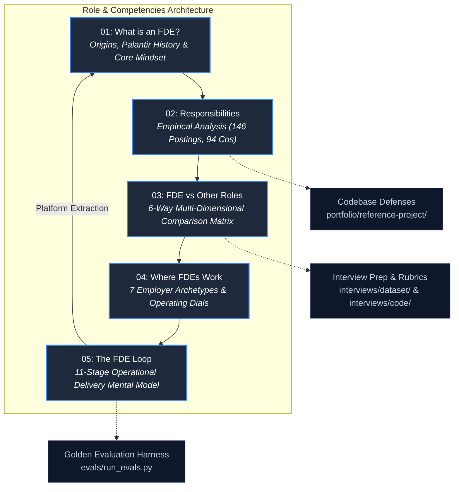

# Role & Competencies: The Forward Deployed Engineering Discipline

In enterprise technology, the greatest bottleneck to enterprise AI and software adoption is rarely the
algorithm—it is the integration boundary. A model that achieves state-of-the-art benchmarks on localhost
will routinely fail when confronted with customer Virtual Private Clouds (VPCs), legacy SQL schemas,
strict Role-Based Access Control (RBAC), corporate proxy TLS interception, and ambiguous business workflows.

The **Forward Deployed Engineer (FDE)** is the specialized engineering discipline engineered to solve this
exact problem. Operating at the frontline of customer infrastructure, an FDE executes a non-negotiable
**dual mandate**:
1. **Direct Customer Delivery**: Architect, build, and deploy mission-critical software directly inside the
   customer's environment to solve immediate, high-value business problems.
2. **Platform Extraction & Feedback Loop**: Abstract bespoke customer integrations into core, reusable
   platform primitives, informing the product roadmap and hardening the vendor's upstream systems.

This module provides the comprehensive foundation for understanding what an FDE is, the empirical reality
of the daily work, how the role differs from adjacent engineering titles, where FDEs operate across the
industry, and the continuous 11-stage delivery loop governing the discipline.

---

## 1. Pillar Knowledge Architecture

The five guides in this pillar form a progressive learning sequence—from conceptual origin to operational execution:

---

## 2. Core Pillar Guides

### 1. [What is an FDE?](01-what-is-an-fde.md)
The foundational definition and history of the Forward Deployed Engineering discipline:
- **Origins at Palantir (2004)**: How Alexander Karp and Shyam Sankar created the title to eliminate the "telephone game" between enterprise customers and back-office product teams.
- **The Modern AI-Era Expansion**: Why modern frontier AI labs (OpenAI, Anthropic, Cohere, Scale AI) consider FDEs their primary revenue-enabling engineering force.
- **The 4 Non-Negotiable Mindset Invariants**:
  1. *Production Ownership*: Code is not done when it runs on your laptop; it is done when it is monitored, audited, and autonomously maintained in the customer's production cluster.
  2. *Bilingual Fluency*: Seamlessly switching between VP-level business ROI and low-level Linux networking, OpenSSL CA bundles, and SQL execution plans.
  3. *Zero Not-My-Job Syndrome*: Owning whatever breaks between the product and customer value—whether it is data parsing, IAM permission drift, or legacy reverse-engineering.
  4. *Platform Extraction Instinct*: Refusing to build bespoke consulting one-offs without extracting reusable libraries and upstream SDK features.

### 2. [Responsibilities & Empirical Work Breakdown](02-responsibilities.md)
The empirical reality of the FDE job based on systematic extraction from 146 deduplicated job postings across 94 enterprise employers ([`job-market/dataset/fde_market_data.json`](../job-market/dataset/fde_market_data.json)):
- **The Top Empirical Responsibilities**:
  - **90.4%** require building, testing, and shipping production-grade software (Python, TypeScript, Go, C++).
  - **79.5%** require direct customer-facing technical interactions with client CTOs, lead architects, and domain operators.
  - **74.7%** require designing end-to-end distributed system architectures, streaming pipelines, and API integrations.
  - **61.6%** require building automated evaluation harnesses, regression benchmarks, and quality gates.
  - **56.2%** require upstream platform extraction, PR contributions, and internal SDK development.
- **The 60/40 Split**: The sustainable operational cadence balancing customer deployment sprints with core product contributions to prevent technical debt and consulting entrapment.

### 3. [FDE vs Other Roles: The Definitive Taxonomy](03-fde-vs-other-roles.md)
A rigorous, multi-dimensional comparison disambiguating FDE from the 5 titles it is most frequently confused with:
- **The Comprehensive Comparison Matrix**:
  - Compares **FDE** vs **Software Engineer (SWE)**, **Solutions Architect (SA)**, **Sales Engineer / Pre-Sales (SE)**, **Technical Account Manager (TAM)**, **Developer Relations (DevRel)**, and **Product Manager (PM)**.
  - Evaluates 9 objective operational axes: primary mandate, production code authoring, customer interface depth, ownership lifecycle, travel expectations, compensation model, performance metrics, and failure modes.
- **The "Coding vs Talking" Continuum**: Quantifying exact time allocations across production code, systems design, client meetings, and technical documentation.
- **Role Transition Playbooks**: Actionable step-by-step career blueprints for SWEs, SAs, SEs, and Consultants looking to transition into senior FDE positions.

### 4. [Where FDEs Work: The 7 Employer Archetypes](04-where-fdes-work.md)
An exhaustive taxonomy of the enterprise tech ecosystem employing Forward Deployed Engineers:
- **The 7 Employer Archetypes**:
  1. *Frontier AI Research Labs* (OpenAI, Anthropic, Cohere): Custom agent skills, Model Context Protocol (MCP) servers, bidirectional model fine-tuning feedback.
  2. *Big Data & Enterprise AI Platforms* (Palantir, Databricks, Snowflake): Semantic enterprise ontologies, large-scale PySpark data pipelines, co-building intensive sprints.
  3. *Cloud Hyperscalers* (AWS, Microsoft Azure, Google Cloud): Multi-VPC enterprise networking, PrivateLink configurations, Terraform infrastructure-as-code.
  4. *Series A/B Growth-Stage Startups*: The high-leverage "First-FDE" motion closing seven-figure lighthouse enterprise logos.
  5. *Systems Integrators & Consultancies* (Deloitte, Accenture): Managing billable SOW delivery while fighting custom codebase rot.
  6. *Defense, Aerospace & National Security* (Palantir Defense, Anduril): Air-gapped enclaves, SCIFs, hardware data diodes, and ATO compliance.
  7. *Regulated In-House Enterprises* (JPMorgan Chase, Mayo Clinic): Internal forward-deployed squads navigating high data gravity with zero external travel.
- **The Employer Operating Dial Matrix**: Comparing compensation equity, travel load (0% to 50%), custom-vs-platform code ratios, and primary burnout vectors.
- **The 8-Question Candidate Due Diligence Protocol**: Interview questions to audit an employer's true engineering culture and avoid sales-support traps.

### 5. [The FDE Loop: The 11-Stage Operational Mental Model](05-the-fde-loop.md)
The universal delivery mental model and operational lifecycle linking all phases of forward-deployed work:
- **The 11 Continuous Stages**:
  `Problem Discovery` $\rightarrow$ `Scoping & Requirements` $\rightarrow$ `Architecture & Contracts` $\rightarrow$ `Prototype Implementation` $\rightarrow$ `Customer Integration` $\rightarrow$ `Deployment & Hardening` $\rightarrow$ `Evaluation & Gating` $\rightarrow$ `Iteration & Tuning` $\rightarrow$ `Production Cutover` $\rightarrow$ `Operational Handover` $\rightarrow$ `Platform Extraction & Upstream Loop`.
- **The 3 Recursive Feedback Loops**:
  1. *Evaluation $\rightarrow$ Scoping*: When empirical evals uncover unstated customer requirements or metric drift.
  2. *Iteration $\rightarrow$ Architecture*: When parameter tuning hits mathematical ceilings and architectural boundary redesign is required.
  3. *Deployment $\rightarrow$ Integration*: When staging reveals corporate proxy/VPC firewall constraints.
- **The 11-Stage Operational Matrix**: Specifying target objectives, verifiable artifacts (OpenAPI specs, Golden Evals, Runbooks), failure modes, and codebase anchors.
- **Forensic Failure Analysis**: Deep-dives into the three fatal project killers: *The Evaluation Gap*, *The Production Cliff (The MIT NANDA 95% Reality)*, and *The Handover Vacuum*.

---

## 3. Situational Reader Navigation Matrix

Depending on your professional background and immediate objective, use this routing matrix to navigate
directly to the relevant chapters:

| Your Current Background / Goal | Primary Objective | Recommended Entry Point | Key Secondary Chapter |
| :--- | :--- | :--- | :--- |
| **Backend / Full-Stack SWE** | Seeking customer impact, business ownership, and higher executive visibility | [03: FDE vs Other Roles (SWE Transition)](03-fde-vs-other-roles.md#1-the-software-engineer-swe-transitioning-to-fde) | [05: The FDE Loop](05-the-fde-loop.md) |
| **Solutions Architect / SE** | Moving from slide decks and high-level PoCs to writing production code | [03: FDE vs Other Roles (SA Transition)](03-fde-vs-other-roles.md#2-the-solutions-architect-sa--sales-engineer-se-transitioning-to-fde) | [02: Responsibilities](02-responsibilities.md) |
| **Consultant / SI Engineer** | Escaping billable-hour churn to build reusable software products | [04: Where FDEs Work (Consultancies)](04-where-fdes-work.md#5-global-systems-integrators--consultancies) | [01: What is an FDE?](01-what-is-an-fde.md) |
| **Job Candidate in Interview Loop** | Preparing for system design, live coding, and customer scenario rounds | [05: The FDE Loop (Interview Script)](05-the-fde-loop.md#4-the-interview--portfolio-loop-script) | [Interviews Question Bank](../interviews/07-question-bank.md) |
| **Evaluating an FDE Job Offer** | Auditing travel requirements, equity vs cash, and platform extraction | [04: Where FDEs Work (Due Diligence)](04-where-fdes-work.md#the-8-question-candidate-due-diligence-protocol) | [02: Responsibilities (Market Data)](02-responsibilities.md#2-the-empirical-work-breakdown) |
| **Hiring Manager / Tech Founder** | Designing an FDE team, drafting JDs, and structuring compensation bands | [02: Responsibilities (Task Frequencies)](02-responsibilities.md#2-the-empirical-work-breakdown) | [04: Where FDEs Work (Archetypes)](04-where-fdes-work.md#2-the-7-employer-archetypes) |

---

## 4. Direct Codebase Defense Implementations

Every conceptual competency defined in this module is implemented as concrete, tested, and executable
code within this repository:

| Role Competency | Codebase Defense Implementation | Verification & Testing Command |
| :--- | :--- | :--- |
| **Production API & Pipeline Architecture** | [`portfolio/reference-project/src/api/server.py`](../portfolio/reference-project/src/api/server.py) | `pytest portfolio/reference-project/tests/` (Asserts automated routing, idempotency, RBAC) |
| **Resilient Client & Exponential Backoff** | [`interviews/code/resilient_client.py`](../interviews/code/resilient_client.py) | `pytest interviews/code/test_resilient_client.py` (Asserts 429/503 retry jitter and backoff) |
| **Webhook Idempotency & Replay Protection** | [`interviews/code/webhook_receiver.py`](../interviews/code/webhook_receiver.py) | `pytest interviews/code/test_webhook_receiver.py` (Asserts atomic idempotency keys & SHA256 hashes) |
| **Tenant Rate Limiting & Backpressure** | [`interviews/code/rate_limiter.py`](../interviews/code/rate_limiter.py) | `pytest interviews/code/test_rate_limiter.py` (Asserts sliding window quotas and retry-after headers) |
| **Automated Golden Evaluation Harness** | [`portfolio/reference-project/evals/run_evals.py`](../portfolio/reference-project/evals/run_evals.py) | `python portfolio/reference-project/evals/run_evals.py` (25 golden enterprise test cases, 100% SLA) |
| **Market Intelligence Dataset** | [`job-market/dataset/fde_market_data.json`](../job-market/dataset/fde_market_data.json) | `python job-market/dataset/validate_market_data.py` (146 postings, 94 companies validated) |
| **Customer Engagement Playbooks** | [`customer/01-engagement-lifecycle.md`](../customer/01-engagement-lifecycle.md) | Cross-referenced against 10 structured enterprise delivery phases |

---

## 5. Primary Practitioner Literature & Citations

1. **Alexander Karp & Peter Thiel** (2004): *The Palantir Forward Deployed Engineering Model*. Palantir Technologies Founders' Letters & Architecture Briefs. [palantir.com/careers/forward-deployed-software-engineer](https://www.palantir.com/careers/forward-deployed-software-engineer/)
2. **Shyam Sankar** (2024): *Council of Technical Advisers Briefings & Forward Deployed Architecture*. Palantir Technologies Executive Keynotes. [palantir.com](https://www.palantir.com)
3. **OpenAI**: *Forward Deployed Engineer, Enterprise & Solutions Engineering Specifications* (2026). [openai.com/careers](https://openai.com/careers)
4. **Anthropic**: *Forward Deployed Engineer - Claude Enterprise Deployments & Model Context Protocol* (2026). [job-boards.greenhouse.io/anthropic/jobs/5302966008](https://job-boards.greenhouse.io/anthropic/jobs/5302966008)
5. **MIT NANDA Initiative / Fortune**: *The GenAI Divide: Why 95% of Enterprise AI Pilots Fail* (August 2025). [fortune.com/2025/08/18/mit-report-95-percent-generative-ai-pilots-at-companies-failing-cfo](https://fortune.com/2025/08/18/mit-report-95-percent-generative-ai-pilots-at-companies-failing-cfo)
6. **Plank**: *The Forward Deployed Engineer Census & Role Taxonomy* (2025). Analysis of 982 forward-deployed job listings. [plank.com](https://plank.com)
7. **Lightcast**: *Labor Market Analytics: Forward Deployed Software Engineer Compensation & Job Frequency* (2026). Sample median base salary: $188,000 across US metropolitan regions.
