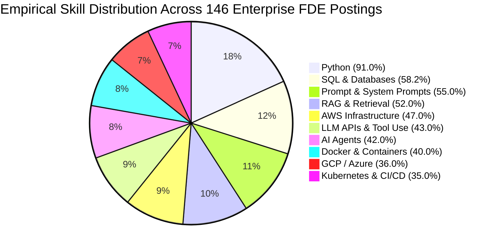
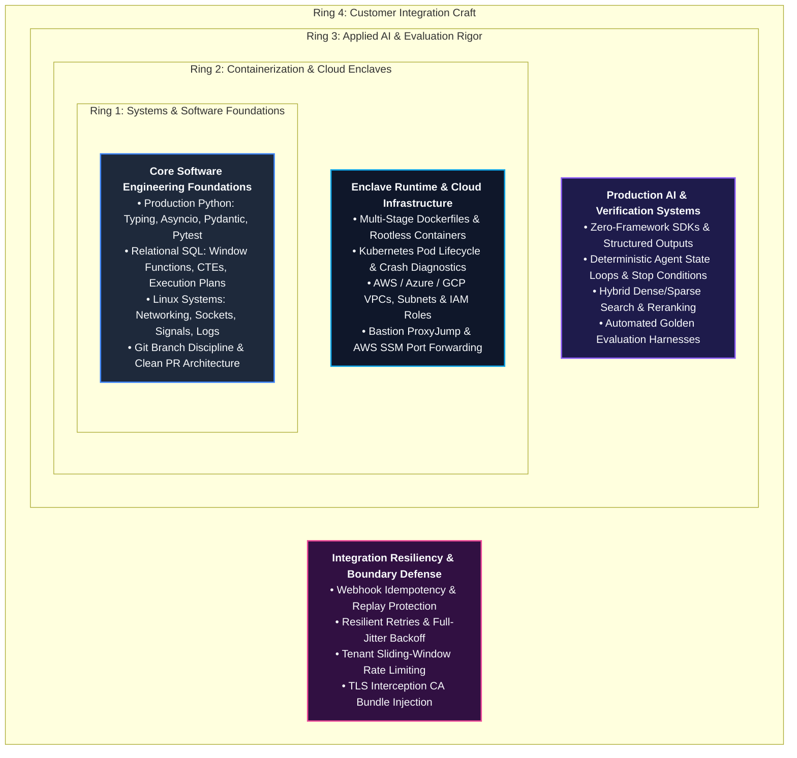

# Core Technical Skills: The Production Engineering Stack

In enterprise technology, a common misconception is that the Forward Deployed Engineer (FDE) is primarily
a "prompt engineer," a solutions architect who draws diagrams, or a technical consultant who writes glue scripts.
The empirical reality is starkly different: an FDE is, first and foremost, a **senior production software engineer**
who deploys code into foreign, hostile, and locked-down customer environments.

When you deploy software inside an enterprise customer's Virtual Private Cloud (VPC), there are no managed
notebook environments or local Docker desktops. You face air-gapped corporate firewalls, corporate TLS interception
proxies, strict Role-Based Access Control (RBAC), legacy SQL databases with undocumented schemas, and strict
enterprise Service Level Agreements (SLAs).

This guide provides the definitive technical competency standard for the FDE discipline. It is calibrated against
empirical data from 146 deduplicated enterprise job postings across 94 employers ([`job-market/dataset/fde_market_data.json`](../job-market/dataset/fde_market_data.json)),
specifies exact engineering depth for every layer of the stack, and maps each skill directly to production code
defenses within this repository.

---

## 1. Empirical Technology Distribution

Based on systematic analysis of 146 active enterprise FDE job postings across 94 companies (including OpenAI,
Anthropic, Palantir, Databricks, Snowflake, Scale AI, and AWS), the technical requirements cluster across five
core engineering domains:



### Empirical Distribution Table

| Technical Domain | Core Technology / Competency | Posting Count ($N=146$) | Frequency (%) | Primary Production Context |
| :--- | :--- | :--- | :--- | :--- |
| **Core Languages** | **Python** | 133 | **91.0%** | Production backend services, data pipelines, SDK authoring, async APIs |
| | **SQL & Relational Stores** | 85 | **58.2%** | Reverse-engineering customer OLTP schemas, analytics pipelines, migrations |
| | **TypeScript / JavaScript** | 46 | **31.5%** | Enterprise frontend integration, Node.js microservices, webhooks |
| | **Go / C++** | 27 | **18.5%** | High-throughput streaming, low-latency inferencing, edge deployments |
| **Cloud Platforms** | **Amazon Web Services (AWS)** | 69 | **47.0%** | Multi-VPC setups, PrivateLink, IAM role assumptions, ECS/EKS, KMS |
| | **Google Cloud Platform (GCP)** | 55 | **37.7%** | BigQuery integrations, Vertex AI, GKE, Cloud Run, Workload Identity |
| | **Microsoft Azure** | 50 | **34.2%** | Azure OpenAI Service, Entra ID (Azure AD), AKS, Private Endpoints |
| **Containers & Ops** | **Docker** | 58 | **40.0%** | Multi-stage production builds, distroless images, rootless execution |
| | **Kubernetes (k8s)** | 51 | **35.0%** | Reading manifests, diagnosing `CrashLoopBackOff`, Helm chart overrides |
| | **CI/CD & Automation** | 50 | **34.0%** | GitHub Actions, GitLab CI, automated regression & evaluation pipelines |
| | **Terraform / IaC** | 38 | **26.0%** | Reading customer infrastructure modules, provisioning enclave resources |
| **Applied AI & LLMs** | **Prompt / System Prompting** | 80 | **55.0%** | Few-shot in-context learning, defensive steering, refusal boundary setting |
| | **RAG & Hybrid Search** | 76 | **52.0%** | Dense vector embeddings, BM25 lexical search, reciprocal rank fusion (RRF) |
| | **LLM APIs & Tool Calling** | 63 | **43.0%** | Schema-enforced JSON generation, function calling, rate/token budgeting |
| | **AI Agents & Workflows** | 61 | **42.0%** | Multi-step deterministic state machines, retry loops, stop conditions |
| | **LangChain / LlamaIndex** | 48 | **33.0%** | Framework literacy; understanding internal abstractions and debugging |

---

## 2. The 4 Concentric Rings of FDE Technical Mastery

FDE technical depth is not a flat list of buzzwords; it operates as four concentric layers of engineering capability.
Outer layers are completely useless without the foundation of the inner layers:



---

## 3. Calibrated Technical Depth Specifications

Enterprise job postings specify technologies, but rarely calibrate **how deep** an engineer must go.
Below is the definitive calibration for forward-deployed production engineering.

---

### Layer 1: Core Software Engineering Foundations

#### Python (The 91.0% Standard)
In FDE work, Python is not a prototyping scripting language; it is a compiled, typed, asynchronous backend
language that must survive customer security reviews and automated CI/CD gating:
- **Typing & Schemas**: Strict static typing with `mypy` or `pyright`. Universal adoption of Pydantic v2
  (`BaseModel`, `Field`, `model_validator`) for runtime serialization and deserialization.
- **Asynchronous Execution (`asyncio`)**: Mastery of asynchronous I/O loops (`async`/`await`), task concurrency
  (`asyncio.gather`), timeouts (`asyncio.timeout`), and connection pooling (`aiohttp`, `httpx.AsyncClient`).
- **Testing Architecture**: Writing deterministic test suites using `pytest`. Extensive use of fixtures,
  mocking external APIs (`pytest-mock`), parameterized test suites, and asserting on exception contexts.
- **Production Packaging**: Packaging applications with `pyproject.toml` (using modern build tools like `uv`,
  `poetry`, or `hatch`), structured logging with contextual JSON fields (`structlog`), and 12-factor configuration
  via environment variables.

#### Relational SQL & Data Modeling (58.2%)
Customer enterprise data almost never arrives clean in a managed vector database; it resides in 15-year-old
PostgreSQL, Oracle, or SQL Server databases with hundreds of unindexed columns:
- **Complex Querying**: Fluency in Common Table Expressions (`WITH ... AS (...)`) and advanced window functions
  (`ROW_NUMBER()`, `DENSE_RANK()`, `LAG()`, `LEAD()`, `PARTITION BY`).
- **Execution Plan Profiling**: Inspecting `EXPLAIN (ANALYZE, BUFFERS)` to identify sequential scans, nested loop
  joins on unindexed foreign keys, and sorting spills to disk.
- **Defensive Schema Introspection**: Querying database information catalogs (`information_schema.tables`,
  `information_schema.columns`) to map undocumented tables without requesting database administrator assistance.

#### Linux Systems & Networking
When an application fails inside a customer enclave, SSH access and terminal diagnostics are your only tools:
- **Network Diagnostics**: Using `curl -IvL` to trace HTTP redirects, inspect TLS handshake negotiations, and
  verify SSL certificate authority chains (`--cacert`). Diagnosing socket states with `ss -tulpn` or `netstat`.
- **Process & Resource Inspection**: Inspecting system processes with `htop`, `ps aux`, and examining process limits
  in `/proc/<pid>/limits`. Diagnosing file descriptor exhaustion (`lsof -p <pid>`).
- **Log Forensics**: Rapidly searching, filtering, and parsing multi-gigabyte log files using `ripgrep` (`rg`),
  `awk`, `sed`, and `jq` without loading entire files into memory.

---

### Layer 2: Containerization & Cloud Enclaves

#### Docker & Container Hygiene (40.0%)
FDE container images are deployed into customer container registries (ECR, ACR, Artifact Registry, Harbor)
subject to automated vulnerability scanning (Trivy, Snyk, Prisma Cloud):
- **Multi-Stage Builds**: Separating the build environment (compilers, dev tools, SDKs) from the minimal runtime
  enclave (`distroless` or `alpine`) to minimize image size and eliminate Common Vulnerabilities and Exposures (CVEs).
- **Non-Root Execution**: Explicitly creating and running as a non-root system user (`USER appuser`) with restricted
  file system permissions.
- **Health Check Hooks**: Defining robust `HEALTHCHECK` instructions that probe local service endpoints without
  relying on external curl or shell dependencies.

#### Kubernetes (k8s) & Cluster Runtimes (35.0%)
FDEs rarely build Kubernetes clusters from scratch; they deploy microservices into pre-existing, heavily
governed customer clusters:
- **Manifest Architecture**: Reading, editing, and authoring `Deployment`, `Service`, `ConfigMap`, `Secret`,
  and `Ingress` manifests.
- **Pod Lifecycle & Probes**: Configuring distinct `startupProbe`, `livenessProbe`, and `readinessProbe` hooks
  to prevent traffic routing before internal model weights or database connections are initialized.
- **Cluster Diagnostics**: Diagnosing failure states using `kubectl describe pod <name>` and `kubectl logs -f <name>`:
  - `CrashLoopBackOff`: Application exit code inspection, missing configuration secrets, unhandled startup exceptions.
  - `OOMKilled` (Exit Code 137): Container memory limit exceeded by Python garbage collection spikes or batch buffer sizes.
  - `ImagePullBackOff`: Customer registry authentication failures or missing pull secrets.

#### Enterprise Cloud & VPC Topologies (AWS 47%, GCP 38%, Azure 34%)
FDEs must be deeply proficient in one primary cloud (typically AWS) and conceptually fluent across all three:
- **VPC Networking**: Subnet routing, public vs private subnets, Internet Gateways vs NAT Gateways, Security Groups
  (stateful) vs Network Access Control Lists (NACLs, stateless).
- **Private Connectivity**: Connecting across accounts using AWS VPC Peering, PrivateLink, Azure Private Endpoints,
  or GCP Private Service Connect to prevent traffic from traversing the public internet.
- **IAM Least Privilege**: Defining role-based policies with strict ARN constraints; assuming cross-account roles
  via AWS STS (`sts:AssumeRole`) or GCP Workload Identity Federation.
- **Bastion & Enclave Traversal**: Tunneling through enterprise bastions using OpenSSH `ProxyJump` and AWS Systems
  Manager (SSM) Session Manager port-forwarding:
  ```bash
  aws ssm start-session --target i-0123456789abcdef0 \
      --document-name AWS-StartPortForwardingSession \
      --parameters '{"portNumber":["8000"],"localPortNumber":["8000"]}'
  ```

---

### Layer 3: Applied AI & Evaluation Rigor

#### Zero-Framework LLM API Mastery
Third-party abstraction libraries (such as early LangChain wrappers) frequently obscure network retries, hide token
consumption, and break under custom proxy configurations. A senior FDE must master direct vendor SDKs:
- **Schema-Enforced Structured Outputs**: Utilizing native JSON schema enforcement (`response_format={"type": "json_schema"}`)
  or strict tool calling schemas to guarantee type-safe deserialization directly into Pydantic models.
- **Deterministic Agent Loops**: Constructing explicit agent loops with finite step budgets, deterministic termination
  predicates, and state accumulators:
  ```python
  MAX_AGENT_STEPS = 5
  for step in range(MAX_AGENT_STEPS):
      response = await client.generate(messages=history, tools=tool_registry)
      if not response.tool_calls:
          return response.content  # Terminal stop condition
      for tool_call in response.tool_calls:
          result = await execute_tool(tool_call)
          history.append({"role": "tool", "content": result})
  raise RuntimeError("Agent exceeded maximum execution budget without terminal resolution.")
  ```
- **Token & Cost Accounting**: Measuring prompt vs completion token consumption per request, computing latency
  distributions (p50, p95, p99), and enforcing client-side budget caps.

#### RAG & Hybrid Retrieval Engineering (52.0%)
Simple vector cosine similarity search fails on enterprise documents containing exact SKU numbers, legal clause codes,
or customer IDs:
- **Chunking Strategy**: Implementing semantic and sliding-window chunking with configurable overlap (see [`interviews/code/chunker.py`](../interviews/code/chunker.py))
  to preserve contextual continuity across chunk boundaries.
- **Hybrid Retrieval**: Combining dense vector embeddings (semantic similarity) with sparse lexical search (BM25)
  via Reciprocal Rank Fusion (RRF) to capture both conceptual meaning and exact keyword hits.
- **Citation Grounding**: Enforcing that every generated response contains deterministic file, section, and line-level
  citations traceable to the underlying source document.

#### Automated Golden Evaluation Systems
The primary differentiator between an amateur hobbyist and a production FDE is the ability to prove that a probabilistic
system satisfies enterprise accuracy SLAs:
- **Deterministic Golden Benchmarks**: Assembling curated evaluation sets reflecting real-world edge cases (see [`portfolio/reference-project/evals/DATASET_PROVENANCE.md`](../portfolio/reference-project/evals/DATASET_PROVENANCE.md)).
- **Automated Scorecard Execution**: Running non-flaky evaluation test suites comparing model outputs against ground truth
  classification categories, extraction schemas, and citation requirements (see [`portfolio/reference-project/evals/run_evals.py`](../portfolio/reference-project/evals/run_evals.py)).

---

### Layer 4: Customer Integration Craft & Resiliency Primitives

#### Webhook Idempotency & Replay Protection
Customer upstream event buses (Salesforce, Stripe, ServiceNow, Kafka) guarantee *at-least-once* delivery. If your
webhook receiver processes the same event twice, customer database records are corrupted:
- **Atomic Idempotency Keys**: Checking and recording unique transaction IDs within an atomic transaction.
- **Payload Fingerprinting**: Computing SHA-256 hashes of incoming payloads to detect and reject conflicting payloads
  reusing the same idempotency key (HTTP 409 Conflict).
- **Production Defense**: Implemented and tested in [`interviews/code/webhook_receiver.py`](../interviews/code/webhook_receiver.py)
  and [`interviews/code/test_webhook_receiver.py`](../interviews/code/test_webhook_receiver.py).

#### Resilient Clients & Exponential Backoff
Enterprise downstream APIs experience transient network blips, HTTP 429 rate limits, and 503 service unavailable errors:
- **Full-Jitter Backoff**: Implementing exponential backoff with randomized jitter to prevent the "thundering herd"
  problem across distributed client instances:
  $$\text{Sleep} = \text{random}(0, \min(T_{\max}, T_{\text{base}} \times 2^{\text{attempt}}))$$
- **Header-Aware Throttling**: Honoring upstream `Retry-After` headers and strictly isolating transient retriable errors
  from fatal unretriable client errors (HTTP 400, 401, 403, 422).
- **Production Defense**: Implemented and tested in [`interviews/code/resilient_client.py`](../interviews/code/resilient_client.py)
  and [`interviews/code/test_resilient_client.py`](../interviews/code/test_resilient_client.py).

#### Tenant Rate Limiting & Backpressure
Multi-tenant enterprise systems must prevent a single customer or runaway batch worker from exhausting shared downstream
LLM rate quotas:
- **Sliding-Window Memory Store**: Tracking request timestamps per tenant to enforce strict rolling-window request quotas.
- **Graceful Rejection**: Returning standard HTTP 429 status codes with computed `Retry-After` headers.
- **Production Defense**: Implemented and tested in [`interviews/code/rate_limiter.py`](../interviews/code/rate_limiter.py)
  and [`interviews/code/test_rate_limiter.py`](../interviews/code/test_rate_limiter.py).

---

## 4. Direct Codebase Defense Implementations

Every technical skill detailed in this guide is directly backed by fully implemented, unit-tested, and evaluated
code in this repository:

| Core Skill Competency | Codebase Defense File | Test / Verification Command | Production Architecture Role |
| :--- | :--- | :--- | :--- |
| **Resilient API Client** | [`interviews/code/resilient_client.py`](../interviews/code/resilient_client.py) | `pytest interviews/code/test_resilient_client.py` | Exponential backoff with full jitter, header-aware retry logic |
| **Idempotent Webhooks** | [`interviews/code/webhook_receiver.py`](../interviews/code/webhook_receiver.py) | `pytest interviews/code/test_webhook_receiver.py` | Replay protection, SHA256 payload verification, conflict detection |
| **Multi-Tenant Rate Limiting**| [`interviews/code/rate_limiter.py`](../interviews/code/rate_limiter.py) | `pytest interviews/code/test_rate_limiter.py` | Sliding window rate limiter with tiered quotas and backpressure |
| **Structured Output Extractor**| [`interviews/code/structured_extractor.py`](../interviews/code/structured_extractor.py) | `pytest interviews/code/test_structured_extractor.py`| Pydantic schema validation with self-healing reflection loops |
| **Semantic Document Chunker** | [`interviews/code/chunker.py`](../interviews/code/chunker.py) | `pytest interviews/code/test_chunker.py` | Word-boundary preservation, sliding overlap, empty/edge filtering |
| **Defensive Log Parser** | [`interviews/code/parser.py`](../interviews/code/parser.py) | `pytest interviews/code/test_parser.py` | Unstructured CSV/JSON log repair, timestamp normalization |
| **Production FastAPI Server** | [`portfolio/reference-project/src/api/server.py`](../portfolio/reference-project/src/api/server.py) | `pytest portfolio/reference-project/tests/` | Full enterprise engine with RBAC, hybrid search, and audit trail |
| **Automated Golden Evals** | [`portfolio/reference-project/evals/run_evals.py`](../portfolio/reference-project/evals/run_evals.py) | `python portfolio/reference-project/evals/run_evals.py` | 25 enterprise test cases asserting 100% citation grounding |

---

## 5. 12-Point Calibrated Self-Audit Diagnostic

Run this diagnostic quarterly or before entering an enterprise FDE interview loop. Each item maps directly to a
verifiable operational capability:

- [ ] **1. Python Packaging & Typing**: I can package an asynchronous Python service using `pyproject.toml`, enforce strict type hinting with `mypy`, and validate runtime schemas using Pydantic v2.
- [ ] **2. Automated Testing Rigor**: I can write clean `pytest` test suites with fixtures, parameterized test cases, and async mocking that achieve $\ge 90\%$ code coverage.
- [ ] **3. Database Query Optimization**: I can write window-function queries (`ROW_NUMBER()`, `LEAD()`), audit execution plans using `EXPLAIN ANALYZE`, and identify missing composite indexes.
- [ ] **4. Container Hardening**: I can author a multi-stage Dockerfile that runs as an unprivileged non-root user, eliminates build dependencies, and compiles into a minimal distroless image.
- [ ] **5. Kubernetes Crash Diagnostics**: I can diagnose a pod stuck in `CrashLoopBackOff` or terminated with `OOMKilled` (Exit Code 137) using `kubectl describe` and log inspection.
- [ ] **6. Enterprise VPC Networking**: I can configure VPC subnets, NAT gateways, and Security Groups, and navigate private enclaves using SSH `ProxyJump` or AWS SSM port forwarding.
- [ ] **7. Framework-Free LLM SDKs**: I can call frontier model APIs (OpenAI / Anthropic) directly without LangChain, enforcing strict JSON schemas and tool-calling validation.
- [ ] **8. Hybrid RAG Architecture**: I can construct a RAG pipeline combining dense vector embeddings and BM25 lexical search with reciprocal rank fusion (RRF) and source citation.
- [ ] **9. Deterministic Golden Evaluations**: I can assemble an empirical golden dataset and execute automated evaluation harnesses measuring category classification, latency, and grounding.
- [ ] **10. Webhook Idempotency**: I can design an idempotent webhook receiver that prevents duplicate execution using atomic state tracking and SHA-256 payload conflict detection.
- [ ] **11. Resilient API Integrations**: I can implement client-side retries with exponential backoff and full jitter, respecting upstream `Retry-After` headers without thundering herds.
- [ ] **12. Multi-Tenant Throttling**: I can implement sliding-window rate limiters that isolate noisy enterprise tenants and return HTTP 429 status codes with backpressure headers.

---

## 6. Primary Practitioner Literature & Citations

1. **Anthropic**: *Forward Deployed Engineer Role Specification & Engineering Standards* (2026). [job-boards.greenhouse.io/anthropic/jobs/5302966008](https://job-boards.greenhouse.io/anthropic/jobs/5302966008)
2. **OpenAI**: *Enterprise Solutions & Forward Deployed Engineering Architecture Guidelines* (2026). [openai.com/careers](https://openai.com/careers)
3. **AWS Well-Architected Framework**: *Reliability Pillar: Implementing Exponential Backoff, Jitter, and Idempotent Operations*. [docs.aws.amazon.com/wellarchitected/latest/reliability-pillar](https://docs.aws.amazon.com/wellarchitected/latest/reliability-pillar/)
4. **Google Site Reliability Engineering**: *Addressing Cascading Failures and Thundering Herds with Client-Side Jitter*. [sre.google/sre-book/addressing-cascading-failures](https://sre.google/sre-book/addressing-cascading-failures/)
5. **Alexey Grigorev**: *AI Engineering Field Guide: Forward Deployed Engineer Skill Census* (2026). Analysis of 146 deduplicated FDE postings across 94 enterprise companies. [github.com/alexeygrigorev/ai-engineering-field-guide](https://github.com/alexeygrigorev/ai-engineering-field-guide)
6. **Plank**: *The 2025 Forward Deployed Engineer Market Report*. Comprehensive survey of 982 forward-deployed job listings. [plank.com](https://plank.com)
7. **Lightcast**: *Labor Market Intelligence: Production Systems Engineering & Enterprise Software Integration Demand* (2026).
