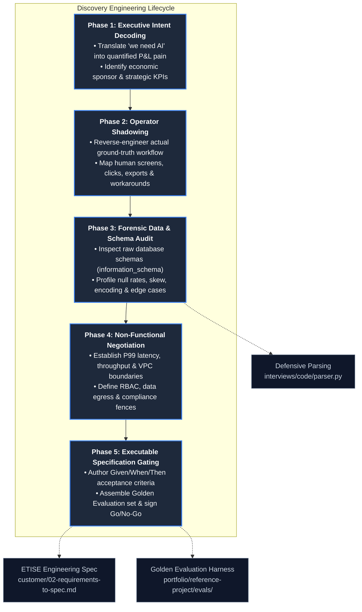
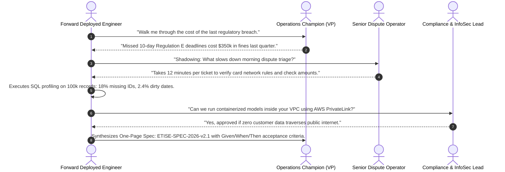

# Discovery and Requirements Engineering

In enterprise technology, the most catastrophic engineering failures do not occur during deployment;
they occur during the first two weeks of discovery. Building an architecturally flawless, highly scalable,
and mathematically sophisticated system for the wrong business problem is the single most expensive error
a Forward Deployed Engineer (FDE) can commit. Once code is written and infrastructure is provisioned, reversing
bad architectural assumptions costs weeks of schedule slip and erodes stakeholder credibility.

The empirical data reflects this reality: in an independent analysis of 146 deduplicated enterprise FDE job
postings across 94 employers ([`job-market/dataset/fde_market_data.json`](../job-market/dataset/fde_market_data.json)),
**scoping requirements and technical discovery appears in 52.0% of postings**—matching RAG (52.0%) and outpacing
Kubernetes (35.0%). OpenAI's enterprise FDE role specification explicitly places discovery first in its core
mandate: *"lead technical discovery, architecture, implementation, evaluation, productionization, and handoff"*
([OpenAI Careers, 2026](https://openai.com/careers)).

Furthermore, the **MIT NANDA Initiative** (Fortune, August 2025) revealed that roughly **95% of enterprise
generative AI pilots fail to deliver measurable P&L impact**. The small 5% that succeed do not succeed because
of superior foundational models; they succeed because they are surgically integrated into concrete operational
workflows discovered on the ground.

This guide provides the field manual for technical discovery: the 5-phase discovery lifecycle, the 8-theme
practitioner interview protocol, forensic SQL data auditing techniques, an empirical financial dispute case
study backed by CFPB data, and direct codebase defenses.

---

## 1. The 5-Phase Discovery Engineering Lifecycle

Technical discovery is not casual conversation or pre-sales relationship building; it is a structured,
forensic engineering process that converts vague executive aspirations into binding, testable technical contracts:



---

## 2. The 8-Theme Technical Discovery Protocol

Run discovery interviews as disciplined 45-minute sessions. Pair two engineers: one leads the questioning
while the other captures technical transcripts and architecture notes. Record sessions with explicit client
permission. Close every interview by reading back key takeaways and resolving contradictions in the room.

### Theme 1: Current-State Workflow Mechanics
*Objective: Uncover how the work actually happens, not how the executive manual claims it happens.*
- "Walk me through the lifecycle of the last concrete ticket or case handled yesterday, from arrival to closure."
- "What exact tools, browser tabs, terminal windows, spreadsheets, and internal Slack/Teams channels were open?"
- "If an engineer sat silently beside your team for an entire shift, what would be the most surprising manual workaround?"

### Theme 2: Quantified Pain & Financial Cost
*Objective: Attach dollar amounts, operator hours, or customer churn numbers to the problem.*
- "What does this operational bottleneck cost per week in human hours, direct customer credits, or delayed SLA penalties?"
- "Which failure hurts the organization more: slow turnaround time or inaccurate decisions that require manual rework?"
- "What happens to the business unit if this system remains completely unchanged for the next twelve months?"

### Theme 3: Volume, Velocity & Edge-Case Distributions
*Objective: Size the system and detect distribution skews before architecting ingestion pipelines.*
- "How many events, tickets, or records pass through this pipeline daily, and what does the peak-to-median ratio look like?"
- "What percentage of cases are considered 'routine,' and what were the three weirdest edge cases encountered last month?"
- "Which classes of cases must *never* be handled autonomously and must always divert to human operators?"

### Theme 4: Measurable Success Metrics & 90-Day P&L Objectives
*Objective: Define the exact scorecard used to judge the project at steering committee reviews.*
- "Ninety days after production deployment, what single metric tells executive leadership that this investment succeeded?"
- "What is the current empirical baseline for that metric, and who is the official source of truth for measuring it?"
- "What outcome would cause leadership to label this project a failure, even if the software ships on time with zero bugs?"

### Theme 5: Enclave, Security & Regulatory Constraints
*Objective: Identify VPC isolation, data classification, and compliance barriers before writing code.*
- "What classification does this data hold (PII, PHI, PCI-DSS, MNPI), and does customer data ever have permission to leave your VPC?"
- "Are we deploying inside an air-gapped AWS enclave, Azure GovCloud, or on-premise OpenShift cluster?"
- "What corporate proxy, egress filtering, and TLS interception appliances sit between our runtime and external APIs?"

### Theme 6: Decision Structure & Hidden Approvers
*Objective: Prevent week-six project vetos by identifying every governance stakeholder on Day 1.*
- "Who has the authority to formally sign off on production cutover? Who holds operational veto power?"
- "Whose approval was required on the last major technical initiative that surprised the project team late in the cycle?"
- "Who represents InfoSec, Legal, and Data Governance, and have they reviewed our preliminary data flow diagram?"

### Theme 7: Prior Attempts & Deceased Vendor Post-Mortems
*Objective: Avoid repeating historical failures and understand organizational antibodies.*
- "What has been attempted before to solve this problem, whether through internal engineering or external vendors?"
- "Why did the previous attempt stall, lose executive sponsorship, or fail in production?"
- "May we review the post-mortem, architecture spec, or ticket export from that previous project?"

### Theme 8: Boundary Invariants & Scope Exclusions
*Objective: Establish explicit non-goals to prevent insidious sprint-over-sprint scope creep.*
- "What related upstream and downstream systems are explicitly *out of scope* for this engagement?"
- "What capabilities are nice-to-have aspirational features that must not gate the Phase 1 production release?"

---

## 3. Forensic Data Walkthrough & Schema Auditing

Never accept a curated demo dataset or synthetic CSV export as representative of customer production reality.
Curated demo environments lie: they feature clean UTF-8 text, zero missing fields, balanced categorical distributions,
and negligible concurrency. Production enterprise databases contain 15 years of schema migrations, corrupted encodings,
and unindexed join keys.

### Essential Discovery SQL Profiling Queries

When granted read-only access to customer data stores, execute these non-destructive profiling queries
immediately to discover data rot:

#### 1. Schema Introspection Without DBA Intervention
```sql
-- Map all tables and column types across the target customer schema
SELECT 
    table_name, 
    column_name, 
    data_type, 
    is_nullable
FROM information_schema.columns
WHERE table_schema = 'customer_production'
ORDER BY table_name, ordinal_position;
```

#### 2. Null Rate and Cardinality Distribution
```sql
-- Audit missing data, unique cardinality, and record volume in critical fields
SELECT 
    COUNT(*) AS total_records,
    COUNT(customer_id) AS non_null_ids,
    COUNT(DISTINCT customer_id) AS unique_ids,
    ROUND(100.0 * (COUNT(*) - COUNT(issue_category)) / COUNT(*), 2) AS category_null_pct,
    ROUND(100.0 * (COUNT(*) - COUNT(dispute_amount)) / COUNT(*), 2) AS amount_null_pct,
    ROUND(100.0 * (COUNT(*) - COUNT(narrative_text)) / COUNT(*), 2) AS narrative_null_pct
FROM customer_production.disputes;
```

#### 3. Timestamp Skew and Format Fragmentation
```sql
-- Detect timestamp nulls, unparseable formats, and timezone anomalies
SELECT 
    MIN(created_at) AS earliest_record,
    MAX(created_at) AS latest_record,
    COUNT(*) FILTER (WHERE created_at > NOW()) AS future_dated_anomalies,
    COUNT(*) FILTER (WHERE created_at IS NULL) AS unversioned_records
FROM customer_production.disputes;
```

#### 4. Categorical Class Imbalance
```sql
-- Identify rare edge-case categories vs dominant classes
SELECT 
    COALESCE(issue_category, 'MISSING') AS category,
    COUNT(*) AS frequency,
    ROUND(100.0 * COUNT(*) / SUM(COUNT(*)) OVER(), 2) AS share_percentage
FROM customer_production.disputes
GROUP BY issue_category
ORDER BY frequency DESC;
```

---

## 4. Production Empirical Case: Enterprise Dispute Escalation Engine

To illustrate disciplined discovery in practice, consider the following real-world engagement calibrated
against empirical records from the **Consumer Financial Protection Bureau (CFPB) Public Complaint Database**
and **Bitext Enterprise Customer Interaction Datasets** ([`portfolio/reference-project/evals/DATASET_PROVENANCE.md`](../portfolio/reference-project/evals/DATASET_PROVENANCE.md)).

### Situation & Stakeholder Context
A Tier-1 financial institution processes over 12,000 monthly consumer disputes across credit cards, consumer loans,
and retail banking. The executive sponsor (Head of Consumer Operations) approaches the FDE team requesting an
*"Enterprise GenAI Agent to fully automate customer dispute handling."* They have allocated a 6-week pilot budget.

### Discovered Ground-Truth Constraints
1. **The Legacy Core**: Dispute records originate in a 20-year-old mainframe core banking database.
   Exported records contain truncated free-text narratives, inconsistent date formats, and missing transaction IDs.
2. **Regulatory & Compliance Fence**: Under federal consumer protection guidelines (12 CFR Part 1005 / Regulation E),
   billing disputes exceeding $5,000 or alleging identity theft must be resolved within strict statutory timelines
   (10 business days) and require a fully audited paper trail.
3. **The Data Egress Wall**: Customer financial data may not leave the institution's private AWS VPC. No third-party
   SaaS LLM APIs may be called without an InfoSec review that requires 12 weeks.

### What Good Looks Like (The Discovery Transformation)
Instead of attempting to build an autonomous agent that directly issues financial refunds—which would be
vetoed by Compliance on Day 14—the FDE guides the engagement toward an **Automated Dispute Intelligence & SLA
Escalation Engine (ETISE)**:
- High-confidence routine disputes ($< \$250$, zero fraud flags) are classified, enriched with relevant regulatory
  citations, and drafted for operator batch approval.
- High-risk disputes ($> \$1,000$, statutory deadlines, legal threats) are immediately routed into an urgent
  exception queue with deterministic SLA countdown timers.

### The 6-Move Discovery Walkthrough



1. **Move 1: Executive Intent Decoding**: The FDE uncovers that "automate dispute handling" actually means
   "eliminate regulatory fines caused by missed Regulation E deadlines." Fines totaled $350,000 in Q3 alone.
2. **Move 2: Operator Shadowing**: The FDE spends 4 hours observing Tier-2 dispute analysts. The bottleneck is
   not typing responses; it is cross-referencing messy complaint narratives against internal policy PDFs and
   determining whether statutory 10-day clocks apply.
3. **Move 3: Forensic Data Profiling**: Running SQL diagnostics against 100,000 historical dispute records reveals
   that 18.2% of raw records lack standardized transaction IDs and 2.4% contain unparseable dates—meaning any naive
   pipeline would throw runtime exceptions on 1 out of every 5 incoming tickets.
4. **Move 4: InfoSec & Compliance Gate**: The FDE presents a containerized enclave architecture using private
   endpoints (AWS PrivateLink), proving zero data egress and passing security review in Week 1.
5. **Move 5: Golden Dataset Assembly**: The FDE pairs with the lead compliance officer to curate a 25-case Golden
   Evaluation dataset representing statutory edge cases, fee disputes, and identity theft allegations.
6. **Move 6: The Binding Contract**: The FDE authors the formal specification ([`customer/02-requirements-to-spec.md`](../customer/02-requirements-to-spec.md)),
   establishing measurable acceptance criteria: $\ge 88\%$ category accuracy, $\ge 90\%$ severity classification,
   and $100\%$ citation grounding before production cutover.

---

## 5. Direct Codebase Defense Implementations

The technical discovery practices outlined here map directly to executable code, parsers, and evaluation
frameworks within this repository:

| Discovery Finding / Artifact | Codebase Defense Implementation | Production Role |
| :--- | :--- | :--- |
| **Dirty Export & Missing Fields** | [`interviews/code/parser.py`](../interviews/code/parser.py) | Defensive CSV/JSON parser repairing dirty amounts, missing timestamps, and corrupted rows |
| **Schema Validation & Gating** | [`interviews/code/structured_extractor.py`](../interviews/code/structured_extractor.py) | Pydantic model validation with self-healing error correction loops |
| **Empirical Evaluation Harness** | [`portfolio/reference-project/evals/run_evals.py`](../portfolio/reference-project/evals/run_evals.py) | Automated scorecard executing 25 golden enterprise dispute scenarios against acceptance SLAs |
| **Real-World Dataset Provenance**| [`portfolio/reference-project/evals/DATASET_PROVENANCE.md`](../portfolio/reference-project/evals/DATASET_PROVENANCE.md) | Ground truth documentation based on CFPB public dispute records and Bitext interactions |
| **Executable Spec Skeleton** | [`customer/02-requirements-to-spec.md`](../customer/02-requirements-to-spec.md) | Standardized one-page specification skeleton with Given/When/Then acceptance criteria |
| **Production SLA Gateway** | [`portfolio/reference-project/src/api/server.py`](../portfolio/reference-project/src/api/server.py) | FastAPI service asserting statutory SLA escalation tags and operator override workflows |

---

## 6. Primary Practitioner Literature & Citations

1. **OpenAI**: *Forward Deployed Engineer, Enterprise & Applied Engineering Role Standards* (2026). [openai.com/careers](https://openai.com/careers)
2. **Anthropic**: *Forward Deployed Engineer - Enterprise Deployments & Customer Discovery Rigor* (2026). [job-boards.greenhouse.io/anthropic/jobs/5302966008](https://job-boards.greenhouse.io/anthropic/jobs/5302966008)
3. **MIT NANDA Initiative / Fortune**: *The GenAI Divide: Why 95% of Enterprise AI Pilots Fail* (August 2025). [fortune.com/2025/08/18/mit-report-95-percent-generative-ai-pilots-at-companies-failing-cfo](https://fortune.com/2025/08/18/mit-report-95-percent-generative-ai-pilots-at-companies-failing-cfo)
4. **Consumer Financial Protection Bureau (CFPB)**: *Consumer Complaint Database Public API & Schema Specifications*. [consumerfinance.gov/data-research/consumer-complaints](https://www.consumerfinance.gov/data-research/consumer-complaints/)
5. **Bitext**: *Enterprise Customer Support & Intent Classification Benchmark Corpus*. [huggingface.co/datasets/bitext](https://huggingface.co/datasets/bitext)
6. **Alexander Karp & Shyam Sankar**: *The Palantir Forward Deployed Engineering Methodology: Direct Ground-Truth Discovery* (Palantir Technologies, 2024).
