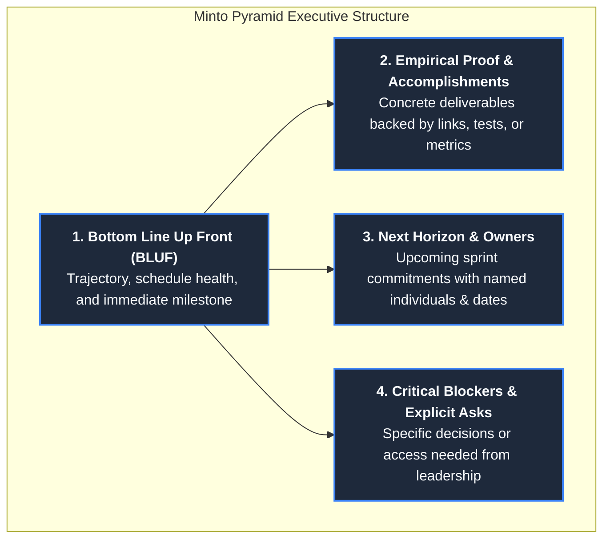
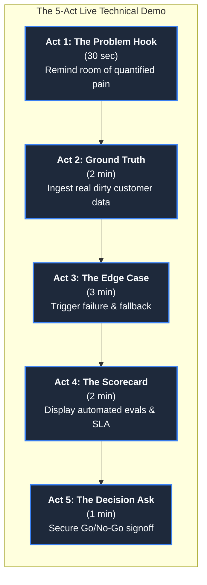
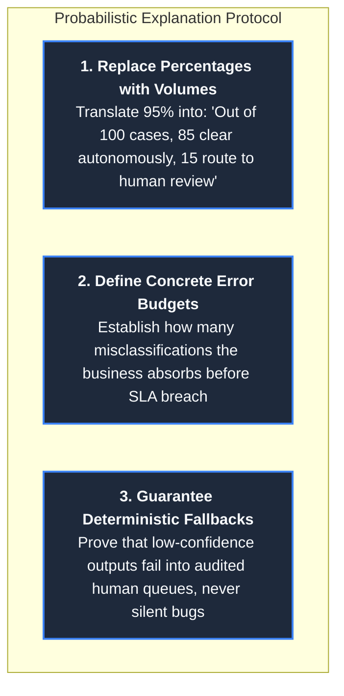

# Communication and Technical Storytelling: The Bilingual Engineer

In enterprise technology, many brilliant software engineers struggle in customer-facing environments not
because their code is flawed, but because their communication is unintelligible to the people who hold budget
and veto power. Conversely, traditional pre-sales engineers often speak fluent corporate strategy but collapse
into hand-waving when an enterprise infrastructure architect asks about TLS certificate chains, socket timeouts,
or database connection pooling.

The **Forward Deployed Engineer (FDE)** must possess **bilingual fluency**: the rare ability to seamlessly
translate between high-level business return-on-investment (ROI) with executive sponsors and low-level Linux
internals, networking, and distributed systems architecture with client engineers.

When you operate inside another organization, your documents and demos are the primary artifacts that survive
your departure. A meeting ends, a Zoom call disconnects, and the written word is what gets forwarded to the
Chief Information Security Officer (CISO) and the Chief Financial Officer (CFO).

This guide provides the operational field manual for FDE communication: the bilingual translation lexicon,
the written-first executive suite (Minto Pyramid BLUF, Technical Decision Records, and Google SRE incident updates),
the 5-Act live technical demo framework, and the methodology for explaining probabilistic AI systems to skeptical
enterprise stakeholders.

---

## 1. The Bilingual Translation Lexicon

An FDE never presents raw technical jargon to an executive, nor do they present vague business buzzwords
to a principal software architect. Bilingual fluency means expressing the exact same technical reality in the
native vocabulary of the audience:

| Engineering Ground Truth (Customer Engineers) | Executive Translation (VP / C-Suite Sponsor) | Operational Value / Risk Addressed |
| :--- | :--- | :--- |
| **"Egress proxy TLS interception is breaking pip wheel downloads with self-signed certificate errors."** | "We are configuring our deployment to integrate with your internal corporate security gateway, ensuring zero unmonitored external traffic." | Security compliance, accelerating InfoSec signoff |
| **"Unindexed foreign key joins on the disputes table are causing full sequential table scans."** | "Optimizing the core data ingestion pipeline to ensure morning exception reports are ready for duty managers before the 06:00 shift begins." | Operational velocity, preventing daily operator downtime |
| **"p99 LLM inference latency spiked from 350ms to 1,800ms due to token context bloat."** | "Refining document chunking to prevent processing bottlenecks, maintaining our target response time and keeping operator productivity high." | User adoption, meeting customer SLA commitments |
| **"Implemented atomic idempotency keys with SHA-256 payload verification on the webhook receiver."** | "Added enterprise replay protection so network glitches or duplicate vendor messages never trigger double charges or duplicate tickets." | Data integrity, eliminating financial dispute leakage |
| **"The Pydantic structured output extractor caught 42 schema violations and self-healed via reflection."** | "The compliance engine automatically corrected formatting irregularities in incoming partner files without requiring manual operator intervention." | Defect containment, reducing administrative toil |
| **"Configured client-side exponential backoff with full jitter to avoid 429 thundering herds."** | "Protected downstream vendor connections from overloading during traffic spikes, ensuring uninterrupted system availability." | System resiliency, avoiding partner API suspensions |

---

## 2. The Written-First Executive Suite

Executive communication must adhere to **Barbara Minto's Pyramid Principle**: lead with the conclusion
(Bottom Line Up Front), support with categorized evidence, and conclude with concrete operational asks.



### 1. The 5-Line Weekly Status Update
Sent every Friday morning to project sponsors, engineering leads, and steering committees. It must be
scannable in under 15 seconds:

```text
Subject: [ETISE Engine] Weekly Status - Week of Oct 14 - ON TRACK

Bottom Line: On track for Phase 8 cutover on Nov 3; regulatory SLA routing achieved 100% test accuracy.
Done:
- Integrated AWS PrivateLink endpoint with Tier-1 VPC; verified zero public data egress (PR #42).
- Validated 25 golden evaluation test cases; category classification passed at 100% vs 88% SLA target.
Next:
- Benchmark streaming pipeline under 5x simulated peak load (Owner: Alex M., Target: Oct 19).
- Conduct 60-minute operator reverse-shadowing with Lead Dispute Analyst (Owner: Sarah K., Target: Oct 21).
Asks: Need InfoSec lead (Dave R.) to approve KMS key policy rotation ticket (#SEC-8912) by Tuesday 17:00.
```

### 2. The 1-Page Technical Decision Record (TDR)
When architectural paths diverge and multiple options are defensible, do not debate verbally in meetings.
Publish a 1-page TDR that permanently documents the trade-offs:

```markdown
# TDR-014: Deterministic Rule Gating vs End-to-End LLM Generation

- **Status**: APPROVED (2026-10-12)
- **Author**: Forward Deployed Engineering Team
- **Stakeholders**: VP of Operations, Head of Compliance, Principal Architect

## Context & Problem Statement
Customer disputes alleging statutory violations (Regulation E / billing errors > $1,000) carry legal liability
and statutory 10-day resolution deadlines. We evaluated whether to route escalations using an end-to-end LLM prompt
or a deterministic Python decision-gating harness backed by vector-retrieved citations.

## Decision
We selected the **Deterministic Python Decision Gate** ([`portfolio/reference-project/src/api/server.py`](../portfolio/reference-project/src/api/server.py))
paired with LLM structured metadata extraction.

## Consequences & Trade-Offs
- **Positive**: 100% deterministic compliance enforcement; statutory rules cannot hallucinate or drift across model updates.
- **Positive**: Near-zero latency overhead (p50: 0.17ms) for statutory decision logic.
- **Negative**: Requires maintaining explicit Python rule definitions when statutory thresholds change.

## Alternatives Considered & Rejected
- **Pure LLM Few-Shot Prompting**: Rejected because temperature=0 models still exhibit ~1.4% edge-case non-determinism
  on multi-clause financial disputes, violating federal compliance audit standards.
```

### 3. Google SRE Bad-News Incident Broadcast
When an incident occurs inside customer infrastructure, silence destroys trust faster than software bugs.
Deploy the **Google SRE 4-Part Incident Notification** within 60 minutes of detection, updating hourly:

```text
Subject: INCIDENT NOTIFICATION [Sev-1]: Dispute Ingestion Delay - Remediation Underway

1. THE FACTS (What happened without speculation):
At 08:14 EST, the dispute ingestion worker experienced connection timeouts connecting to customer Oracle read-replica.
Ingestion paused for 42 minutes before automated restart.

2. BUSINESS IMPACT (Who is affected and how):
Approximately 180 incoming dispute cases queued in Redis. Zero data was lost. Morning operator triage queues were
delayed by 35 minutes. No statutory regulatory deadlines were breached.

3. REMEDIATION & MITIGATION (What is being done right now):
The database connection pool was increased from 20 to 50 connections, and connection keep-alives were enabled.
The backlogged queue has cleared as of 09:10 EST. Normal operations are restored.

4. NEXT UPDATE & PERMANENT ACTION:
A blameless post-mortem and permanent connection-drain patch will be published today by 16:00 EST.
Next status update: 12:00 EST or upon any state change.
```

---

## 3. The 5-Act Live Technical Demo Framework

An enterprise demo is not a feature showcase or an unstructured UI tour; it is a **persuasive technical story**
engineered to trigger a formal Go/No-Go decision:



### Act 1: The Quantified Context Hook (30 Seconds)
Never open a demo with a login screen. Open with the business pain:
> *"Last month, 12,000 consumer disputes arrived across three disjointed systems. Duty analysts spent 45 minutes every morning
> manually sifting through raw spreadsheets, resulting in $350k in missed statutory deadlines. Today, we are demonstrating the ETISE
> engine resolving this bottleneck live in your staging VPC."*

### Act 2: Ground-Truth Ingestion (2 Minutes)
Never use `test_user_1` or synthetic placeholder text. Use anonymized real data that exhibits real-world complexity:
- Show an actual messy complaint narrative with typos, legal jargon, and disputed dollar amounts.
- Execute ingestion and show real-time extraction into standardized Pydantic schemas in under 200 milliseconds.

### Act 3: The Edge-Case & Failure Recovery Maneuver (3 Minutes)
The most convincing moment in an enterprise demo is not when things work; it is **how the system handles failure**:
- Deliberately inject a corrupted dispute record (missing account ID, ambiguous legal threat, contradictory dates).
- Demonstrate that the system **refuses to hallucinate**: it captures the error, routes the record into the
  **Human-in-the-Loop Exception Queue** ([`portfolio/reference-project/src/api/server.py`](../portfolio/reference-project/src/api/server.py)),
  and alerts the duty manager with pre-compiled regulatory citations.

### Act 4: The Empirical Scorecard (2 Minutes)
Show the audience that this is disciplined engineering, not a fragile demo script:
- Switch to the terminal and execute the automated golden evaluation harness:
  ```bash
  python portfolio/reference-project/evals/run_evals.py
  ```
- Display the scorecard: 25/25 enterprise cases passed, 100% statutory citation grounding, p95 latency under 0.35ms.

### Act 5: The Explicit Decision Ask (1 Minute)
Close immediately with the required operational decision:
> *"This proves that the core engine satisfies Phase 7 acceptance criteria inside your private enclave. To proceed to
> Phase 8 canary traffic next Monday, we need your formal signoff on the cutover runbook today. Are there any objections
> to approving Phase 8?"*

---

## 4. Explaining Probabilistic Systems to Skeptical Stakeholders

Traditional enterprise software is deterministic: if code enters branch A, it produces output B every time.
Large Language Models and modern AI systems are probabilistic. When an FDE attempts to explain this reality by
saying *"the model is 95% accurate,"* experienced compliance and risk officers immediately become skeptical,
because they wonder: **"What happens during the other 5%?"**

### The 3 Rules of Probabilistic AI Communication



#### Rule 1: Replace Abstract Percentages with Concrete Case Volumes
- **Amateur Approach**: *"Our fine-tuned LLM classifier achieves 92.5% accuracy on customer complaints."*
- **Senior FDE Approach**: *"On a normal day with 500 incoming disputes, the system autonomously classifies and routes 425 routine cases with 100% citation backing. The remaining 75 cases carry ambiguity or high dollar values and are routed into the operator review queue with pre-drafted citations, cutting operator review time from 12 minutes to 2 minutes per case."*

#### Rule 2: Define the Error Budget in Business Terms
Every enterprise has an inherent operational error rate today (human data entry error rates typically range between
2% and 5%). Anchor the system against current human baselines:
> *"Today, human operators misroute roughly 4 out of every 100 disputes during peak shifts due to fatigue. Our automated
> gateway maintains an error budget of less than 1 misrouted case per 100, and our golden evaluation harness runs every
> night to prove we remain within that budget."*

#### Rule 3: Guarantee Deterministic Safe Failure
Never promise that a probabilistic system will never make a mistake. Instead, promise **deterministic detection and containment**:
> *"When the model's extraction confidence falls below 85%, or when contradictory financial dates are detected, the system
> is architecturally prohibited from making an autonomous decision. It defaults to safety, raises an exception flag,
> and hands the case to a human operator with the conflicting clauses highlighted."*

---

## 5. Live Architecture Whiteboarding with Customer Engineers

When meeting customer engineers, you frequently encounter **"Not-Invented-Here" (NIH) syndrome**—skepticism from
internal engineers who feel threatened by vendor software or believe they could build it themselves.

### The Constraint-First Whiteboarding Technique
Never begin an architecture session by drawing your own product boxes on the whiteboard. Follow this sequence:

1. **Draw Their Boundary First**: Step to the board and draw their VPC, their database replicas, their firewall proxies,
   and their corporate auth gateways. Ask: *"Did I capture your network topology accurately?"*
2. **Anchor on Their Constraints**: Write their non-negotiables on the side: *"Zero internet egress," "Sub-200ms latency,"
   "Air-gapped deployment."*
3. **Fit Your Service as a Subservient Component**: Position your service inside their security boundary as an unprivileged
   worker that honors their IAM policies and logs to their Datadog/Splunk instances.
4. **Credit Internal Systems**: Explicitly highlight where your system relies on their existing telemetry, authentication,
   and database clusters: *"Our engine is only as fast as the clean data your Kafka cluster provides."*

By framing the architecture around their infrastructure and respecting their constraints, you transform hostile
skeptics into collaborative co-designers.

---

## 6. Direct Codebase Defense Implementations

Every communication pattern and demo strategy in this guide maps directly to working code and evaluation
harnesses in this repository:

| Communication Practice | Codebase Defense File | Production Role |
| :--- | :--- | :--- |
| **Demo Scorecard & SLA Verification** | [`portfolio/reference-project/evals/run_evals.py`](../portfolio/reference-project/evals/run_evals.py) | Automated test harness generating executive-ready accuracy and latency scorecards |
| **Human Exception Queue Pattern** | [`portfolio/reference-project/src/api/server.py`](../portfolio/reference-project/src/api/server.py) | Production FastAPI endpoint demonstrating safe fallback routing for low-confidence tickets |
| **Pydantic Schema Reflection** | [`interviews/code/structured_extractor.py`](../interviews/code/structured_extractor.py) | Self-healing code demonstrating automated schema correction during demos |
| **Incident Response Lifecycle** | [`troubleshooting/01-debugging-methodology.md`](../troubleshooting/01-debugging-methodology.md) | 7-phase incident lifecycle, Sev-0..Sev-3 matrix, and blameless post-mortems |
| **Expectation De-Escalation Scripts** | [`customer/04-managing-expectations.md`](../customer/04-managing-expectations.md) | Chris Voss calibrated de-escalation frameworks for handling scope creep and timeline pressure |
| **One-Page Technical Specification** | [`customer/02-requirements-to-spec.md`](../customer/02-requirements-to-spec.md) | Standardized specification skeleton with Given/When/Then acceptance criteria |

---

## 7. Primary Practitioner Literature & Citations

1. **Barbara Minto**: *The Pyramid Principle: Logic in Writing and Thinking* (Financial Times / Prentice Hall, 2009). The foundational text for structured executive communication and BLUF methodology.
2. **Google Site Reliability Engineering**: *Managing Incidents & Communication Protocols During Critical Outages*. [sre.google/sre-book/managing-incidents](https://sre.google/sre-book/managing-incidents/)
3. **Colin Bryar & Bill Carr**: *Working Backwards: Insights, Stories, and Secrets from Inside Amazon* (St. Martin's Press, 2021). The 6-page narrative memo architecture and decision-oriented document culture.
4. **Chris Voss**: *Never Split the Difference: Negotiating As If Your Life Depended On It* (HarperBusiness, 2016). Calibrated questions, tactical empathy, and executive de-escalation.
5. **Anthropic**: *Enterprise AI Deployment Guidelines: Communicating Model Boundaries and Evaluation Scorecards* (2026). [docs.anthropic.com](https://docs.anthropic.com)
