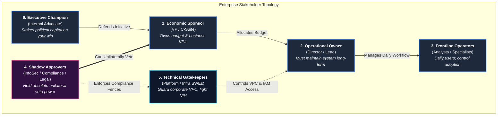
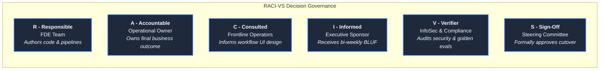
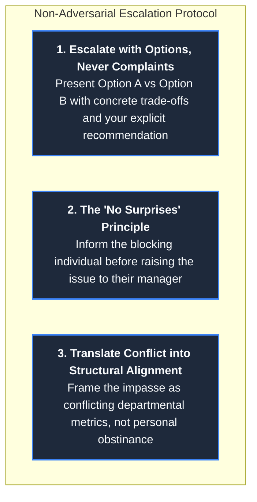
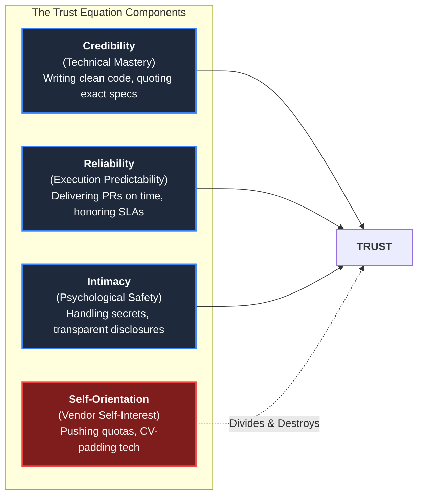

# Stakeholder Management & Organizational Dynamics

In enterprise forward deployed engineering, pure technical brilliance is a necessary condition for success,
but it is never sufficient. The codebase you write does not execute in an abstract computational sandbox; it executes
inside a complex human organization characterized by competing political factions, asymmetric risk tolerances,
historical vendor trauma, and unaligned departmental incentives.

More enterprise deployments fail from unmanaged organizational friction than from compiler errors or network drops.
In an empirical study of 146 deduplicated enterprise FDE job postings across 94 companies ([`job-market/dataset/fde_market_data.json`](../job-market/dataset/fde_market_data.json)),
**79.5% of employers explicitly mandate cross-functional technical leadership and stakeholder management**.
The software you deploy touches multiple internal fiefdoms: the VP who funded it, the business unit manager who
must hit quarterly targets with it, the frontline operators who must use it daily, and the InfoSec and Compliance
officers who hold the power to shut it down unilaterally.

This guide provides the field manual for navigating enterprise stakeholder dynamics: the 6 enterprise stakeholder
archetypes, the RACI-VS governance model, the 20-minute decision-oriented steering committee cadence, non-adversarial
escalation protocols, and David Maister's Trust Equation applied to customer engineering.

---

## 1. The 6 Enterprise Stakeholder Archetypes & Influence Topology

On an enterprise engagement, stakeholders do not align along a simple org chart; they align along axes of
influence, risk exposure, and veto power:



---

## 2. The Stakeholder Incentive & Diagnostic Matrix

Every stakeholder operates under two driving forces: **what they win** (their economic or career incentive)
and **what they fear** (the risk that keeps them awake at night). Uncovering both in your first 1:1 interview
is the most effective way to prevent project stalls:

| Stakeholder Archetype | Primary Objective (They Win When...) | Core Career Fear (They Lose When...) | Hidden Currency & Motivation | Tactical Engagement Protocol | Fatal Failure Mode |
| :--- | :--- | :--- | :--- | :--- | :--- |
| **1. Economic Sponsor**<br/>*(VP of Operations / CTO)* | The engagement moves a primary P&L metric ($350k fine reduction, 20% throughput gain). | Becoming publicly associated with an expensive, highly visible vendor failure. | Executive board prestige and measurable ROI. | Deliver bi-weekly 3-line BLUF updates; lead with business metrics, not technical trivia. | Surprising them with schedule slips or budget overruns in front of their peers. |
| **2. Operational Owner**<br/>*(Director of Support / Claims)* | Daily operational friction decreases without increasing headcount. | Being handed an unmaintainable "black box" that breaks the moment the FDE leaves. | Team stability, operational predictability. | Involve them in weekly architecture reviews; co-design runbooks and reverse-shadowing schedules. | Designing custom code that only the vendor understands, creating operational dependency. |
| **3. Frontline Operators**<br/>*(Duty Analysts / Specialists)* | Repetitive administrative toil disappears, making their workday less stressful. | Workplace automation leading to headcount cuts, retraining, or punitive monitoring. | Personal autonomy, tool usability, avoiding rework. | Shadow them on the floor; integrate directly into their existing tools (Slack, TMS, internal UI); never add a new portal. | Designing an interface from a boardroom demo that adds 15 extra clicks to their daily workflow. |
| **4. Shadow Approvers**<br/>*(InfoSec / Legal / Compliance)* | Zero data leaks, zero regulatory audit failures, zero unapproved egress traffic. | Approving an architecture that subsequently suffers a security breach or compliance fine. | Risk minimization, strict adherence to statutory policy. | Engage in Week 1; provide formal network egress diagrams, SBOMs, and data classification matrices. | Discovering them in Week 6; attempting to bypass security policies to hit a demo deadline. |
| **5. Technical Gatekeepers**<br/>*(Platform / Infra SWEs)* | Maintaining infrastructure reliability, clean architecture, and standard CI/CD. | Being paged at 03:00 AM for unmonitored vendor code that crashes cluster nodes. | Technical elegance, architectural consistency, NIH defensiveness. | Honor their Terraform modules, follow their PR guidelines, credit their systems publicly in steering reviews. | Dismissing internal infrastructure tools as "legacy" and demanding custom root permissions. |
| **6. Executive Champion**<br/>*(Internal VP Advocate)* | Proving their forward-looking vision by bringing innovative technology to the firm. | Burning hard-earned political capital on a vendor team that fails to deliver. | Organizational momentum and promotion to Senior VP / C-Suite. | Arm them with empirical weekly scorecards, presentation slides, and verifiable metrics they can share upwards. | Leaving them defenseless during executive steering committee interrogations. |

---

## 3. The RACI-VS Enterprise Governance Framework

Ambiguity surrounding decision rights is the root cause of late-stage project stalls. When an engagement
approaches production cutover, confusion over who holds the authority to approve deployments leads to circular
debates. Deploy the **RACI-VS Governance Framework** during Week 1 kickoff:



### RACI-VS Implementation Matrix

| Project Milestone / Deliverable | Responsible (R) | Accountable (A) | Consulted (C) | Informed (I) | Verifier (V) | Sign-Off (S) |
| :--- | :--- | :--- | :--- | :--- | :--- | :--- |
| **Requirements Specification (ETISE-SPEC)** | FDE Lead | Operational Owner | Frontline Operators | Economic Sponsor | Compliance Lead | Operational Owner |
| **VPC Infrastructure & Network Peering** | FDE Infra Lead | Technical Gatekeeper | Cloud Arch Team | Operational Owner | InfoSec Lead | Technical Gatekeeper |
| **Golden Evaluation Accuracy Benchmark** | FDE Team | Operational Owner | Domain Specialists | Economic Sponsor | Compliance Auditor | Economic Sponsor |
| **Production Cutover (Phase 8)** | FDE Team | Operational Owner | Frontline Operators | Economic Sponsor | InfoSec / SRE | Steering Committee |
| **Operational Handover & Runbook Signoff** | FDE Lead | Operational Owner | Frontline Operators | Economic Sponsor | Customer SRE Lead | Operational Owner |

---

## 4. The 4-Tier Engagement Cadence & Steering Committee Architecture

A disciplined communication cadence ensures that approvals are predictable milestones rather than emergency meetings:

### 1. The 4-Tier Communication Cadence
- **Tier 1: Economic Sponsor (Bi-Weekly, 15 Minutes)**:
  - Format: Written 3-line BLUF email. In-person meeting only upon milestone gates.
  - Content: Trajectory status (On Track / At Risk), current metric movement, critical budget/timeline decisions.
- **Tier 2: Operational Owner & Tech Leads (Weekly, 45 Minutes)**:
  - Format: Working technical session with live terminal/repo access.
  - Content: Code diff reviews, open blocker log, upcoming integration dependencies, architecture trade-offs.
- **Tier 3: Frontline Operators (Daily Standup during Rollout, 15 Minutes)**:
  - Format: Rapid triage check-in.
  - Content: Reviewing yesterday's exception cases, user interface feedback, confirming false-positive flags.
- **Tier 4: Shadow Approvers (Phase-Gate Gating, Asynchronous)**:
  - Format: Written compliance artifacts, security questionnaires, and evaluation scorecards.
  - Content: Verifiable audit trails; zero emergency meetings required.

### 2. The 20-Minute Decision-Focused Steering Committee
Never run a steering committee meeting as an unstructured slide reading or product demo. A steering meeting
that concludes without an explicit operational decision was a poorly formatted email. Use this standing 20-minute agenda:

```text
20-MINUTE STEERING COMMITTEE AGENDA
--------------------------------------------------------------------------------
00:00 - 03:00 | Trajectory & Baseline Scorecard (Phase health, accuracy metrics)
03:00 - 08:00 | Empirical Milestone Proof (Reviewing Golden Eval results, PR links)
08:00 - 15:00 | Architectural Decision / Risk Trade-Off (Options A vs B with costs)
15:00 - 20:00 | Explicit Decision Vote & Recorded Ownership (Confirming Go/No-Go)
--------------------------------------------------------------------------------
```

### 3. The "Pre-Wiring" Technique
Borrowed from top-tier strategic management and enterprise delivery: **never introduce a controversial proposal
or architectural pivot for the first time in a public committee meeting**.
- Schedule 15-minute 1:1 sessions with each voting stakeholder 48 hours prior to the committee.
- Present the proposal, hear their personal reservations in private, and incorporate their suggested safeguards.
- When the formal steering committee convenes, the meeting functions as a public ratification rather than an
  adversarial debate.

---

## 5. Non-Adversarial Escalation & Conflict Resolution

In customer deployments, cross-organizational conflicts are inevitable: an infrastructure ticket languishes
in an approval queue, database credentials are withheld, or scope requests threaten delivery deadlines.

### The 3 Rules of Non-Adversarial Escalation



#### Rule 1: Escalate with Options and Consequences
Never approach leadership with an open-ended problem. Present two concrete paths with explicit consequences:
> *"VPC peering access for the staging database has been pending with network engineering for 9 business days.
> We have two options to maintain project momentum:
> - **Option A**: Proceed with local synthetic mock data. This maintains our demo date next Thursday, but defers live
>   schema integration testing to Phase 7, introducing late integration risk.
> - **Option B**: Pause Phase 5 progression until the VPC peering ticket (#NET-402) is cleared, moving our demo
>   date out by 5 business days, but ensuring zero unverified schema assumptions.
> We recommend **Option B** to ensure complete compliance integrity."*

#### Rule 2: The "No Surprises" Rule
Never escalate over an individual's head without informing them first. A surprise escalation creates an enemy
who will actively obstruct future sprints. Deploy this advance notification script:
> *"Hi Marcus, I know your team is under heavy load with the data center migration. Because our project steering
> committee meets tomorrow and our Phase 5 gate depends on this VPC peering ticket, I need to raise the schedule
> trade-off to Sarah and Dave. I wanted to let you know in advance so it’s not a surprise, and I will be explicitly
> noting that your team is currently constrained by the migration priorities."*

#### Rule 3: Deploy Chris Voss Calibrated Questions
When encountering stubborn organizational pushback, avoid arguing logic. Use calibrated "How" and "What" questions
to shift the problem-solving burden onto the counterparty:
- Instead of: *"You need to approve this IAM role today or we will miss our deadline."*
- **Use**: *"How are we supposed to validate the Regulation E compliance rules without read access to the transaction audit table?"*
- Instead of: *"You cannot add five new report types in the middle of a sprint."*
- **Use**: *"What would you like us to descope from next week's release in order to absorb these additional report formats?"*

---

## 6. David Maister's Trust Equation in Practice

In *The Trusted Advisor*, David Maister establishes the definitive mathematical formulation of professional trust:

$$\text{Trust} = \frac{\text{Credibility} + \text{Reliability} + \text{Intimacy}}{\text{Self-Orientation}}$$

### How FDEs Build or Destroy the Trust Components



1. **Credibility (Technical Truth)**: Established through deep domain competence, fluent command of customer architectures,
   and citing exact regulatory clauses rather than generic tech buzzwords.
2. **Reliability (Predictable Delivery)**: Established when commitments match execution. If an FDE promises a PR by
   Tuesday at 17:00, it arrives at 16:45 with full test coverage and passing CI.
3. **Intimacy (Discretion & Vulnerability)**: Established when customer operators feel safe admitting internal dysfunction,
   messy data workarounds, or lack of documentation without fear that the FDE will mock them to executive leadership.
4. **Self-Orientation (The Fatal Denominator)**: **The primary destroyer of customer relationships.** When an FDE pushes
   a complex distributed technology to pad their personal resume, or pushes an enterprise upsell to hit vendor sales targets,
   $\text{Self-Orientation} \rightarrow \infty$ and $\text{Trust} \rightarrow 0$. An FDE must always place the customer's
   operational health above vendor self-interest.

---

## 7. Direct Codebase Defense Implementations

Stakeholder management is reflected directly in how our production reference architecture is structured,
tested, and audited:

| Stakeholder Management Practice | Codebase Defense Implementation | Production Role |
| :--- | :--- | :--- |
| **RACI Persona Access Separation** | [`portfolio/reference-project/tests/test_server.py`](../portfolio/reference-project/tests/test_server.py) | Asserts permission-aware RBAC filtering across operator, analyst, and admin roles |
| **Human Operator Exception Queue** | [`portfolio/reference-project/src/api/server.py`](../portfolio/reference-project/src/api/server.py) | Production endpoint routing ambiguous tickets to operators, protecting operator autonomy |
| **Empirical Steering Scorecard** | [`portfolio/reference-project/evals/run_evals.py`](../portfolio/reference-project/evals/run_evals.py) | Generates verifiable accuracy and latency metrics for steering committee reviews |
| **Audit Trail Logging for Compliance** | [`portfolio/reference-project/src/api/server.py`](../portfolio/reference-project/src/api/server.py) | Captures immutable dispatch decisions and statutory escalation flags for auditability |
| **Managing Scope & Bad News** | [`customer/04-managing-expectations.md`](../customer/04-managing-expectations.md) | Standardized SRE communication protocols for delivering delayed milestones or outage updates |
| **Incident Response Lifecycle** | [`troubleshooting/01-debugging-methodology.md`](../troubleshooting/01-debugging-methodology.md) | 7-phase incident response lifecycle and blameless post-mortem templates |

---

## 8. Primary Practitioner Literature & Citations

1. **David H. Maister, Charles H. Green, & Robert M. Galford**: *The Trusted Advisor* (Free Press, 2000). The foundational formulation of the Trust Equation, professional credibility, and managing client self-orientation.
2. **Chris Voss**: *Never Split the Difference: Negotiating As If Your Life Depended On It* (HarperBusiness, 2016). Tactical empathy, calibrated questioning, and non-adversarial conflict resolution.
3. **Google Site Reliability Engineering**: *Managing Incidents & SRE Operational Relationships*. [sre.google/sre-book/managing-incidents](https://sre.google/sre-book/managing-incidents/)
4. **Palantir Technologies**: *Forward Deployed Engineering: Field Architecture and Stakeholder Management*. [palantir.com/careers/forward-deployed-software-engineer](https://www.palantir.com/careers/forward-deployed-software-engineer/)
5. **Colin Bryar & Bill Carr**: *Working Backwards: Insights, Stories, and Secrets from Inside Amazon* (St. Martin's Press, 2021). Single-threaded leadership, decision mechanisms, and stakeholder alignment.
