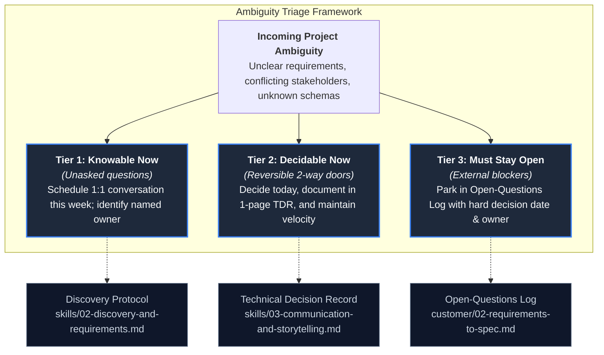
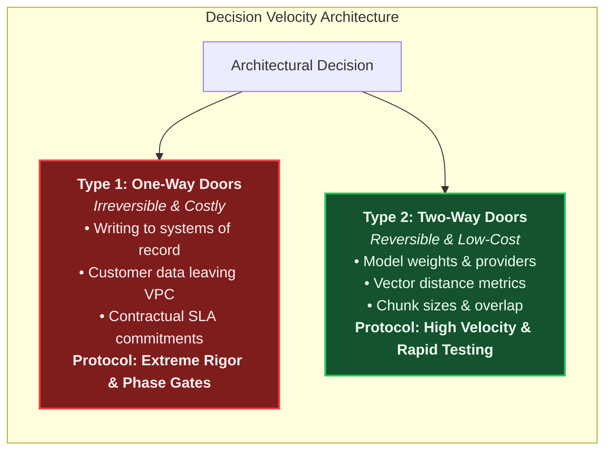
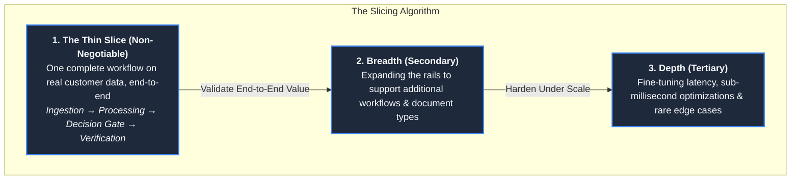
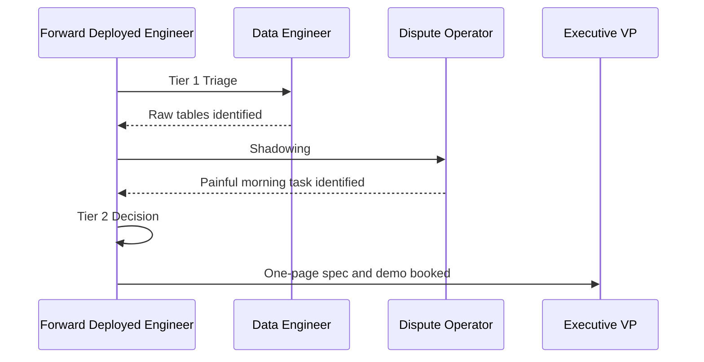

# Working with Ambiguity and Prioritization: High Agency in Complex Organizations

In traditional software engineering, an engineer is handed a Jira ticket with pre-negotiated acceptance criteria,
a Figma mock, and an existing CI/CD pipeline. In Forward Deployed Engineering, problems arrive as an ambiguous,
high-friction mandate: *"Our operations team is drowning in exceptions—build something with AI to fix it."*

Ambiguity is not an operational defect in FDE work; it is the **default operating environment**. Anthropic’s
benchmark Forward Deployed Engineer role specification explicitly defines this competency:
> *"High agency with an ability to navigate ambiguity present in complex organizations, identifying problems,
> formulating technical solutions, and driving execution to completion."*
> — [Anthropic Careers, 2026](https://job-boards.greenhouse.io/anthropic/jobs/5302966008)

On customer engagements, **requirements are the outputs of engineering work, not the inputs to it**.
If the customer already understood their data shapes, their exact latency constraints, and their integration
dependencies, they would have built the software themselves.

This guide provides the operational playbook for high agency: the 3-tier ambiguity triage framework, the One-Way
vs Two-Way Door decision matrix, the "Integration Tax" prioritization model, an empirical financial operations case
study, and direct codebase defenses.

---

## 1. The 3-Tier Ambiguity Triage Framework

When dropped into an enterprise engagement where dozens of architectural, regulatory, and business questions
remain unanswered, an FDE does not wait for a product manager. They immediately sort all uncertainty into
three operational tiers:

### 1. Tier 1: Knowable Now (Go Find Out)
More than 60% of apparent project ambiguity is simply an unasked question. It does not require deep research;
it requires an engineer walking over to an operator or scheduling a 20-minute Zoom call:
- *"Does the customer's Oracle database use UTC or Eastern Standard Time?"*
- *"Who holds the administrative credentials to generate an Artifactory API token?"*
- **Action**: Name the person who owns the answer, book a 15-minute conversation within 48 hours, and close the item.

### 2. Tier 2: Decidable Now (Decide, Document, and Move)
Items where you hold 70% of the information you will ever get, and where waiting for 100% consensus will stall
the sprint for two weeks:
- *"Should we use a 500-token chunk size with 10% overlap or a 1,000-token chunk size?"*
- *"Should the local developer sandbox run on SQLite or a containerized PostgreSQL instance?"*
- **Action**: Make the decision today, publish a 1-page Technical Decision Record (TDR), and proceed. A rough
  decision documented in code beats a perfect decision that arrives after the pilot expires.

### 3. Tier 3: Must Stay Open (Time-Box and Quarantine)
Items that genuinely cannot be resolved today due to pending external dependencies, regulatory filings, or
corporate procurement cycles:
- *"Will InfoSec permit calling external LLM endpoints via AWS PrivateLink, or must we run open-weight models self-hosted?"*
- *"Will the pilot expand to European business units subject to GDPR cross-border data transfer rules?"*
- **Action**: Quarantine the item in the **Open-Questions Log**. Assign an explicit owner, a hard decision deadline,
  and a documented impact statement if unresolved. Never allow Tier 3 items to bleed into daily sprint work.

### The Production Open-Questions Log

| Question & Scope | Named Owner | Decision Deadline | Blocking Impact if Unresolved | Active Mitigation / Workaround |
| :--- | :--- | :--- | :--- | :--- |
| **Is AWS PrivateLink approved for model traffic?** | Dave R. (InfoSec Lead) | Week 3, Oct 18 | Blocks staging cluster deployment | Build against local mock container in VPC |
| **Are EU disputes included in Phase 1 pilot?** | Sarah K. (VP Ops) | Week 4, Oct 25 | Expands compliance review by 6 weeks | Scope strictly to US credit card disputes |
| **Do operators require email digest or in-app UI?** | Marcus L. (Lead Analyst) | Week 2, Oct 11 | Minor UI rework (approx 4 hours) | Build standardized webhook payload first |

---

## 2. Reversible vs Irreversible Decisions (The Two-Way Door Matrix)

Adapted from Jeff Bezos's foundational 1997 Amazon shareholder framework, enterprise forward deployed engineering
requires distinguishing **Type 1 Decisions (One-Way Doors)** from **Type 2 Decisions (Two-Way Doors)**:

### The FDE Two-Way Door Decision Matrix

| Architectural / Operational Decision | Decision Class | Blast Radius & Reversibility | Recommended FDE Protocol |
| :--- | :--- | :--- | :--- |
| **Direct writes to customer Core Banking SQL database** | **Type 1 (One-Way)** | Critical: Database corruption, transaction loss, audit failures. | Never execute direct writes in Phase 1. Route writes to a staging audit queue requiring human operator verification. |
| **Transmitting customer complaint text to public SaaS APIs** | **Type 1 (One-Way)** | Critical: Regulatory compliance breach, GDPR/GLBA violation. | Quarantine data in customer VPC; require formal InfoSec signoff before opening egress firewall ports. |
| **Contractual SLA commitments (p99 latency < 200ms)** | **Type 1 (One-Way)** | High: Commercial liability, contract penalty clauses. | Refuse fixed SLA guarantees during discovery; anchor commitments on empirical golden evaluation benchmarks. |
| **Selecting embedding model (e.g. OpenAI vs BGE vs Cohere)** | **Type 2 (Two-Way)** | Low: Re-indexing a 50k document corpus takes under 2 hours. | Pick a standard baseline immediately; isolate embedding calls behind an abstract interface to allow swapping later. |
| **Chunking configuration (500 tokens vs 1,000 tokens)** | **Type 2 (Two-Way)** | Low: Chunking is completely encapsulated in ingestion workers. | Use parameterized chunkers (e.g. [`interviews/code/chunker.py`](../interviews/code/chunker.py)); optimize via automated evals. |
| **Choosing local development database (SQLite vs Postgres)** | **Type 2 (Two-Way)** | Low: Abstracted via SQLAlchemy or raw SQL repository layer. | Deploy containerized Postgres locally via `docker-compose` on Day 1 to match production SQL dialect. |

> [!TIP]
> **The Reversible Door Escape Hatch**: When enterprise customers panic over technical uncertainty, they instinctively
> reach for one-way doors: halting the project, launching multi-month security committees, or demanding permanent
> platform commitments. A senior FDE converts their fear into a schedule by offering a **reversible two-way door**:
> *"Let us deploy a two-week sandbox running on de-identified historical data inside your VPC. If it fails our safety
> metrics, we tear it down with a single command."*

---

## 3. Prioritization Under Pressure: The Integration Tax & Slicing Algorithm

In customer environments, traditional engineering estimates are dangerously inaccurate because they fail to account
for the **Integration Tax**: the friction of deploying software inside infrastructure you do not own.

### The Integration Tax Formula

$$\text{Total Effort} = \text{Core Engineering Effort} \times (1 + \text{Integration Tax})$$

Where $\text{Integration Tax}$ is compounded by:
- Corporate SSO & SAML/OAuth integration ($\approx +50\%$)
- Bastion jumping, VPN instability, and strict egress filtering ($\approx +40\%$)
- Cross-departmental InfoSec and data governance reviews ($\approx +60\%$)
- Production change freeze windows and legacy schema migrations ($\approx +50\%$)

An FDE openly prices the Integration Tax during sprint planning:
> *"Writing the core evaluation classifier takes three days. Integrating it with your enterprise Active Directory and
> corporate egress proxy will take two weeks. Let us budget accordingly so there are no surprises."*

### The Slicing Algorithm: Thin Slice First

When deadlines compress and leadership demands results, junior engineers attempt to build the entire system
shallowly. A senior FDE cuts scope in a strict, disciplined sequence:

1. **Step 1: The Thin Slice (Never Cut)**: Build one single workflow completely from end to end on real data.
   If building a dispute engine, ingest one real complaint format, run it through the classification model,
   route it to the human exception queue, and log the audit record. This proves architecture viability.
2. **Step 2: Breadth (Cut First if Pressed)**: Adding support for 15 additional document types or 5 secondary
   ticket categories. These follow the rails established by the thin slice.
3. **Step 3: Depth (Cut Second if Pressed)**: Optimizing p99 latency from 250ms to 120ms or tuning rare long-tail
   edge cases.

---

## 4. Production Empirical Case Study: Transforming "Just Build Something With Our Data"

To examine high-agency execution under extreme ambiguity, consider this real-world engagement calibrated against
empirical enterprise financial dispute operations ([`portfolio/reference-project/evals/DATASET_PROVENANCE.md`](../portfolio/reference-project/evals/DATASET_PROVENANCE.md)).

### The Situation & Initial Ambiguity
Week 1 at a regional consumer finance institution. The executive sponsor (Executive VP of Operations) meets
the FDE team and issues a vague mandate:
> *"Our consumer complaint volume doubled this year. We have budget for AI. Just build something smart with our
> dispute data and we'll know it when we see it. You have four weeks before our next board meeting."*

Your team consists of you (the FDE) and one internal data engineer allocated at 25% time.

### Discovered Ground-Truth Constraints
- Historical dispute narratives sit in an on-premise DB2 warehouse. The internal data engineer has read-only
  access to de-identified dispute records.
- Any network connection leaving the customer's private subnet requires a formal architecture review that meets
  monthly.
- Frontline dispute operators are cynical; a prior vendor promised "automated resolution" eight months ago and
  delivered an unmaintainable model that hallucinated refund amounts.

### What High-Agency Execution Looks Like: Week 1 Move-by-Move

1. **Move 1: Execute Tier 1 Triage on Day 2**:
   - Meet the data engineer: discover which tables are actively refreshed vs abandoned. Table `disputes_text_raw`
     contains 45,000 historical records with real complaints.
   - Shadow the senior dispute analyst: discover that the most expensive operational pain is **verifying whether
     disputes exceed $1,000 and carry statutory 10-day Regulation E escalation deadlines**.
2. **Move 2: Execute Tier 2 Decisions on Day 3**:
   - Decide immediately: the pilot will operate on a sample of 250 de-identified historical complaints.
   - Deploy the **Walking Skeleton** ([`portfolio/reference-project/src/api/server.py`](../portfolio/reference-project/src/api/server.py))
     inside a containerized local sandbox within their network, avoiding the 4-week external security review.
3. **Move 3: Baseline the Target Metric on Day 4**:
   - Time the manual workflow: analysts currently spend **8.5 minutes per dispute** manually checking card
     network rules and computing regulatory deadlines.
   - Establish the target: the automated engine must classify the dispute, extract the dollar amount, and tag
     statutory deadlines in under 2 seconds, cutting review time to under 1.5 minutes.
4. **Move 4: Book the Week 3 Decision Gate on Day 5**:
   - Send the weekly BLUF update to the Executive VP:
     > *"We have bounded the scope to automated Regulation E statutory escalation routing. We are building on
     > de-identified data in a local enclave. Demo is scheduled for Oct 24 at 14:00 to evaluate baseline accuracy
     > and decide whether to proceed to staging deployment."*

By Friday of Week 1, the vague executive request *"build something with our data"* was converted into a
bounded technical architecture, an active open-questions log, and an empirical evaluation target.

---

## 5. Direct Codebase Defense Implementations

Navigating ambiguity requires resilient engineering defenses that isolate uncertainty behind clean interfaces:

| Ambiguity Defense Discipline | Codebase Defense File | Production Role |
| :--- | :--- | :--- |
| **The Walking Skeleton Architecture** | [`portfolio/reference-project/src/api/server.py`](../portfolio/reference-project/src/api/server.py) | Full end-to-end FastAPI service with local mock fallbacks, enabling rapid local iteration |
| **Self-Healing Schema Correction** | [`interviews/code/structured_extractor.py`](../interviews/code/structured_extractor.py) | Pydantic validation with reflection loops, absorbing unexpected customer schema anomalies |
| **Parameter-Driven Text Chunking** | [`interviews/code/chunker.py`](../interviews/code/chunker.py) | Configurable sliding window chunker enabling rapid two-way door experimentation |
| **Deterministic Decision Gating** | [`portfolio/reference-project/src/api/server.py`](../portfolio/reference-project/src/api/server.py) | Rule-based escalation gate preventing probabilistic hallucinations on statutory deadlines |
| **Automated Golden Evals as Insurance**| [`portfolio/reference-project/evals/run_evals.py`](../portfolio/reference-project/evals/run_evals.py) | 25-case benchmark providing objective proof of accuracy to skeptical steering committees |
| **One-Page Technical Specification** | [`customer/02-requirements-to-spec.md`](../customer/02-requirements-to-spec.md) | Standardized contract skeleton converting ambiguous customer conversations into testable code |

---

## 6. Primary Practitioner Literature & Citations

1. **Jeff Bezos**: *1997 Amazon Letter to Shareholders: Type 1 and Type 2 Decisions* (Amazon Inc., 1997). The foundational formulation of one-way vs two-way doors and decision velocity under uncertainty.
2. **Anthropic**: *Forward Deployed Engineer Role Specification & High Agency Competencies* (2026). [job-boards.greenhouse.io/anthropic/jobs/5302966008](https://job-boards.greenhouse.io/anthropic/jobs/5302966008)
3. **Kathleen M. Eisenhardt & Donald N. Sull**: *Simple Rules: How to Thrive in a Complex World* (Houghton Mifflin Harcourt, 2015). Prioritization heuristics for operating in high-velocity, ambiguous environments.
4. **Paul Graham**: *Do Things that Don't Scale* (Y Combinator, 2013). The philosophy of high agency, manual customer immersion, and rapid prototype validation.
5. **Alexander Karp**: *The Philosophy of Forward Deployment: Engineering Agency in Foreign Environments* (Palantir Technologies, 2024).
