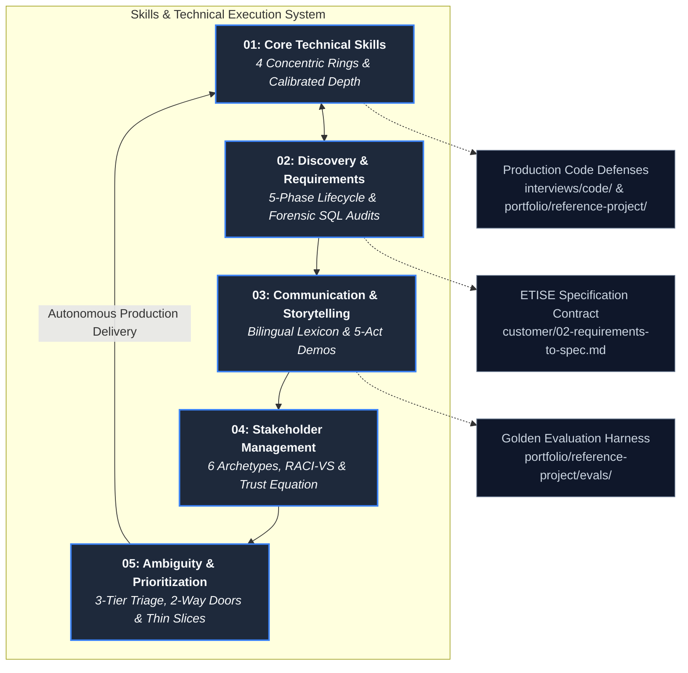

# Skills & Technical Execution: The Complete FDE Competency System

In enterprise technology, a persistent fallacy divides engineering capability into "hard technical skills"
(writing code, configuring clusters, training models) and "soft non-technical skills" (talking to clients,
running meetings, managing expectations). In Forward Deployed Engineering, this distinction is completely false.

When you operate inside another organization's infrastructure, **discovery is engineering**: discovering an
undocumented database schema via SQL introspection is just as technical as writing the query. **Communication is
architecture**: explaining a system's failure modes and confidence intervals prevents fatal production outages.
**Stakeholder alignment is system design**: mapping organizational incentives and security permissions is what
allows your software to exist inside the customer's Virtual Private Cloud (VPC).

Empirical data from 146 deduplicated enterprise FDE job postings across 94 employers ([`job-market/dataset/fde_market_data.json`](../job-market/dataset/fde_market_data.json))
validates this reality:
- **90.4%** require building, testing, and shipping production-grade software (Python, SQL, TypeScript, Go).
- **79.5%** require direct cross-functional customer technical leadership and stakeholder management.
- **52.0%** require technical discovery, requirements scoping, and workflow reverse-engineering.

**Technical depth gets you into the room; organizational execution, bilingual communication, stakeholder
alignment, and high agency are why customers allow you to deploy to production.**

This module provides the comprehensive field manual for the five core competencies defining the Forward
Deployed Engineer.

---

## 1. Pillar Knowledge Architecture

The five guides in this pillar form an interconnected operational system governing the entire delivery lifecycle:

---

## 2. Core Pillar Guides

### 1. [Core Technical Skills: The Production Engineering Stack](01-core-technical-skills.md)
The production engineering baseline weighted by empirical evidence from 146 enterprise postings:
- **The Empirical Technology Distribution**: Python (91.0%), SQL (58.2%), Prompt/System Prompts (55.0%), RAG (52.0%), AWS (47.0%), Docker (40.0%), k8s (35.0%), and CI/CD (34.0%).
- **The 4 Concentric Rings of Mastery**: Ring 1 (Systems & Software Foundations) $\rightarrow$ Ring 2 (Containerization & Cloud Enclaves) $\rightarrow$ Ring 3 (Applied AI & Evaluation Rigor) $\rightarrow$ Ring 4 (Customer Integration Craft).
- **Calibrated Depth Specifications**:
  - *Python*: Static typing (`mypy`), Pydantic v2 schemas, `asyncio` task concurrency and timeouts, `pytest` fixtures, and structured logging (`structlog`).
  - *Relational SQL*: Window functions (`ROW_NUMBER()`, `LEAD()`), CTEs, and execution plan profiling (`EXPLAIN ANALYZE`).
  - *Linux & Networking*: `curl -IvL --cacert` TLS tracing, `ss -tulpn` socket inspection, process limits in `/proc/<pid>/limits`, and log forensics using `ripgrep`, `awk`, and `jq`.
  - *Containers & Cloud*: Multi-stage distroless Dockerfiles, non-root execution, Kubernetes pod crash diagnostics (`CrashLoopBackOff`, `OOMKilled`), VPC subnets, and AWS SSM port-forwarding.
  - *Applied AI & Resiliency*: Framework-free vendor SDKs, strict JSON schema enforcement, deterministic agent loops with stop conditions, webhook idempotency, and client-side full-jitter exponential backoff.
- **12-Point Calibrated Self-Audit Diagnostic**: A comprehensive self-assessment checklist linking directly to guide chapters.

### 2. [Discovery and Requirements Engineering](02-discovery-and-requirements.md)
Transforming ambiguous executive conversations into binding, testable engineering contracts:
- **The 5-Phase Discovery Engineering Lifecycle**: Executive Intent Decoding $\rightarrow$ Operator Shadowing $\rightarrow$ Forensic Data & Schema Audit $\rightarrow$ Non-Functional Boundary Negotiation $\rightarrow$ Executable Specification Gating.
- **The 8-Theme Technical Discovery Protocol**: Concrete interview scripts targeting Current-State Mechanics, Quantified Pain & Financial Cost ($350k quarterly fines), Volume/Edge-Case Skew, 90-Day P&L Objectives, Enclave Constraints, Hidden Approvers, and Prior Dead Vendor Post-Mortems.
- **Forensic Data Walkthrough Playbook**: Non-destructive SQL diagnostic queries profiling schema catalogs (`information_schema.columns`), null rates, unique cardinality, timestamp anomalies, and categorical class imbalance.
- **The "Demo vs Production Delta"**: Forensic analysis of why curated sandbox data kills 95% of enterprise pilots (The MIT NANDA Report reality).
- **Production Empirical Case (ETISE Engine)**: Real-world financial dispute escalation case study backed by public CFPB complaint records and Bitext customer interaction datasets.

### 3. [Communication and Technical Storytelling: The Bilingual Engineer](03-communication-and-storytelling.md)
Bridging the communication chasm between C-Suite ROI and low-level Linux/cloud systems:
- **The Bilingual Translation Lexicon**: A structured translation matrix mapping engineering realities (TLS proxies, sequential table scans, p99 token bloat, idempotency keys, Pydantic reflection, backoff jitter) directly into executive business impact ($350k fine avoidance, operational velocity, regulatory compliance).
- **The Written-First Executive Suite**:
  - *The 5-Line BLUF Status Email*: Barbara Minto's Pyramid Principle applied to weekly updates; scannable in 15 seconds.
  - *The 1-Page Technical Decision Record (TDR)*: Capturing context, decisions, consequences, and alternatives considered & rejected.
  - *Google SRE Bad-News Broadcast*: Delivering incident updates within 60 minutes across Facts, Business Impact, Remediation, and Next Update.
- **The 5-Act Live Technical Demo Framework**: Act 1 (The Quantified Context Hook - 30s) $\rightarrow$ Act 2 (Ground-Truth Ingestion - 2m) $\rightarrow$ Act 3 (The Edge-Case & Failure Recovery Maneuver - 3m) $\rightarrow$ Act 4 (The Empirical Scorecard - 2m) $\rightarrow$ Act 5 (The Explicit Decision Ask - 1m).
- **Explaining Probabilistic AI Systems**: Demolishing the "95% accuracy" myth; replacing abstract percentages with concrete case volumes (e.g., 425 autonomous vs 75 human review) and guaranteed deterministic safe fallbacks.
- **Constraint-First Architecture Whiteboarding**: Overcoming customer engineer "Not-Invented-Here" (NIH) defensiveness by drawing their boundaries and honoring their infrastructure first.

### 4. [Stakeholder Management & Organizational Dynamics](04-stakeholder-management.md)
Navigating enterprise politics, aligning conflicting departmental incentives, and managing shadow approvers:
- **The 6 Enterprise Stakeholder Archetypes & Influence Topology**: Mapping the political landscape across Economic Sponsor (VP / C-Suite), Operational Owner (Director / Lead), Frontline Operators (Analysts / Specialists), Shadow Approvers (InfoSec / Legal / Compliance), Technical Gatekeepers (Platform / Infra SWEs), and Executive Champion (Internal Advocate).
- **The Stakeholder Incentive & Diagnostic Matrix**: Specifying primary objectives, career fears, hidden currencies, engagement protocols, and fatal failure modes for all 6 archetypes.
- **The RACI-VS Enterprise Governance Framework**: Standardizing decision rights across Responsible, Accountable, Consulted, Informed, plus **Verifier** (Security/Compliance audit) and **Sign-Off** (Steering Committee Go/No-Go).
- **The 4-Tier Engagement Cadence & 20-Minute Steering Committee Agenda**: Eliminating demo theater with a strict 20-minute decision-gating ritual and securing alignment via the "Pre-Wiring" technique.
- **Non-Adversarial Escalation Protocols**: Escalating with options (Option A vs Option B with trade-offs), the "No Surprises" advance notice rule, and Chris Voss calibrated de-escalation scripts.
- **David Maister's Trust Equation**: $\text{Trust} = \frac{\text{Credibility} + \text{Reliability} + \text{Intimacy}}{\text{Self-Orientation}}$; identifying Self-Orientation (pushing vendor quotas) as the fatal denominator.

### 5. [Working with Ambiguity and Prioritization: High Agency in Complex Organizations](05-ambiguity-and-prioritization.md)
Operating under extreme enterprise uncertainty and driving projects to production cutover:
- **The 3-Tier Ambiguity Triage Framework**: Sorting uncertainty into *Tier 1: Knowable Now* (15-minute conversation with named owner), *Tier 2: Decidable Now* (Decide today, document in 1-page TDR, maintain velocity), and *Tier 3: Must Stay Open* (Quarantined in Open-Questions Log with explicit owner and deadline).
- **The Two-Way Door (Type 1 vs Type 2) Decision Matrix**: Grounding Jeff Bezos's framework into customer VPC environments; distinguishing irreversible Type 1 doors (writing to core banking databases, transmitting data outside VPC) from reversible Type 2 doors (model weights, chunk sizes, local sandbox databases).
- **The Reversible Door Escape Hatch**: Converting customer executive panic into a 2-week sandbox schedule.
- **The "Integration Tax" & Slicing Algorithm**: Quantifying the friction of deploying in foreign infrastructure ($\text{Total Effort} = \text{Core Effort} \times (1 + \text{Integration Tax})$); cutting scope via Thin Slice (1 workflow end-to-end on real data) $\rightarrow$ Breadth $\rightarrow$ Depth.
- **Empirical Case Study ("Just Build Something With Our Data")**: Transforming vague executive mandates into an active open-questions log, an audited baseline, and a 20-minute decision-gating demo in Week 1.

---

## 3. Situational Reader Navigation Matrix

When facing an active challenge or organizational bottleneck during a customer deployment, use this rapid-routing
matrix to jump directly to the relevant operational protocol:

| On-the-Ground Field Scenario | Root Risk Domain | Immediate Operational Protocol | Reference Guide & Section |
| :--- | :--- | :--- | :--- |
| **Blocked on corporate proxy TLS errors (`pip install` failing)** | Corporate network inspection | Export `REQUESTS_CA_BUNDLE` and configure corporate CA bundle injection | [Core Technical Skills: Linux Systems & Networking](01-core-technical-skills.md#linux-systems--networking) |
| **Executive sponsor says "just build something smart with our data"** | High ambiguity & vague scope | Execute 3-tier ambiguity triage; baseline one manual workflow metric | [Ambiguity & Prioritization: The 3-Tier Triage](05-ambiguity-and-prioritization.md#1-the-3-tier-ambiguity-triage-framework) |
| **Raw database export has 18% missing IDs and corrupted dates** | Data distribution rot | Run SQL profiling queries; implement defensive CSV/JSON parsing repair | [Discovery & Requirements: Forensic SQL Profiling](02-discovery-and-requirements.md#3-forensic-data-walkthrough--schema-auditing) |
| **Customer engineers hostile to vendor technology ("NIH" syndrome)** | Political defensiveness | Deploy constraint-first whiteboarding; credit their infrastructure in demos | [Communication: Constraint-First Whiteboarding](03-communication-and-storytelling.md#5-live-architecture-whiteboarding-with-customer-engineers) |
| **Risk & Compliance officer demands "100% LLM accuracy"** | Uncalibrated probabilistic expectations | Replace percentages with concrete case volumes; guarantee deterministic safe fallbacks | [Communication: Explaining Probabilistic Systems](03-communication-and-storytelling.md#4-explaining-probabilistic-systems-to-skeptical-stakeholders) |
| **VPC peering approval ticket languishing with network engineering** | Blocked cross-team dependency | Escalate non-adversarially with Options A vs B and the "No Surprises" rule | [Stakeholder Management: Non-Adversarial Escalation](04-stakeholder-management.md#5-non-adversarial-escalation--conflict-resolution) |
| **Preparing live demo to trigger Phase 8 production cutover** | Milestone decision gating | Execute the 5-Act demo framework; close immediately with explicit decision ask | [Communication: The 5-Act Live Technical Demo](03-communication-and-storytelling.md#3-the-5-act-live-technical-demo-framework) |
| **Steering committee devolving into circular arguments over scope** | Ambiguous decision rights | Institute RACI-VS decision matrix; pre-wire voting deciders in 1:1s | [Stakeholder Management: RACI-VS Governance](04-stakeholder-management.md#3-the-raci-vs-enterprise-governance-framework) |

---

## 4. Direct Codebase Defense Implementations

Every conceptual skill, communication template, and architectural decision documented in this module is backed
by working, evaluated, and testable code within this repository:

| Core Skill Discipline | Codebase Defense File | Verification & Testing Command | Production Role |
| :--- | :--- | :--- | :--- |
| **Resilient API Integrations** | [`interviews/code/resilient_client.py`](../interviews/code/resilient_client.py) | `pytest interviews/code/test_resilient_client.py` | Exponential backoff with full jitter, header-aware retry logic |
| **Webhook Replay Protection** | [`interviews/code/webhook_receiver.py`](../interviews/code/webhook_receiver.py) | `pytest interviews/code/test_webhook_receiver.py` | Atomic idempotency keys, SHA-256 payload verification, conflict handling |
| **Tenant Rate Limiting** | [`interviews/code/rate_limiter.py`](../interviews/code/rate_limiter.py) | `pytest interviews/code/test_rate_limiter.py` | Sliding-window tenant rate limiting with standard `Retry-After` headers |
| **Self-Healing Schema Correction** | [`interviews/code/structured_extractor.py`](../interviews/code/structured_extractor.py) | `pytest interviews/code/test_structured_extractor.py` | Pydantic v2 schema enforcement with reflection error correction loops |
| **Semantic Document Chunking** | [`interviews/code/chunker.py`](../interviews/code/chunker.py) | `pytest interviews/code/test_chunker.py` | Parameterized sliding-window text chunker preserving sentence boundaries |
| **Defensive Log Parsing** | [`interviews/code/parser.py`](../interviews/code/parser.py) | `pytest interviews/code/test_parser.py` | Unstructured CSV/JSON log repair, timestamp normalization, dirty data drops |
| **Walking Skeleton Production Server**| [`portfolio/reference-project/src/api/server.py`](../portfolio/reference-project/src/api/server.py) | `pytest portfolio/reference-project/tests/` | FastAPI service with RBAC permissions, human exception queues, audit logs |
| **Automated Golden Evals Scorecard** | [`portfolio/reference-project/evals/run_evals.py`](../portfolio/reference-project/evals/run_evals.py) | `python portfolio/reference-project/evals/run_evals.py` | 25 enterprise test cases asserting 100% citation grounding and SLA targets |

---

## 5. Primary Practitioner Literature & Citations

1. **Anthropic**: *Forward Deployed Engineer Role Standards, High Agency, and Enterprise Deployment Guidelines* (2026). [job-boards.greenhouse.io/anthropic/jobs/5302966008](https://job-boards.greenhouse.io/anthropic/jobs/5302966008)
2. **OpenAI**: *Forward Deployed Engineer, Enterprise & Solutions Engineering Standards* (2026). [openai.com/careers](https://openai.com/careers)
3. **Palantir Technologies**: *The Forward Deployed Engineering Model: Field Architecture and High-Agency Delivery*. [palantir.com/careers/forward-deployed-software-engineer](https://www.palantir.com/careers/forward-deployed-software-engineer/)
4. **Barbara Minto**: *The Pyramid Principle: Logic in Writing and Thinking* (Financial Times / Prentice Hall, 2009). The foundational formulation of structured executive communication and BLUF methodology.
5. **David H. Maister, Charles H. Green, & Robert M. Galford**: *The Trusted Advisor* (Free Press, 2000). The mathematical formulation of the Trust Equation and advisory credibility.
6. **Jeff Bezos**: *1997 Amazon Letter to Shareholders: Type 1 and Type 2 Decisions* (Amazon Inc., 1997). The one-way vs two-way door framework for decision velocity under uncertainty.
7. **Chris Voss**: *Never Split the Difference: Negotiating As If Your Life Depended On It* (HarperBusiness, 2016). Tactical empathy, calibrated questioning, and non-adversarial conflict de-escalation.
8. **Google Site Reliability Engineering**: *Managing Incidents & Addressing Cascading Failures*. [sre.google/sre-book/managing-incidents](https://sre.google/sre-book/managing-incidents/)
9. **MIT NANDA Initiative / Fortune**: *The GenAI Divide: Why 95% of Enterprise AI Pilots Fail* (August 2025). [fortune.com/2025/08/18/mit-report-95-percent-generative-ai-pilots-at-companies-failing-cfo](https://fortune.com/2025/08/18/mit-report-95-percent-generative-ai-pilots-at-companies-failing-cfo)
