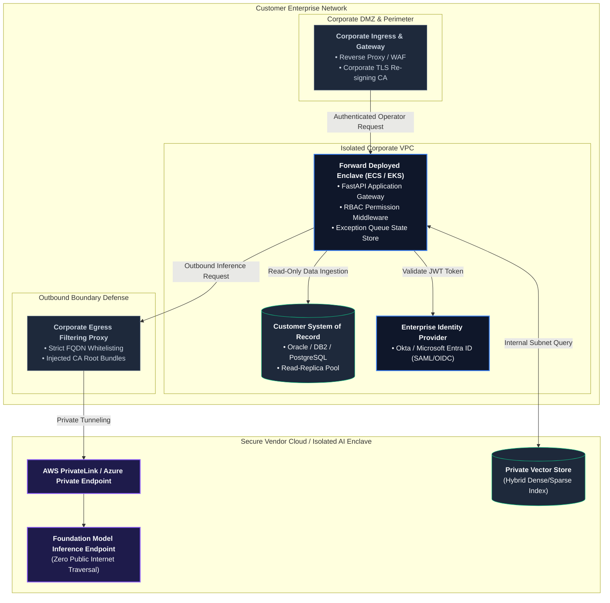
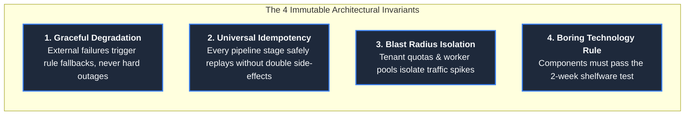
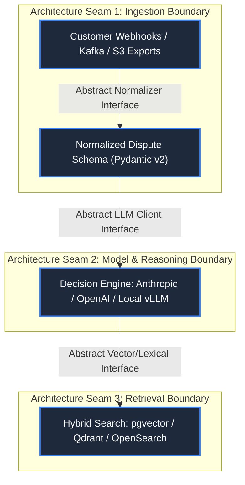
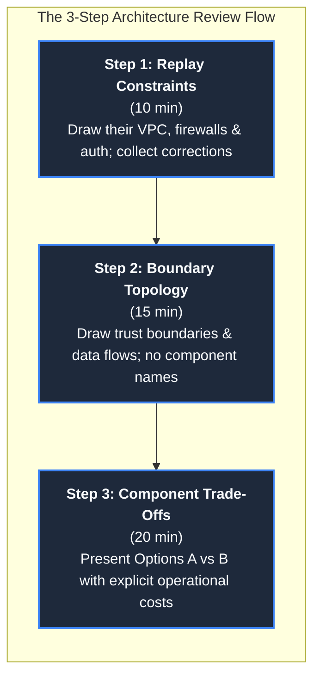

# Architecture for Customer Systems: Engineering Under Hostile Constraints

In consumer or internal SaaS engineering, system architects enjoy total sovereignty over their technical stack:
they choose the cloud provider, the database engine, the deployment orchestrator, the authentication framework,
and the CI/CD pipeline. In Forward Deployed Engineering (FDE), this sovereignty is completely absent.

An FDE designs systems that must survive inside an organization they did not build, under constraints they did
not choose: locked-down Virtual Private Clouds (VPCs), legacy SQL databases with 20-year-old schemas, corporate
TLS interception proxies, strict Role-Based Access Control (RBAC), and variable customer operational maturity.

This reality establishes the **Core Architecture Paradox of Forward Deployed Engineering**:
> **The best architecture is not the most mathematically elegant or technologically novel; it is the one the
> customer's internal on-call engineers can autonomously operate, monitor, and debug at 03:00 AM after the FDE departs.**

A system that achieves breakthrough algorithmic performance on localhost but requires constant vendor intervention
to stay online in production is an architectural failure. It degenerates into permanent consulting toil and is
eventually abandoned as "shelfware."

This guide provides the foundational field manual for customer systems architecture: the 8-dimension constraint
matrix, the enterprise network boundary topology, the 4 immutable architectural invariants, the 3 evolution seams,
and direct codebase defense implementations.

---

## 1. Enterprise Network Boundary & Enclave Topology

In customer environments, architecture begins at the network boundary. Before drawing software components or
selecting database engines, you must map how traffic traverses the customer's corporate security perimeter:

---

## 2. The 8-Dimension Constraint Matrix

Before writing an architecture specification, capture the customer's operational constraints across eight
non-negotiable dimensions. In customer engineering, **the constraints determine the architecture, not your preferences**:

| Constraint Dimension | Key Architectural Questions | Direct Architectural Impact | Failure Mode if Ignored |
| :--- | :--- | :--- | :--- |
| **1. Cloud Estate & VPC Topology** | AWS, Azure, GCP, or on-premise OpenShift? Multi-account layout? Transit Gateways? | Determines deployment target (ECS Fargate, EKS, Azure Container Apps, bare VMs). | Provisioning containers that cannot route to internal database subnets. |
| **2. Identity Provider & SSO Reality** | Okta, Entra ID (Azure AD), PingFederate? Automated SCIM provisioning or manual tickets? | Dictates RBAC implementation; requires JWT/OIDC claims validation in middleware. | Building custom user tables that violate enterprise single sign-on mandates. |
| **3. Data Gravity & Ingestion Windows** | Where does raw data live? What are database read-replica refresh windows and query caps? | Determines streaming vs batch ingestion; dictates read-only connection pooling. | Overloading production transactional databases during business hours. |
| **4. Latency Budgets & Concurrency** | Interactive UI (< 2s) vs asynchronous batch? Peak-to-median transaction volume ratio? | Governs synchronous REST vs asynchronous message queues (Redis, SQS, Kafka). | Worker thread pool starvation during morning shift traffic spikes. |
| **5. Compliance & Regulatory Regimes** | HIPAA, PCI-DSS, SOC 2 Type II, GLBA, GDPR? Are external model API calls permitted? | Dictates data residency; requires VPC endpoint isolation (PrivateLink) or local weights. | Complete project shutdown by InfoSec during week-six security audits. |
| **6. Ops Maturity & Observability** | Who holds the pager? What observability tools exist (Datadog, Splunk, CloudWatch)? | Forces logging to match their telemetry format (`structlog` JSON to stdout). | Deploying Prometheus/Grafana dashboards that internal SREs refuse to monitor. |
| **7. Change-Freeze Calendars** | Fiscal year-end, Black Friday/Cyber Week, quarterly compliance audit freezes? | Sets non-negotiable launch dates; delivery gates must negotiate around freezes. | Committing to a November launch date during a 6-week corporate change blackout. |
| **8. Pre-Existing Vendor Contracts** | What database and messaging licenses are already paid for and approved? | Favors boring technology they already own (e.g. Postgres pgvector vs new SaaS DB). | Forcing procurement cycles for unapproved third-party software licenses. |

---

## 3. The 4 Immutable Architectural Invariants

Regardless of the specific customer industry or deployment platform, every forward-deployed system must enforce
four immutable architectural invariants:

### Invariant 1: Graceful Degradation Across Trust Boundaries
When crossing a network trust boundary—especially to third-party LLM providers, external SaaS endpoints, or
legacy mainframe databases—components must degrade gracefully rather than crash:
- **Circuit Breaking & Fallback Gates**: If external model inference latency exceeds 2,500ms or returns HTTP 429/503
  errors, the pipeline automatically diverts incoming requests to a deterministic rule-based decision gate or routes
  them into an audited human exception queue ([`portfolio/reference-project/src/api/server.py`](../portfolio/reference-project/src/api/server.py)).
- **Zero Silent Failures**: Downstream degradation is explicitly flagged in response metadata (`degraded_fallback: true`),
  ensuring downstream operators know an automated heuristic was applied.

### Invariant 2: Universal Idempotency & Replayability
In enterprise environments, network timeouts, Kafka consumer rebalances, and manual operational retries guarantee
that requests will arrive more than once:
- **Atomic Idempotency Keys**: Webhook receivers and API endpoints must record transaction IDs atomically
  ([`interviews/code/webhook_receiver.py`](../interviews/code/webhook_receiver.py)).
- **Payload Fingerprinting**: Store a SHA-256 hash of the initial request payload. If a duplicate request arrives with
  the same key but different content, reject immediately with HTTP 409 Conflict to protect database integrity.
- **Backfill Safety**: Re-running an ingestion batch over historical records must produce identical state without
  generating duplicate billing disputes or sending duplicate customer notifications.

### Invariant 3: Blast Radius Isolation
In multi-tenant customer environments, a single rogue department, automated batch script, or runaway load test
must never exhaust system-wide resources:
- **Sliding-Window Tenant Throttling**: Enforce per-tenant request quotas using sliding-window timestamp logs
  ([`interviews/code/rate_limiter.py`](../interviews/code/rate_limiter.py)).
- **Header-Aware Backpressure**: Return HTTP 429 status codes with explicit `Retry-After` headers, shedding load
  at the perimeter before backend workers suffer memory exhaustion.
- **Worker Pool Partitioning**: Allocate separate concurrency limits for interactive user traffic vs background
  batch backfills.

### Invariant 4: The "Boring Technology" & Shelfware Rule
Dan McKinley’s foundational principle—*Choose Boring Technology*—is an operational mandate for FDEs:
- **The Shelfware Test**: If the customer’s internal engineering team cannot name who owns a component, how to
  deploy it, and how to debug it two weeks after handover, that component is guaranteed to become shelfware.
- **Leverage Existing Primitives**: If the customer has operated PostgreSQL for a decade, use `pgvector` for
  semantic search rather than introducing a standalone, unapproved vector database cluster that requires dedicated SREs.
- **Earn Complexity**: Start with simple scheduled worker jobs and managed database tables. Earn the right to introduce
  distributed event streams (Kafka) only when verified throughput benchmarks mathematically require them.

---

## 4. The 3 Architectural Seams: Evolution Without Rewrites

Version 1 of a forward-deployed system is a beachhead: it must deploy rapidly, prove measurable business value,
and establish operational trust. However, building v1 as a tangled monolith creates technical debt that makes
future improvements impossible.

A senior FDE designs **three explicit architectural seams**—clean abstraction boundaries that allow swapping
underlying technologies without rewriting core business workflows:

1. **Seam 1: The Integration & Ingestion Boundary**:
   - Decouple customer-specific transport protocols (Kafka topics, SFTP drops, webhook payloads) from internal domain logic.
   - All external data is immediately converted into standardized, typed Pydantic schemas ([`interviews/code/parser.py`](../interviews/code/parser.py)).
   - Swapping an SFTP batch input for an event-driven webhook requires altering only the ingestion adapter.
2. **Seam 2: The Model Provider Boundary**:
   - Never embed proprietary model SDK calls directly inside business routing logic.
   - Implement an abstract `LLMProvider` interface with standardized methods (`generate`, `extract_structured`, `embed`).
   - When the customer’s InfoSec team approves self-hosted open-weight models (vLLM) to replace commercial cloud APIs,
     the migration requires updating a single provider class without modifying upstream validation logic.
3. **Seam 3: The Retrieval & Knowledge Boundary**:
   - Encapsulate vector indexing, sparse BM25 tokenization, and reciprocal rank fusion behind a `KnowledgeStore` interface.
   - Moving from an embedded in-memory vector index to an enterprise-grade managed cluster (e.g., Pinecone or AWS OpenSearch)
     is isolated to the persistence adapter.

---

## 5. The Customer Architecture Review Playbook

Presenting an architecture to customer leadership and internal principal engineers is an exercise in building
alignment, not winning an intellectual debate. A common junior mistake is presenting a 50-slide deck with a single
predetermined architecture, which forces customer engineers into an adversarial posture.

### The 3-Step Whiteboard Review Flow

1. **Step 1: Replay Their Constraints First (10 Minutes)**:
   - Walk up to the whiteboard and draw their infrastructure: *"Here is your private AWS subnet, your Active Directory
     gateway, your corporate proxy TLS inspection appliance, and your DB2 read-replica. Did I capture your network topology accurately?"*
   - By demonstrating mastery of their environment, you establish immediate credibility.
2. **Step 2: Walk the Data Boundaries Next (15 Minutes)**:
   - Draw request arrows crossing boundaries before mentioning any vendor software:
     *"Customer complaints enter here via reverse proxy; data is validated here inside your private subnet; model inference requests
     egress exclusively over AWS PrivateLink with zero public internet traversal."*
   - InfoSec and network engineers will immediately relax once they see their security perimeter respected.
3. **Step 3: Present Options with Operational Costs Attached (20 Minutes)**:
   - Present two defensible architectures (e.g., Option A: Embedded PostgreSQL with `pgvector` vs Option B: Dedicated Managed Vector Cluster).
   - Document trade-offs openly: *"Option A is zero new operational overhead for your SRE team but caps retrieval to 500k records;
     Option B scales to 50M records but requires your team to manage a new cluster."*
   - Let the customer's technical leadership make the trade-off decision.

### The "02:00 AM Pager Test"
Before finalizing any architecture, conduct this simple thought experiment with the customer's on-call lead:
> *"Imagine it is 02:00 AM on a Saturday. A container is stuck in CrashLoopBackOff or pod memory exhaustion.
> Walk me through how your on-call engineer diagnoses this issue using your existing Splunk/Datadog dashboards
> and runbooks."*

If the customer's engineer cannot narrate the diagnostic sequence without asking you for help, **the architecture
is too complex and must be simplified**.

---

## 6. Direct Codebase Defense Implementations

Every architectural pattern in this guide is implemented and verified in this repository's codebase:

| Architecture Principle | Codebase Defense File | Verification Command | Production Role |
| :--- | :--- | :--- | :--- |
| **Deterministic Decision Gating** | [`portfolio/reference-project/src/api/server.py`](../portfolio/reference-project/src/api/server.py) | `pytest portfolio/reference-project/tests/` | Graceful fallback gateway ensuring statutory rules never hallucinate |
| **Atomic Webhook Idempotency** | [`interviews/code/webhook_receiver.py`](../interviews/code/webhook_receiver.py) | `pytest interviews/code/test_webhook_receiver.py` | Replay protection with SHA-256 conflict detection |
| **Tenant Sliding-Window Throttling** | [`interviews/code/rate_limiter.py`](../interviews/code/rate_limiter.py) | `pytest interviews/code/test_rate_limiter.py` | Blast radius isolation preventing quota starvation |
| **Resilient Retries with Jitter** | [`interviews/code/resilient_client.py`](../interviews/code/resilient_client.py) | `pytest interviews/code/test_resilient_client.py` | Full-jitter exponential backoff honoring `Retry-After` headers |
| **Hybrid Retrieval Seam** | [`portfolio/reference-project/src/api/server.py`](../portfolio/reference-project/src/api/server.py) | `pytest portfolio/reference-project/tests/` | Reciprocal rank fusion combining dense cosine and sparse BM25 |
| **Automated Golden Evals Harness** | [`portfolio/reference-project/evals/run_evals.py`](../portfolio/reference-project/evals/run_evals.py) | `python portfolio/reference-project/evals/run_evals.py` | 25 enterprise test cases asserting 100% citation grounding |

---

## 7. Primary Practitioner Literature & Citations

1. **Dan McKinley**: *Choose Boring Technology* (mcfunley.com, 2015). The foundational essay on innovation tokens, operational shelfware, and sustainable systems engineering.
2. **Anthropic**: *Enterprise Architecture Guidelines & Model Context Protocol Specification* (2026). [docs.anthropic.com](https://docs.anthropic.com)
3. **AWS Well-Architected Framework**: *Reliability & Security Pillars: Designing Resilient Workloads in Foreign VPCs*. [aws.amazon.com/architecture/well-architected](https://aws.amazon.com/architecture/well-architected/)
4. **Google Site Reliability Engineering**: *Designing Distributed Systems for Graceful Degradation and Failure Containment*. [sre.google/sre-book](https://sre.google/sre-book/)
5. **Martin Fowler**: *Patterns of Enterprise Application Architecture* (Addison-Wesley, 2002). Core patterns for domain logic isolation, repository boundaries, and gateway adapters.
6. **Alexander Karp & Shyam Sankar**: *Forward Deployed System Architecture in Enterprise Enclaves* (Palantir Technologies, 2024).
