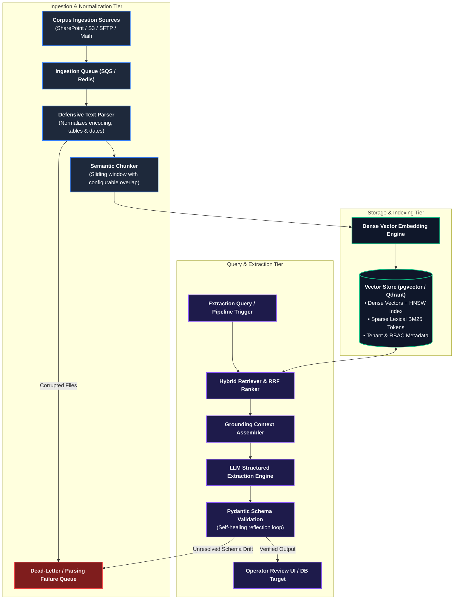
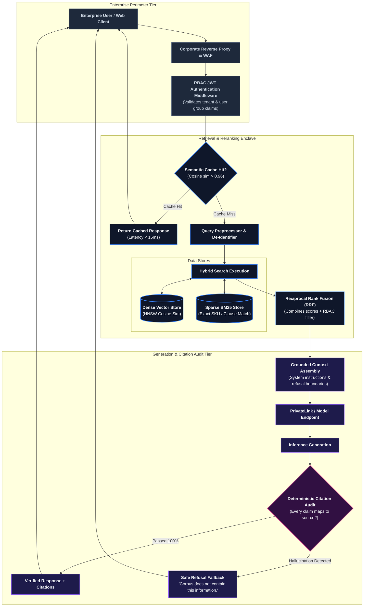
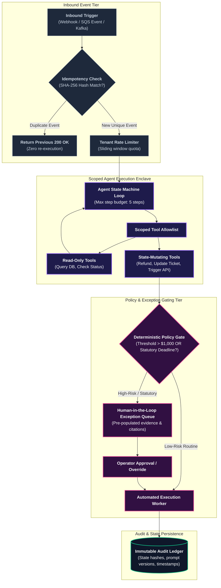
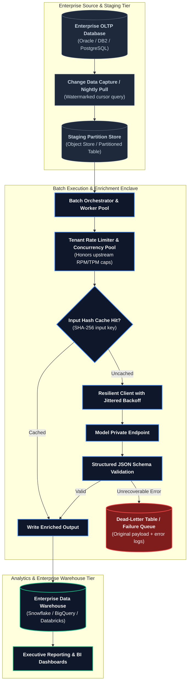

# Reference Architectures for Forward Deployed Engineering

In enterprise technology, staring at a blank whiteboard during an architecture review is an invitation to
analysis paralysis. While every customer enterprise possesses unique legacy quirks, Virtual Private Cloud (VPC)
layouts, and compliance boundaries, **more than 90% of forward-deployed systems resolve into one of four canonical
architectural patterns**.

These reference architectures represent hardened, battle-tested topologies engineered to satisfy enterprise
security audits, operational telemetry mandates, and strict Service Level Agreements (SLAs). They are calibrated
against empirical demand from 146 enterprise FDE postings ([`job-market/dataset/fde_market_data.json`](../job-market/dataset/fde_market_data.json)),
reflecting requirements for RAG and retrieval (52.0%), LLM APIs and tool calling (43.0%), AI agents (42.0%),
containerized enclaves (Docker 40.0%, Kubernetes 35.0%), and enterprise data stores (58.2%).

---

## 1. Core Architectural Invariants

Before selecting an architectural shape, adhere to three foundational rules:

1. **Adapt, Do Not Adopt**: Run the 8-dimension constraint inventory first ([`system-design/01-architecture-for-customer-systems.md`](01-architecture-for-customer-systems.md)).
   The reference architecture is the *end result* of fitting capabilities to constraints, not a rigid template
   to copy-paste into customer infrastructure.
2. **The Deployment Footprint Decides Where It Lands**: The same logical reference architecture can be deployed
   as an in-VPC containerized enclave, a hybrid cross-account setup over AWS PrivateLink, or a fully air-gapped
   on-premise deployment ([`deployment/02-deployment-patterns.md`](../deployment/02-deployment-patterns.md)).
3. **Inherit the "Boring" Operational Spine**: Scaffolding—metrics, distributed tracing, secret management, and
   configuration—must be inherited from the customer’s existing enterprise stack (Datadog, Splunk, HashiCorp Vault,
   Kubernetes Secrets). Novelty belongs strictly in domain logic, never in operational plumbing.

---

## 2. The Four Canonical Reference Architectures

---

### Shape 1: Enterprise Document Intelligence & Extraction Pipeline

Ingest, normalize, chunk, index, retrieve, and extract structured business entities from unstructured enterprise
corpora (PDF contracts, regulatory filings, claims files, insurance policies):

#### Production Fit & Key Use Cases
- Ingesting and analyzing unstructured 10-K regulatory filings, insurance dispute claims, commercial loan packages,
  and clinical trials where precision and auditability are non-negotiable.

#### Core Production Components
- **Ingestion & Parser**: Asynchronous queue worker paired with defensive parsers ([`interviews/code/parser.py`](../interviews/code/parser.py))
  that clean messy table formatting, drop unparseable rows, and log parsing exceptions.
- **Chunker & Embeddings**: Semantic chunking preserving paragraph boundaries and sliding overlaps ([`interviews/code/chunker.py`](../interviews/code/chunker.py))
  to ensure retrieval continuity across boundary splits.
- **Structured Schema Extractor**: Pydantic v2 validation engine with self-healing feedback loops
  ([`interviews/code/structured_extractor.py`](../interviews/code/structured_extractor.py)), guaranteeing type-safe
  JSON payloads before writing to downstream systems of record.

#### Operational & Failure Traps
- **The Parsing Schedule Black Hole**: Teams budget weeks for prompt engineering but allocate two days for parsing.
  In reality, scanned PDFs with nested multi-column tables consume 60% of the engineering schedule.
- **Per-Document Lineage Invariant**: Every vector chunk must store immutable source metadata (`document_id`,
  `version_hash`, `chunk_index`, `page_number`). When a document is updated or deleted, the pipeline must execute
  deterministic atomic purges and re-indexing without rebuilding the entire corpus.

---

### Shape 2: VPC-Enclave Hybrid RAG Assistant

Grounded, low-latency question answering over proprietary customer knowledge bases with deterministic source
citations and strict access control filtering:

#### Production Fit & Key Use Cases
- Internal engineering runbook assistants, customer support copilot interfaces, and compliance policy search engines.

#### Core Production Components
- **Permission-Aware Hybrid Search**: Combining dense vector embeddings (semantic meaning) with sparse lexical BM25
  (exact SKU numbers, regulation codes) via Reciprocal Rank Fusion, with strict SQL `WHERE tenant_id = :tenant`
  filtering enforced at the database level ([`portfolio/reference-project/src/api/server.py`](../portfolio/reference-project/src/api/server.py)).
- **Deterministic Citation Grounding**: A post-generation verification step that audits every statement against
  the retrieved context. If an assertion lacks document backing, the system triggers an explicit safe refusal
  rather than emitting a plausible hallucination.

#### Operational & Failure Traps
- **The Empty-Answer Anti-Pattern**: When an assistant encounters a question outside its corpus, uncalibrated models
  attempt to invent an answer. A senior FDE programs the assistant to treat *"The corpus does not contain information
  to answer this query"* as a first-class success state.
- **Corpus Stagnation & Drift**: RAG assistants fail over time not because retrieval algorithms degrade, but because
  underlying documents become obsolete. Establish automated weekly corpus staleness monitors.

---

### Shape 3: Deterministic Agentic Automation Engine with Human Exception Gating

A high-leverage operational agent that executes multi-step workflows across external enterprise systems,
strictly bound by deterministic policy rules, scoped tool allowlists, and human approval gates:

#### Production Fit & Key Use Cases
- Enterprise financial dispute escalation (ETISE), IT service desk automated remediation, insurance claim triage,
  and customer refund processing.

#### Core Production Components
- **Atomic Idempotency Engine**: SHA-256 fingerprint verification preventing duplicate ticket processing
  ([`interviews/code/webhook_receiver.py`](../interviews/code/webhook_receiver.py)).
- **Deterministic Policy Gate**: Python rule enforcement that intercepts state-mutating actions based on business
  thresholds (e.g. disputes exceeding $1,000 or alleging statutory Regulation E violations are hard-diverted to human review).
- **Human Exception Queue**: Production FastAPI endpoint routing ambiguous edge cases to operators with pre-compiled
  citations, cutting manual review time by 80% without relinquishing regulatory control
  ([`portfolio/reference-project/src/api/server.py`](../portfolio/reference-project/src/api/server.py)).

#### Operational & Failure Traps
- **Runaway Agent Loops & Budget Blowouts**: Open-ended agent loops can trigger recursive LLM calls, exhausting API
  rate limits in minutes. Enforce strict invariants: maximum 5 steps per task, hard token budgets, and client-side
  timeouts.
- **The Vendor Hero Trap**: Automated agents must never run in production without comprehensive runbooks and operator
  override levers. If an operator cannot manually pause the agent with a single flag, the system will be decommissioned
  during its first operational anomaly.

---

### Shape 4: High-Throughput Batch Enrichment & Data Plane

Model-driven batch transformations operating as a warehouse-scale data pipeline over millions of historical or
nightly records:

#### Production Fit & Key Use Cases
- Nightly transaction dispute classification, lead enrichment across millions of CRM contacts, catalog taxonomy
  tagging, and historical compliance audits.

#### Core Production Components
- **Watermark Ingestion & Backfill Idempotency**: Pulling records using strict high-watermark cursors (`WHERE updated_at > :last_watermark`),
  ensuring interrupted batch jobs resume cleanly without reprocessing.
- **Input-Hash Caching**: Computing SHA-256 hashes of input texts and caching model outputs. When running periodic
  backfills or model re-evaluations, unchanged records are served instantly from cache at zero token cost.
- **Resilient Batch Workers**: Full-jitter exponential backoff clients ([`interviews/code/resilient_client.py`](../interviews/code/resilient_client.py))
  preventing multi-threaded batch workers from overwhelming shared LLM quotas.

#### Operational & Failure Traps
- **The Thundering Herd Trap**: Running 100 parallel batch workers against external model APIs without client-side
  rate limiters instantly triggers HTTP 429 cascades, bringing down interactive customer-facing services sharing the
  same API quota.
- **Silent Drops & Zombie Jobs**: Dropping unparseable records silently corrupts warehouse analytics. Every failure
  must land in a dedicated dead-letter table with the exact provider error and input payload attached.

---

## 3. Comparative Architecture Selection Matrix

Use this matrix during Phase 3 architectural discovery to evaluate candidate shapes against customer constraints:

| Architecture Shape | Target Latency SLA | Relative Compute Cost | Human Oversight Overhead | Required Network Egress | Deployment Footprint | Primary Operational Risk |
| :--- | :--- | :--- | :--- | :--- | :--- | :--- |
| **1. Document Intelligence** | Asynchronous (30s – 5m) | Medium ($0.02 – $0.15 / doc) | Low (Exception sampling only) | Moderate (Vector sync & model calls) | Dedicated Queue + Worker Nodes + Vector DB | PDF table parsing corruption; vector drift |
| **2. Hybrid RAG Assistant** | Interactive (< 1.5s p95) | Low ($0.005 – $0.03 / query) | Medium (Feedback review & curation) | High (Real-time model inference) | Web Gateway + Cache + Hybrid Store | Outdated knowledge base; plausible hallucination |
| **3. Agentic Automation Engine** | Near-Realtime (2s – 10s) | High ($0.05 – $0.50 / task) | High (Gated approval queues) | High (Multi-step tool & API calls) | Microservice Enclave + Audit Store + Queue | Runaway execution loops; state-mutating errors |
| **4. Batch Data Plane** | Scheduled (1h – 8h batch) | Low ($0.001 – $0.01 / row) | Very Low (Daily error queue check) | Very High (Sustained bulk bandwidth) | Distributed Batch Pool + Dead-Letter Store | Quota exhaustion cascades; unversioned backfills |

---

## 4. Direct Codebase Defense Implementations

Each of the four reference architectures is implemented as functional, evaluated, and testable code within
this repository:

| Reference Architecture | Primary Codebase Implementation | Test & Evaluation Suite | Production Verification Role |
| :--- | :--- | :--- | :--- |
| **Document Intelligence (Shape 1)** | [`interviews/code/chunker.py`](../interviews/code/chunker.py) [`interviews/code/parser.py`](../interviews/code/parser.py) | `pytest interviews/code/test_chunker.py` `pytest interviews/code/test_parser.py` | Word-boundary chunking, CSV/JSON log repair, dirty date normalization |
| **Hybrid RAG Assistant (Shape 2)** | [`portfolio/reference-project/src/api/server.py`](../portfolio/reference-project/src/api/server.py) | `pytest portfolio/reference-project/tests/` | Reciprocal rank fusion combining dense cosine and sparse BM25 with RBAC |
| **Agentic Automation Engine (Shape 3)** | [`portfolio/reference-project/src/api/server.py`](../portfolio/reference-project/src/api/server.py) [`interviews/code/webhook_receiver.py`](../interviews/code/webhook_receiver.py) | `python portfolio/reference-project/evals/run_evals.py` | 25-case golden evaluation harness asserting 100% citation grounding and SLA routing |
| **Batch Data Plane (Shape 4)** | [`interviews/code/rate_limiter.py`](../interviews/code/rate_limiter.py) [`interviews/code/resilient_client.py`](../interviews/code/resilient_client.py) | `pytest interviews/code/test_rate_limiter.py` `pytest interviews/code/test_resilient_client.py` | Sliding-window tenant throttling, full-jitter backoff, header-aware retries |

---

## 5. Primary Practitioner Literature & Citations

1. **Anthropic**: *Model Context Protocol (MCP) Architecture Specification & Tool Integration Guidelines* (2026). [modelcontextprotocol.io](https://modelcontextprotocol.io)
2. **OpenAI**: *Enterprise Function Calling & Assistants Architecture Guide* (2026). [platform.openai.com/docs/guides/function-calling](https://platform.openai.com/docs/guides/function-calling)
3. **AWS Architecture Center**: *Architecting Generative AI Applications on AWS: Hybrid Cloud and VPC Enclave Topologies*. [aws.amazon.com/architecture](https://aws.amazon.com/architecture/)
4. **Google Site Reliability Engineering**: *Cascading Failures and Reliable Bulk Data Processing*. [sre.google/sre-book](https://sre.google/sre-book/)
5. **Databricks**: *The Big Book of GenAI Reference Architectures: Ingestion, Hybrid Search, and Evaluation*. [databricks.com](https://www.databricks.com)
6. **Palantir Technologies**: *Forward Deployed Field Architecture: Composable Data Planes and Operational Microservices* (2024).
