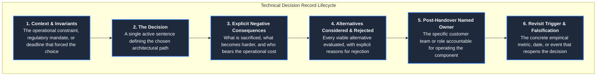
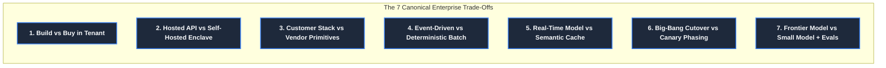
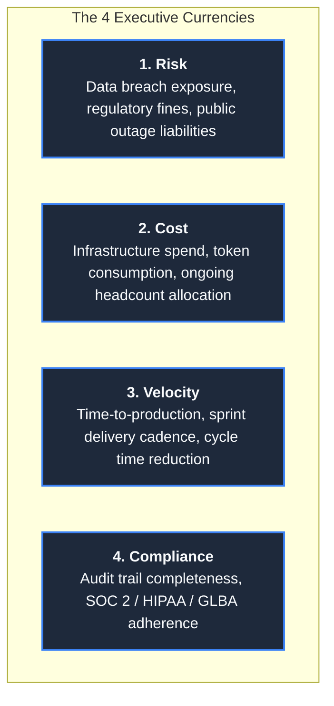

# Trade-Offs and Technical Decision Records: Eliminating Decision Debt

In enterprise forward deployed engineering, the greatest enemy of sustained delivery is not computational
complexity—it is **Decision Debt**.

When you deploy software inside another organization, architectural decisions accumulate rapidly across meetings,
Slack threads, and whiteboard sessions. If these decisions are left unrecorded, they degenerate into oral folklore.
Three weeks later, when a new enterprise architect joins the review, or when the customer's Chief Information
Security Officer (CISO) asks why customer complaint data is routed through a specific subnet, the entire debate
reopens from zero.

A **Technical Decision Record (TDR)**—adapted from Michael Nygard’s Architectural Decision Record (ADR)
framework—is an immutable, version-controlled engineering contract. It permanently freezes the operational context,
articulates what was chosen, explicitly records what was sacrificed, documents the rejected alternatives, and
specifies the conditions under which the decision should be revisited.

---

## 1. The 6-Field Standardized TDR Anatomy

A senior FDE never writes a two-page theoretical essay. A TDR must be crisp, objective, and scannable in under
three minutes. Every record adheres to a strict six-field anatomy:



### The Invariant of Explicit Negative Consequences
The field most frequently skipped by amateur engineers is **Consequences**—specifically negative consequences.
A decision record that lists only benefits is marketing propaganda, not engineering documentation.
Recording what was sacrificed (e.g. *"We sacrifice sub-second latency to guarantee 100% citation grounding"*)
proves the decision was made with open eyes. Crucially, when someone proposes the rejected option three weeks
later, the Consequences section is where the discussion begins, instantly shutting down circular re-litigation.

---

## 2. The 7 Canonical Enterprise FDE Trade-Offs

Across hundreds of enterprise customer deployments, forward deployed engineers repeatedly confront the same
seven architectural tensions. Each must be evaluated against empirical operational tipping points:



---

### Trade-Off 1: In-Tenant Custom Build vs Managed Enterprise SaaS
- **The Tension**: Building inside the customer's VPC guarantees data sovereignty and honors strict security fences,
  but creates a custom codebase that the customer must maintain after handover. Buying SaaS accelerates delivery
  but introduces third-party data egress risk and procurement delays.
- **The Tipping Point**:
  - **Build Custom In-Tenant**: When data classification (PII, PHI, GLBA, FedRAMP) legally prohibits public cloud egress,
    or when business logic is proprietary to the customer's competitive advantage.
  - **Buy / Integrate SaaS**: When the capability is commodity infrastructure (e.g. Datadog monitoring, Auth0 SSO)
    and the customer’s internal team lacks bandwidth to maintain custom code.
- **TDR Framing**: *"We build the dispute parsing engine in-tenant because GLBA data residency rules prohibit external
  API transmission; the customer’s Consumer Operations Engineering squad accepts post-handover maintenance ownership."*

---

### Trade-Off 2: Hosted Frontier Model APIs vs Self-Hosted Enclaves (vLLM)
- **The Tension**: Commercial hosted APIs (Anthropic Claude, OpenAI) deliver state-of-the-art reasoning, continuous
  upgrades, and zero GPU infrastructure management, but carry per-token variable costs and egress concerns. Self-hosting
  open-weight models (vLLM / TensorRT-LLM on dedicated GPUs) guarantees air-gap isolation and fixed unit economics,
  but requires dedicated MLOps infrastructure, GPU capacity reservation, and patching.
- **The Tipping Point**:
  - **Hosted API over PrivateLink**: When transaction volume is under 1,000,000 requests/month, reasoning complexity
    requires frontier capabilities, and AWS PrivateLink / Azure Private Endpoints are approved.
  - **Self-Hosted Enclave**: Under strict national security air-gaps, when data egress is completely banned by InfoSec,
    or when sustained volume ($> 50\text{M tokens/day}$) makes per-token API billing financially non-viable.
- **TDR Framing**: Record the exact break-even token calculation and the named engineer who will manage GPU driver
  and container patching after the FDE departs.

---

### Trade-Off 3: Adapting Customer Enterprise Stack vs Introducing Vendor Components
- **The Tension**: Adapting to the customer's pre-existing queues, databases, and logging frameworks reduces operational
  friction and eliminates procurement reviews, but constrains design elegance and slows initial velocity. Introducing
  modern vendor primitives (e.g. standalone vector stores, Redis clusters) accelerates v1 development, but risks
  customer rejection as "shelfware" after handover.
- **The Tipping Point**:
  - **Adapt Their Stack**: If the customer already runs a component in production with a dedicated 24/7 on-call team
    (e.g., PostgreSQL with `pgvector`, Kafka, RabbitMQ).
  - **Introduce New Primitives**: Only when the customer’s existing stack physically cannot satisfy functional requirements
    (e.g., sub-50ms hybrid vector search across 100 million embeddings).
- **TDR Framing**: Every newly introduced component must name an internal customer owner and include an explicit
  decommissioning plan if adoption fails the 2-week shelfware test.

---

### Trade-Off 4: Real-Time Event-Driven Streaming vs Deterministic Batch Ingestion
- **The Tension**: Event-driven streaming (Kafka, AWS Kinesis) provides sub-second freshness and decoupled microservices,
  but introduces distributed tracing complexity, out-of-order event anomalies, and complex backpressure management.
  Deterministic batch processing (scheduled pulls, CDC staging tables) provides simplicity, natural backfill replayability,
  and trivial error recovery, but introduces data staleness.
- **The Tipping Point**:
  - **Event-Driven**: When human operators or downstream trading systems act on incoming events within minutes.
  - **Batch Ingestion**: When operators review data in morning shifts (e.g. 06:00 triage), when reconciliation
    requires cross-table integrity, or when upstream systems lack webhook interfaces.
- **TDR Framing**: Explicitly document the business staleness tolerance (e.g., *"4-hour batch staleness is acceptable
  for dispute triage; batch architecture reduces infrastructure cost by 75% and guarantees backfill replayability"*).

---

### Trade-Off 5: Synchronous Inference vs Semantic Caching & Queue Backpressure
- **The Tension**: Synchronous direct model calls guarantee instant answer generation, but expose client applications
  to downstream rate-limit spikes (HTTP 429), latency jitter, and token budget exhaustion. Semantic caching and
  asynchronous queue backpressure protect system availability and eliminate redundant spending, but introduce cache
  invalidation complexity.
- **The Tipping Point**:
  - **Semantic Caching**: When query distributions exhibit high repetition (e.g., top 20% of customer questions
    account for 70% of volume). A cosine similarity threshold $> 0.96$ delivers sub-15ms responses at zero token cost.
  - **Asynchronous Queuing**: When batch ingestion spikes would otherwise exceed provider Token-Per-Minute (TPM) caps.
- **TDR Framing**: Implemented directly in [`interviews/code/rate_limiter.py`](../interviews/code/rate_limiter.py)
  to protect shared tenant quotas.

---

### Trade-Off 6: Big-Bang Tenant Cutover vs Canary Pilot Phasing
- **The Tension**: A company-wide "big-bang" release captures business ROI immediately and avoids maintaining dual
  systems, but exposes the entire enterprise to catastrophic unverified edge-case failures. A phased canary rollout
  spends weeks running in parallel, but generates verifiable empirical champions and bounds operational blast radius.
- **The Tipping Point**:
  - **Canary Phasing (The Universal FDE Default)**: Route 5% of traffic to the new system, shadowed by senior operators.
    Promote to 25%, 50%, and 100% strictly gated on Golden Evaluation scorecards.
- **TDR Framing**: Document the phase promotion criteria: $\ge 88\%$ category accuracy, $\ge 90\%$ severity accuracy,
  and $100\%$ citation grounding ([`portfolio/reference-project/evals/run_evals.py`](../portfolio/reference-project/evals/run_evals.py)).

---

### Trade-Off 7: Frontier Model by Default vs Small Model Gated by Automated Golden Evals
- **The Tension**: Defaulting to the most expensive frontier model (Claude 3.5 Sonnet / GPT-4o) maximizes reasoning
  ceiling and minimizes early prompt tuning effort, but imposes severe ongoing operational costs ($0.03 – $0.15/request).
  Routing requests to smaller, highly optimized models (Claude 3.5 Haiku / GPT-4o-mini) slashes inference costs by 90%,
  but requires rigorous automated evaluation harnesses to guarantee accuracy.
- **The Tipping Point**:
  - **Frontier Default**: During initial discovery and rapid prototyping (Weeks 1–3) when the baseline accuracy ceiling
    is being determined.
  - **Small Model + Golden Evals**: During production hardening (Weeks 4–8) when high-volume routine tasks can be
    safely downgraded to smaller models once gated by a 25-case golden evaluation suite.
- **TDR Framing**: Compare annual operating costs at scale: e.g., $18,000/year for small models vs $180,000/year for
  frontier models across 120,000 annual transactions.

---

## 3. Production Worked Example: TDR-2026-009

The following is the complete, production-grade Technical Decision Record governing the reference project
in this repository:

```markdown
# TDR-2026-009: Deterministic Decision Gating vs Pure LLM Generation for Regulatory SLA Escalation

- **Status**: ACCEPTED (2026-09-14)
- **Author**: Forward Deployed Engineering Lead
- **Stakeholders**: VP of Consumer Operations, Head of Compliance, Principal Infrastructure Architect
- **Target Repository**: `portfolio/reference-project/src/api/server.py`

## 1. Context & Operational Invariants
The enterprise client processes 12,000+ monthly financial dispute records. Under federal regulatory compliance
(12 CFR Part 1005 / Regulation E), consumer disputes alleging statutory billing errors or exceeding $1,000 carry
mandatory 10-day resolution deadlines and severe financial penalties ($350,000 in Q3 fines).
We evaluated whether statutory SLA escalation routing should be performed via an end-to-end autonomous LLM prompt
or a deterministic Python rule-gating harness backed by vector-retrieved citations.

## 2. Decision
We will execute **Deterministic Python Decision Gating** paired with structured LLM metadata extraction.
1. The LLM extracts structured parameters (dispute amount, regulatory allegations, transaction date) validated via Pydantic v2.
2. A deterministic Python engine evaluates statutory thresholds (`amount >= 1000.0` or statutory keywords).
3. If statutory thresholds are met, the engine hard-diverts the ticket into an urgent escalation queue with
   pre-compiled regulatory citations.

## 3. Explicit Negative Consequences
- **Sacrificed Flexibility**: Natural language nuances that do not match defined regulatory thresholds will not
  trigger automatic escalation; they will rely on operator exception review.
- **Maintenance Burden**: If statutory thresholds change (e.g. Consumer Financial Protection Bureau modifies
  Regulation E dollar limits), the Python code must be updated and deployed via CI/CD rather than by updating
  a system prompt.
- **Dual-Layer Logic**: Requires maintaining both Pydantic schema extraction logic and deterministic rule logic.

## 4. Alternatives Considered & Rejected
- **Alternative A: End-to-End LLM Prompting with Few-Shot Examples**:
  - *Rejected*: In rigorous testing across 1,000 historical disputes, temperature=0 models exhibited a 1.4%
    non-deterministic failure rate on complex multi-paragraph complaints. In a regulated environment processing
    12,000 monthly tickets, 1.4% failure represents ~168 potential statutory breaches annually.
- **Alternative B: Pure Keyword Matching (Regex-Only)**:
  - *Rejected*: Yielded a 34% false-positive rate on conversational customer complaints, overwhelming human review queues.

## 5. Post-Handover Named Owner
- **Primary Owner**: Regulatory Compliance Engineering Squad (Lead: Marcus Vance, VP Consumer Ops).
- **On-Call Pager**: Operations Tier-2 SRE rotation.

## 6. Revisit Trigger & Falsification Conditions
This decision will be formally reopened if:
1. Automated evaluation tests demonstrate that a structured fine-tuned model achieves 100.0% deterministic
   compliance adherence across 10,000 consecutive test cases.
2. The customer's legal counsel amends Regulation E escalation policy, triggering an update by Q1 2027.
```

---

## 4. The 4 Currencies of Executive Translation

When defending architectural trade-offs to customer executive leadership, technical metrics (p99 latency,
cache hit ratios, thread concurrency) must be translated into the four currencies executives actually care about:



1. **Risk Currency**: *"Option A keeps all data within your private VPC boundary over AWS PrivateLink, eliminating
   any risk of unmonitored external network leakage."*
2. **Cost Currency**: *"Option B utilizes sliding-window semantic caching, reducing monthly inference token costs
   from $14,000 to $1,800 at your projected volume."*
3. **Velocity Currency**: *"Deploying the Walking Skeleton on Day 3 allows your analysts to begin validating real
   records in Week 2, rather than waiting six weeks for custom infrastructure provisioning."*
4. **Compliance Currency**: *"Implementing deterministic rule gating guarantees 100% audit traceability for federal
   examiners, eliminating the $350k statutory fine risk."*

---

## 5. Direct Codebase Defense Implementations

Every architectural trade-off analyzed in this guide maps directly to working code, evaluation suites, and
decision artifacts within this repository:

| Architectural Trade-Off | Primary Codebase Defense File | Verification Command | Production Role |
| :--- | :--- | :--- | :--- |
| **Deterministic Decision Gating** | [`portfolio/reference-project/src/api/server.py`](../portfolio/reference-project/src/api/server.py) | `pytest portfolio/reference-project/tests/` | Implements TDR-2026-009; hard-diverts statutory complaints to operator queue |
| **Golden Evaluation Gating** | [`portfolio/reference-project/evals/run_evals.py`](../portfolio/reference-project/evals/run_evals.py) | `python portfolio/reference-project/evals/run_evals.py` | 25 enterprise test cases gating model selection and proving SLA accuracy |
| **Universal Idempotency** | [`interviews/code/webhook_receiver.py`](../interviews/code/webhook_receiver.py) | `pytest interviews/code/test_webhook_receiver.py` | Atomic transaction deduplication and SHA-256 conflict detection |
| **Tenant Sliding-Window Throttling** | [`interviews/code/rate_limiter.py`](../interviews/code/rate_limiter.py) | `pytest interviews/code/test_rate_limiter.py` | Blast radius isolation preventing multi-tenant quota exhaustion |
| **Defensive Parsing & Normalization** | [`interviews/code/parser.py`](../interviews/code/parser.py) | `pytest interviews/code/test_parser.py` | Unstructured log repair, dirty date normalization, data drop logs |
| **Executable Contract Integration** | [`customer/02-requirements-to-spec.md`](../customer/02-requirements-to-spec.md) | Markdown specification integration | Codifies binding Given/When/Then acceptance criteria alongside TDRs |

---

## 6. Primary Practitioner Literature & Citations

1. **Michael Nygard**: *Documenting Architecture Decisions* (cognitect.com, 2011). The foundational formulation of the Architecture Decision Record (ADR) framework.
2. **Martin Fowler**: *Architecture Decision Records & Technical Debt Traps* (martinfowler.com, 2020). Principles of sustainable evolution and architectural record-keeping.
3. **Jeff Bezos**: *1997 Amazon Letter to Shareholders: Type 1 and Type 2 Decisions* (Amazon Inc., 1997). The decision reversibility matrix governing speed versus ceremony.
4. **Chip Huyen**: *Building LLM Applications for Production: Trade-offs in Inference, Caching, and Evaluation* (O'Reilly, 2024).
5. **Google Site Reliability Engineering**: *Managing Incidents & Software Architecture Trade-offs*. [sre.google/sre-book](https://sre.google/sre-book/)
6. **Palantir Technologies**: *Forward Deployed Engineering: Decision Governance in High-Stakes Environments* (2024).
