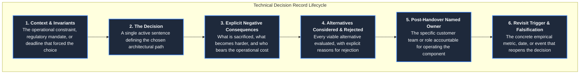
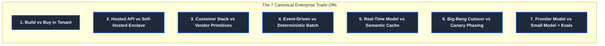
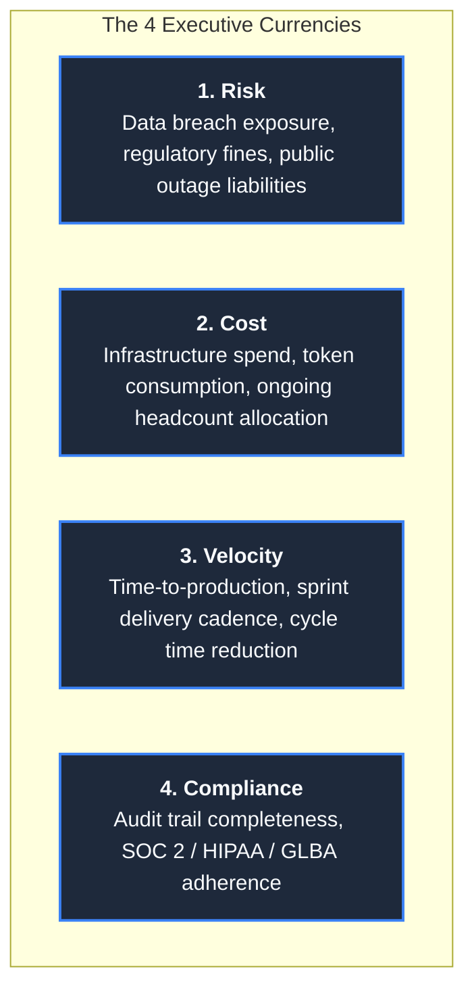

# Trade-Offs and Technical Decision Records: Eliminating Decision Debt

Scope, reviewed 2026-10-09: architectures, latency/cost ranges, deployment schedules, and example dialogue below are planning guidance or assumptions unless linked to a specific measured artifact. Historical 146-role labels retain their original window and are not remeasured on the current snapshot. The executable-scope section states which controls actually run.

In enterprise forward deployed engineering, the greatest enemy of sustained delivery is not computational
complexity—it is **Decision Debt**.

When you deploy software inside another organization, architectural decisions accumulate rapidly across meetings,
Slack threads, and whiteboard sessions. If these decisions are left unrecorded, they degenerate into oral folklore.
Three weeks later, when a new enterprise architect joins the review, or when the customer's Chief Information
Security Officer (CISO) asks why customer complaint data is routed through a specific subnet, the entire debate
reopens from zero.

A **Technical Decision Record (TDR)**—adapted from Michael Nygard’s Architectural Decision Record (ADR)
framework—is an immutable, version-controlled engineering contract. It permanently freezes the operational context,
articulates what was chosen, explicitly records what was sacrificed, documents the rejected alternatives, and
specifies the conditions under which the decision should be revisited.

---

## 1. The 6-Field Standardized TDR Anatomy

A senior FDE never writes a two-page theoretical essay. A TDR must be crisp, objective, and scannable in under
three minutes. Every record adheres to a strict six-field anatomy:

```mermaid
graph TD
    subgraph Technical Decision Record Lifecycle
        F1["<b>1. Context & Invariants</b><br/>The operational constraint, regulatory mandate, or deadline that forced the choice"]
        F2["<b>2. The Decision</b><br/>A single active sentence defining the chosen architectural path"]
        F3["<b>3. Explicit Negative Consequences</b><br/>What is sacrificed, what becomes harder, and who bears the operational cost"]
        F4["<b>4. Alternatives Considered & Rejected</b><br/>Every viable alternative evaluated, with explicit reasons for rejection"]
        F5["<b>5. Post-Handover Named Owner</b><br/>The specific customer team or role accountable for operating the component"]
        F6["<b>6. Revisit Trigger & Falsification</b><br/>The concrete empirical metric, date, or event that reopens the decision"]

        F1 --> F2 --> F3 --> F4 --> F5 --> F6
    end

    classDef tdr fill:#1e293b,stroke:#3b82f6,stroke-width:2px,color:#f8fafc;
    class F1,F2,F3,F4,F5,F6 tdr;
```

### The Invariant of Explicit Negative Consequences
The field most frequently skipped by amateur engineers is **Consequences**—specifically negative consequences.
A decision record that lists only benefits is marketing propaganda, not engineering documentation.
Recording what was sacrificed (e.g. *"We sacrifice sub-second latency to guarantee 100% citation grounding"*)
proves the decision was made with open eyes. Crucially, when someone proposes the rejected option three weeks
later, the Consequences section is where the discussion begins, instantly shutting down circular re-litigation.

---

## 2. The 7 Canonical Enterprise FDE Trade-Offs

Across hundreds of enterprise customer deployments, forward deployed engineers repeatedly confront the same
seven architectural tensions. Each must be evaluated against empirical operational tipping points:

```mermaid
graph LR
    subgraph The 7 Canonical Enterprise Trade-Offs
        T1["<b>1. Build vs Buy in Tenant</b>"]
        T2["<b>2. Hosted API vs Self-Hosted Enclave</b>"]
        T3["<b>3. Customer Stack vs Vendor Primitives</b>"]
        T4["<b>4. Event-Driven vs Deterministic Batch</b>"]
        T5["<b>5. Real-Time Model vs Semantic Cache</b>"]
        T6["<b>6. Big-Bang Cutover vs Canary Phasing</b>"]
        T7["<b>7. Frontier Model vs Small Model + Evals</b>"]
    end

    classDef trade fill:#1e293b,stroke:#3b82f6,stroke-width:2px,color:#f8fafc;
    class T1,T2,T3,T4,T5,T6,T7 trade;
```

---

### Trade-Off 1: In-Tenant Custom Build vs Managed Enterprise SaaS
- **The Tension**: Building inside the customer's VPC can support a residency requirement when all storage, backups, telemetry, and egress paths are verified,
  but creates a custom codebase that the customer must maintain after handover. Buying SaaS accelerates delivery
  but introduces third-party data egress risk and procurement delays.
- **The Tipping Point**:
  - **Build Custom In-Tenant**: When data classification (PII, PHI, GLBA, FedRAMP) legally prohibits public cloud egress,
    or when business logic is proprietary to the customer's competitive advantage.
  - **Buy / Integrate SaaS**: When the capability is commodity infrastructure (e.g. Datadog monitoring, Auth0 SSO)
    and the customer’s internal team lacks bandwidth to maintain custom code.
- **TDR Framing**: *"We build the dispute parsing engine in-tenant because GLBA data residency rules prohibit external
  API transmission; the customer’s Consumer Operations Engineering squad accepts post-handover maintenance ownership."*

---

### Trade-Off 2: Hosted Frontier Model APIs vs Self-Hosted Enclaves (vLLM)
- **The Tension**: Commercial hosted APIs (Anthropic Claude, OpenAI) deliver state-of-the-art reasoning, continuous
  upgrades, and zero GPU infrastructure management, but carry per-token variable costs and egress concerns. Self-hosting
  open-weight models (vLLM / TensorRT-LLM on dedicated GPUs) requires verified network isolation and measured infrastructure economics,
  but requires dedicated MLOps infrastructure, GPU capacity reservation, and patching.
- **The Tipping Point**:
  - **Hosted API over PrivateLink**: When transaction volume is under 1,000,000 requests/month, reasoning complexity
    requires frontier capabilities, and AWS PrivateLink / Azure Private Endpoints are approved.
  - **Self-Hosted Enclave**: Under strict national security air-gaps, when data egress is completely banned by InfoSec,
    or when sustained volume ($> 50\text{M tokens/day}$) makes per-token API billing financially non-viable.
- **TDR Framing**: Record the exact break-even token calculation and the named engineer who will manage GPU driver
  and container patching after the FDE departs.

---

### Trade-Off 3: Adapting Customer Enterprise Stack vs Introducing Vendor Components
- **The Tension**: Adapting to the customer's pre-existing queues, databases, and logging frameworks reduces operational
  friction and eliminates procurement reviews, but constrains design elegance and slows initial velocity. Introducing
  modern vendor primitives (e.g. standalone vector stores, Redis clusters) accelerates v1 development, but risks
  customer rejection as "shelfware" after handover.
- **The Tipping Point**:
  - **Adapt Their Stack**: If the customer already runs a component in production with a dedicated 24/7 on-call team
    (e.g., PostgreSQL with `pgvector`, Kafka, RabbitMQ).
  - **Introduce New Primitives**: Only when the customer’s existing stack physically cannot satisfy functional requirements
    (e.g., sub-50ms hybrid vector search across 100 million embeddings).
- **TDR Framing**: Every newly introduced component must name an internal customer owner and include an explicit
  decommissioning plan if adoption fails the 2-week shelfware test.

---

### Trade-Off 4: Real-Time Event-Driven Streaming vs Deterministic Batch Ingestion
- **The Tension**: Event-driven streaming (Kafka, AWS Kinesis) provides sub-second freshness and decoupled microservices,
  but introduces distributed tracing complexity, out-of-order event anomalies, and complex backpressure management.
  Deterministic batch processing (scheduled pulls, CDC staging tables) provides simplicity, natural backfill replayability,
  and trivial error recovery, but introduces data staleness.
- **The Tipping Point**:
  - **Event-Driven**: When human operators or downstream trading systems act on incoming events within minutes.
  - **Batch Ingestion**: When operators review data in morning shifts (e.g. 06:00 triage), when reconciliation
    requires cross-table integrity, or when upstream systems lack webhook interfaces.
- **TDR Framing**: Explicitly document the business staleness tolerance (e.g., *"4-hour batch staleness is acceptable
  for dispute triage; measure batch cost against the streaming baseline and test backfill replayability"*).

---

### Trade-Off 5: Synchronous Inference vs Semantic Caching & Queue Backpressure
- **The Tension**: Synchronous model calls place inference latency on the request path, but expose client applications
  to downstream rate-limit spikes (HTTP 429), latency jitter, and token budget exhaustion. Semantic caching and
  asynchronous queue backpressure protect system availability and eliminate redundant spending, but introduce cache
  invalidation complexity.
- **The Tipping Point**:
  - **Semantic Caching**: When query distributions exhibit high repetition (e.g., top 20% of customer questions
    account for a measured share of volume). Choose similarity thresholds and cache expiry on a measured workload; latency, false cache hits, and cost remain unmeasured here.
  - **Asynchronous Queuing**: When batch ingestion spikes would otherwise exceed provider Token-Per-Minute (TPM) caps.
- **TDR Framing**: Implemented directly in [`interviews/code/rate_limiter.py`](../interviews/code/rate_limiter.py)
  to protect shared tenant quotas.

---

### Trade-Off 6: Big-Bang Tenant Cutover vs Canary Pilot Phasing
- **The Tension**: A company-wide "big-bang" release captures business ROI immediately and avoids maintaining dual
  systems, but exposes the entire enterprise to catastrophic unverified edge-case failures. A phased canary rollout
  spends weeks running in parallel, but generates verifiable empirical champions and bounds operational blast radius.
- **The Tipping Point**:
  - **Canary Phasing (The Universal FDE Default)**: Route 5% of traffic to the new system, shadowed by senior operators.
    Promote to 25%, 50%, and 100% strictly gated on Golden Evaluation scorecards.
- **TDR Framing**: Document the phase promotion criteria: $\ge 88\%$ category accuracy, $\ge 90\%$ severity accuracy,
  and $100\%$ citation grounding ([`portfolio/reference-project/evals/run_evals.py`](../portfolio/reference-project/evals/run_evals.py)).

---

### Trade-Off 7: Frontier Model by Default vs Small Model Gated by Automated Golden Evals
- **The Tension**: Defaulting to the most expensive frontier model (Claude 3.5 Sonnet / GPT-4o) maximizes reasoning
  ceiling and minimizes early prompt tuning effort, but imposes severe ongoing operational costs ($0.03 – $0.15/request).
  Routing requests to smaller, highly optimized models (Claude 3.5 Haiku / GPT-4o-mini) slashes inference costs by 90%,
  but requires rigorous automated evaluation harnesses to guarantee accuracy.
- **The Tipping Point**:
  - **Frontier Default**: During initial discovery and rapid prototyping (Weeks 1–3) when the baseline accuracy ceiling
    is being determined.
  - **Small Model + Golden Evals**: During production hardening (Weeks 4–8) when high-volume routine tasks can be
    safely downgraded to smaller models once gated by a 25-case golden evaluation suite.
- **TDR Framing**: Compare annual operating costs at scale: e.g., $18,000/year for small models vs $180,000/year for
  frontier models across 120,000 annual transactions.

---

## 3. Reviewed decision example: evidence-free dispatch

Reviewed on 2026-10-09 against [ETISE](../portfolio/reference-project/README.md). The former named financial engagement, fines, thousand-record experiments, failure percentages, and statutory dollar triggers had no supporting artifacts and are withdrawn as observations.

### Context and decision

The reference classifier used to raise fallback confidence to at least the dispatch threshold. Its grounding gate also ignored the absence of evidence. These are observed code defects, not hypothetical customer incidents.

Keep raw feature similarity below the threshold when warranted, and require a verified quotation in strict mode before automated dispatch. Preserve P0 escalation even when knowledge is unavailable. [Adversarial tests](../portfolio/reference-project/tests/test_regression_gates.py) exercise unknown input, empty evidence, forged citation flags, and incorrect routing.

### Consequences and alternatives

More requests may require human review, increasing operator workload. A locally verified quote still does not establish relevance, legal authority, or authenticated permission. Turning off strict mode changes the reference's policy boundary and requires explicit review before any real deployment.

A calibrated model is an alternative only after an independently labeled customer holdout exists. The current hand-written scores are not probabilities. A durable, authenticated service is separate required work.

### Legal boundary

Do not represent a customer-defined dollar threshold as a statute. [Regulation E §1005.11](https://www.consumerfinance.gov/rules-policy/regulations/1005/11/), reviewed today, distinguishes investigation, provisional credit, and conditional extensions. It does not create the former blanket $1,000 threshold and ten-day final-resolution rule.

### Revisit trigger and ownership

Revisit when approved customer policies, representative labels, review capacity measurements, and a named production owner exist. Record the new baseline and untouched evaluation set. A known fixture score cannot make this a legally accepted financial routing system.

## 4. The 4 Currencies of Executive Translation

When defending architectural trade-offs to customer executive leadership, technical metrics (p99 latency,
cache hit ratios, thread concurrency) must be translated into the four currencies executives actually care about:

```mermaid
graph TD
    subgraph The 4 Executive Currencies
        C1["<b>1. Risk</b><br/>Data breach exposure, regulatory fines, public outage liabilities"]
        C2["<b>2. Cost</b><br/>Infrastructure spend, token consumption, ongoing headcount allocation"]
        C3["<b>3. Velocity</b><br/>Time-to-production, sprint delivery cadence, cycle time reduction"]
        C4["<b>4. Compliance</b><br/>Audit trail completeness, SOC 2 / HIPAA / GLBA adherence"]
    end

    classDef curr fill:#1e293b,stroke:#3b82f6,stroke-width:2px,color:#f8fafc;
    class C1,C2,C3,C4 curr;
```

1. **Risk Currency**: *"Option A keeps all data within your private VPC boundary over AWS PrivateLink, subject to verification of telemetry, backup, and egress paths."*
2. **Cost Currency**: *"Option B utilizes sliding-window semantic caching, requires a measured hit rate, quality-loss analysis, and total-cost comparison at your projected volume."*
3. **Velocity Currency**: *"Deploying the Walking Skeleton on Day 3 allows your analysts to begin validating real
   records in Week 2, rather than waiting six weeks for custom infrastructure provisioning."*
4. **Compliance Currency**: *"Rule gating is one proposed control. We still need durable audit events, jurisdiction-specific policy review, and evidence from recovery tests before discussing compliance."*

---

## Executable scope

These blueprints are design recommendations. The repository supplies selected local exercises, not full implementations of every architecture. Reviewed 2026-10-09.

| Artifact | Exercised behavior | Boundary |
|---|---|---|
| [ETISE API](../portfolio/reference-project/src/api/server.py) | Payload-conflict detection, account/role replay context, TTL, single-process serialized replay, default document filtering | Caller roles are unauthenticated; queues and cache are process-local |
| [Retrieval](../portfolio/reference-project/src/pipeline/ingestion.py) | Feature hashing, token overlap, exact document/section quote checks | No learned embeddings, BM25, RRF, or regulatory entailment |
| [Regression runner](../portfolio/reference-project/evals/run_evals.py) | Routing, required documents, nonempty grounding, and failure reporting | 25 known legacy fixtures with unverified origins; no independent customer holdout |
| [Chunker](../interviews/code/chunker.py) | Bounded regex-token windows and overlap | Regex units are not a model tokenizer or a PDF ingestion pipeline |
| [Retry exercise](../interviews/code/resilient_client.py) | Real default delay, retry budgets, header-aware retry | An isolated exercise, not a durable event-processing system |

Use the [reference README](../portfolio/reference-project/README.md) for setup and current test commands. Authentication, tenant isolation, durable transactions, restore drills, private cloud networking, and measured workload SLOs remain required production work. Customer-defined thresholds are not statutes. Regulation E deadlines require review of the [official conditional rules](https://www.consumerfinance.gov/rules-policy/regulations/1005/11/).

## 6. Primary Practitioner Literature & Citations

1. **Michael Nygard**: *Documenting Architecture Decisions* (cognitect.com, 2011). The foundational formulation of the Architecture Decision Record (ADR) framework.
2. **Martin Fowler**: *Architecture Decision Records & Technical Debt Traps* (martinfowler.com, 2020). Principles of sustainable evolution and architectural record-keeping.
3. **Jeff Bezos**: *2015 Amazon Letter to Shareholders: Type 1 and Type 2 Decisions* (Amazon Inc., 2015). The decision reversibility matrix governing speed versus ceremony.
4. **Chip Huyen**: *Building LLM Applications for Production: Trade-offs in Inference, Caching, and Evaluation* (O'Reilly, 2024).
5. **Google Site Reliability Engineering**: *Managing Incidents & Software Architecture Trade-offs*. [sre.google/sre-book](https://sre.google/sre-book/)
