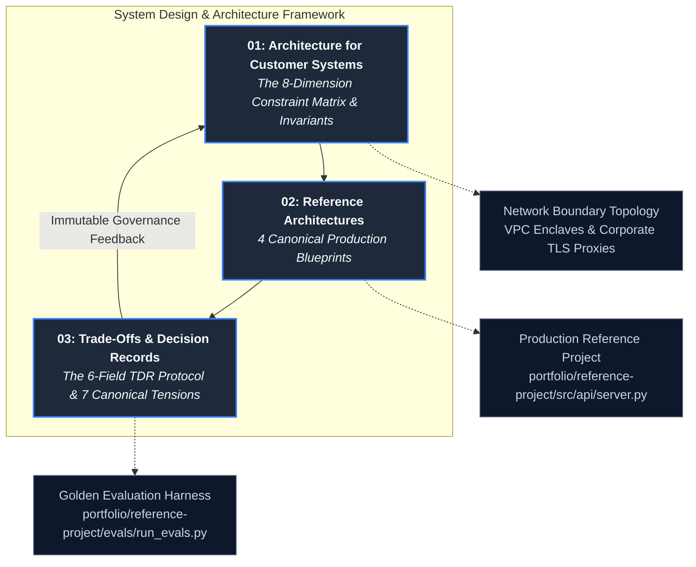

# System Design & Architecture: Engineering in Hostile Enterprise Enclaves

In consumer technology and public SaaS development, system architecture is defined by scale: how to distribute
state across global data centers, serve millions of concurrent HTTP requests, and achieve high availability on
infrastructure the engineering team fully controls.

In **Forward Deployed Engineering (FDE)**, system architecture is defined by **constraints**:
- You do not choose the cloud provider, the network subnet topology, or the corporate perimeter firewalls.
- You do not choose the identity provider, the legacy SQL database engines, or the 20-year-old schema migrations.
- You do not choose the compliance regime (HIPAA, PCI-DSS, SOC 2, GLBA) or the internal operational maturity of the customer's on-call rotation.

This reality establishes the foundational engineering philosophy of the forward-deployed discipline:
> **The best architecture is not the most mathematically elegant or technologically novel; it is the one the
> customer's internal on-call engineers can autonomously operate, monitor, and debug at 03:00 AM after the FDE departs.**

A system that achieves breakthrough algorithmic benchmarks on localhost but requires constant vendor intervention
to stay online in production is an architectural failure. It degenerates into perpetual consulting toil and is
eventually abandoned as "shelfware."

This module provides the comprehensive architectural field manual for forward-deployed systems: constraint-driven
system design, four canonical enterprise reference blueprints, and the technical decision record (TDR) governance
protocol that eliminates decision debt.

---

## 1. Pillar Knowledge Architecture

The three guides in this pillar form a progressive architectural framework—from environmental constraints to
repeatable deployment shapes and immutable decision records:

---

## 2. Core Pillar Guides

### 1. [Architecture for Customer Systems: Engineering Under Hostile Constraints](01-architecture-for-customer-systems.md)
The foundational principles of designing systems inside infrastructure you do not control:
- **Enterprise Network Boundary & Enclave Topology**: Complete request routing model traversing corporate DMZ reverse proxies, private corporate subnets (FastAPI enclave, legacy database read replicas, Okta/Entra ID SSO), corporate egress filtering proxies with injected CA bundles, and secure cloud endpoints over AWS PrivateLink.
- **The 8-Dimension Constraint Matrix**: Comprehensive reference table evaluating Cloud Estate & VPC Topology, Identity Provider & SSO Reality, Data Gravity & Ingestion Windows, Latency Budgets & Concurrency, Compliance & Regulatory Regimes (HIPAA, PCI-DSS, SOC 2, GLBA), Ops Maturity & Observability Stack, Change-Freeze Calendars, and Pre-Existing Vendor Contracts.
- **The 4 Immutable Architectural Invariants**:
  1. *Graceful Degradation Across Trust Boundaries*: External model failures trigger deterministic rule-based decision gates or human exception queues ([`portfolio/reference-project/src/api/server.py`](../portfolio/reference-project/src/api/server.py)); never hard outages.
  2. *Universal Idempotency & Replayability*: Atomic idempotency keys and SHA-256 payload fingerprinting ([`interviews/code/webhook_receiver.py`](../interviews/code/webhook_receiver.py)).
  3. *Blast Radius Isolation*: Sliding-window tenant throttling and header-aware backpressure ([`interviews/code/rate_limiter.py`](../interviews/code/rate_limiter.py)).
  4. *The "Boring Technology" & Shelfware Rule*: Passing the 2-week shelfware test; leveraging existing enterprise primitives (e.g. `pgvector` in PostgreSQL).
- **The 3 Architecture Seams**: Decoupling systems across *Seam 1: Ingestion Boundary*, *Seam 2: Model & Reasoning Boundary*, and *Seam 3: Retrieval Boundary* to enable evolution without rewrites.
- **The Customer Architecture Review Playbook & The "02:00 AM Pager Test"**: 3-step whiteboard flow (Constraints First $\rightarrow$ Boundary Shapes Next $\rightarrow$ Component Trade-Offs Last) and conducting the 02:00 AM thought experiment to ensure maintainability.

### 2. [Reference Architectures for Forward Deployed Engineering](02-reference-architectures.md)
The four canonical production blueprints covering 90%+ of forward deployed enterprise engagements:
- **Shape 1: Enterprise Document Intelligence & Extraction Pipeline**:
  - Ingestion Queue $\rightarrow$ Defensive Text Parser & Chunker $\rightarrow$ Dense Vector Embedding Engine $\rightarrow$ `pgvector` Store $\rightarrow$ Pydantic v2 Schema Validator with self-healing feedback loop $\rightarrow$ Operator Review UI and Dead-Letter Queue.
  - Mitigating the parsing schedule black hole and enforcing per-document version lineage.
- **Shape 2: VPC-Enclave Hybrid RAG Assistant**:
  - Reverse Proxy & WAF $\rightarrow$ RBAC JWT Auth Middleware $\rightarrow$ Semantic Cache (< 15ms hit) $\rightarrow$ Hybrid Dense (Cosine) + Sparse (BM25) Reciprocal Rank Fusion $\rightarrow$ Grounded Generation over PrivateLink $\rightarrow$ Deterministic Citation Auditor (100% grounding gate) $\rightarrow$ Safe Refusal Fallback.
  - Eliminating the empty-answer anti-pattern and monitoring corpus drift.
- **Shape 3: Deterministic Agentic Automation Engine with Human Exception Gating**:
  - Inbound Webhook $\rightarrow$ Idempotency Fingerprint Check (SHA-256) $\rightarrow$ Sliding-Window Rate Limiter $\rightarrow$ Scoped Agent Loop (max 5-step budget) $\rightarrow$ Deterministic Policy Gate (Threshold > $1,000 or Regulation E deadline) $\rightarrow$ Automated Execution vs Human Exception Queue $\rightarrow$ Immutable Audit Ledger.
  - Bounding runaway agent loops and escaping the vendor hero trap.
- **Shape 4: High-Throughput Batch Enrichment & Data Plane**:
  - Enterprise OLTP CDC / Nightly Pull $\rightarrow$ Watermarked Staging Partition $\rightarrow$ Tenant Rate Limiter & Concurrency Pool $\rightarrow$ LLM Enrichment with Cache keyed on SHA-256 input hash $\rightarrow$ Resilient Client with Full-Jitter Backoff $\rightarrow$ Dead-Letter Table $\rightarrow$ Enterprise Data Warehouse (Snowflake / BigQuery).
  - Preventing API thundering herds and eliminating silent record drops.
- **The Comparative Architecture Selection Matrix**: Evaluating all 4 shapes across Target Latency SLA, Relative Compute Cost, Human Oversight Overhead, Required Network Egress, Deployment Footprint, and Primary Operational Risk.

### 3. [Trade-Offs and Technical Decision Records: Eliminating Decision Debt](03-trade-offs-and-decision-records.md)
The governance protocol that prevents circular stakeholder debates and permanently documents engineering trade-offs:
- **The Decision Debt Crisis**: Why undocumented architectural choices degenerate into oral folklore and decision debt, endlessly reopening settled debates across stakeholder reorganizations.
- **The 6-Field Standardized TDR Anatomy**: Context & Invariants $\rightarrow$ The Decision $\rightarrow$ Explicit Negative Consequences $\rightarrow$ Alternatives Considered & Rejected $\rightarrow$ Post-Handover Named Owner $\rightarrow$ Revisit Trigger & Falsification Conditions.
- **The 7 Canonical Enterprise FDE Trade-Off Deep-Dives**:
  1. *In-Tenant Custom Build vs Managed Enterprise SaaS* (GLBA data sovereignty vs post-handover maintenance ownership).
  2. *Hosted Frontier Model APIs vs Self-Hosted Enclaves (vLLM)* (Reasoning ceiling & zero GPU ops vs air-gap sovereignty & fixed token economics).
  3. *Customer Enterprise Stack vs Vendor Primitives* (Operational familiarity vs design constraints & the 2-week shelfware test).
  4. *Real-Time Event-Driven Streaming vs Deterministic Batch Ingestion* (Sub-second freshness vs replayability, backfill safety, & operational simplicity).
  5. *Synchronous Model Invocations vs Semantic Caching & Queue Backpressure* (Zero staleness vs latency & p99 cost protection).
  6. *Big-Bang Tenant Cutover vs Canary Pilot Phasing* (Immediate value capture vs unverified edge-case blast radius).
  7. *Frontier Model by Default vs Small Model Gated by Automated Golden Evals* (Maximum reasoning ceiling vs 90% inference cost reduction).
- **Production Worked Example (TDR-2026-009)**: Complete production decision record for the Enterprise Ticket Intelligence & SLA Escalation Engine (ETISE): *Deterministic Decision Gating vs Pure LLM Generation for Regulatory SLA Escalation*.
- **The 4 Currencies of Executive Translation**: Translating engineering choices into Risk, Cost, Velocity, and Compliance.

---

## 3. Situational Reader Navigation Matrix

When confronting an architectural bottleneck during an enterprise engagement, use this rapid-routing matrix to
navigate directly to the required operational protocol:

| On-the-Ground Field Scenario | Root Architectural Challenge | Immediate Architectural Protocol | Reference Guide & Section |
| :--- | :--- | :--- | :--- |
| **Customer InfoSec demands zero public internet data egress** | Data sovereignty & compliance | Deploy in-VPC container enclave with AWS PrivateLink / Azure Private Endpoints | [Architecture for Customer Systems: Boundary Topology](01-architecture-for-customer-systems.md#1-enterprise-network-boundary--enclave-topology) |
| **Deciding between interactive RAG, batch data plane, or agent loop** | Pattern selection under ambiguity | Consult Comparative Selection Matrix evaluating latency, cost, and human oversight | [Reference Architectures: Comparative Selection Matrix](02-reference-architectures.md#3-comparative-architecture-selection-matrix) |
| **Customer engineers re-opening debate on model hosting or build vs buy** | Decision debt & stakeholder churn | Publish 1-page TDR documenting explicit negative consequences and rejected alternatives | [Trade-Offs & Decision Records: 6-Field TDR Anatomy](03-trade-offs-and-decision-records.md#1-the-6-field-standardized-tdr-anatomy) |
| **Preparing architecture review for hostile customer infrastructure team** | Political skepticism ("NIH" syndrome) | Execute 3-step whiteboard flow: draw their VPC first, then boundaries, then components | [Architecture for Customer Systems: Whiteboard Playbook](01-architecture-for-customer-systems.md#5-the-customer-architecture-review-playbook) |
| **Multi-tenant batch workers exhausting downstream LLM API quotas** | Cascading quota starvation | Implement sliding-window tenant rate limiters and full-jitter exponential backoff | [Reference Architectures: Batch Data Plane](02-reference-architectures.md#shape-4-high-throughput-batch-enrichment--data-plane) |
| **Statutory regulatory rules hallucinating during pilot testing** | Probabilistic unreliability | Replace pure LLM generation with deterministic Python decision gating | [Trade-Offs & Decision Records: TDR-2026-009 Worked Example](03-trade-offs-and-decision-records.md#3-production-worked-example-tdr-2026-009) |

---

## 4. Direct Codebase Defense Implementations

Every architectural principle, reference shape, and decision record in this module is implemented as functional,
tested, and verified code within this repository:

| Architectural Principle / Shape | Primary Codebase Defense File | Verification & Testing Command | Production Role |
| :--- | :--- | :--- | :--- |
| **Deterministic Decision Gating** | [`portfolio/reference-project/src/api/server.py`](../portfolio/reference-project/src/api/server.py) | `pytest portfolio/reference-project/tests/` | Implements TDR-2026-009; hard-diverts statutory complaints to operator queue |
| **Hybrid Dense/Sparse Search (RRF)**| [`portfolio/reference-project/src/api/server.py`](../portfolio/reference-project/src/api/server.py) | `pytest portfolio/reference-project/tests/test_server.py` | Reciprocal rank fusion combining dense cosine and sparse BM25 with RBAC |
| **Automated Golden Evals Scorecard** | [`portfolio/reference-project/evals/run_evals.py`](../portfolio/reference-project/evals/run_evals.py) | `python portfolio/reference-project/evals/run_evals.py` | 25 enterprise test cases asserting 100% citation grounding and SLA targets |
| **Atomic Webhook Idempotency** | [`interviews/code/webhook_receiver.py`](../interviews/code/webhook_receiver.py) | `pytest interviews/code/test_webhook_receiver.py` | Replay protection with SHA-256 conflict detection |
| **Tenant Sliding-Window Throttling** | [`interviews/code/rate_limiter.py`](../interviews/code/rate_limiter.py) | `pytest interviews/code/test_rate_limiter.py` | Blast radius isolation preventing multi-tenant quota exhaustion |
| **Resilient Client with Full Jitter** | [`interviews/code/resilient_client.py`](../interviews/code/resilient_client.py) | `pytest interviews/code/test_resilient_client.py` | Full-jitter exponential backoff honoring upstream `Retry-After` headers |
| **Self-Healing Schema Correction** | [`interviews/code/structured_extractor.py`](../interviews/code/structured_extractor.py) | `pytest interviews/code/test_structured_extractor.py` | Pydantic v2 schema validation with reflection loops |
| **Defensive Log Parsing & Repair** | [`interviews/code/parser.py`](../interviews/code/parser.py) | `pytest interviews/code/test_parser.py` | Unstructured CSV/JSON log repair, timestamp normalization |

---

## 5. Primary Practitioner Literature & Citations

1. **Dan McKinley**: *Choose Boring Technology* (mcfunley.com, 2015). The foundational philosophy of innovation tokens and sustainable systems engineering.
2. **Michael Nygard**: *Documenting Architecture Decisions* (cognitect.com, 2011). The formulation of the Architectural Decision Record (ADR) framework.
3. **Martin Fowler**: *Patterns of Enterprise Application Architecture* (Addison-Wesley, 2002). Core patterns for domain logic isolation, repository boundaries, and gateway adapters.
4. **Anthropic**: *Model Context Protocol (MCP) Architecture Specification & Tool Integration Guidelines* (2026). [modelcontextprotocol.io](https://modelcontextprotocol.io)
5. **AWS Architecture Center**: *Architecting Generative AI Applications on AWS: Hybrid Cloud and VPC Enclave Topologies*. [aws.amazon.com/architecture](https://aws.amazon.com/architecture/)
6. **Google Site Reliability Engineering**: *Cascading Failures and Reliable Bulk Data Processing*. [sre.google/sre-book](https://sre.google/sre-book/)
7. **Palantir Technologies**: *Forward Deployed Field Architecture: Composable Data Planes and Operational Microservices* (2024).
