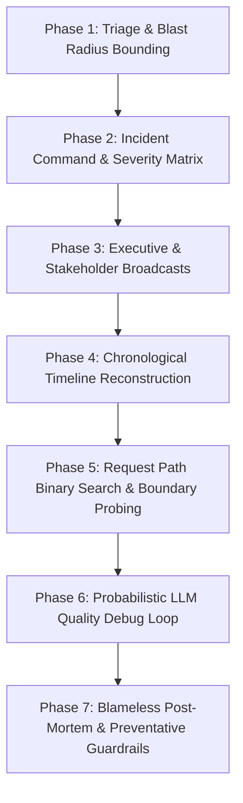
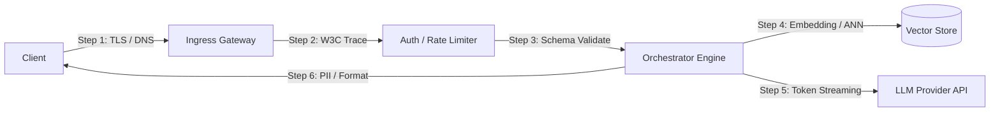
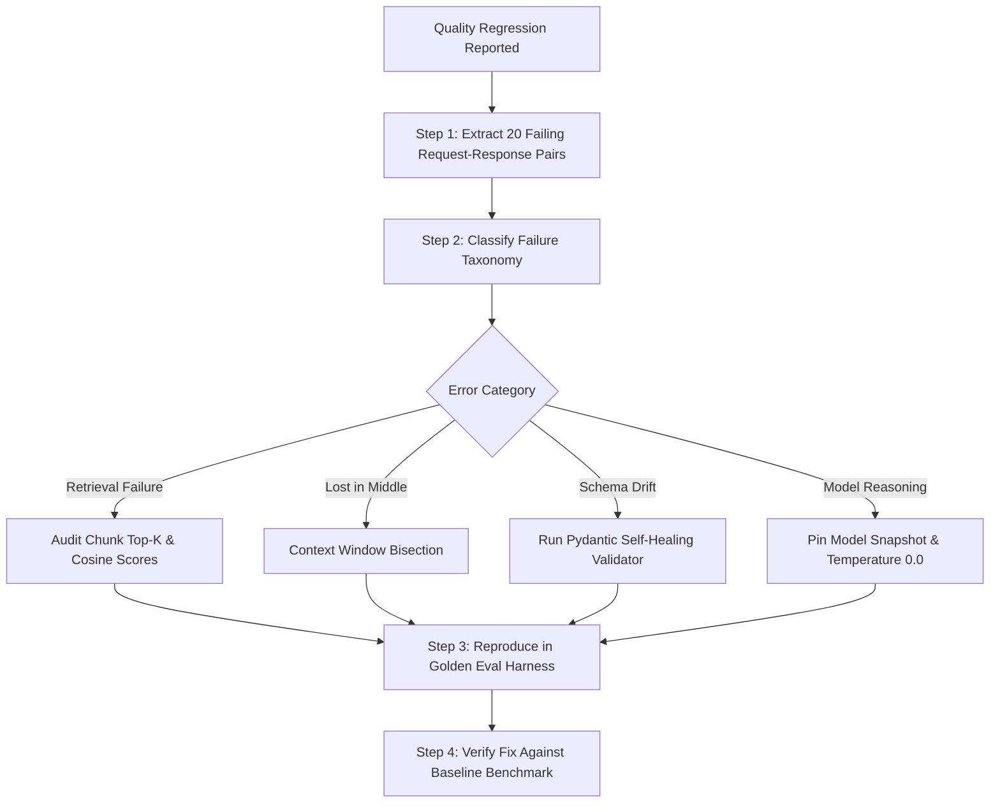

# A Debugging & Incident Response Methodology for FDEs

For Forward Deployed Engineers (FDEs) and technical leads diagnosing high-stakes customer production systems under active customer observation.

In an FDE engagement, debugging differs fundamentally from internal product engineering: you are operating on systems you did not build, across infrastructure boundaries you do not fully control, under strict security constraints, with customer executive sponsors watching every command. In this environment, unstructured guessing or "shotgun debugging" destroys customer trust within minutes. A battle-tested incident response methodology is the difference between calm, professional resolution and catastrophic project derailment.

This methodology formalizes seven operational phases drawn from **Google SRE Incident Management**, **PagerDuty Incident Command System (ICS)**, and verified field practices from senior FDE practitioners (**Om Bharatiya**, **Nehal Vyas**, **Dr. Sanjay Kumar PhD**).

---

## The 7-Phase Incident Response Lifecycle



---

## Phase 1: Triage, Blast Radius Bounding & Rollback Bias

Before executing diagnostics or reading stack traces, the on-call FDE must stabilize the deployment. Root-causing while customer traffic is actively failing is operational malpractice.

### 1. The Four Immediate Stabilization Invariants
1. **Reproduce or Classify as Intermittent**: Verify whether the defect reproduces deterministically with a synthetic curl payload. If intermittent, immediately flag it as such and inspect concurrency, rate limits, or scheduled cron collisions.
2. **Quantify the Blast Radius**: Calculate exact exposure:
   - *Impacted Entities*: Is this all tenants, a single enterprise tenant, or specific user roles?
   - *Traffic Percentage*: What percentage of total request volume is failing (e.g., 100% of `/v1/chat/completions` vs. 4.2% of long-context document ingestion)?
   - *Data Integrity*: Are customer records being silently dropped, corrupted in storage, or cleanly rejected with non-200 HTTP codes?
3. **Mitigate Before Analyzing**: If customer operations are degraded, apply mitigations immediately:
   - Drain traffic to the secondary availability zone or fallback model endpoint.
   - Flip feature flags or disable non-critical background enrichment workers.
   - Revert recent deployments if a rollback script exists and takes `< 5 minutes`.
4. **The Rollback Bias**: If a deployment or configuration change occurred within 2 hours of the incident onset, the default action is an immediate rollback. A rollback that resolves the failure proves causality in 120 seconds; a rollback that does not instantly eliminates the release candidate from the hypothesis space.

---

## Phase 2: Severity Matrix & Escalation Windows

Standardize incident severity classification across both your engineering organization and the customer's operations team to prevent ambiguity during outages.

| Severity Level | Definition & Operational Impact | Response SLA | Update Cadence | Escalation Protocol |
| :--- | :--- | :--- | :--- | :--- |
| **Sev-0 (Critical)** | Complete service outage; active customer data loss or security breach; all production users blocked from core business workflows. | `< 15 minutes` | Every `20–30 mins` | Page VP of Engineering, Lead FDE, and Customer Executive Sponsor; spin up dedicated war room bridge. |
| **Sev-1 (Major)** | Core workflow degraded with no immediate workaround; high error rates (`> 5%`); SLA breach imminent within 2 hours. | `< 30 minutes` | Every `45–60 mins` | Notify Engineering Manager, Lead Architect, and Customer Technical Lead. |
| **Sev-2 (Moderate)** | Non-critical feature impaired (e.g., batch ingestion delayed, async analytics failing); viable manual workaround available. | `< 2 hours` | Every `4 hours` | Assign on-duty FDE ticket; review during daily engineering sync. |
| **Sev-3 (Minor)** | Cosmetic UI defect, minor documentation typo, or non-blocking prompt formatting edge case affecting `< 0.1%` of requests. | `< 24 hours` | Milestone updates | Log in standard customer sprint backlog. |

---

## Phase 3: Stakeholder Communication Cadence & Broadcast Templates

Silence during an outage forces customer stakeholders to assume the worst. Send structured updates on a fixed clock regardless of whether new technical findings have emerged.

### Communication Invariant: The Fact vs. Hypothesis Rule
- **Fact**: *"At 14:02 UTC, 5xx error rates on `/api/v2/extract` increased from 0.02% to 8.4%."*
- **Hypothesis (explicitly labeled)**: *"Hypothesis: Upstream rate limiting by Azure OpenAI is returning HTTP 429 behind our API gateway. We are inspecting gateway egress logs now to verify."*

### Executive Broadcast Templates

#### 1. Initial Acknowledgment Broadcast (Sent within 15 minutes of Sev-0/Sev-1)
```text
INCIDENT ALERT: [Sev-1] Degradation on Document Ingestion Pipeline
Time Detected: 2026-03-14 09:12 UTC
Incident Commander: Alex Rivera (Lead FDE)
Customer Impact: Inbound PDF parsing for Midwest Region claims is timing out. 
Current Status: Investigating request path and database connection pools.
Mitigation in Progress: Routing inbound requests to backup processing queue.
Next Update: 09:45 UTC (or earlier if status changes).
```

#### 2. Progress & Mitigation Broadcast (Sent every 30-45 minutes)
```text
INCIDENT UPDATE #2: [Sev-1] Degradation on Document Ingestion Pipeline
Current Time: 2026-03-14 09:45 UTC
Status: Mitigation Deployed - Traffic Stabilizing
Findings: 
- Fact: Upstream OCR microservice experienced connection pool exhaustion following 08:30 batch job.
- Action Taken: Doubled max connection pool limits from 50 to 100 and recycled zombie connections.
- Current Metrics: Error rate dropped from 14.2% to 0.4%. Queue backlog processing at 450 docs/min.
Next Steps: Monitoring queue drain rate for 30 minutes to confirm full recovery.
Next Update: 10:15 UTC.
```

#### 3. Resolution & Incident Closure Broadcast
```text
INCIDENT RESOLVED: [Sev-1] Degradation on Document Ingestion Pipeline
Time Resolved: 2026-03-14 10:10 UTC
Total Duration: 58 minutes (09:12 - 10:10 UTC)
Summary: Document ingestion pipeline fully operational. Backlog drained to 0. Error rate: 0.00%.
Root Cause: Connection pool exhaustion triggered by unindexed batch query during morning scheduled refresh.
Remediation: Connection pool enlarged, query optimized, and automated connection health-check alert deployed.
Follow-up: Full blameless post-mortem report will be delivered within 24 hours.
```

---

## Phase 4: Chronological Timeline Reconstruction

Every incident requires a single, synchronized timeline maintained in the shared incident channel. "Random" bugs almost always collapse into clear causal sequences once timestamps are aligned.

| Timestamp (UTC) | Source / Actor | Event / Observed Metric | Architectural Context |
| :--- | :--- | :--- | :--- |
| `2026-03-14 08:30:00` | Scheduled Cron | Weekly document corpus re-indexing initiated. | Ingested 1.2M chunks instead of typical 35k delta. |
| `2026-03-14 08:45:12` | Datadog Alert | `pgvector` memory consumption crossed 85% threshold. | Vector index build saturated container RAM. |
| `2026-03-14 09:02:18` | Ingress Gateway | P99 latency on `/v1/query` spiked from 240ms to 4,800ms. | Database locks blocked incoming read transactions. |
| `2026-03-14 09:12:00` | Customer Lead | Outage declared; customer support team reported blank UI widgets. | Sev-1 bridge opened. |
| `2026-03-14 09:25:00` | FDE On-Call | Re-indexing job terminated; read-only replica promoted for search traffic. | Mitigation deployed. |
| `2026-03-14 09:40:00` | Metrics Check | Latency recovered to 215ms; zero 5xx errors recorded. | System stabilized. |

---

## Phase 5: Request Path Binary Search & Boundary Probing

Deployments fail in stages. Binary search the end-to-end request topology: ingress proxy -> auth gateway -> rate limiter -> orchestrator -> vector store -> LLM endpoint -> response formatter -> downstream sink.



### High-Resolution Network Boundary Diagnostic Playbook
To pinpoint whether latency or errors originate in network transit, TLS negotiation, or server-side execution, use curl with an explicit timing template.

```bash
# 1. Create a curl timing format file
cat << 'EOF' > /tmp/curl-format.txt
    time_namelookup:  %{time_namelookup}s\n
       time_connect:  %{time_connect}s\n
    time_appconnect:  %{time_appconnect}s\n
   time_pretransfer:  %{time_pretransfer}s\n
      time_redirect:  %{time_redirect}s\n
 time_starttransfer:  %{time_starttransfer}s (TTFB)\n
                    ----------\n
         time_total:  %{time_total}s\n
EOF

# 2. Execute high-resolution trace probe
curl -w "@/tmp/curl-format.txt" -o /dev/null -s \
  -X POST "https://api.enterprise.customer.com/v1/chat/completions" \
  -H "Content-Type: application/json" \
  -H "Authorization: Bearer ${CUSTOMER_API_KEY}" \
  -H "traceparent: 00-4bf92f3577b34da6a3ce929d0e0e4736-00f067aa0ba902b7-01" \
  -d '{"model":"claude-3-5-sonnet","messages":[{"role":"user","content":"healthcheck"}]}'
```

#### Interpreting Diagnostic Output:
- **`time_namelookup > 0.5s`**: DNS resolution delay or misconfigured upstream VPC nameserver.
- **`time_connect > 1.0s`**: TCP handshake bottleneck, firewall SYN packet dropping, or MTU blackholing.
- **`time_appconnect > 1.5s`**: TLS certificate verification hang or enterprise deep packet inspection (DPI) proxy stall.
- **`time_starttransfer > 5.0s`**: Upstream model processing latency, vector DB index lock, or connection pool exhaustion.

---

## Phase 6: The Probabilistic LLM Quality Debug Loop

Unlike traditional microservices that crash with stack traces, AI applications degrade probabilistically. A quality regression must be debugged with the same rigor as a deterministic code regression.



### Deterministic Context Bisection Protocol
When an LLM suddenly hallucinates or refuses responses on large multi-document prompts, locate the toxic chunk or prompt contamination using binary context bisection:

```python
# context_bisect.py - Deterministic Context Bisection Tool
from typing import List, Callable

def bisect_failing_context(
    system_prompt: str,
    chunks: List[str],
    eval_fn: Callable[[str, List[str]], bool]
) -> List[str]:
    """
    Locates the minimal set of context chunks triggering model failure.
    eval_fn returns True if prompt succeeds, False if failure reproduces.
    """
    if eval_fn(system_prompt, chunks):
        print("[+] Full context passes. Defect is non-reproducible or intermittent.")
        return []

    low = 0
    high = len(chunks)
    culprits = []

    print(f"[*] Starting bisection across {len(chunks)} context chunks...")
    
    # Test individual halves
    mid = len(chunks) // 2
    left_half = chunks[:mid]
    right_half = chunks[mid:]

    if not eval_fn(system_prompt, left_half):
        print(f"[!] Defect reproduced in first half (chunks 0..{mid}). Bisections continue...")
        return bisect_failing_context(system_prompt, left_half, eval_fn)
    elif not eval_fn(system_prompt, right_half):
        print(f"[!] Defect reproduced in second half (chunks {mid}..{len(chunks)}). Bisections continue...")
        return bisect_failing_context(system_prompt, right_half, eval_fn)
    else:
        print("[!] Multi-chunk interaction detected: defect requires chunks from both partitions.")
        return chunks
```

### Integration with Reference Golden Evaluation Harness
Never deploy a prompt or retrieval fix to a customer environment without proving zero-regression across the golden dataset. Run our verified reference evaluation suite:

```bash
python portfolio/reference-project/evals/run_evals.py
```
*Acceptance gate*: 100% accuracy on category/severity classification, 100% citation grounding, zero hallucinated policy assertions.

---

## Phase 7: Blameless Post-Mortem & Preventative Defenses

The post-mortem is a permanent customer trust asset. A customer who receives an honest, rigorous engineering post-mortem within 24 hours of an outage trusts the partnership more than before the incident.

### The Five Whys Root Cause Protocol
1. **Why did the extraction API fail?** The worker pods were terminated by the Kubernetes OOM-killer.
2. **Why were the pods OOM-killed?** Memory usage spiked past 4GB per pod processing a 12,000-page loan portfolio.
3. **Why did the pod attempt to process 12,000 pages at once?** The customer webhook batch payload contained no file size or page-count limits.
4. **Why did our service accept an unbounded payload?** The ingress validation layer relied on client-side constraints rather than server-side gateway bounds.
5. **Why were gateway payload bounds absent?** The initial integration spec omitted payload streaming and memory budgeting invariants.

### Production Defensive Modules in Field Guide Codebase
Every post-mortem action item should map directly to hardened, tested software patterns. Cross-reference our repository implementations:
- **Backoff & Circuit Breaking**: [`interviews/code/resilient_client.py`](../interviews/code/resilient_client.py)
- **Idempotency & Replay Protection**: [`interviews/code/webhook_receiver.py`](../interviews/code/webhook_receiver.py)
- **Token Bucket Rate Limiting**: [`interviews/code/rate_limiter.py`](../interviews/code/rate_limiter.py)
- **Self-Healing Structured Data Extraction**: [`interviews/code/structured_extractor.py`](../interviews/code/structured_extractor.py)
- **Context-Aware Semantic Chunking**: [`interviews/code/chunker.py`](../interviews/code/chunker.py)
- **Dirty Data Cleaning & Validation Runner**: [`interviews/code/vibe_coding_runner.py`](../interviews/code/vibe_coding_runner.py)

---

## Related Documents

- [Debugging Customer Systems](02-debugging-customer-systems.md) - Operating inside customer environments without direct console or database access.
- [Common Failure Modes](03-common-failure-modes.md) - Catalog of real-world enterprise outage patterns, diagnostic commands, and remediation recipes.
- [Production Readiness Checklist](../deployment/03-production-readiness-checklist.md) - Pre-flight verification gates to pass before go-live.
- [Evaluation and Testing](../ai/03-evaluation-and-testing.md) - Building deterministic regression test suites for probabilistic models.
- [Managing Expectations](../customer/04-managing-expectations.md) - Managing executive stakeholders during mission-critical production incidents.

---

## Primary Practitioner References

1. **Google Site Reliability Engineering**: *Managing Incidents* (Chapter 14) and *Postmortem Culture: Learning from Failure* (Chapter 15). [sre.google/sre-book/incident-management](https://sre.google/sre-book/incident-management/)
2. **PagerDuty Incident Response Documentation**: *Incident Commander Principles & Communication Protocols*. [response.pagerduty.com](https://response.pagerduty.com/)
3. **W3C Distributed Tracing Specification**: *W3C Recommendation for Trace Context and `traceparent` Header Propagation*. [w3.org/TR/trace-context](https://www.w3.org/TR/trace-context/)
4. **Marc Brooker (AWS VP/Distinguished Engineer)**: *Defensive Distributed Systems and Retries*. [brooker.co.za/blog](https://brooker.co.za/blog/)
5. **Om Bharatiya & Nehal Vyas**: *Forward Deployed Engineering Field Practices and Production System Triage*.
