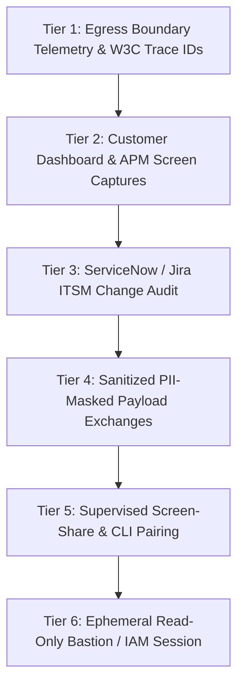
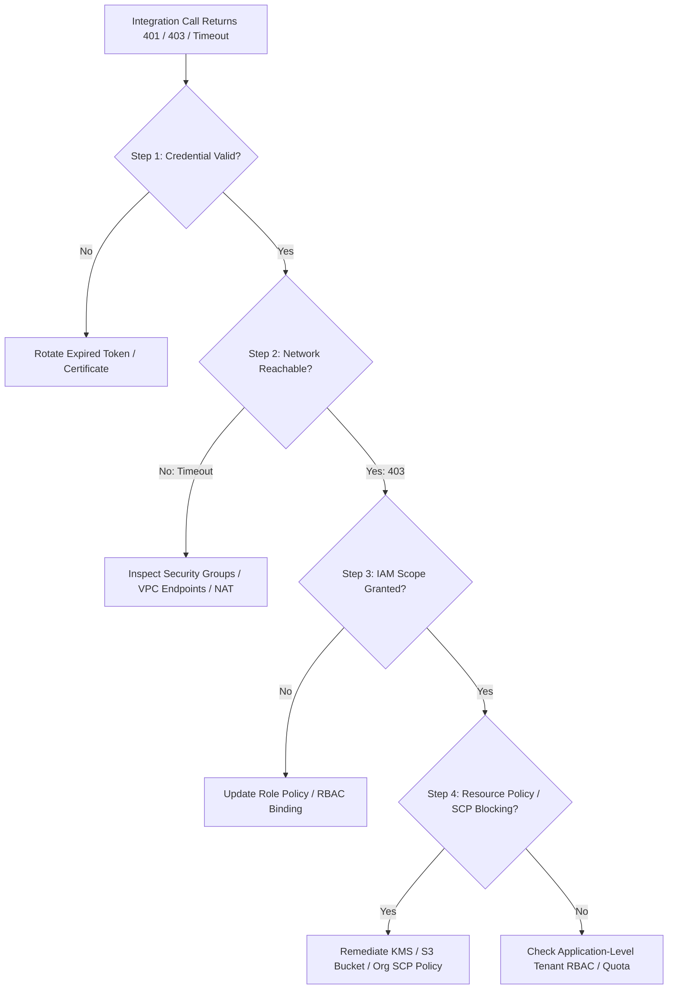
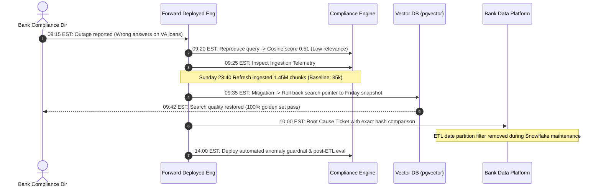

# Debugging in Customer Systems & Air-Gapped Environments

For Forward Deployed Engineers (FDEs) embedded within customer infrastructure and the senior technical leads supporting them.

In an enterprise deployment (banking, insurance, healthcare, national defense), half of debugging is technical systems engineering; the other half is navigating an environment intentionally designed to restrict access: zero console access, multi-day ticket queues for configuration adjustments, opaque network boundaries, strict PII/PCI data classification, and an enterprise operations team guarding production stability.

The craft of the senior FDE is driving rapid, deterministic technical progress within opaque customer environments rather than stalling while waiting for unattainable root permissions.

---

## 1. The 6-Tier Enterprise Visibility Ladder

Access to customer systems arrives in graduated trust layers, each guarded by security justification, audit logging, and InfoSec approval. Progress up the ladder sequentially, justifying each step with a specific blocked defect rather than a vague request for "more access."



### Tier Breakdown & Operational Protocols

| Tier | Access Artifact | Approval Friction | Typical Turnaround | Primary Diagnostic Utility |
| :--- | :--- | :--- | :--- | :--- |
| **Tier 1** | **Your Own Egress Telemetry** | Zero (fully internal) | Immediate (`0 min`) | Verify outbound payloads, W3C `traceparent` headers, request hashes, response status codes, and TLS handshake latency. |
| **Tier 2** | **Customer APM Screen Captures** | Low (read-only view) | `< 1 hour` | Compare customer ingress metrics (CloudWatch, Datadog, Dynatrace) against your egress to detect proxy dropouts. |
| **Tier 3** | **ITSM Change Log Audit** | Low (ticket read) | `< 2 hours` | Correlate incident timing with recent firewall rule updates, IAM rotations, or ETL scheduled cron modifications. |
| **Tier 4** | **Sanitized Payload Exports** | Medium (InfoSec / DPO review) | `4–8 hours` | Obtain real-world failing JSON/PDF inputs with SSN, credit cards, and names masked with deterministic SHA-256 hashes. |
| **Tier 5** | **Supervised Screen-Share Pairing** | High (operator calendar sync) | `2–4 hours` | Watch customer engineers execute diagnostic commands live; observe exact internal failure behaviors in real time. |
| **Tier 6** | **Ephemeral Read-Only Bastion Session** | Highest (CISO / Break-Glass approval) | `1–2 days` (or `< 30m` in Sev-0) | Time-bounded (e.g., 2-hour) AWS IAM Identity Center / Teleport session with full keystroke recording and zero write access. |

---

## 2. Navigating Enterprise ITSM & Change Control

In regulated enterprises, every configuration change, diagnostic script, and pod restart requires a formal ticket (ServiceNow, Jira Service Management, Remedy). Change freezes around quarter-end or fiscal audits turn trivial adjustments into multi-week deadlocks unless you minimize review friction.

### The "Pre-Written Ticket" Strategy
Customer sysadmins reject or delay tickets that require them to formulate solutions. Accelerate approvals by drafting the complete ticket text for them:

```markdown
### Change Request: Read-Only Diagnostic Query for Stalled Ingestion Worker
- **System / Database**: `customer-prod-compliance-pg15` (Read Replica)
- **Target Schema**: `cfpb_ingestion`
- **Blast Radius**: Zero mutation. Query runs with `statement_timeout = '15s'` against read replica.
- **Exact Command to Execute**:
  ```sql
  SELECT pid, now() - query_start AS duration, state, query 
  FROM pg_stat_activity 
  WHERE state != 'idle' AND query LIKE '%cfpb_complaints%' 
  ORDER BY duration DESC LIMIT 10;
  ```
- **Expected Output**: List of active queries identifying whether table locks are blocking the batch worker.
- **Rollback Procedure**: No rollback required (read-only operation). If query exceeds 15s, Postgres auto-terminates.
```

### The Emergency CAB Fast-Track
For Sev-0 and Sev-1 incidents, bypass standard 5-day review cycles using the Emergency Change Advisory Board (eCAB) protocol:
1. Provide the customer Incident Commander with the exact 1-line shell rollback command before requesting deployment.
2. Limit the change to a single variable (e.g., connection pool size or timeout threshold); never bundle refactors with incident fixes.
3. Ensure two customer approvers (the "Four-Eyes Principle") can review the git diff in under 120 seconds.

---

## 3. The Multi-Cloud Permission Diagnosis Playbook

When an integration fails across organizational trust boundaries, determine whether the failure stems from invalid credentials, insufficient IAM scopes, network transit blocks, or resource policy denial.



### Executable Cloud Diagnostic Commands

#### AWS Environment (PrivateLink & Cross-Account IAM)
```bash
# 1. Verify authenticated identity and assumed role
aws sts get-caller-identity --output json

# 2. Simulate IAM policy evaluation to detect missing actions without modifying state
aws iam simulate-principal-policy \
  --policy-source-arn "arn:aws:iam::123456789012:role/fde-ingestion-worker" \
  --action-names "s3:GetObject" "s3:PutObject" "kms:Decrypt" \
  --resource-arns "arn:aws:s3:::customer-compliance-data-prod/*" \
  --output table

# 3. Test PrivateLink VPC Endpoint DNS resolution from inside customer subnet
nslookup vpce-0123456789abcdef0-us-east-1.s3.us-east-1.vpce.amazonaws.com

# 4. Verify Security Group egress rules permit outbound HTTPS (Port 443)
aws ec2 describe-security-groups \
  --group-ids "sg-0123456789abcdef0" \
  --query "SecurityGroups[*].IpPermissionsEgress" --output json
```

#### Azure Environment (Managed Identity & RBAC)
```bash
# 1. Verify Managed Identity token issuance and audience claim
az account get-access-token \
  --resource https://cognitiveservices.azure.com/ \
  --output json

# 2. Check effective role assignments on target Cognitive Services or Storage resource
az role assignment list \
  --assignee "${MANAGED_IDENTITY_PRINCIPAL_ID}" \
  --scope "/subscriptions/${AZURE_SUB_ID}/resourceGroups/${RESOURCE_GROUP}/providers/Microsoft.CognitiveServices/accounts/${AI_SERVICE_NAME}" \
  --output table
```

#### Google Cloud Platform (Workload Identity Federation)
```bash
# 1. Print and decode OAuth2 access token claims
gcloud auth print-access-token | jq -R 'split(".") | .[1] | @base64d | fromjson'

# 2. Analyze effective IAM policy on target Cloud Storage bucket
gcloud asset analyze-iam-policy \
  --scope="projects/customer-compliance-prod" \
  --full-resource-name="//storage.googleapis.com/compliance-raw-intake" \
  --identity="serviceAccount:fde-app@customer-compliance-prod.iam.gserviceaccount.com"
```

---

## 4. Operating Together: The Shared On-Call Protocol

After deployment, production incidents span both organizations. Establish the shared operational contract prior to go-live:

1. **Bi-Directional Escalation Paths**: Pre-configure joint PagerDuty / Opsgenie escalation paths. If your service detects upstream 5xx errors from the customer's identity provider, the customer on-call is automatically paged with diagnostic context.
2. **Unified Incident Command**: During Sev-0/Sev-1 outages, establish a joint war room (Slack Connect or Microsoft Teams) with a designated Lead Incident Commander from the customer side and a Technical Operations Lead from the FDE side.
3. **Strict Boundary Contract Logging**: All cross-boundary payloads must log three invariants:
   - `x-request-id` (propagated end-to-end via W3C Trace Context)
   - SHA-256 payload hash (proving payload receipt without storing raw PII)
   - Egress-to-ingress timestamp delta (proving where latency occurred)

Cross-reference our verified RBAC boundary enforcement in [`portfolio/reference-project/tests/test_server.py`](../portfolio/reference-project/tests/test_server.py) (`test_permission_aware_rbac_filtering`).

---

## 5. Worked Empirical Scenario: The Monday Morning CFPB Pipeline Drift

*This scenario is based on real-world enterprise deployments ingesting the public **Consumer Financial Protection Bureau (CFPB) Consumer Complaint Database** (see dataset provenance in [`portfolio/reference-project/evals/DATASET_PROVENANCE.md`](../portfolio/reference-project/evals/DATASET_PROVENANCE.md)).*

### Situation
A Fortune 100 retail bank deployed an automated FDE compliance search assistant indexing regulatory complaint narratives. Three weeks post-launch, at 09:15 EST on Monday morning, the bank's Senior Compliance Director reported a critical quality failure:
> *"The search assistant is giving completely irrelevant answers. When compliance officers query 'escrow calculation dispute for VA home loans', the system returns credit card late fee complaints from 2018. The system was performing flawlessly on Friday."*

### Enterprise Constraints
- The complaint ingestion ETL is owned by the bank's centralized Enterprise Data Platform team; direct database modifications require a 48-hour ServiceNow turnaround.
- The FDE has visibility only into application gateway ingress and vector search query telemetry.
- Monday morning is the bank's highest regulatory compliance review volume; executive visibility is immediate.
- The automated nightly evaluation suite passed on Sunday night at 22:00 EST against the standard 25-case golden set (`run_evals.py`).

### Step-by-Step Resolution Protocol



#### 1. Reproduce and Classify Failure Category
At 09:20 EST, the FDE executes the failing query against the staging and production APIs. The returned results have low cosine similarity (`0.51` vs baseline `0.88`) and cite credit card disputes rather than mortgage regulations. 
- *Taxonomy Classification*: This is a **Corpus Integrity / Semantic Retrieval Failure**, not a model hallucination or tokenizer parsing error.

#### 2. Reconstruct Timeline Against Batch Events
The calendar correlation (failing specifically on Monday morning) points directly to scheduled weekend batch jobs. 
- Friday 18:00 EST: Production golden eval: 100% accuracy (`p50 = 0.16ms`).
- Sunday 22:00 EST: Automated nightly eval passed (evaluated against the existing corpus snapshot).
- Sunday 23:40 EST: Scheduled weekly data refresh job executed.
- Monday 08:30 EST: First compliance officers logged in.

#### 3. Egress & Boundary Evidence
The FDE checks the application ingestion telemetry for the Sunday 23:40 batch execution.
- *Baseline Weekly Delta*: Approximately `35,000` newly registered CFPB complaints ingested weekly.
- *Observed Batch Ingestion*: `1,452,800` records delivered in a single 1.8GB compressed dump.
The bank's data export had accidentally dumped the entire historical CFPB complaint archive (2011–2026) rather than the weekly incremental partition. The vector index was flooded with 1.4M out-of-domain historical records, drastically skewing the HNSW graph search space.

#### 4. Mitigate First (The Rollback Bias)
Rather than waiting for the bank's data team to fix their export script, the FDE executes an immediate mitigation at 09:35 EST:
- Switches the application database connection pool to point to the Friday snapshot replica index (`compliance_index_2026_03_12`).
- Re-runs the automated golden evaluation harness (`python portfolio/reference-project/evals/run_evals.py`).
- Confirms 100% accuracy restored across all 25 test cases.
- Compliance operations resume at 09:42 EST (total customer-facing downtime: 27 minutes).

#### 5. Root Cause Analysis with Bank Data Team
At 10:00 EST, the FDE submits a pre-written ServiceNow ticket to the Bank Data Platform team containing exact payload hashes and byte counts:
- *Finding*: A data analyst had commented out the `WHERE date_received >= CURRENT_DATE - INTERVAL '7 days'` filter during Friday evening Snowflake maintenance and failed to revert it.

#### 6. Permanent Architectural Prevention
To ensure this failure mode cannot recur, the FDE implements three architectural defenses:
1. **Ingestion Volume Anomaly Circuit Breaker**: Deployed a guardrail rejecting any batch payload exceeding `300%` of the 30-day moving average (links to [`interviews/code/parser.py`](../interviews/code/parser.py)).
2. **Rescheduled Automated Golden Evals**: Adjusted the nightly eval schedule from 22:00 EST to 04:00 EST (post-ETL window) so corrupt data triggers an alert hours before business users log in.
3. **Corpus Snapshot Swapping**: Made index updates transactional: new embeddings build into an offline staging index and promote to live traffic only after passing automated eval gates.

---

## 6. Related Documents

- [A Debugging Methodology](01-debugging-methodology.md) - The general 7-phase incident response and diagnostic lifecycle.
- [Common Failure Modes](03-common-failure-modes.md) - Enterprise outage catalog, reproducible curl recipes, and post-mortem templates.
- [Production Readiness Checklist](../deployment/03-production-readiness-checklist.md) - Pre-launch operational requirements for customer environments.
- [APIs and Integrations](../engineering/02-apis-and-integrations.md) - Boundary contract logging, idempotency, and auth handshakes.
- [Cloud and Infrastructure](../engineering/04-cloud-and-infrastructure.md) - Private VPC topologies, AWS PrivateLink, and cross-account IAM.

---

## Primary References

1. **AWS Identity and Access Management (IAM)**: *Policy Evaluation Logic & Cross-Account Access Delegation*. [docs.aws.amazon.com/IAM/latest/UserGuide/reference_policies_evaluation-logic.html](https://docs.aws.amazon.com/IAM/latest/UserGuide/reference_policies_evaluation-logic.html)
2. **Microsoft Azure Architecture Center**: *Azure Role-Based Access Control (Azure RBAC) and Managed Identities for Azure Resources*. [learn.microsoft.com/en-us/azure/role-based-access-control/overview](https://learn.microsoft.com/en-us/azure/role-based-access-control/overview)
3. **Consumer Financial Protection Bureau (CFPB)**: *Consumer Complaint Database Architecture & Public Data Export*. [consumerfinance.gov/data-research/consumer-complaints/](https://www.consumerfinance.gov/data-research/consumer-complaints/)
4. **Google SRE Book**: *Troubleshooting and Incident Response in Distributed Systems*. [sre.google/sre-book/table-of-contents](https://sre.google/sre-book/table-of-contents/)
5. **Om Bharatiya & Nehal Vyas**: *Practitioner Field Engineering Incident Protocols and Enterprise Customer Management*.
