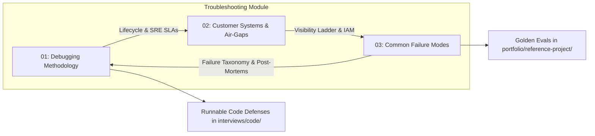

# Field Engineering Troubleshooting & Incident Response

In an enterprise Forward Deployed Engineering (FDE) engagement, troubleshooting is not an isolated academic exercise; it is an active performance of technical competency under high-stakes conditions. You are diagnosing complex distributed systems you did not build, across infrastructure boundaries you do not fully control, within regulated security enclaves (banking, healthcare, defense), while customer engineering leaders and executive sponsors observe your every command.

A structured, battle-tested methodology is what separates rapid, professional stabilization from chaotic flailing. Flailing in front of a customer permanently burns trust; methodical, evidence-driven incident triage is the single fastest way to cement long-term enterprise partnership credibility.

---

## 1. Core Module Guides

This module codifies the operational protocols, cloud diagnostics, and recurring incident patterns required to resolve enterprise production outages:

### 1. [A Debugging & Incident Response Methodology](01-debugging-methodology.md)
The foundational 7-phase incident response lifecycle derived from **Google Site Reliability Engineering (SRE)** and **PagerDuty Incident Command (ICS)**:
- **Phase 1: Triage & Blast Radius Bounding**: The four immediate stabilization invariants and establishing `< 5 min` rollback bias.
- **Phase 2: Severity Matrix & Escalation Windows**: Explicit Sev-0 through Sev-3 definitions, response SLAs (15m P0, 30m P1, 2h P2, 24h P3), and escalation paths.
- **Phase 3: Executive Stakeholder Broadcasts**: Verbatim communication templates for initial alert, investigation progress, and incident resolution.
- **Phase 4: Chronological Timeline Reconstruction**: Single synchronized UTC event reconstruction and correlation discipline.
- **Phase 5: Request Path Binary Search**: End-to-end trace traversal using W3C `traceparent` headers and high-resolution cURL timing diagnostics (`curl-format.txt`).
- **Phase 6: Probabilistic LLM Quality Debug Loop**: Treating quality regressions as code diffs; deterministic context bisection algorithm (`bisect_failing_context`).
- **Phase 7: Blameless Post-Mortem**: The Five Whys root cause analysis protocol and automated regression eval integration.

### 2. [Debugging in Customer Systems & Air-Gapped Environments](02-debugging-customer-systems.md)
Operating inside customer enterprise environments without console or direct database access:
- **The 6-Tier Enterprise Visibility Ladder**: Step-by-step access escalation from application egress telemetry (Tier 1) up to supervised screen-shares (Tier 5) and ephemeral read-only bastions (Tier 6).
- **Navigating Enterprise ITSM & Change Control**: Pre-written ServiceNow/Jira change requests with explicit read-only commands (`pg_stat_activity`), 15s statement timeouts, and emergency Change Advisory Board (eCAB) bypass maneuvers.
- **The Multi-Cloud Permission Diagnosis Playbook**: Practical CLI diagnostic commands for AWS STS/IAM simulation, Azure CLI RBAC token verification, and GCP Workload Identity claim decoding.
- **Empirical CFPB Pipeline Case Study**: Real-world investigation of a 1.45M-record uncurated batch dump flooding a compliance vector search engine, resolved via snapshot replica fallback and automated volume anomaly circuit breakers.

### 3. [Common Failure Modes & Field Troubleshooting](03-common-failure-modes.md)
Catalog of 7 battle-tested enterprise failure modes observed across production customer deployments:
- **Data Pipeline Failures**: UTF-8 BOM byte corruption (`\ufeff`), multiline CSV breakage, and upstream schema drift.
- **API & Rate Limiting Failures**: Token bucket exhaustion, shared reset window thundering herds, and jitterless backoff.
- **Network & Connectivity Failures**: TCP half-close idle socket hangs behind enterprise NAT firewalls and asymmetric MTU blackholing.
- **Model & Prompt Regressions**: Upstream tokenizer/format drift, temperature refusal spikes, and JSON schema non-compliance.
- **Retrieval (RAG) Failures**: "Lost in the middle" context window degradation and out-of-vocabulary embedding recall drops.
- **Authentication & Security Failures**: Clock skew JWT validation rejections (`nbf`/`exp`) and OAuth2 token refresh race conditions.
- **Database & Concurrency Failures**: PostgreSQL connection pool starvation under streaming LLM holds and deadlocks.
- **Diagnostic Network & DB Cheat Sheet**: Concrete terminal commands (`curl`, `tcpdump`, `strace`, `jq`, `pg_stat_activity`, `openssl s_client`).
- **Standard Blameless Post-Mortem Template**: Comprehensive incident documentation standard.

---

## 2. Active Incident Fast Triage Index

When responding to an active production alert, consult this rapid-routing matrix to jump directly to the relevant diagnostic protocol:

| Observed Symptom | Primary Suspect Domain | Immediate Stabilization Move | Diagnostic Runbook Link |
| :--- | :--- | :--- | :--- |
| **P99 Latency > 5,000ms** on API Gateway | Network transit, TLS handshake, or LLM stream stall | Inspect TTFB vs. connect time; enable response streaming; check worker connection pool | [Phase 5: cURL Timing Breakdown](01-debugging-methodology.md#high-resolution-network-boundary-diagnostic-playbook) |
| **HTTP 403 Forbidden** on cross-account resource | Expired token, missing IAM action, or VPC Endpoint policy | Test token validity; run IAM simulate policy without mutating state | [Section 3: Cloud IAM Diagnostics](02-debugging-customer-systems.md#3-the-multi-cloud-permission-diagnosis-playbook) |
| **HTTP 429 Too Many Requests** bursts at :00 | Top-of-hour cron thundering herd or shared quota reset | Apply decorrelated jittered backoff; drain non-critical async queues | [Failure Mode 2: Rate Limiting & Thundering Herds](03-common-failure-modes.md#2-api--rate-limiting-failures) |
| **Irrelevant Search / Hallucinations** post-weekend | Corpus ingestion drift or toxic chunks in context window | Revert vector index pointer to previous snapshot; run context bisection | [Section 5: CFPB Pipeline Drift Case Study](02-debugging-customer-systems.md#5-worked-empirical-scenario-the-monday-morning-cfpb-pipeline-drift) |
| **Worker OOM-Killed (Exit Code 137)** | Unbounded batch payload or memory-leaking streaming parser | Terminate runaway ingestion pod; enforce ingress byte/page limits | [Phase 7: Five Whys Payload Breakdown](01-debugging-methodology.md#the-five-whys-root-cause-protocol) |
| **Silent Character Dropping / JSON Parse Errors** | UTF-8 BOM (`\ufeff`) or multiline delimiter splits | Inspect raw byte stream with `xxd`; switch to strict UTF-8-SIG decoding | [Failure Mode 1: Data Pipeline Failures](03-common-failure-modes.md#1-data-pipeline-failures) |
| **Idle Sockets Hanging at 15 Minutes** | Stateful firewall dropping idle TCP half-close packets | Enable `SO_KEEPALIVE` with 60s idle intervals and explicit read timeouts | [Failure Mode 3: Network & Connectivity Failures](03-common-failure-modes.md#3-network--connectivity-failures) |

---

## 3. Direct Codebase Defense Implementations

Every failure mode documented in this module pairs with a hardened, production-tested software defense within our repository:

| Defensive Pattern | Source Implementation | Test Suite Verification |
| :--- | :--- | :--- |
| **Resilient API Client** (Decorrelated Jitter & Exponential Backoff) | [`interviews/code/resilient_client.py`](../interviews/code/resilient_client.py) | `pytest interviews/code/test_resilient_client.py` |
| **Idempotent Webhook Receiver** (Payload Hashing & Replay Defense) | [`interviews/code/webhook_receiver.py`](../interviews/code/webhook_receiver.py) | `pytest interviews/code/test_webhook_receiver.py` |
| **Token Bucket Rate Limiter** (Tiered Quotas & Sliding Windows) | [`interviews/code/rate_limiter.py`](../interviews/code/rate_limiter.py) | `pytest interviews/code/test_rate_limiter.py` |
| **Self-Healing Structured Extractor** (Pydantic Schema Error Correction) | [`interviews/code/structured_extractor.py`](../interviews/code/structured_extractor.py) | `pytest interviews/code/test_structured_extractor.py` |
| **Context-Aware Semantic Chunker** (Sentence-Boundary Overlap) | [`interviews/code/chunker.py`](../interviews/code/chunker.py) | `pytest interviews/code/test_chunker.py` |
| **Dirty Export Parser** (BOM Stripping & Data Sanitization) | [`interviews/code/parser.py`](../interviews/code/parser.py) | `pytest interviews/code/test_parser.py` |
| **Automated Golden Evaluation Suite** (25 Real-World Enterprise Cases) | [`portfolio/reference-project/evals/run_evals.py`](../portfolio/reference-project/evals/run_evals.py) | `python portfolio/reference-project/evals/run_evals.py` |
| **Permission-Aware RBAC Vector Filtering** | [`portfolio/reference-project/src/server.py`](../portfolio/reference-project/src/server.py) | `pytest portfolio/reference-project/tests/test_server.py` |

---

## 4. Primary Practitioner References

1. **Google Site Reliability Engineering**: *Managing Incidents* & *Postmortem Culture: Learning from Failure*. [sre.google/sre-book/incident-management](https://sre.google/sre-book/incident-management/)
2. **PagerDuty Incident Command System**: *Incident Commander Principles & Incident Triage Communication*. [response.pagerduty.com](https://response.pagerduty.com/)
3. **W3C Distributed Tracing Recommendation**: *Trace Context Header Propagation (`traceparent`)*. [w3.org/TR/trace-context](https://www.w3.org/TR/trace-context/)
4. **Marc Brooker (AWS VP / Distinguished Engineer)**: *Defensive Distributed Systems Design and Retries with Jitter*. [brooker.co.za/blog](https://brooker.co.za/blog/)
5. **Consumer Financial Protection Bureau (CFPB)**: *Consumer Complaint Database Public Architecture & Schema*. [consumerfinance.gov/data-research/consumer-complaints/](https://www.consumerfinance.gov/data-research/consumer-complaints/)
6. **Om Bharatiya & Nehal Vyas**: *Field Engineering Methodologies and Enterprise Technical Operations*.
